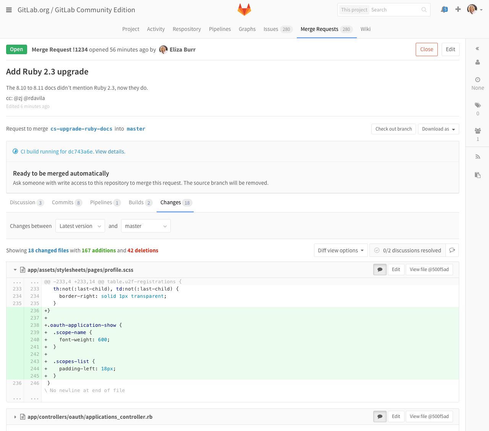
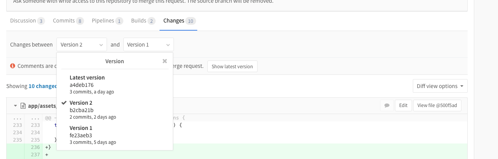
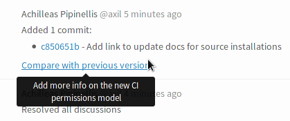
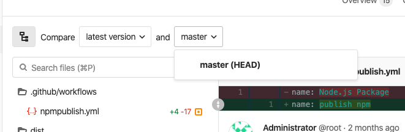

# Merge requests versions

Every time you push to a branch that is tied to a merge request, a new version
of merge request diff is created. When you visit a merge request that contains
more than one pushes, you can select and compare the versions of those merge
request diffs.

## Selecting a version

By default, the latest version of changes is shown. However, you
can select an older one from version dropdown.

Merge request versions are based on push not on commit. So, if you pushed 5
commits in a single push, it displays as a single option in the dropdown. If you
pushed 5 times, that counts for 5 options.

You can also compare the merge request version with an older one to see what has
changed since then.

Comments are disabled while viewing outdated merge versions or comparing to
versions other than base.

Every time you push new changes to the branch, a link to compare the last
changes appears as a system note.

## Find the merge request that introduced a change

> [Introduced](https://gitlab.com/gitlab-org/gitlab-foss/-/issues/2383) in GitLab 10.5.

When viewing the commit details page, GitLab links to the merge request (or
merge requests, if it's in more than one) containing that commit.

This only applies to commits that are in the most recent version of a merge
request - if commits were in a merge request, then rebased out of that merge
request, they aren't linked.

## `HEAD` comparison mode for merge requests

> [Introduced](https://gitlab.com/gitlab-org/gitlab/-/issues/27008) in GitLab 12.10.

Merge requests, particularly the **Changes** tab, is where source code
is reviewed and discussed. In circumstances where the target branch was
merged into the source branch of the merge request, the changes in the
source and target branch can be shown mixed together making it hard to
understand which changes are being added and which already exist in the
target branch.

In GitLab 12.10, we added a comparison mode, which
shows a diff calculated by simulating how it would look like once merged - a more accurate
representation of the changes rather than using the base of the two
branches. The new mode is available from the comparison target drop down
by selecting **main (HEAD)**. In GitLab 13.9, it
[replaced](https://gitlab.com/gitlab-org/gitlab/-/issues/198458) the
old default comparison. For technical details, additional information is available in the
[developer documentation](../../../development/diffs.md#merge-request-diffs-against-the-head-of-the-target-branch).

<!-- ## Troubleshooting

Include any troubleshooting steps that you can foresee. If you know beforehand what issues
one might have when setting this up, or when something is changed, or on upgrading, it's
important to describe those, too. Think of things that may go wrong and include them here.
This is important to minimize requests for support, and to avoid doc comments with
questions that you know someone might ask.

Each scenario can be a third-level heading, e.g. `### Getting error message X`.
If you have none to add when creating a doc, leave this section in place
but commented out to help encourage others to add to it in the future. -->
