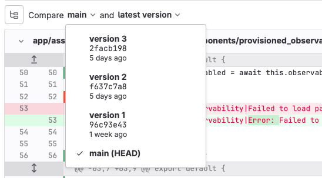
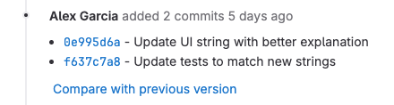

DETAILS:
**Tier:** Free, Premium, Ultimate
**Offering:** GitLab.com, GitLab Self-Managed, GitLab Dedicated

When you create a merge request, you select two branches to compare. The differences
between the two branches are shown as a **diff** in the merge request. Each time
you push commits to a branch connected to a merge request, GitLab updates the
merge request diff to a new **diff version**.

NOTE:
Diff versions are updated on each push, not each commit. If a push contains multiple
commits, only one new diff version is created.

By default, GitLab compares the latest push in your source branch (`feature`)
against the most recent commit in the target branch, often `main`.

## Compare diff versions

If you've pushed to your branch multiple times, the diff version from each previous push
is available for comparison. When your merge request contains many changes or
sequential changes to the same file, you might want to compare a smaller number of changes.

Prerequisites:

- The merge request branch must contain commits from multiple pushes. Individual commits
  in the same push do not generate new diff versions.

To compare diff versions:

1. On the left sidebar, select **Search or go to** and find your project.
1. Select **Code > Merge requests**.
1. Select a merge request.
1. To view the current diff version for this merge request, select **Changes**.
1. Next to **Compare** (**{file-tree}**), select the pushes to compare. This example
   compares `main` to the most recent push (latest diff version) of the branch:

   

   This example branch has four commits, but the branch contains only three diff versions
   because two commits were pushed at the same time.

## View diff versions from a system note

GitLab adds a system note to a merge request each time you push new changes to
the merge request's branch. In this example, a single push added two commits:

To view the diff for that commit, select the commit SHA.

For more information, see how to [show or filter system notes on a merge request](../system_notes.md#on-a-merge-request).

## Related topics

- [Merge request diffs for developers](../../../development/merge_request_concepts/diffs/_index.md)
- [Merge request diff storage for administrators](../../../administration/merge_request_diffs.md)

<!-- ## Troubleshooting

Include any troubleshooting steps that you can foresee. If you know beforehand what issues
one might have when setting this up, or when something is changed, or on upgrading, it's
important to describe those, too. Think of things that might go wrong and include them here.
This is important to minimize requests for support, and to avoid doc comments with
questions that you know someone might ask.

Each scenario can be a third-level heading, for example `### Getting error message X`.
If you have none to add when creating a doc, leave this section in place
but commented out to help encourage others to add to it in the future. -->
