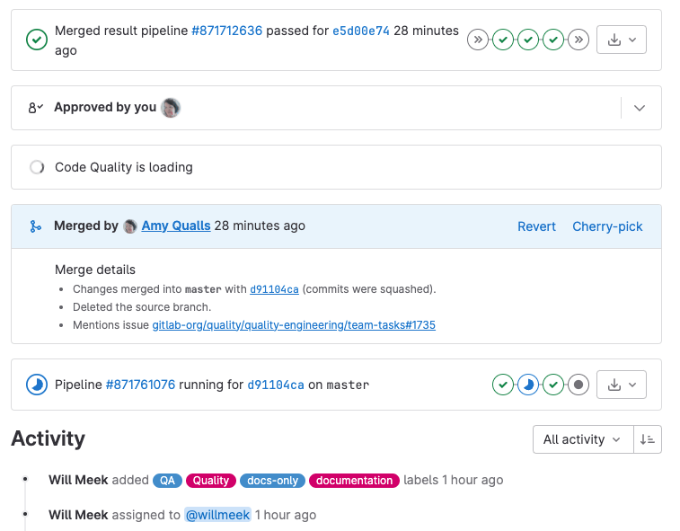

DETAILS:
**Tier:** Free, Premium, Ultimate
**Offering:** GitLab.com, GitLab Self-Managed, GitLab Dedicated

The **Overview** page of a merge request displays status updates from services
that perform actions on your merge request. All subscription levels display a
widgets area, but the content of the area depends on your subscription level
and the services you configure for your project.

## Pipeline information

If you've set up [GitLab CI/CD](../../../ci/_index.md) in your project,
a [merge request](_index.md) displays pipeline information in the widgets area
of the **Overview** tab:

- Both pre-merge and post-merge pipelines, and the environment information, if any.
- Which deployments are in progress.

If an application is successfully deployed to an
[environment](../../../ci/environments/_index.md), the deployed environment and the link to the
[review app](../../../ci/review_apps/_index.md) are both shown.

NOTE:
When the pipeline fails in a merge request but it can still merge,
GitLab shows **Merge** in red.

## Post-merge pipeline status

When you merge a merge request, you can see the post-merge pipeline status of
the branch the merge request merged into. For example, when a merge request
merges into the [default branch](../repository/branches/default.md), and then
triggers a deployment to the staging environment.

GitLab shows ongoing deployments, and the state (deploying or deployed)
for environments. If it's the first deployment of the branch, the link
returns a `404` error until done. During the deployment, GitLab disables the
stop button. If the pipeline fails to deploy, GitLab hides the deployment information.

For more information, [read about pipelines](../../../ci/pipelines/_index.md).

## Set auto-merge

Set a merge request that looks ready to merge to
[merge automatically when CI pipeline succeeds](auto_merge.md).

## Live preview with review apps

Configure [review apps](../../../ci/review_apps/_index.md) for your project
to preview the changes submitted to a feature branch through a merge request
on a per-branch basis. You don't need to check out the branch, install, and preview locally.
All your changes are available to preview by anyone with the review apps link.

With GitLab [Route Maps](../../../ci/review_apps/_index.md#route-maps) set, the
merge request widget takes you directly to the pages changed, making it easier and
faster to preview proposed modifications.

[Read more about review apps](../../../ci/review_apps/_index.md).

## License compliance

DETAILS:
**Tier:** Ultimate
**Offering:** GitLab.com, GitLab Self-Managed, GitLab Dedicated

To view a list of licenses that detected for your project's dependencies,
configure [License Compliance](../../compliance/license_scanning_of_cyclonedx_files/_index.md)
for your project.

## External status checks

DETAILS:
**Tier:** Ultimate
**Offering:** GitLab.com, GitLab Self-Managed, GitLab Dedicated

If you have configured [external status checks](status_checks.md) you can
see the status of these checks in merge requests
[in a specific widget](status_checks.md#status-checks-widget).

## Application security scanning

If you enable any application security scanning tools, GitLab shows the results in the security
scanning widget. For more information, see
[security scanning output in merge request widget](../../application_security/detect/security_scan_results.md#merge-request).
