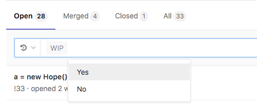

# "Work In Progress" merge requests

If a merge request is not yet ready to be merged, perhaps due to continued development
or open threads, you can prevent it from being accepted before it's ready by flagging
it as a **Work In Progress**. This will disable the "Merge" button, preventing it from
being merged, and it will stay disabled until the "WIP" flag has been removed.

## Adding the "Work In Progress" flag to a merge request

There are several ways to flag a merge request as a Work In Progress:

- Add `[WIP]` or `WIP:` to the start of the merge request's title. Clicking on
  **Start the title with WIP:**, under the title box, when editing the merge request's
  description will have the same effect.
- Add the `/wip` [quick action](../quick_actions.md#quick-actions-for-issues-and-merge-requests)
  in a comment in the merge request. This is a toggle, and can be repeated
  to change the status back. Note that any other text in the comment will be discarded.
- Add "wip" or "WIP" to the start of a commit message targeting the merge request's
  source branch. This is not a toggle, and doing it again in another commit will have
  no effect.

## Removing the "Work In Progress" flag from a merge request

Similar to above, when a Merge Request is ready to be merged, you can remove the
"Work in Progress" flag in several ways:

- Remove `[WIP]` or `WIP:` from the start of the merge request's title. Clicking on
  **Remove the WIP: prefix from the title**, under the title box, when editing the merge
  request's description, will have the same effect.
- Add the `/wip` [quick action](../quick_actions.md#quick-actions-for-issues-and-merge-requests)
  in a comment in the merge request. This is a toggle, and can be repeated
  to change the status back. Note that any other text in the comment will be discarded.
- Click on the **Resolve WIP status** button near the bottom of the merge request description,
  next to the "Merge" button (see [image above](#work-in-progress-merge-requests)).
  Must have at least Developer level permissions on the project for the button to
  be visible.

## Including/excluding WIP merge requests when searching

When viewing/searching the merge requests list, you can choose to include or exclude
WIP merge requests by adding a "WIP" filter in the search box, and choosing "Yes"
(to include) or "No" (to exclude).

<!-- ## Troubleshooting

Include any troubleshooting steps that you can foresee. If you know beforehand what issues
one might have when setting this up, or when something is changed, or on upgrading, it's
important to describe those, too. Think of things that may go wrong and include them here.
This is important to minimize requests for support, and to avoid doc comments with
questions that you know someone might ask.

Each scenario can be a third-level heading, e.g. `### Getting error message X`.
If you have none to add when creating a doc, leave this section in place
but commented out to help encourage others to add to it in the future. -->
