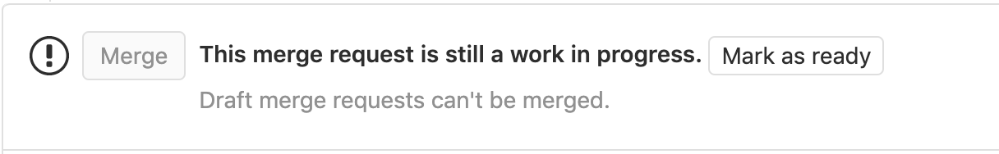

# Draft merge requests **(CORE)**

If a merge request is not yet ready to be merged, perhaps due to continued development
or open threads, you can prevent it from being accepted before it's ready by flagging
it as a **Draft**. This will disable the "Merge" button, preventing it from
being merged, and it will stay disabled until the "Draft" flag has been removed.

When [pipelines for merged results](../../../ci/merge_request_pipelines/pipelines_for_merged_results/index.md)
is enabled, draft merge requests run [merge request pipelines](../../../ci/merge_request_pipelines/index.md)
only.

To run pipelines for merged results, you must [remove the draft status](#removing-the-draft-flag-from-a-merge-request).

## Adding the "Draft" flag to a merge request

> - [Introduced](https://gitlab.com/gitlab-org/gitlab/-/issues/32692) in GitLab 13.2, Work-In-Progress (WIP) merge requests were renamed to **Draft**. Support for using **WIP** will be removed in GitLab 14.0.
> - **Mark as draft** and **Mark as ready** buttons [introduced](https://gitlab.com/gitlab-org/gitlab/-/issues/227421) in GitLab 13.5.

There are several ways to flag a merge request as a Draft:

- Click the **Mark as draft** button on the top-right corner of the merge request's page.
- Add `[Draft]`, `Draft:` or `(Draft)` to the start of the merge request's title. Clicking on
  **Start the title with Draft:**, under the title box, when editing the merge request's
  description will have the same effect.
- **Deprecated** Add `[WIP]` or `WIP:` to the start of the merge request's title.
  **WIP** still works but was deprecated in favor of **Draft**. It will be removed in the next major version (GitLab 14.0).
- Add the `/draft` (or `/wip`) [quick action](../quick_actions.md#quick-actions-for-issues-merge-requests-and-epics)
  in a comment in the merge request. This is a toggle, and can be repeated
  to change the status back. Note that any other text in the comment will be discarded.
- Add `draft:`, `Draft:`, `fixup!`, or `Fixup!` to the beginning of a commit message targeting the
  merge request's source branch. This is not a toggle, and doing it again in another
  commit will have no effect.

## Removing the "Draft" flag from a merge request

Similar to above, when a Merge Request is ready to be merged, you can remove the
`Draft` flag in several ways:

- Click the **Mark as ready** button on the top-right corner of the merge request's page.
- Remove `[Draft]`, `Draft:` or `(Draft)` from the start of the merge request's title. Clicking on
  **Remove the Draft: prefix from the title**, under the title box, when editing the merge
  request's description, will have the same effect.
- Add the `/draft` (or `/wip`) [quick action](../quick_actions.md#quick-actions-for-issues-merge-requests-and-epics)
  in a comment in the merge request. This is a toggle, and can be repeated
  to change the status back. Note that any other text in the comment will be discarded.
- Click on the **Resolve Draft status** button near the bottom of the merge request description,
  next to the **Merge** button (see [image above](#draft-merge-requests)).
  Must have at least Developer level permissions on the project for the button to
  be visible.

## Including/excluding WIP merge requests when searching

When viewing/searching the merge requests list, you can choose to include or exclude
WIP merge requests by adding a "WIP" filter in the search box, and choosing "Yes"
(to include) or "No" (to exclude).

<!-- ## Troubleshooting

Include any troubleshooting steps that you can foresee. If you know beforehand what issues
one might have when setting this up, or when something is changed, or on upgrading, it's
important to describe those, too. Think of things that may go wrong and include them here.
This is important to minimize requests for support, and to avoid doc comments with
questions that you know someone might ask.

Each scenario can be a third-level heading, e.g. `### Getting error message X`.
If you have none to add when creating a doc, leave this section in place
but commented out to help encourage others to add to it in the future. -->
