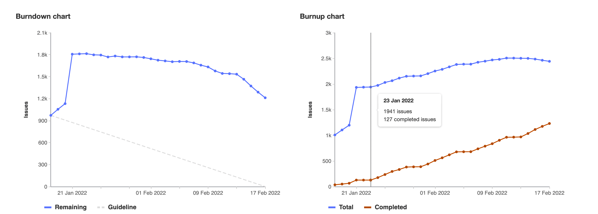
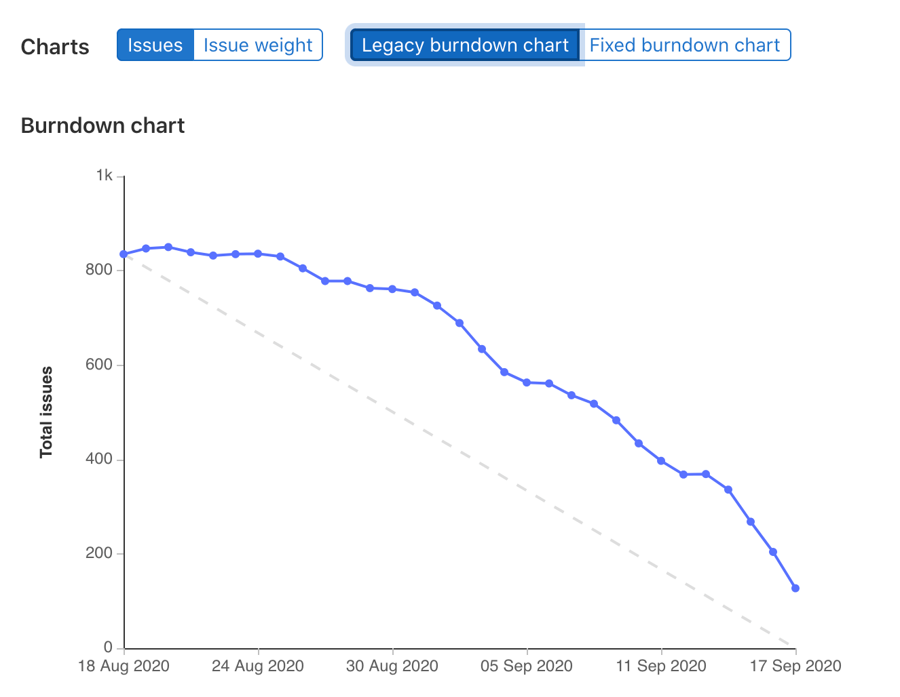
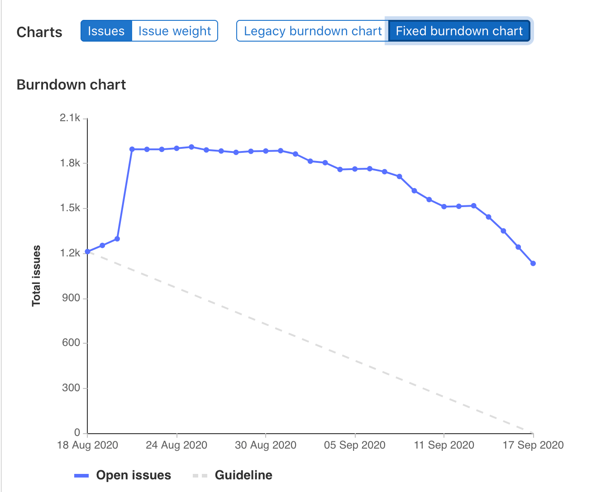
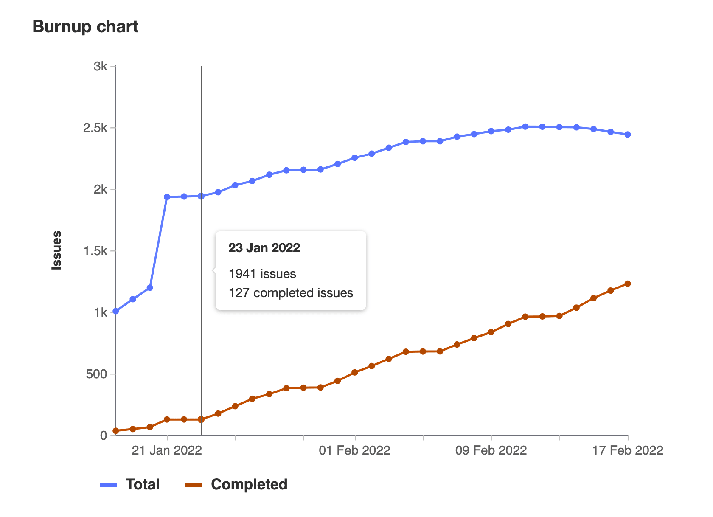

DETAILS:
**Tier:** Premium, Ultimate
**Offering:** GitLab.com, GitLab Self-Managed, GitLab Dedicated

[Burndown](#burndown-charts) and [burnup](#burnup-charts) charts show the progress of completing a milestone.

## Burndown charts

Burndown charts show the number of issues over the course of a milestone.

At a glance, you see the current state for the completion a given milestone.
Without them, you would have to organize the data from the milestone and plot it
yourself to have the same sense of progress.

GitLab plots it for you and presents it in a clear and beautiful chart.

<i class="fa fa-youtube-play youtube" aria-hidden="true"></i>
For an overview, check the video demonstration on [Mapping work versus time with burndown charts](https://www.youtube.com/watch?v=zJU2MuRChzs).

To view a project's burndown chart:

1. On the left sidebar, select **Search or go to** and find your project.
1. Select **Plan > Milestones**.
1. Select a milestone from the list.

To view a group's burndown chart:

1. On the left sidebar, select **Search or go to** and find your group.
1. Select **Plan > Milestones**.
1. Select a milestone from the list.

### Use cases for burndown charts

Burndown charts are generally used for tracking and analyzing the completion of
a milestone. Therefore, their use cases are tied to the
[use you are assigning your milestone to](_index.md).

For example, suppose you lead a team of developers in a large company,
and you follow this workflow:

- Your company set the goal for the quarter to deliver 10 new features for your app
  in the upcoming major release.
- You create a milestone, and remind your team to assign that milestone to every new issue
  and merge request that's part of the launch of your app.
- Every week, you open the milestone, visualize the progress, identify the gaps,
  and help your team to get their work done.
- Every month, you check in with your supervisor, and show the progress of that milestone
  from the burndown chart.
- By the end of the quarter, your team successfully delivered 100% of that milestone, as
  it was taken care of closely throughout the whole quarter.

### How burndown charts work

A burndown chart is available for every project or group milestone that has been attributed a **start
date** and a **due date**.

NOTE:
You're able to [promote project](_index.md#promote-a-project-milestone-to-a-group-milestone) to group milestones and still see the **burndown chart** for them, respecting license limitations.

The chart indicates the project's progress throughout that milestone (for issues assigned to it).

In particular, it shows how many issues were or are still open for a given day in the
milestone's corresponding period.

You can also toggle the burndown chart to display the
[cumulative open issue weight](#switch-between-number-of-issues-and-issue-weight) for a given day.

### Fixed burndown charts

For milestones created before GitLab 13.6, burndown charts have an additional toggle to
switch between Legacy and Fixed views.

| Legacy | Fixed |
| ----- | ----- |
|  |  |

**Fixed burndown** charts track the full history of milestone activity, from its creation until the
milestone expires. After the milestone due date passes, issues removed from the milestone no longer
affect the chart.

**Legacy burndown** charts track when issues were created and when they were last closed, not their
full history. For each day, a legacy burndown chart takes the number of open issues and the issues
created that day, and subtracts the number of issues closed that day.
Issues that were created and assigned a milestone before its start date (and remain open as of the
start date) are considered as having been opened on the start date.
Therefore, when the milestone start date is changed, the number of opened issues on each day may
change.
Reopened issues are considered as having been opened on the day after they were last closed.

## Burnup charts

Burnup charts show the assigned and completed work for a milestone.

To view a project's burnup chart:

1. On the left sidebar, select **Search or go to** and find your project.
1. Select **Plan > Milestones**.
1. Select a milestone from the list.

To view a group's burnup chart:

1. On the left sidebar, select **Search or go to** and find your group.
1. Select **Plan > Milestones**.
1. Select a milestone from the list.

### How burnup charts work

Burnup charts have separate lines for total work and completed work. The total line
shows changes to the scope of a milestone. When an open issue is moved to another
milestone, the "total issues" goes down but the "completed issues" stays the same.
The completed work is a count of issues closed. When an issue is closed, the "total
issues" remains the same and "completed issues" goes up.

## Switch between number of issues and issue weight

In both burndown or burnup charts you can view them
either by the total number of issues
or the total weight for each day of the milestone.

To switch between the two settings, select either **Issues** or **Issue weight** above the charts.

When sorting by weight, make sure all your issues
have weight assigned, because issues with no weight don't show on the chart.

## Roll up weights

DETAILS:
**Offering:** GitLab Self-Managed

> - [Introduced](https://gitlab.com/gitlab-org/gitlab/-/issues/381879) in GitLab 17.1 [with a flag](../../../administration/feature_flags.md) named `rollup_timebox_chart`. Disabled by default.

FLAG:
On GitLab Self-Managed, by default this feature is not available. For more information, see the history.
This feature is available for testing, but not ready for production use.

With [tasks](../../tasks.md), a more granular planning is possible.
If this feature is enabled, the weight of issues that have tasks is derived from the tasks in the
same milestone.
Issues with tasks are not counted separately in burndown or burnup charts.

How issue weight is counted in charts:

- If an issue's tasks do not have weights assigned, the issue's weight is used instead.
- If an issue has multiple tasks, and some tasks are completed in a prior iteration, only tasks in
  this iteration are shown and counted.
- If a task is directly assigned to an iteration, without its parent, it's the top level item and
  contributes its own weight. The parent issue is not shown.

### Weight rollup examples

**Example 1**

- Issue has weight 5 and is assigned to Milestone 2.
- Task 1 has weight 2 and is assigned to Milestone 1.
- Task 2 has weight 2 and is assigned to Milestone 2.
- Task 3 has weight 2 and is assigned to Milestone 2.

The charts for Milestone 1 would show Task 1 as having weight 2.

The charts for Milestone 2 would show Issue as having weight 4.

**Example 2**

- Issue has weight 5 and is assigned to Milestone 2.
- Task 1 is assigned to Milestone 1 without any weight.
- Task 2 is assigned to Milestone 2 without any weight.
- Task 3 is assigned to Milestone 2 without any weight.

The charts for Milestone 1 would show Task 1 as having weight 0.

The charts for Milestone 2 would show Issue as having weight 5.

**Example 3**

- Issue is assigned to Milestone 2 without any weight.
- Task 1 has weight 2 and is assigned to Milestone 1
- Task 2 has weight 2 and is assigned to Milestone 2
- Task 3 has weight 2 and is assigned to Milestone 2

The charts for Milestone 1 would show Task 1 as having weight 2.

The charts for Milestone 2 would show Issue as having weight 4.

## Troubleshooting

### Burndown and burnup charts do not show the correct issue status

A limitation of these charts is that [the days are in the UTC time zone](https://gitlab.com/gitlab-org/gitlab/-/issues/267967).

This can cause the graphs to be inaccurate in other timezones. For example:

- All the issues in a milestone are recorded as being closed on or before the last day.
- One issue was closed on the last day at 6 PM PST (Pacific time), which is UTC-7.
- The issue activity log displays the closure time at 6 PM on the last day of the milestone.
- The charts plot the time in UTC, so for this issue, the close time is 1 AM the following day.
- The charts show the milestone as incomplete and missing one closed issue.
