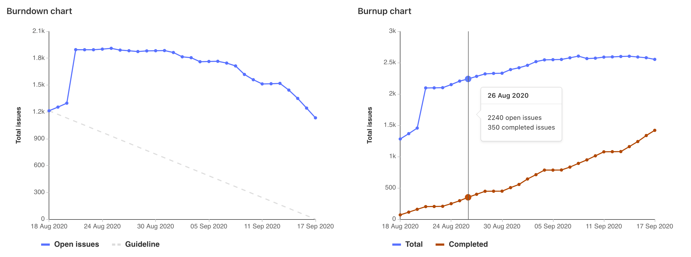
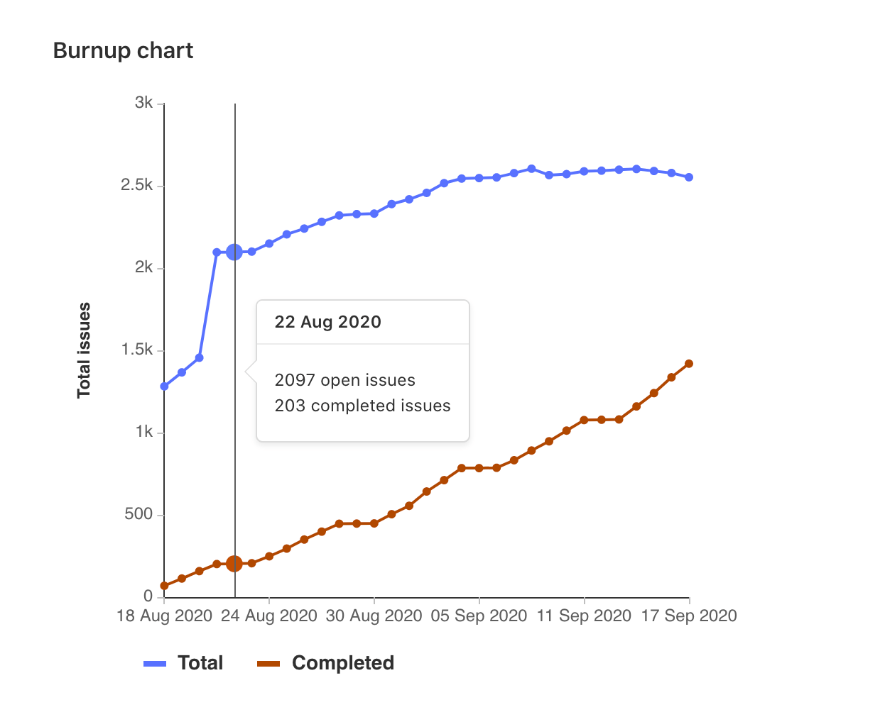

# Burndown and burnup charts **(STARTER)**

[Burndown](#burndown-charts) and [burnup](#burnup-charts) charts show the progress of completing a milestone.

## Burndown charts

> - [Introduced](https://gitlab.com/gitlab-org/gitlab/-/merge_requests/1540) in [GitLab Starter](https://about.gitlab.com/pricing/) 9.1 for project milestones.
> - [Introduced](https://gitlab.com/gitlab-org/gitlab/-/merge_requests/5354) in [GitLab Premium](https://about.gitlab.com/pricing/) 10.8 for group milestones.
> - [Added](https://gitlab.com/gitlab-org/gitlab/-/merge_requests/6495) to [GitLab Starter](https://about.gitlab.com/pricing/) 11.2 for group milestones.
> - [Introduced](https://gitlab.com/gitlab-org/gitlab/-/issues/6903) [fixed burndown charts](#fixed-burndown-charts) in [GitLab Starter](https://about.gitlab.com/pricing/) 13.6.

Burndown charts show the number of issues over the course of a milestone.

At a glance, you see the current state for the completion a given milestone.
Without them, you would have to organize the data from the milestone and plot it
yourself to have the same sense of progress.

GitLab plots it for you and presents it in a clear and beautiful chart.

<i class="fa fa-youtube-play youtube" aria-hidden="true"></i>
For an overview, check the video demonstration on [Mapping work versus time with burndown charts](https://www.youtube.com/watch?v=zJU2MuRChzs).

To view a project's burndown chart:

1. In a project, navigate to **Issues > Milestones**.
1. Select a milestone from the list.

To view a group's burndown chart:

1. In a group, navigate to **Issues > Milestones**.
1. Select a milestone from the list.

### Use cases for burndown charts

Burndown charts are generally used for tracking and analyzing the completion of
a milestone. Therefore, their use cases are tied to the
[use you are assigning your milestone to](index.md).

For example, suppose you lead a team of developers in a large company,
and you follow this workflow:

- Your company set the goal for the quarter to deliver 10 new features for your app
  in the upcoming major release.
- You create a milestone, and remind your team to assign that milestone to every new issue
  and merge request that's part of the launch of your app.
- Every week, you open the milestone, visualize the progress, identify the gaps,
  and help your team to get their work done.
- Every month, you check in with your supervisor, and show the progress of that milestone
  from the burndown chart.
- By the end of the quarter, your team successfully delivered 100% of that milestone, as
  it was taken care of closely throughout the whole quarter.

### How burndown charts work

A burndown chart is available for every project or group milestone that has been attributed a **start
date** and a **due date**.

NOTE: **Note:**
You're able to [promote project](index.md#promoting-project-milestones-to-group-milestones) to group milestones and still see the **burndown chart** for them, respecting license limitations.

The chart indicates the project's progress throughout that milestone (for issues assigned to it).

In particular, it shows how many issues were or are still open for a given day in the
milestone's corresponding period.

The burndown chart can also be toggled to display the cumulative open issue
weight for a given day. When using this feature, make sure issue weights have
been properly assigned, since an open issue with no weight adds zero to the
cumulative value.

### Fixed burndown charts

For milestones created before GitLab 13.6, burndown charts have an additional toggle to
switch between Legacy and Fixed views.

| Legacy | Fixed |
| ----- | ----- |
|  |  |

**Fixed burndown** charts track the full history of milestone activity, from its creation until the
milestone expires. After the milestone due date passes, issues removed from the milestone no longer
affect the chart.

**Legacy burndown** charts track when issues were created and when they were last closed, not their
full history. For each day, a legacy burndown chart takes the number of open issues and the issues
created that day, and subtracts the number of issues closed that day.
Issues that were created and assigned a milestone before its start date (and remain open as of the
start date) are considered as having been opened on the start date.
Therefore, when the milestone start date is changed, the number of opened issues on each day may
change.
Reopened issues are considered as having been opened on the day after they were last closed.

## Burnup charts

> - [Introduced](https://gitlab.com/gitlab-org/gitlab/-/issues/6903) in [GitLab Starter](https://about.gitlab.com/pricing/) 13.6.
> - [Feature flag removed](https://gitlab.com/gitlab-org/gitlab/-/issues/268350) in [GitLab Starter](https://about.gitlab.com/pricing/) 13.7.

Burnup charts show the assigned and completed work for a milestone.

To view a project's burnup chart:

1. In a project, navigate to **Issues > Milestones**.
1. Select a milestone from the list.

To view a group's burnup chart:

1. In a group, navigate to **Issues > Milestones**.
1. Select a milestone from the list.

### How burnup charts work

Burnup charts have separate lines for total work and completed work. The total line
shows when scope is reduced or added to a milestone. The completed work is a count
of issues closed.

Burnup charts can show either the total number of issues or total weight for each
day of the milestone. Use the toggle above the charts to switch between total
and weight.

<!-- ## Troubleshooting

Include any troubleshooting steps that you can foresee. If you know beforehand what issues
one might have when setting this up, or when something is changed, or on upgrading, it's
important to describe those, too. Think of things that may go wrong and include them here.
This is important to minimize requests for support, and to avoid doc comments with
questions that you know someone might ask.

Each scenario can be a third-level heading, e.g. `### Getting error message X`.
If you have none to add when creating a doc, leave this section in place
but commented out to help encourage others to add to it in the future. -->
