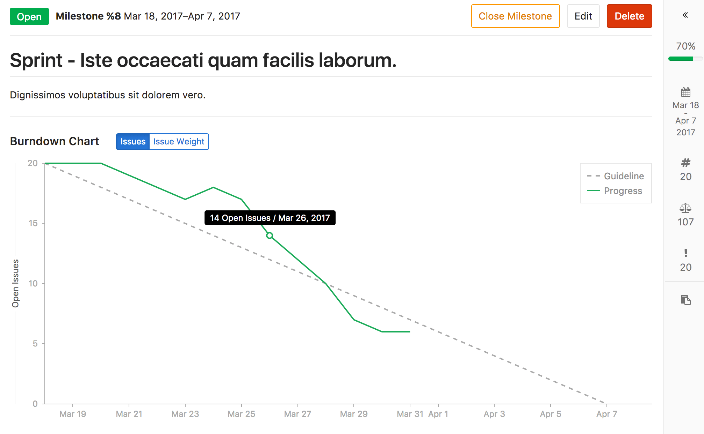

# Burndown Charts **[STARTER]**

>**Notes:**
- [Introduced][ee-1540] in [GitLab Starter 9.1][ee-9.1].
- Closed or reopened issues prior to GitLab 9.1 won't have a `closed_at`
  value, so the burndown chart considers them as closed on the milestone
  `start_date`. In that case, a warning will be displayed.

## Overview

Burndown Charts are visual representations of the progress of completing a milestone.

At a glance, you see the current state for the completion a given milestone.
Without them, you would have to organize the data from the milestone and plot it
yourself to have the same sense of progress.

GitLab Starter plots it for you and presents it in a clear and beautiful chart.

For an overview, check the video demonstration on [Mapping Work Versus Time, With Burndown Charts](https://about.gitlab.com/2017/04/25/mapping-work-to-do-versus-time-with-burndown-charts/).

## Use cases

Burndown Charts, in gerenal, are used for tracking and analyzing the completion of
a milestone. Therefore, their use cases are tied to the
[use you are giving to your milestone](index.md#use-cases).

To exemplify, suppose you lead a team of developers in a large company,
and you follow this workflow:

- Your company set the goal for the quarter to deliver 10 new features for your app
in the upcoming major release
- You create a milestone, and remind your team to assign that milestone to every new issue
and merge request that's part of the launch of your app
- Every week, you open the milestone, visualize the progress, identify the gaps,
and help your team to get their work done
- Every month, you check in with your supervisor, and show the progress of that milestone
from the Burndown Chart
- By the end of the quarter, your team successfully delivered 100% of that milestone, as
it was taken care of closely throughout the whole quarter

## How it works

>**Note:** Burndown charts are only available for project milestones. They will be available for group milestones [in the future](https://gitlab.com/gitlab-org/gitlab-ee/issues/3064).

A Burndown Chart is available for every project milestone that has been attributed a **start
date** and a **due date**.

Find your project's **Burndown Chart** under **Project > Issues > Milestones**,
and select a milestone from your current ones.

The chart indicates the project's progress throughout that milestone (for issues assigned to it).

In particular, it shows how many issues were or are still open for a given day in the
milestone's corresponding period.

Since it only tracks when an issue was last closed (and not its full history), the chart
assumes that issue was open on days prior to that date. Reopened issues are
considered as open on one day after they were closed.

Note that with this design, if you create a new issue in the middle of the milestone period 
(and assign the milestone to the issue), the Burndown Chart will appear as if the 
issue was already open at the beginning of the milestone. A workaround is to simply 
close the issue (so that a closed timestamp is stored in the system), and reopen 
it to ge the desired effect, with a rise in the chart appearing on the day after.
This is what appears in the example below.

The Burndown Chart can also be toggled to display the cumulative open issue
weight for a given day. When using this feature, make sure issue weights have
been properly assigned, since an open issue with no weight adds zero to the
cumulative value.

[ee-1540]: https://gitlab.com/gitlab-org/gitlab-ee/merge_requests/1540
[ee-9.1]: https://about.gitlab.com/2017/04/22/gitlab-9-1-released/#burndown-charts-ees-eep
