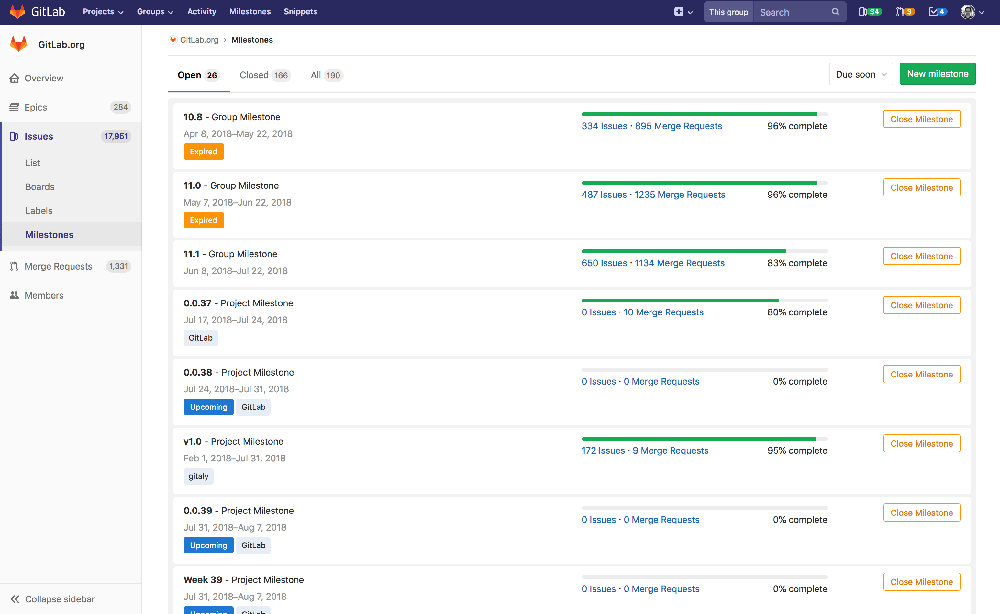
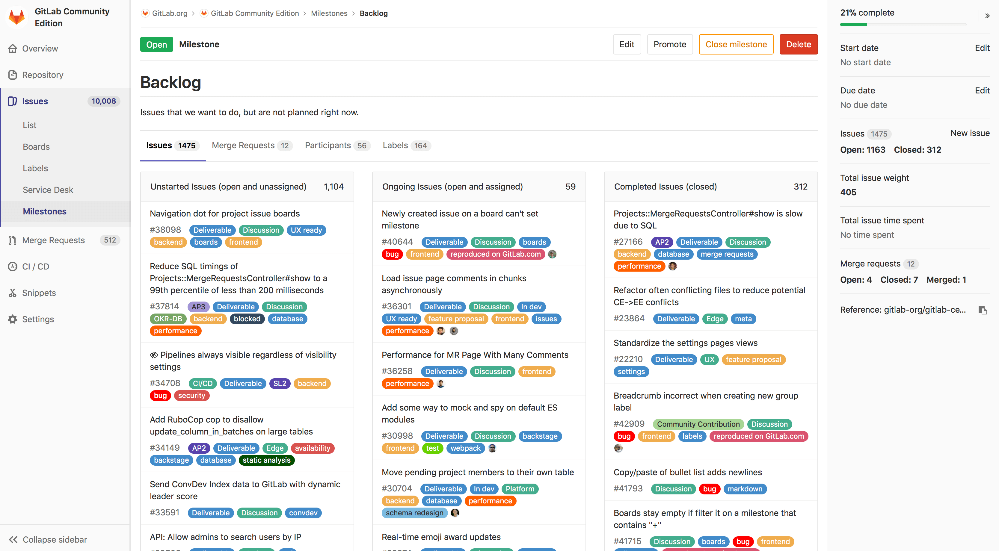

# Milestones

## Overview

Milestones in GitLab are a way to track issues and merge requests created to achieve a broader goal in a certain period of time.

Milestones allow you to organize issues and merge requests into a cohesive group, with an optional start date and an optional due date.

## Milestones as Agile sprints

Milestones can be used as Agile sprints.
Set the milestone start date and due date to represent
the start and end of your Agile sprint.
Set the milestone title to the name of your Agile sprint,
such as `November 2018 sprint`.
Add an issue to your Agile sprint by associating
the milestone to the issue.  

## Milestones as releases

Milestones can be used as releases.
Set the milestone due date to represent the release date of your release. 
(And leave the milestone start date blank.)
Set the milestone title to the version of your release,
such as `Version 9.4`.
Add an issue to your release by associating
the milestone to the issue.

## Project milestones and group milestones

- **Project milestones** can be assigned to issues or merge requests in that project only. Navigate to **Issues > Milestones** in a project to view the project milestone list.
- **Group milestones** can be assigned to any issue or merge request of any project in that group. Navigate to **Issues > Milestones** in a group to view the group milestone list.
- All milestones you have access to can also be viewed in the dashboard milestones list. Click on **Milestones** on the top navigation bar to view both project milestones and group milestones you have access to.

## Creating milestones

>**Note:**
A permission level of `Developer` or higher is required to create milestones.

### New project milestone

To create a **project milestone**, navigate to **Issues > Milestones** in the project.

Click the **New milestone** button. Enter the title, an optional description, an optional start date, and an optional due date. Click **Create milestone** to create the milestone.

### New group milestone

To create a **group milestone**, follow similar steps from above to project milestones. Navigate to **Issues > Milestones** in the group and create it from there.

## Editing milestones

>**Note:**
A permission level of `Developer` or higher is required to edit milestones.

You can update a milestone by navigating to **Issues > Milestones** in the project or group and clicking the **Edit** button.

You can delete a milestone by clicking the **Delete** button.

### Promoting project milestones to group milestones

If you are expanding from a few projects to a larger number of projects within the same group, you may want to share the same milestone among multiple projects in the same group. If you previously created a project milestone and now want to make it available for other milestones, you can promote it to a group milestone.

From the project milestone list page, you can promote a project milestone to a group milestone. This will merge all project milestones across all projects in this group with the same name into a single group milestones. All issues and merge requests that previously were assigned one of these project milestones will now be assigned the new group milestones. This action cannot be reversed and the changes are permanent.

>**Note:**
Not all features on the project milestone view are available on the group milestone view. If you promote a project milestone to a group milestone, you will lose these features. See [Milestone view](#milestone-view) to see which features are missing from the group milestone view.

## Assigning milestones from the sidebar

Every issue and merge request can be assigned a milestone. The milestones are visible on every issue and merge request page, in the sidebar. They are also visible in the issue board. From the sidebar, you can assign or unassign a milestones to the object. You can also perform this as a [quick action](../quick_actions.md) in a comment. [As mentioned](#project-milestones-and-group-milestones), for a given issue or merge request, both project milestones and group milestones can be selected and assigned to the object.

## Filtering issues and merge requests by milestone

### Filtering in list pages

From the project issue/merge request list pages and the group issue/merge request list pages, you can [filter](../../search/index.md#issues-and-merge-requests) by both group milestones and project milestones.

### Filtering in issue boards

- From [project issue boards](../issue_board.md), you can filter by both group milestones and project milestones in the [search and filter bar](../../search/index.md#issue-boards).
- From [group issue boards](../issue_board.md#group-issue-boards-premium), you can filter by only group milestones in the [search and filter bar](../../search/index.md#issue-boards). **(PREMIUM)**
- From [project issue boards](../issue_board.md), you can filter by both group milestones and project milestones in the [issue board configuration](../issue_board.md#configurable-issue-boards-starter). **(STARTER)**
- From [group issue boards](../issue_board.md#group-issue-boards-premium) you can filter by only group milestones in the [issue board configuration](../issue_board.md#configurable-issue-boards-starter). **(STARTER)**

### Special milestone filters

When filtering by milestone, in addition to choosing a specific project milestone or group milestone, you can choose a special milestone filter.

- **None**: Show issues or merge requests with no assigned milestone.
- **Any**: Show issues or merge requests that have an assigned milestone.
- **Upcoming**: Show issues or merge requests that have been assigned the open milestone that has the next upcoming due date (i.e. nearest due date in the future).
- **Started**: Show issues or merge requests that have an open assigned milestone with a start date that is before today.

## Milestone view

Not all features in the project milestone view are available in the group milestone view. This table summarizes the differences:

| Feature                              | Project milestone view | Group milestone view |
|--------------------------------------|:----------------------:|:--------------------:|
| Title an description                 | ✓                      | ✓                    |
| Issues assigned to milestone         | ✓                      |                      |
| Merge requests assigned to milestone | ✓                      |                      |
| Participants and labels used         | ✓                      |                      |
| Percentage complete                  | ✓                      | ✓                    |
| Start date and due date              | ✓                      | ✓                    |
| Total issue time spent               | ✓                      | ✓                    |
| Total issue weight                   | ✓                      |                      |
| Burndown chart **[STARTER}**         | ✓                      | ✓                    |

The milestone view shows the title and description.

### Project milestone features

These features are only available for project milestones and not group milestones.

- Issues assigned to the milestone are displayed in three columns: Unstarted issues, ongoing issues, and completed issues.
- Merge requests assigned to the milestone are displayed in four columns: Work in progress merge requests, waiting for merge, rejected, and closed.
- Participants and labels that are used in issues and merge requests that have the milestone assigned are displayed.
- [Burndown chart](#project-burndown-charts-starter).

### Project Burndown Charts **(STARTER)**

For project milestones in [GitLab Starter](https://about.gitlab.com/pricing), a [burndown chart](burndown_charts.md) is in the milestone view, showing the progress of completing a milestone.

### Group Burndown Charts **(PREMIUM)**

For group milestones in [GitLab Premium](https://about.gitlab.com/pricing), a [burndown chart](burndown_charts.md) is in the milestone view, showing the progress of completing a milestone.

### Milestone sidebar

The milestone sidebar on the milestone view shows the following:

- Percentage complete, which is calculated as number of closed issues divided by total number of issues.
- The start date and due date.
- The total time spent on all issues that have the milestone assigned.

For project milestones only, the milestone sidebar shows the total issue weight of all issues that have the milestone assigned.

