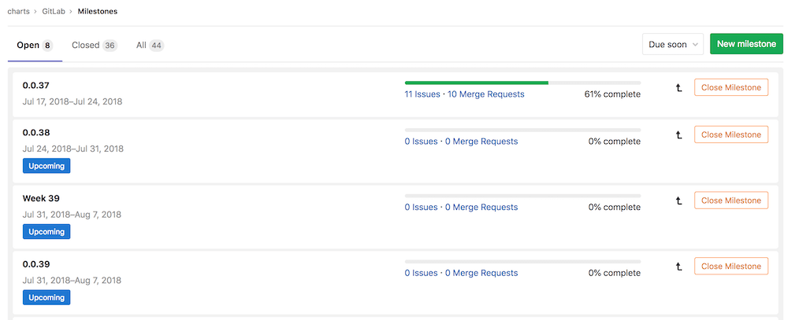
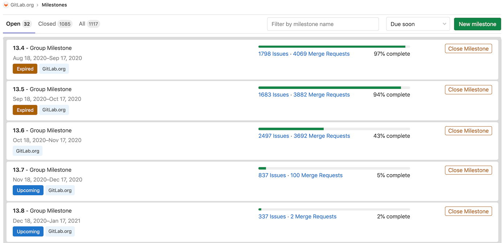
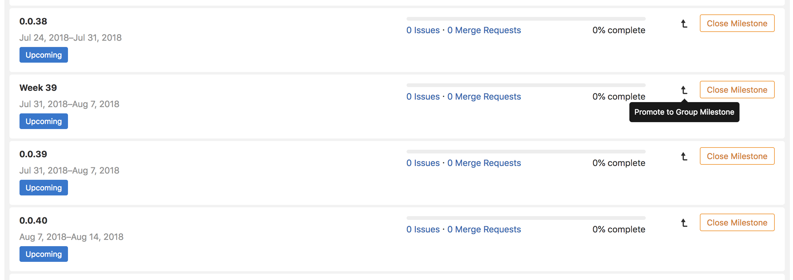
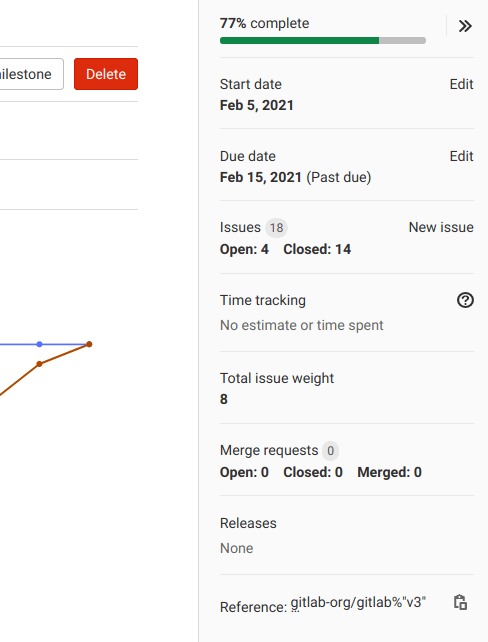

# Milestones **(FREE)**

Milestones in GitLab are a way to track issues and merge requests created to achieve a broader goal in a certain period of time.

Milestones allow you to organize issues and merge requests into a cohesive group, with an optional start date and an optional due date.

## Milestones as Agile sprints

Milestones can be used as Agile sprints so that you can track all issues and merge requests related to a particular sprint. To do so:

1. Set the milestone start date and due date to represent the start and end of your Agile sprint.
1. Set the milestone title to the name of your Agile sprint, such as `November 2018 sprint`.
1. Add an issue to your Agile sprint by associating the desired milestone from the issue's right-hand sidebar.

## Milestones as releases

Similarly, milestones can be used as releases. To do so:

1. Set the milestone due date to represent the release date of your release and leave the milestone start date blank.
1. Set the milestone title to the version of your release, such as `Version 9.4`.
1. Add an issue to your release by associating the desired milestone from the issue's right-hand sidebar.

Additionally, you can integrate milestones with the [Releases feature](../releases/index.md#associate-milestones-with-a-release).

## Project milestones and group milestones

You can assign **project milestones** to issues or merge requests in that project only.
To view the project milestone list, in a project, go to **{issues}** **Issues > Milestones**.

You can assign **group milestones** to any issue or merge request of any project in that group.
To view the group milestone list, in a group, go to **{issues}** **Issues > Milestones**.

You can also view all milestones you have access to in the dashboard milestones list.
To view both project milestones and group milestones you have access to, select **Menu > Milestones**
on the top bar.

For information about project and group milestones API, see:

- [Project Milestones API](../../../api/milestones.md)
- [Group Milestones API](../../../api/group_milestones.md)

NOTE:
If you're in a group and select **Issues > Milestones**, GitLab displays group milestones
and the milestones of projects in this group.
If you're in a project and select **Issues > Milestones**, GitLab displays only this project's milestones.

## Creating milestones

NOTE:
A permission level of [Developer or higher](../../permissions.md) is required to create milestones.

### New project milestone

To create a project milestone:

1. In a project, go to **{issues}** **Issues > Milestones**.
1. Select **New milestone**.
1. Enter the title, an optional description, an optional start date, and an optional due date.
1. Select **New milestone**.

### New group milestone

To create a group milestone:

1. In a group, go to **{issues}** **Issues > Milestones**.
1. Select **New milestone**.
1. Enter the title, an optional description, an optional start date, and an optional due date.
1. Select **New milestone**.

## Editing milestones

NOTE:
A permission level of [Developer or higher](../../permissions.md) is required to edit milestones.

To edit a milestone:

1. In a project or group, go to **{issues}** **Issues > Milestones**.
1. Select a milestone's title.
1. Select **Edit**.

You can delete a milestone by selecting the **Delete** button.

### Promoting project milestones to group milestones

If you are expanding the number of projects in a group, you might want to share the same milestones
among this group's projects. You can also promote project milestones to group milestones in order to
make them available to other projects in the same group.

From the project milestone list page, you can promote a project milestone to a group milestone.
This merges all project milestones across all projects in this group with the same name into a single
group milestones. All issues and merge requests that were previously assigned to one of these project
milestones is assigned the new group milestones. This action cannot be reversed and the changes are
permanent.

WARNING:
From GitLab 12.4 and earlier, some information is lost when you promote a project milestone to a
group milestone. Not all features on the project milestone view are available on the group milestone
view. If you promote a project milestone to a group milestone, you lose these features. Visit
[Milestone view](#milestone-view) to learn which features are missing from the group milestone view.

## Assigning milestones from the sidebar

Every issue and merge request can be assigned a milestone. The milestones are visible on every issue and merge request page, in the sidebar. They are also visible in the issue board. From the sidebar, you can assign or unassign a milestones to the object. You can also perform this as a [quick action](../quick_actions.md) in a comment. [As mentioned](#project-milestones-and-group-milestones), for a given issue or merge request, both project milestones and group milestones can be selected and assigned to the object.

## Filtering issues and merge requests by milestone

### Filtering in list pages

From the project and group issue/merge request list pages, you can [filter](../../search/index.md#issues-and-merge-requests) by both group and project milestones.

### Filtering in issue boards

From [project issue boards](../issue_board.md), you can filter by both group milestones and project
milestones in:

- [Search and filter bar](../../search/index.md#issue-boards)
- [Issue board configuration](../issue_board.md#configurable-issue-boards)

From [group issue boards](../issue_board.md#group-issue-boards), you can filter by only group milestones in:

- [Search and filter bar](../../search/index.md#issue-boards)
- [Issue board configuration](../issue_board.md#configurable-issue-boards)

### Special milestone filters

When filtering by milestone, in addition to choosing a specific project milestone or group milestone, you can choose a special milestone filter.

- **None**: Show issues or merge requests with no assigned milestone.
- **Any**: Show issues or merge requests that have an assigned milestone.
- **Upcoming**: Show issues or merge requests that have been assigned the open milestone and has the nearest due date in the future.
- **Started**: Show issues or merge requests that have an open assigned milestone with a start date that is before today.

## Milestone view

The milestone view shows the title and description.

There are also tabs below these that show the following:

- **Issues**: Shows all issues assigned to the milestone. These are displayed in three columns named:
  - Unstarted Issues (open and unassigned)
  - Ongoing Issues (open and assigned)
  - Completed Issues (closed)
- **Merge Requests**: Shows all merge requests assigned to the milestone. These are displayed in four columns named:
  - Work in progress (open and unassigned)
  - Waiting for merge (open and unassigned)
  - Rejected (closed)
  - Merged
- **Participants**: Shows all assignees of issues assigned to the milestone.
- **Labels**: Shows all labels that are used in issues assigned to the milestone.

### Project Burndown Charts

For project milestones, a [burndown chart](burndown_and_burnup_charts.md) is in the milestone view,
showing the progress of completing a milestone.

### Group Burndown Charts

For group milestones, a [burndown chart](burndown_and_burnup_charts.md) is in the milestone view,
showing the progress of completing a milestone.

### Milestone sidebar

The milestone sidebar on the milestone view shows the following:

- Percentage complete, which is calculated as number of closed issues divided by total number of issues.
- The start date and due date.
- The total time spent on all issues and merge requests assigned to the milestone.
- The total issue weight of all issues assigned to the milestone.

<!-- ## Troubleshooting

Include any troubleshooting steps that you can foresee. If you know beforehand what issues
one might have when setting this up, or when something is changed, or on upgrading, it's
important to describe those, too. Think of things that may go wrong and include them here.
This is important to minimize requests for support, and to avoid doc comments with
questions that you know someone might ask.

Each scenario can be a third-level heading, e.g. `### Getting error message X`.
If you have none to add when creating a doc, leave this section in place
but commented out to help encourage others to add to it in the future. -->
