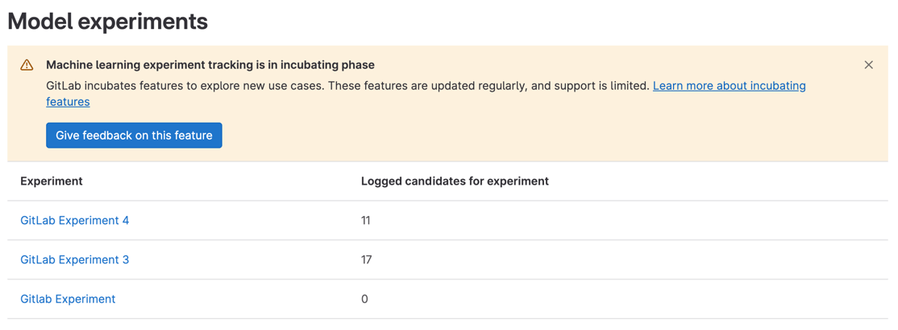
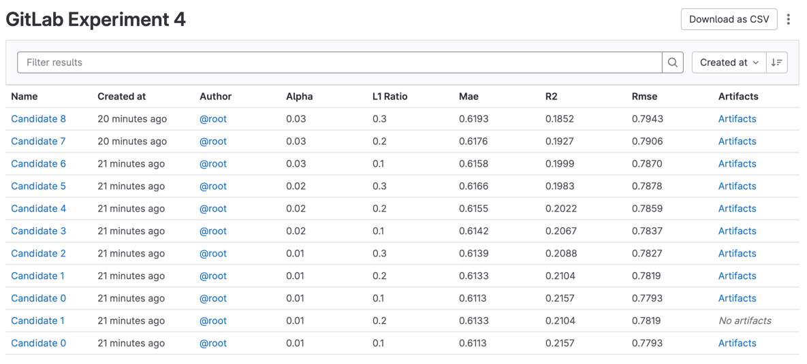
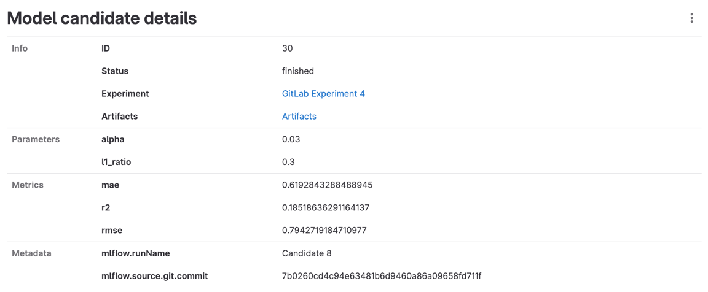

# Machine learning model experiments **(FREE)**

FLAG:
On self-managed GitLab, model experiment tracking is disabled by default.
To enable the feature, ask an administrator to [enable the feature flag](../../../../administration/feature_flags.md) named `ml_experiment_tracking`.
On GitLab.com, this feature is in private testing only.

NOTE:
Model experiment tracking is an [experimental feature](../../../../policy/alpha-beta-support.md). Refer to <https://gitlab.com/gitlab-org/gitlab/-/issues/381660> for feedback and feature requests.

When creating machine learning models, data scientists often experiment with different parameters, configurations, and feature
engineering to improve the performance of the model. Keeping track of all this metadata and the associated
artifacts so that the data scientist can later replicate the experiment is not trivial. Machine learning experiment
tracking enables them to log parameters, metrics, and artifacts directly into GitLab, giving easy access later on.

These features have been proposed:

- Searching experiments.
- Visual comparison of candidates.
- Creating, deleting, and updating candidates through the GitLab UI.

For feature requests, see [epic 9341](https://gitlab.com/groups/gitlab-org/-/epics/9341).

## What is an experiment?

In a project, an experiment is a collection of comparable model candidates.
Experiments can be long-lived (for example, when they represent a use case), or
short-lived (results from hyperparameter tuning triggered by a merge request),
but usually hold model candidates that have a similar set of parameters measured
by the same metrics.

## Model candidate

A model candidate is a variation of the training of a machine learning model, that can be eventually promoted to a version
of the model.

The goal of a data scientist is to find the model candidate whose parameter values lead to the best model
performance, as indicated by the given metrics.

Some example parameters:

- Algorithm (such as linear regression or decision tree).
- Hyperparameters for the algorithm (learning rate, tree depth, number of epochs).
- Features included.

## Track new experiments and candidates

Experiment and trials can only be tracked through the
[MLflow](https://www.mlflow.org/docs/latest/tracking.html) client integration.
See [MLflow client integration](../../integrations/mlflow_client.md) for more information
on how to use GitLab as a backend for the MLflow Client.

## Explore model candidates

Prerequisites:

- You must have at least the Developer role to view experiment data.

To list the current active experiments, either go to `https/-/ml/experiments` or:

1. On the top bar, select **Main menu > Projects** and find your project.
1. On the left sidebar, select **Packages & registries > Model experiments**.
1. To display all candidates that have been logged, along with their metrics, parameters, and metadata, select an experiment.
1. To display details for a candidate, select **Details**.

## View log artifacts

Trial artifacts are saved as [generic packages](../../../packages/generic_packages/index.md), and follow all their
limitations. After an artifact is logged for a candidate, all artifacts logged for the candidate are listed in the
package registry. The package name for a candidate is `ml_experiment_<experiment_id>`, where the version is the candidate
IID. The link to the artifacts can also be accessed from the **Experiment Candidates** list or **Candidate detail**.

## Related topics

- Development details in [epic 8560](https://gitlab.com/groups/gitlab-org/-/epics/8560).
- Add feedback in [issue 381660](https://gitlab.com/gitlab-org/gitlab/-/issues/381660).
