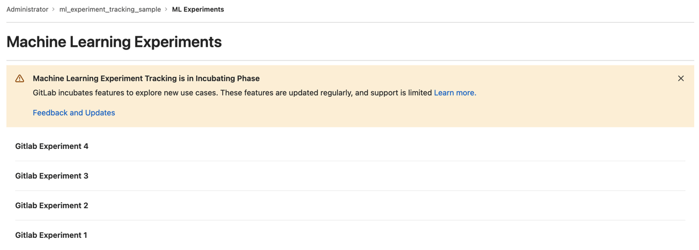
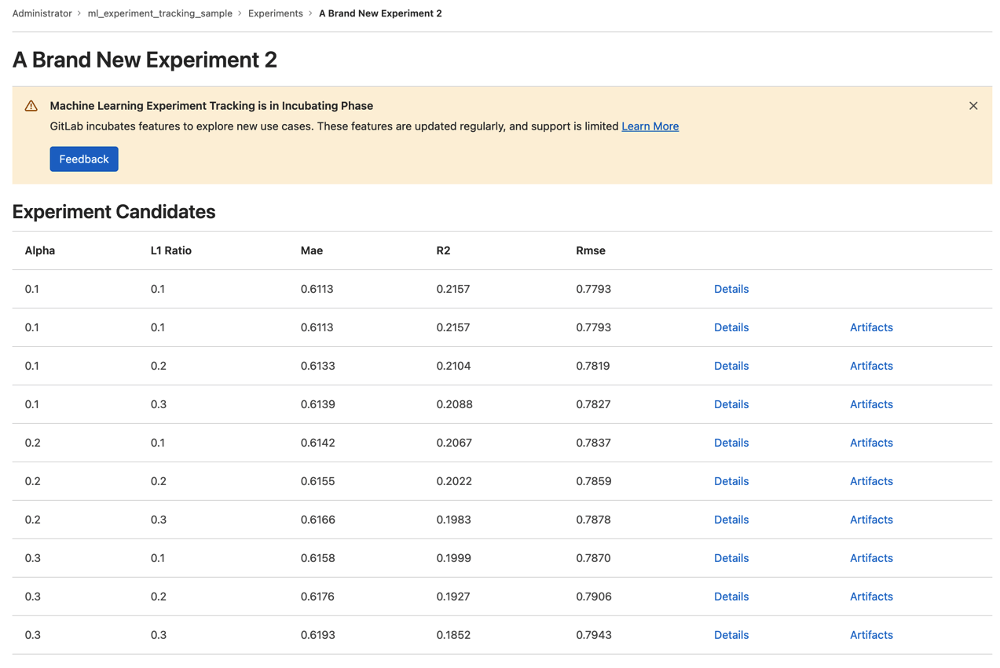
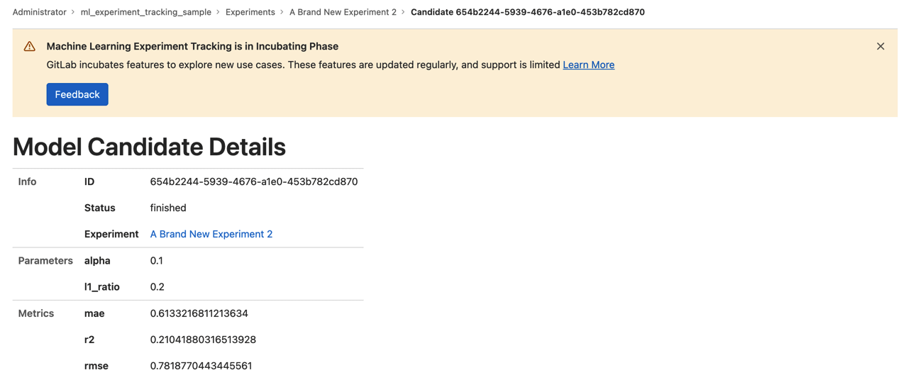

# Machine Learning Experiment Tracking **(FREE)**

DISCLAIMER:
Machine Learning Experiment Tracking is an experimental feature being developed by the Incubation Engineering Department,
and will receive significant changes over time. This feature is being release with the aim of getting user feedback, but
is not stable and can lead to performance degradation. See below on how to disable this feature.

When creating machine learning models, data scientists often experiment with different parameters, configurations, feature
engineering, and so on, to improve the performance of the model. Keeping track of all this metadata and the associated
artifacts so that the data scientist can later replicate the experiment is not trivial. Machine learning experiment
tracking enables them to log parameters, metrics, and artifacts directly into GitLab, giving easy access later on.

## What is an experiment?

An experiment is a collection of comparable model candidates. Experiments can be long lived (for example, when they represent
a use case), or short lived (results from hyperparameter tuning triggered by a merge request), but usually hold model candidates
that have a similar set of parameters and metrics.

## Model candidate

A model candidate is a variation of the training of a machine learning model, that can be eventually promoted to a version
of the model. The goal of a data scientist is to find the model candidate whose parameter values lead to the best model
performance, as indicated by the given metrics.

Example parameters:

- Algorithm (linear regression, decision tree, and so on).
- Hyperparameters for the algorithm (learning rate, tree depth, number of epochs).
- Features included.

## Usage

### User access management

An experiment is always associated to a project. Only users with access to the project an experiment is associated with
can view that experiment data.

### Tracking new experiments and trials

Experiment and trials can only be tracked through the [MLFlow](https://www.mlflow.org/docs/latest/tracking.html) client
integration. More information on how to use GitLab as a backend for MLFlow Client can be found [at the documentation page](../../integrations/mlflow_client.md).

### Exploring model candidates

To list the current active experiments, navigate to `https/-/ml/experiments`. To display all trials
that have been logged, along with their metrics and parameters, select an experiment. To display details for a candidate,
select **Details**.

### Logging artifacts

Trial artifacts are saved as [generic packages](../../../packages/generic_packages/index.md), and follow all their
conventions. After an artifact is logged for a candidate, all artifacts logged for the candidate are listed in the
package registry. The package name for a candidate is `ml_candidate_<candidate_id>`, with version `-`. The link to the
artifacts can also be accessed from the **Experiment Candidates** list or **Candidate detail**.

### Limitations and future

- Searching experiments, searching trials, visual comparison of trials, and creating, deleting and updating experiments and trials through GitLab UI is under development.

## Disabling or enabling the Feature

On self-managed GitLab, ML Experiment Tracking is disabled by default. To enable the feature, ask an administrator to [disable the feature flag](../../../../administration/feature_flags.md) named `ml_experiment_tracking`.
On GitLab.com, this feature is currently on private testing.

## Feedback, roadmap and reports

For updates on the development, refer to the [development epic](https://gitlab.com/groups/gitlab-org/-/epics/8560).

For feedback, bug reports and feature requests, refer to the [feedback issue](https://gitlab.com/gitlab-org/gitlab/-/issues/381660).
