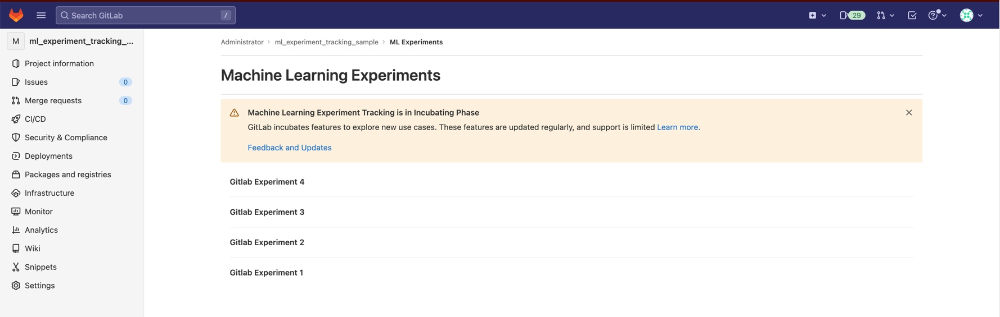
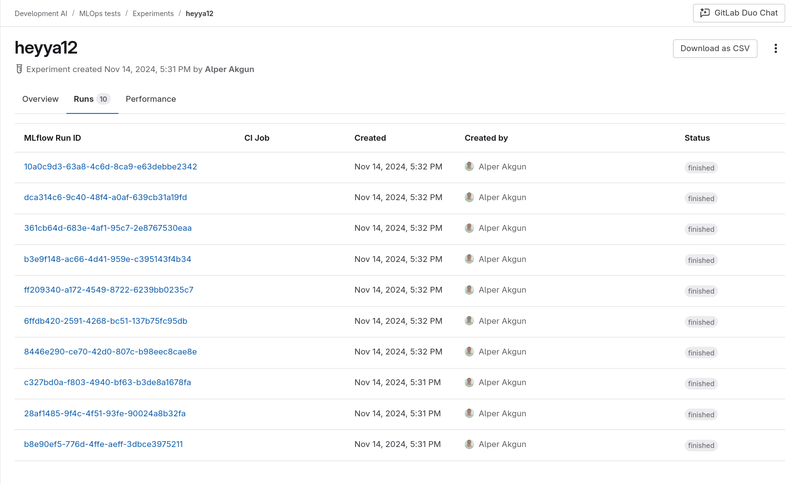
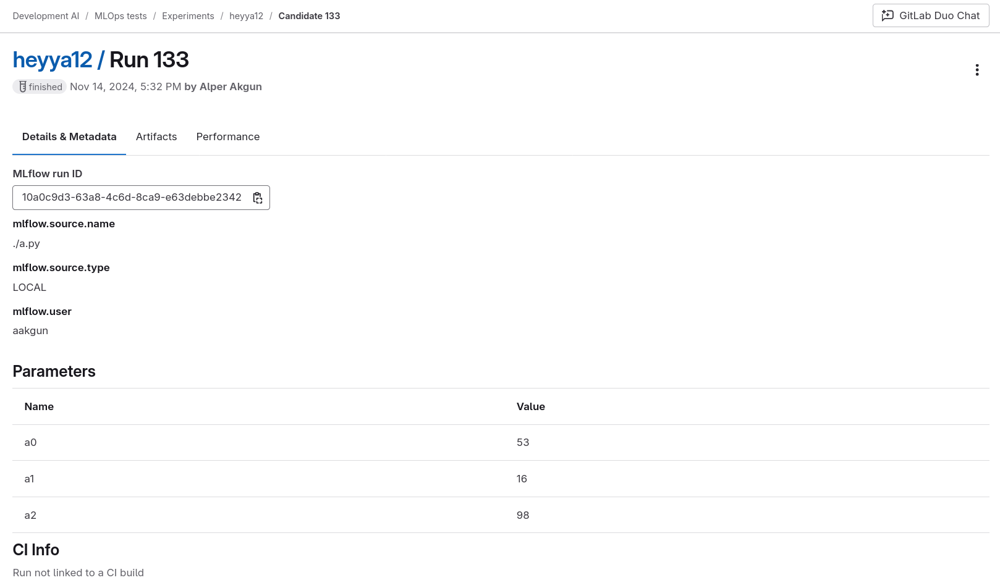

DETAILS:
**Tier:** Free, Premium, Ultimate
**Offering:** GitLab.com, GitLab Self-Managed, GitLab Dedicated

> - [Introduced](https://gitlab.com/groups/gitlab-org/-/epics/9341) in GitLab 15.11.
> - [Generally available](https://gitlab.com/groups/gitlab-org/-/epics/9341) in GitLab 17.8.

When creating machine learning models, data scientists often experiment with different parameters, configurations, and feature
engineering to improve the performance of the model. Keeping track of all this metadata and the associated
artifacts so that the data scientist can later replicate the experiment is not trivial. Machine learning experiment
tracking enables them to log parameters, metrics, and artifacts directly into GitLab, giving easy access later on.

## What is an experiment?

In a project, an experiment is a collection of comparable model runs.
Experiments can be long-lived (for example, when they represent a use case), or
short-lived (results from hyperparameter tuning triggered by a merge request),
but usually hold model runs that have a similar set of parameters measured
by the same metrics.

## Model run

A model run is a variation of the training of a machine learning model, that can be eventually promoted to a version
of the model.

The goal of a data scientist is to find the model run whose parameter values lead to the best model
performance, as indicated by the given metrics.

Some example parameters:

- Algorithm (such as linear regression or decision tree).
- Hyperparameters for the algorithm (learning rate, tree depth, number of epochs).
- Features included.

## Track new experiments and runs

Experiment and trials can only be tracked through the
[MLflow](https://www.mlflow.org/docs/latest/tracking.html) client compatibility.
See [MLflow client compatibility](mlflow_client.md) for more information
on how to use GitLab as a backend for the MLflow Client.

## Explore model runs

To list the current active experiments, either go to `https/-/ml/experiments` or:

1. On the left sidebar, select **Search or go to** and find your project.
1. Select **Analyze > Model experiments**.
1. To display all runs that have been logged, along with their metrics, parameters, and metadata, select an experiment.
1. To display details for a run, select **Details**.

## View log artifacts

Trial artifacts are saved as packages. After an artifact is logged for a run, all artifacts logged for the run are listed in the package registry. The package name for a run is `ml_experiment_<experiment_id>`, where the version is the run IID. The link to the artifacts can also be accessed from the **Experiment Runs** list or **Run detail**.

## View CI information

You can associate runs to the CI job that created them, allowing quick links to the merge request, pipeline, and user that triggered the pipeline:

## View logged metrics

When you run an experiment, GitLab logs certain related data, including its metrics, parameters, and metadata. You can view the metrics in a chart for analysis.

To view logged metrics:

1. On the left sidebar, select **Search or go to** and find your project.
1. Select **Analyze > Model experiments**.
1. Select the experiment you want to view.
1. Select the **Performance** tab.

