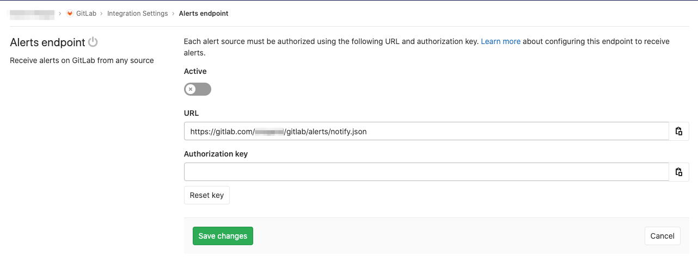
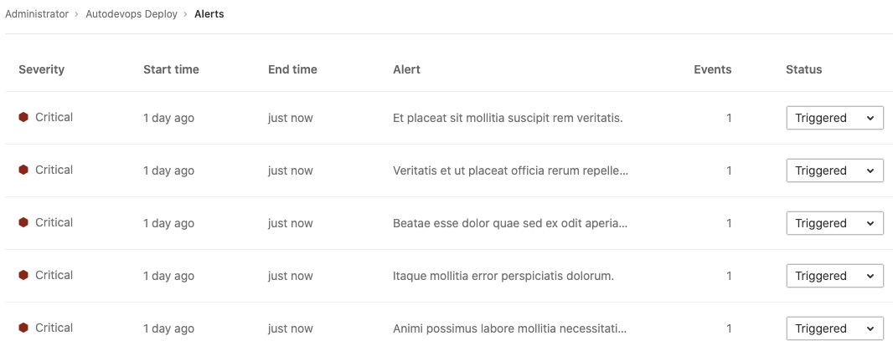

# Alert Management

> [Introduced](https://gitlab.com/groups/gitlab-org/-/epics/2877) in GitLab 13.0.

Alert Management enables developers to easily discover and view the alerts
generated by their application. By surfacing alert information where the code is
being developed, efficiency and awareness can be increased.

## Enable Alert Management

NOTE: **Note:**
You will need at least Maintainer [permissions](../../permissions.md) to enable the Alert Management feature.

1. Follow the [instructions for toggling generic alerts](../integrations/generic_alerts.md#setting-up-generic-alerts)
1. You can now visit **{cloud-gear}** **Operations > Alert Management** in your project's sidebar to [view a list](#alert-management-list) of alerts.

## Alert Management severity

Each level of alert contains a uniquely shaped and color-coded icon to help
you identify the severity of a particular alert. These severity icons help you
immediately identify which alerts you should prioritize investigating:

Alerts contain one of the following icons:

- **Critical**: **{severity-critical}** and hexadecimal color `#8b2615`
- **High**: **{severity-high}** and hexadecimal color `#c0341d`
- **Medium**: **{severity-medium}** and hexadecimal color `#fca429`
- **Low**: **{severity-low}** and hexadecimal color `#fdbc60`
- **Info**: **{severity-info}** and hexadecimal color `#418cd8`
- **Unknown**: **{severity-unknown}** and hexadecimal color `#bababa`

## Alert Management list

NOTE: **Note:**
You will need at least Developer [permissions](../../permissions.md) to view the Alert Management list.

You can find the Alert Management list at **{cloud-gear}** **Operations > Alerts** in your project's sidebar.
Each alert contains the following metrics:

- **Severity** - The current importance of a alert and how much attention it should receive.
- **Start time** - How long ago the alert fired. This field uses the standard GitLab pattern of `X time ago`, but is supported by a granular date/time tooltip depending on the user's locale.
- **End time** - How long ago the alert fired was resolved. This field uses the standard GitLab pattern of `X time ago`, but is supported by a granular date/time tooltip depending on the user's locale.
- **Alert description** - The description of the alert, which attempts to capture the most meaningful data.
- **Event count** - The number of times that an alert has fired.
- **Status** - The [current status](#alert-management-statuses) of the alert.

### Alert Management statuses

Each alert contains a status dropdown to indicate which alerts need investigation.
Standard alert statuses include `triggered`, `acknowledged`, and `resolved`:

- **Triggered**: No one has begun investigation.
- **Acknowledged**: Someone is actively investigating the problem.
- **Resolved**: No further work is required.
