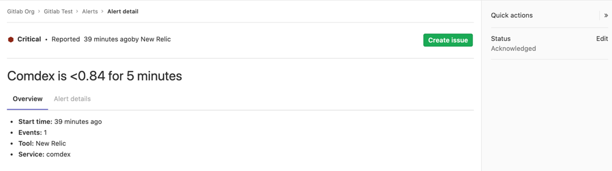
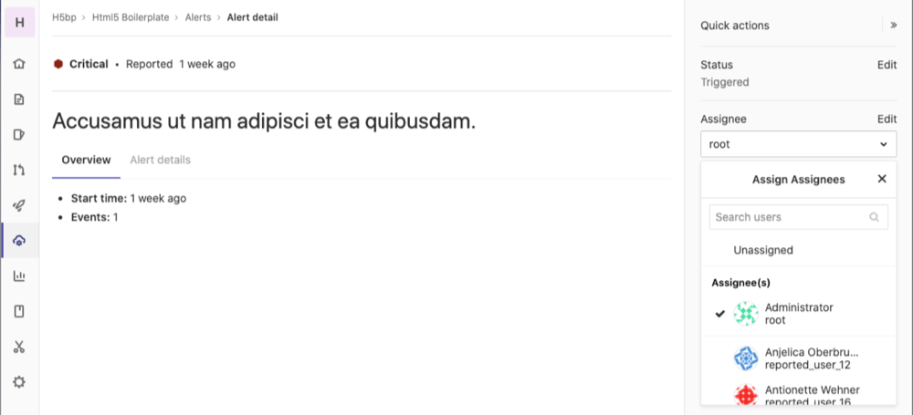
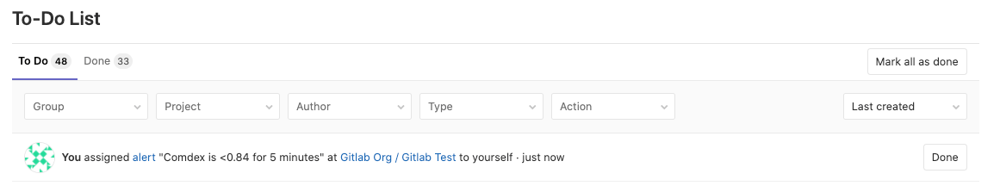

# Alert Management

> [Introduced](https://gitlab.com/groups/gitlab-org/-/epics/2877) in GitLab 13.0.

Alert Management enables developers to easily discover and view the alerts
generated by their application. By surfacing alert information where the code is
being developed, efficiency and awareness can be increased.

## Enable Alert Management

NOTE: **Note:**
You will need at least Maintainer [permissions](../../permissions.md) to enable the Alert Management feature.

1. Follow the [instructions for toggling generic alerts](../integrations/generic_alerts.md#setting-up-generic-alerts)
1. You can now visit **{cloud-gear}** **Operations > Alerts** in your project's sidebar to [view a list](#alert-management-list) of alerts.

## Populate Alert data

To populate data, see the instructions for
[customizing the payload](../integrations/generic_alerts.md) and making a
request to the alerts endpoint.

## Alert Management severity

Each level of alert contains a uniquely shaped and color-coded icon to help
you identify the severity of a particular alert. These severity icons help you
immediately identify which alerts you should prioritize investigating:

Alerts contain one of the following icons:

- **Critical**: **{severity-critical}** and hexadecimal color `#8b2615`
- **High**: **{severity-high}** and hexadecimal color `#c0341d`
- **Medium**: **{severity-medium}** and hexadecimal color `#fca429`
- **Low**: **{severity-low}** and hexadecimal color `#fdbc60`
- **Info**: **{severity-info}** and hexadecimal color `#418cd8`
- **Unknown**: **{severity-unknown}** and hexadecimal color `#bababa`

## Alert Management list

NOTE: **Note:**
You will need at least Developer [permissions](../../permissions.md) to view the Alert Management list.

You can find the Alert Management list at **{cloud-gear}** **Operations > Alerts** in your project's sidebar.
Each alert contains the following metrics:

- **Severity** - The current importance of a alert and how much attention it should receive.
- **Start time** - How long ago the alert fired. This field uses the standard GitLab pattern of `X time ago`, but is supported by a granular date/time tooltip depending on the user's locale.
- **End time** - How long ago the alert fired was resolved. This field uses the standard GitLab pattern of `X time ago`, but is supported by a granular date/time tooltip depending on the user's locale.
- **Alert description** - The description of the alert, which attempts to capture the most meaningful data.
- **Event count** - The number of times that an alert has fired.
- **Status** - The [current status](#alert-management-statuses) of the alert.

### Alert Management statuses

Each alert contains a status dropdown to indicate which alerts need investigation.
Standard alert statuses include `triggered`, `acknowledged`, and `resolved`:

- **Triggered**: No one has begun investigation.
- **Acknowledged**: Someone is actively investigating the problem.
- **Resolved**: No further work is required.

## Alert Management details

NOTE: **Note:**
You will need at least Developer [permissions](../../permissions.md) to view Alert Management details.

Navigate to the Alert Management detail view by visiting the [Alert Management list](#alert-management-list) and selecting an Alert from the list.

### Update an Alert's status

The Alert Management detail view enables you to update the Alert Status.
See [Alert Management statuses](#alert-management-statuses) for more details.

### Create an Issue from an Alert

> [Introduced](https://gitlab.com/gitlab-org/gitlab/-/issues/217745) in GitLab 13.1.

The Alert Management detail view enables you to create an issue with a
description automatically populated from an alert. To create the issue,
click the **Create Issue** button. You can then view the issue from the
alert by clicking the **View Issue** button.

Closing a GitLab issue associated with an alert changes the alert's status to Resolved.
See [Alert Management statuses](#alert-management-statuses) for more details about statuses.

### Update an Alert's assignee

NOTE: **Note:**
We currently only support a single assignee per alert.

The Alert Management detail view allows users to update the Alert Assignee(s).

> [Introduced](https://gitlab.com/groups/gitlab-org/-/epics/3066) in GitLab 13.1.

In large teams, where there is shared ownership of an alert, it can be difficult
to track who is investigating and working on it. The Alert Management detail view
enables you to update the Alert Assignee(s):

NOTE: **Note:**
GitLab currently only supports a single assignee per alert.

1. To display the list of current alerts, click
   **{cloud-gear}** **Operations > Alerts**:

   

1. Select your desired alert to display its **Alert Management Details View**:

   

1. If the right sidebar is not expanded, click
   **{angle-double-right}** **Expand sidebar** to expand it.
1. In the right sidebar, locate the **Assignee** and click **Edit**. From the
   dropdown menu, select each user you want to assign to the alert. GitLab creates
   a [To-Do list item](../../todos.md) for each user.

   

To remove an assignee, click **Edit** next to the **Assignee** dropdown menu and
deselect the user from the list of assignees, or click **Unassigned**.

### Alert system notes

> [Introduced](https://gitlab.com/groups/gitlab-org/-/epics/3066) in GitLab 13.1.

NOTE: **Note:**
GitLab currently only supports creating system notes when assigning an Alert.

Assigning a user an Alert creates a system note, visible in the Alert Details view,
giving you a linear timeline of the alert's investigation and assignment history.

## Use cases for assigning alerts

Consider a team formed by different sections of monitoring, collaborating on a
single application. After an alert surfaces, it's extremely important to
route the alert to the team members who can address and resolve the alert.

Assigning Alerts to multiple assignees eases collaboration and delegation. All
assignees are shown in your team's work-flows, and all assignees receive
notifications, simplifying communication and ownership of the alert.

After completing their portion of investigating or fixing the alert, users can
unassign their account from the alert when their role is complete.
The [alerts status](#alert-management-statuses) can be updated to
reflect if the alert has been resolved.
