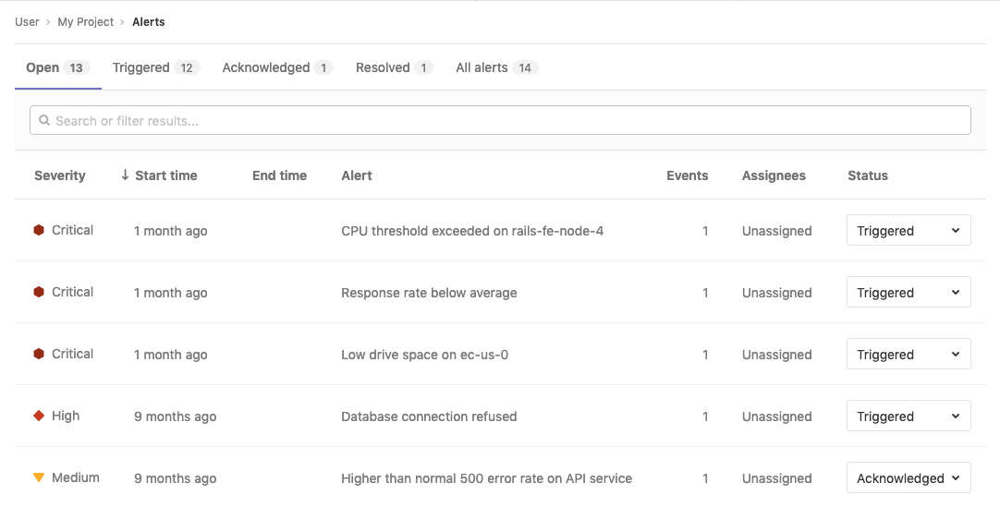
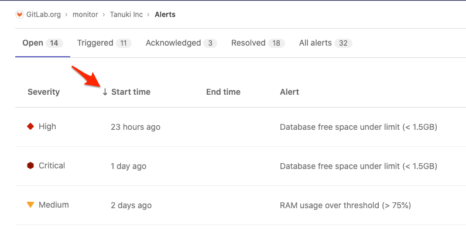

# Alert Management

> [Introduced](https://gitlab.com/groups/gitlab-org/-/epics/2877) in GitLab 13.0.

Alert Management enables developers to easily discover and view the alerts
generated by their application. By surfacing alert information where the code is
being developed, efficiency and awareness can be increased.

## Enable Alert Management

NOTE: **Note:**
You will need at least Maintainer [permissions](../../permissions.md) to enable the Alert Management feature.

There are several ways to accept alerts into your GitLab project, as outlined below.
Enabling any of these methods will allow the Alerts list to display. After configuring
alerts, visit **{cloud-gear}** **Operations > Alerts** in your project's sidebar
to [view the list](#alert-management-list) of alerts.

### Enable a Generic Alerts endpoint

GitLab provides the Generic Alerts endpoint so you can accept alerts from a third-party
alerts service. See the
[instructions for toggling generic alerts](../integrations/generic_alerts.md#setting-up-generic-alerts)
to add this option. After configuring the endpoint, the
[Alerts list](#alert-management-list) is enabled.

To populate the alerts with data, see [Customizing the payload](../integrations/generic_alerts.md#customizing-the-payload) for requests to the alerts endpoint.

### Enable GitLab-managed Prometheus alerts

You can install the GitLab-managed Prometheus application on your Kubernetes
cluster. For more information, see
[Managed Prometheus on Kubernetes](../integrations/prometheus.md#managed-prometheus-on-kubernetes).
When GitLab-managed Prometheus is installed, the [Alerts list](#alert-management-list)
is also enabled.

To populate the alerts with data, see
[GitLab-Managed Prometheus instances](../../../operations/metrics/index.md#managed-prometheus-instances).

### Enable external Prometheus alerts

You can configure an externally-managed Prometheus instance to send alerts
to GitLab. To set up this configuration, see the [configuring Prometheus](../../../operations/metrics/index.md#external-prometheus-instances) documentation. Activating the external Prometheus
configuration also enables the [Alerts list](#alert-management-list).

To populate the alerts with data, see
[External Prometheus instances](../../../operations/metrics/index.md#external-prometheus-instances).

## Alert Management severity

Each level of alert contains a uniquely shaped and color-coded icon to help
you identify the severity of a particular alert. These severity icons help you
immediately identify which alerts you should prioritize investigating:

Alerts contain one of the following icons:

| Severity | Icon | Color (hexadecimal) |
|---|---|---|
| Critical | **{severity-critical}** | `#8b2615` |
| High | **{severity-high}** | `#c0341d` |
| Medium | **{severity-medium}** | `#fca429` |
| Low | **{severity-low}** | `#fdbc60` |
| Info | **{severity-info}** | `#418cd8` |
| Unknown | **{severity-unknown}** | `#bababa` |

## Alert Management list

NOTE: **Note:**
You will need at least Developer [permissions](../../permissions.md) to view the Alert Management list.

You can find the Alert Management list at **{cloud-gear}** **Operations > Alerts** in your project's sidebar.
Each alert contains the following metrics:

- **Severity** - The current importance of a alert and how much attention it should receive.
- **Start time** - How long ago the alert fired. This field uses the standard GitLab pattern of `X time ago`, but is supported by a granular date/time tooltip depending on the user's locale.
- **Alert description** - The description of the alert, which attempts to capture the most meaningful data.
- **Event count** - The number of times that an alert has fired.
- **Issue** - A link to the incident issue that has been created for the alert.
- **Status** - The [current status](#alert-management-statuses) of the alert.

### Alert Management list sorting

> [Introduced](https://gitlab.com/gitlab-org/gitlab/-/issues/217745) in GitLab 13.1.

The Alert Management list displays alerts sorted by start time, but you can
change the sort order by clicking the headers in the Alert Management list.

To see if a column is sortable, point your mouse at the header. Sortable columns
display an arrow next to the column name, as shown in this example:

### Searching alerts

> [Introduced](https://gitlab.com/gitlab-org/gitlab/-/issues/213884) in GitLab 13.1.

The alert list supports a simple free text search.

This search filters on the following fields:

- Title
- Description
- Monitoring tool
- Service

### Alert Management statuses

Each alert contains a status dropdown to indicate which alerts need investigation.
Standard alert statuses include `triggered`, `acknowledged`, and `resolved`:

- **Triggered**: No one has begun investigation.
- **Acknowledged**: Someone is actively investigating the problem.
- **Resolved**: No further work is required.

## Alert Management details

NOTE: **Note:**
You will need at least Developer [permissions](../../permissions.md) to view Alert Management details.

Navigate to the Alert Management detail view by visiting the [Alert Management list](#alert-management-list) and selecting an Alert from the list.

### Update an Alert's status

The Alert Management detail view enables you to update the Alert Status.
See [Alert Management statuses](#alert-management-statuses) for more details.

### Create an Issue from an Alert

> [Introduced](https://gitlab.com/gitlab-org/gitlab/-/issues/217745) in GitLab 13.1.

The Alert Management detail view enables you to create an issue with a
description automatically populated from an alert. To create the issue,
click the **Create Issue** button. You can then view the issue from the
alert by clicking the **View Issue** button.

Closing a GitLab issue associated with an alert changes the alert's status to Resolved.
See [Alert Management statuses](#alert-management-statuses) for more details about statuses.

### Update an Alert's assignee

> [Introduced](https://gitlab.com/groups/gitlab-org/-/epics/3066) in GitLab 13.1.

The Alert Management detail view allows users to update the Alert assignee.

In large teams, where there is shared ownership of an alert, it can be difficult
to track who is investigating and working on it. The Alert Management detail view
enables you to update the Alert assignee:

NOTE: **Note:**
GitLab currently only supports a single assignee per alert.

1. To display the list of current alerts, click
   **{cloud-gear}** **Operations > Alerts**:

   

1. Select your desired alert to display its **Alert Management Details View**:

   

1. If the right sidebar is not expanded, click
   **{angle-double-right}** **Expand sidebar** to expand it.
1. In the right sidebar, locate the **Assignee** and click **Edit**. From the
   dropdown menu, select each user you want to assign to the alert. GitLab creates
   a [To-Do list item](../../todos.md) for each user.

   

To remove an assignee, click **Edit** next to the **Assignee** dropdown menu and
deselect the user from the list of assignees, or click **Unassigned**.

### Alert system notes

> [Introduced](https://gitlab.com/groups/gitlab-org/-/epics/3066) in GitLab 13.1.

When you take action on an alert, this is logged as a system note,
which is visible in the Alert Details view. This gives you a linear
timeline of the alert's investigation and assignment history.

The following actions will result in a system note:

- [Updating the status of an alert](#update-an-alerts-status)
- [Creating an issue based on an alert](#create-an-issue-from-an-alert)
- [Assignment of an alert to a user](#update-an-alerts-assignee)

### View an Alert's metrics data

> [Introduced](https://gitlab.com/gitlab-org/gitlab/-/issues/217768) in GitLab 13.2.

To view the metrics for an alert:

   1. Sign in as a user with Developer or higher [permissions](../../permissions.md).
   1. Navigate to **{cloud-gear}** **Operations > Alerts**.
   1. Click the alert you want to view.
   1. Below the title of the alert, click the **Metrics** tab.

For GitLab-managed Prometheus instances, metrics data is automatically available
for the alert, making it easy to see surrounding behavior. See
[Managed Prometheus instances](../../../operations/metrics/index.md#managed-prometheus-instances)
for information on setting up alerts.

For externally-managed Prometheus instances, you can configure your alerting rules to
display a chart in the alert. See
[Embedding metrics based on alerts in incident issues](../../../operations/metrics/embed.md#embedding-metrics-based-on-alerts-in-incident-issues)
for information on how to appropriately configure your alerting rules. See
[External Prometheus instances](../../../operations/metrics/index.md#external-prometheus-instances)
for information on setting up alerts for your self-managed Prometheus instance.

## Use cases for assigning alerts

Consider a team formed by different sections of monitoring, collaborating on a
single application. After an alert surfaces, it's extremely important to
route the alert to the team members who can address and resolve the alert.

Assigning Alerts to multiple assignees eases collaboration and delegation. All
assignees are shown in your team's work-flows, and all assignees receive
notifications, simplifying communication and ownership of the alert.

After completing their portion of investigating or fixing the alert, users can
unassign their account from the alert when their role is complete.
The [alerts status](#alert-management-statuses) can be updated to
reflect if the alert has been resolved.

### Slack Notifications

> [Introduced](https://gitlab.com/gitlab-org/gitlab/-/issues/216326) in GitLab 13.1.

You can be alerted via a Slack message when a new alert has been received.

See the [Slack Notifications Service docs](../integrations/slack.md) for information on how to set this up.
