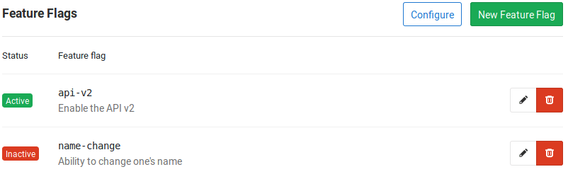
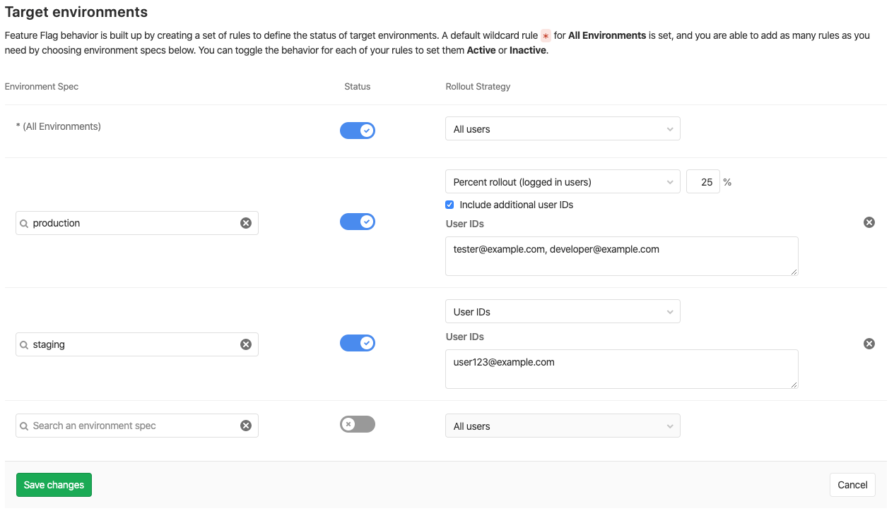

# Feature Flags **(PREMIUM)**

> [Introduced](https://gitlab.com/gitlab-org/gitlab/merge_requests/7433) in GitLab 11.4.

Feature flags allow you to ship a project in different flavors by
dynamically toggling certain functionality.

## Overview

Feature Flags offer a feature toggle system for your application. They enable teams
to achieve Continuous Delivery by deploying new features to production at smaller
batches for controlled testing, separating feature delivery from customer launch.
This helps reducing risk and allows you to easily manage which features to enable.

GitLab offers a Feature Flags interface that allows you to create, toggle and
remove feature flags.

## How it works

Underneath, GitLab uses [unleash](https://github.com/Unleash/unleash), a feature
toggle service. GitLab provides an API where your application can talk to and get the
list of feature flags you set in GitLab.

The application must be configured to talk to GitLab, so that's up to the
developers to use a compatible [client library](#client-libraries) and
integrate it in their app.

By setting a flag active or inactive via GitLab, your application will automatically
know which features to enable or disable respectively.

## Adding a new feature flag

To add a new feature flag:

1. Navigate to your project's **Operations > Feature Flags**.
1. Click on the **New Feature Flag** button.
1. Give it a name.

    NOTE: **Note:**
    A name can contain only lowercase letters, digits, underscores (`_`)
    and dashes (`-`), must start with a letter, and cannot end with a dash (`-`)
    or an underscore (`_`).

1. Give it a description (optional, 255 characters max).
1. Define environment [specs](#define-environment-specs). If you want the flag on by default, enable the catch-all [wildcard spec (`*`)](#define-environment-specs)
1. Click **Create feature flag**.

Once a feature flag is created, the list of existing feature flags will be presented
with ability to edit or remove them.

To make a feature flag active or inactive, click the pencil icon to edit it,
and toggle the status for each [spec](#define-environment-specs).



## Define environment specs

> [Introduced](https://gitlab.com/gitlab-org/gitlab/issues/8621) in GitLab 11.8.

In general, an application is deployed to multiple environments, such as
production, staging and [review apps](../../../ci/review_apps/index.md).
For example, you may not want to enable a feature flag on production until your QA team has
first confirmed that the feature is working correctly on testing environments.

To handle these situations, you can enable a feature flag on a particular environment
with [Environment specs](../../../ci/environments.md#scoping-environments-with-specs).
You can define multiple specs per flag so that you can control your feature flag more granularly.

To define specs for each environment:

1. Navigate to your project's **Operations > Feature Flags**.
1. Click on the **New Feature Flag** button or edit an existing flag.
1. Set the status of the default [spec](../../../ci/environments.md#scoping-environments-with-specs) (`*`). Choose a rollout strategy. This status and rollout strategy combination will be used for _all_ environments.
1. If you want to enable/disable the feature on a specific environment, create a new [spec](../../../ci/environments.md#scoping-environments-with-specs) and type the environment name.
1. Set the status and rollout strategy of the additional spec. This status and rollout strategy combination takes precedence over the default spec since we always use the most specific match available.
1. Click **Create feature flag** or **Update feature flag**.



NOTE: **NOTE**
We'd highly recommend you to use the [Environment](../../../ci/environments.md)
feature in order to quickly assess which flag is enabled per environment.

## Feature Flag strategies

GitLab Feature Flag adopts [Unleash](https://unleash.github.io)
as the feature flag engine. In unleash, there is a concept of rulesets for granular feature flag controls,
called [strategies](https://unleash.github.io/docs/activation_strategy).
Supported strategies for GitLab Feature Flags are described below.

### Rollout strategy

> [Introduced](https://gitlab.com/gitlab-org/gitlab/issues/8240) in GitLab 12.2.

The selected rollout strategy affects which users will experience the feature enabled.

The status of an environment spec ultimately determines whether or not a feature is enabled at all.
For instance, a feature will always be disabled for every user if the matching environment spec has a disabled status, regardless of the chosen rollout strategy.
However, a feature will be enabled for 50% of logged-in users if the matching environment spec has an enabled status along with a **Percent rollout (logged in users)** strategy set to 50%.

#### All users

Enables the feature for all users. It is implemented using the Unleash
[`default`](https://unleash.github.io/docs/activation_strategy#default)
activation strategy.

#### Percent rollout (logged in users)

Enables the feature for a percentage of authenticated users. It is
implemented using the Unleash
[`gradualRolloutUserId`](https://unleash.github.io/docs/activation_strategy#gradualrolloutuserid)
activation strategy.

Set a value of 15%, for example, to enable the feature for 15% of authenticated users.

A rollout percentage may be between 0% and 100%.

CAUTION: **Caution:**
If this strategy is selected, then the Unleash client **must** be given a user
ID for the feature to be enabled. See the [Ruby example](#ruby-application-example) below.

#### User IDs

> [Introduced](https://gitlab.com/gitlab-org/gitlab/issues/8240) in GitLab 12.2. [Updated](https://gitlab.com/gitlab-org/gitlab/issues/34363) to be defined per environment in GitLab 12.6.

A feature flag may be enabled for a list of target users. It is implemented
using the Unleash [`userWithId`](https://unleash.github.io/docs/activation_strategy#userwithid)
activation strategy.

User IDs should be a comma separated list of values. For example, `user@example.com, user2@example.com`, or `username1,username2,username3`, etc.

CAUTION: **Caution:**
The Unleash client **must** be given a user ID for the feature to be enabled for
target users. See the [Ruby example](#ruby-application-example) below.

## Integrating with your application

In order to use Feature Flags, you need to first
[get the access credentials](#configuring-feature-flags) from GitLab and then
prepare your application and hook it with a [client library](#client-libraries).

## Configuring Feature Flags

To get the access credentials that your application will need to talk to GitLab:

1. Navigate to your project's **Operations > Feature Flags**.
1. Click on the **Configure** button to see the values:
    - **API URL**: URL where the client (application) connects to get a list of feature flags.
    - **Instance ID**: Unique token that authorizes the retrieval of the feature flags.
    - **Application name**: The name of the running environment. For instance,
       if the application runs for production server, application name would be
      `production` or similar. This value is used for
      [the environment spec evaluation](#define-environment-specs).

NOTE: **Note:**
The meaning of these fields might change over time. For example, we are not sure
if **Instance ID** will be single token or multiple tokens, assigned to the
**Environment**. Also, **Application name** could describe the version of
application instead of the running environment.

## Client libraries

GitLab currently implements a single backend that is compatible with
[Unleash](https://github.com/Unleash/unleash#client-implementations) clients.

Unleash clients allow the developers to define in the app's code the default
values for flags. Each feature flag evaluation can express the desired
outcome in case the flag isn't present on the provided configuration file.

Unleash currently offers a number of official SDKs for various frameworks and
a number of community contributed libraries.

Official clients:

- [unleash/unleash-client-java](https://github.com/unleash/unleash-client-java)
- [unleash/unleash-client-node](https://github.com/unleash/unleash-client-node)
- [unleash/unleash-client-go](https://github.com/unleash/unleash-client-go)
- [unleash/unleash-client-ruby](https://github.com/unleash/unleash-client-ruby)

Community contributed clients:

- [Unleash FeatureToggle Client for .Net](https://github.com/stiano/unleash-client-dotnet)
- [Unofficial .Net Core Unleash client](https://github.com/onybo/unleash-client-core)
- [Unleash client for Python 3](https://github.com/aes/unleash-client-python)

## Golang application example

Here's an example of how to integrate the feature flags in a Golang application:

```golang
package main

import (
    "io"
    "log"
    "net/http"

    "github.com/Unleash/unleash-client-go"
)

type metricsInterface struct {
}

func init() {
    unleash.Initialize(
        unleash.WithUrl("https://gitlab.com/api/v4/feature_flags/unleash/42"),
        unleash.WithInstanceId("29QmjsW6KngPR5JNPMWx"),
        unleash.WithAppName("production"),
        unleash.WithListener(&metricsInterface{}),
    )
}

func helloServer(w http.ResponseWriter, req *http.Request) {
    if unleash.IsEnabled("my_feature_name") {
        io.WriteString(w, "Feature enabled\n")
    } else {
        io.WriteString(w, "hello, world!\n")
    }
}

func main() {
    http.HandleFunc("/", helloServer)
    log.Fatal(http.ListenAndServe(":8080", nil))
}
```

## Ruby application example

Here's an example of how to integrate the feature flags in a Ruby application.

The Unleash client is given a user id for use with a **Percent rollout (logged in users)** rollout strategy or a list of **Target Users**.

```ruby
#!/usr/bin/env ruby

require 'unleash'
require 'unleash/context'

unleash = Unleash::Client.new({
  url: 'http://gitlab.com/api/v4/feature_flags/unleash/42',
  app_name: 'production',
  instance_id: '29QmjsW6KngPR5JNPMWx'
})

unleash_context = Unleash::Context.new
# Replace "123" with the id of an authenticated user.
# Note that the context's user id must be a string:
# https://unleash.github.io/docs/unleash_context
unleash_context.user_id = "123"

if unleash.is_enabled?("my_feature_name", unleash_context)
  puts "Feature enabled"
else
  puts "hello, world!"
end
```

## Feature Flags API

You can create, update, read, and delete Feature Flags via API
to control them in an automated flow:

- [Feature Flags API](../../../api/feature_flags.md)
- [Feature Flag Specs API](../../../api/feature_flag_specs.md)
