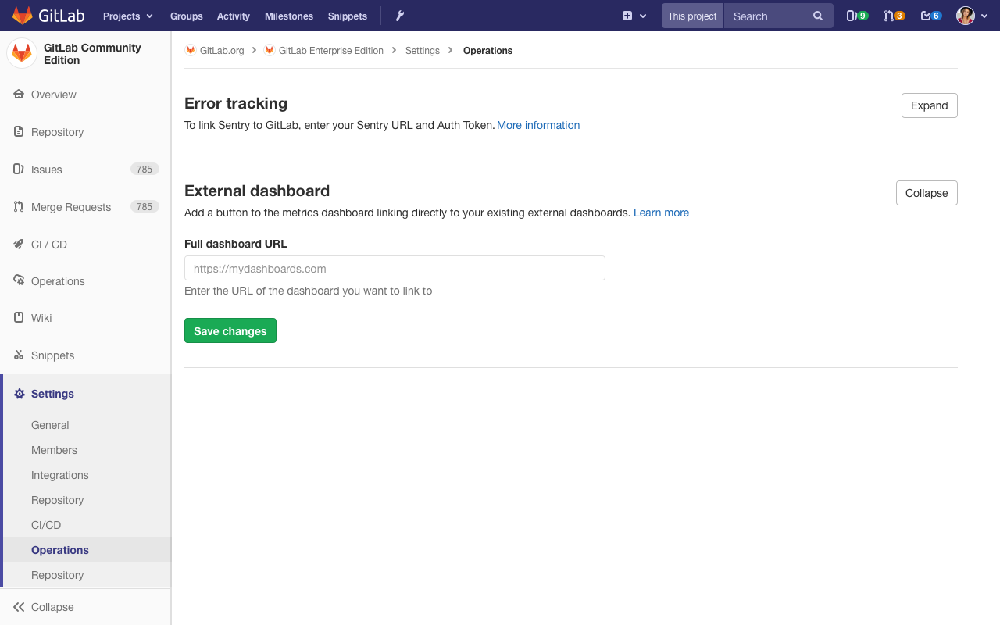
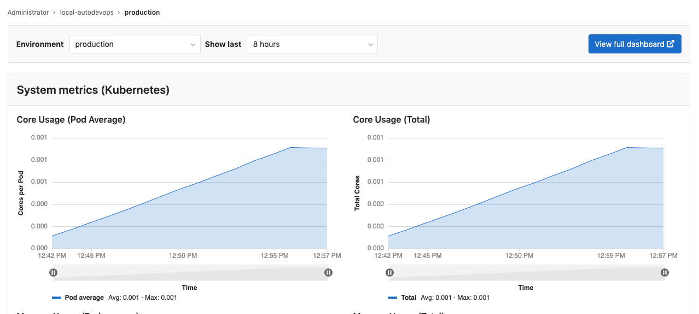

# Linking to an external dashboard

> [Introduced](https://gitlab.com/gitlab-org/gitlab-foss/-/issues/57171) in GitLab 12.0.

You can add a button to the Monitoring dashboard linking directly to your existing external dashboards.

## Enabling the external dashboard link

1. Go to **Settings > Operations** and scroll to the section titled **External dashboard**.

1. Fill in the URL to your external dashboard and click **Save changes**.

   

1. There should now be a button on your
   [Monitoring dashboard](../../../ci/environments/index.md#monitoring-environments) which
   will open the URL you entered in the above step.

   
