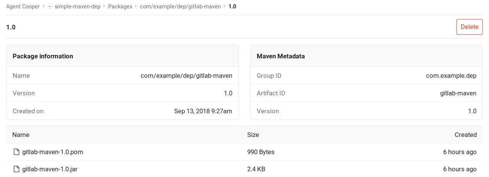

# GitLab Maven Packages repository **[PREMIUM]**

> Introduced in [GitLab Premium](https://about.gitlab.com/pricing/) 11.3.

With the GitLab [Maven](https://maven.apache.org) Packages repository, every
project can have its own space to store its Maven artifacts.



## Enabling the Packages repository

NOTE: **Note:**
This option is available only if your GitLab administrator has
[enabled the Packages repository](../../../administration/maven_packages.md).

In order to use the GitLab Maven Packages repository, you must enable the
Packages repository. To enable (or disable) it:

1. Navigate to your project's **Settings > General > Permissions**.
1. Find the "Packages" feature and enable it.
1. Click on **Save changes** for the changes to take effect.

You should then be able to see the **Packages** section on the left sidebar.
Next, you must configure your project to authorize with the GitLab Maven
repository.

## Authenticating to the GitLab Maven repository

If a project is private or you want to upload Maven artifacts to GitLab,
credentials will need to be provided for authorization. Support is available for
[personal access tokens](../../profile/personal_access_tokens.md) and
[CI job tokens](https://docs.gitlab.com/ee/ci/variables/#predefined-variables-environment-variables).

### Authenticating with a Personal Access Token

To authenticate with a Personal Access Token, add a corresponding section to your
   [`settings.xml`](https://maven.apache.org/settings.html) file:

    ```xml
    <settings>
      <servers>
        <server>
          <id>gitlab-maven</id>
          <configuration>
            <httpHeaders>
              <property>
                <name>Private-Token</name>
                <value>REPLACE_WITH_YOUR_PERSONAL_ACCESS_TOKEN</value>
              </property>
            </httpHeaders>
          </configuration>
        </server>
      </servers>
    </settings>
    ```
    
You should now be able to upload Maven artifacts to your project.


### Authenticating with a CI Job Token

To authenticate with a CI Job Token, add a corresponding section to your
   [`settings.xml`](https://maven.apache.org/settings.html) file:

    ```xml
    <settings>
      <servers>
        <server>
          <id>gitlab-maven</id>
          <configuration>
            <httpHeaders>
              <property>
                <name>Job-Token</name>
                <value>REPLACE_WITH_YOUR_CI_JOB_TOKEN</value>
              </property>
            </httpHeaders>
          </configuration>
        </server>
      </servers>
    </settings>
    ```
    
You should now be able to upload Maven artifacts to your project.

## Configuring your project to use the GitLab Maven repository URL

To download and upload packages from GitLab, you need a `repository` and
`distributionManagement` section respectively in your `pom.xml` file:

```xml
<repositories>
  <repository>
    <id>gitlab-maven</id>
    <url>https://gitlab.com/api/v4/projects/PROJECT_ID/packages/maven</url>
  </repository>
</repositories>
<distributionManagement>
  <repository>
    <id>gitlab-maven</id>
    <url>https://gitlab.com/api/v4/projects/PROJECT_ID/packages/maven</url>
  </repository>
  <snapshotRepository>
    <id>gitlab-maven</id>
    <url>https://gitlab.com/api/v4/projects/PROJECT_ID/packages/maven</url>
  </snapshotRepository>
</distributionManagement>
```

The `id` must be the same with what you
[defined in `settings.xml`](#authorizing-with-the-maven-repository).

In both examples, replace `PROJECT_ID` with your project ID which can be found
on the home page of your project.

If you have a self-hosted GitLab installation, replace `gitlab.com` with your
domain name.

## Uploading packages

Once you have set up the [authorization](#authorizing-with-the-gitlab-maven-repository)
and [configuration](#configuring-your-project-to-use-the-gitlab-maven-repository-url),
test to upload a Maven artifact from a project of yours:

```sh
mvn deploy
```

You can then navigate to your project's **Packages** page and see the uploaded
artifacts or even delete them.

## Creating Maven packages with GitLab CI/CD

Once you have your repository configured to use the GitLab Maven Packages repository,
you can configure GitLab CI/CD to build new packages automatically. The example below
shows how to create a new package each time the `master` branch is updated:

1. Create a `ci_settings.xml` file that will serve as Maven's `settings.xml` file.
   Add the server section with the same id you defined in your `pom.xml` file.
   For example, in our case it's `gitlab-maven`:

    ```xml
    <settings xmlns="http://maven.apache.org/SETTINGS/1.1.0" xmlns:xsi="http://www.w3.org/2001/XMLSchema-instance"
      xsi:schemaLocation="http://maven.apache.org/SETTINGS/1.1.0 http://maven.apache.org/xsd/settings-1.1.0.xsd">
      <servers>
        <server>
          <id>gitlab-maven</id>
          <configuration>
            <httpHeaders>
              <property>
                <name>Job-Token</name>
                <value>CI_JOB_TOKEN</value>
              </property>
            </httpHeaders>
          </configuration>
        </server>
      </servers>
    </settings>
    ```

1. Make sure your `pom.xml` file includes the following:

    ```xml
    <repositories>
      <repository>
        <id>gitlab-maven</id>
        <url>https://gitlab.com/api/v4/projects/PROJECT_ID/packages/maven</url>
      </repository>
    </repositories>
    <distributionManagement>
      <repository>
        <id>gitlab-maven</id>
        <url>https://gitlab.com/api/v4/projects/PROJECT_ID/packages/maven</url>
      </repository>
      <snapshotRepository>
        <id>gitlab-maven</id>
        <url>https://gitlab.com/api/v4/projects/PROJECT_ID/packages/maven</url>
      </snapshotRepository>
    </distributionManagement>
    ```

    TIP: **Tip:**
    You can either leave GitLab CI/CD to replace your project ID value while
    the deploy job is running or hardcode your project's ID.

1. Add a `deploy` job to your `.gitlab-ci.yml` file:

    ```yaml
    deploy:
      image: maven:3.3.9-jdk-8
      script:
        - 'cp ci_settings.xml /root/.m2/settings.xml'
        - 'sed -i "s/CI_JOB_TOKEN/${CI_JOB_TOKEN}/g" /root/.m2/settings.xml'
        - 'sed -i "s/PROJECT_ID/${CI_PROJECT_ID}/g" pom.xml'
        - 'mvn deploy'
      only:
        - master
    ```

1. Push those files to your repository.

The next time the `deploy` job runs, it will copy `ci_settings.xml` to the
user's home location (in this case the user is `root` since it runs in a
Docker container), and `sed` will replace the placeholder values with the
contents of the actual
[environment variables](../../../ci/variables/README.md#predefined-variables-environment-variables).
