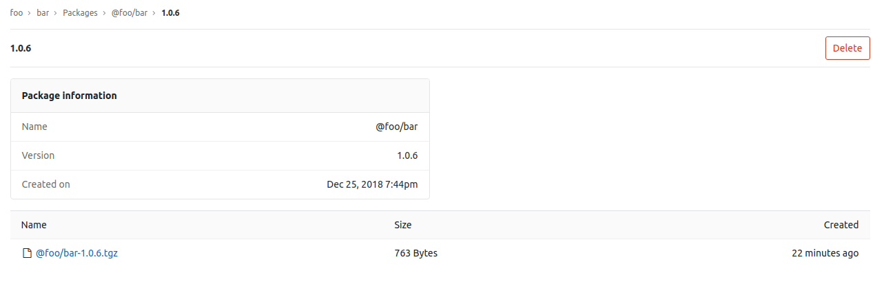

# GitLab NPM Registry **(PREMIUM)**

> [Introduced](https://gitlab.com/gitlab-org/gitlab-ee/issues/5934)
  in [GitLab Premium](https://about.gitlab.com/pricing/) 11.7.

With the GitLab NPM Registry, every
project can have its own space to store NPM packages.



NOTE: **Note:**
Only [scoped](https://docs.npmjs.com/misc/scope) packages are supported.

## Enabling the NPM Registry

NOTE: **Note:**
This option is available only if your GitLab administrator has
[enabled support for the NPM registry](../../../administration/packages.md).**(PREMIUM ONLY)**

After the NPM registry is enabled, it will be available for all new projects
by default. To enable it for existing projects, or if you want to disable it:

1. Navigate to your project's **Settings > General > Permissions**.
1. Find the Packages feature and enable or disable it.
1. Click on **Save changes** for the changes to take effect.

You should then be able to see the **Packages** section on the left sidebar.

Before proceeding to authenticating with the GitLab NPM Registry, you should
get familiar with the package naming convention.

## Package naming convention

**Packages must be scoped in the root namespace of the project**. The package
name may be anything but it is preferred that the project name be used unless
it is not possible due to a naming collision. For example:

| Project                | Package                 | Supported |
| ---------------------- | ----------------------- | --------- |
| `foo/bar`              | `@foo/bar`              | Yes       |
| `foo/bar/baz`          | `@foo/baz`              | Yes       |
| `foo/bar/buz`          | `@foo/anything`         | Yes       |
| `gitlab-org/gitlab-ce` | `@gitlab-org/gitlab-ce` | Yes       |
| `gitlab-org/gitlab-ce` | `@foo/bar`              | No        |

Now, you can configure your project to authenticate with the GitLab NPM
Registry.

## Authenticating to the GitLab NPM Registry

If a project is private or you want to upload an NPM package to GitLab,
credentials will need to be provided for authentication. Support is available
only for [OAuth tokens](../../../api/oauth2.md#resource-owner-password-credentials-flow).

CAUTION: **2FA not supported:**
Authentication for personal access tokens is not yet supported
([#9140](https://gitlab.com/gitlab-org/gitlab-ee/issues/9140)). If you have 2FA
enabled, you won't be able to authenticate to the GitLab NPM Registry.

### Authenticating with an OAuth token

To authenticate with an [OAuth token](../../../api/oauth2.md#resource-owner-password-credentials-flow),
add a corresponding section to your `.npmrc` file:

```ini
; Set URL for your scoped packages.
; For example package with name `@foo/bar` will use this URL for download
@foo:registry=https://gitlab.com/api/v4/packages/npm/

; Add the OAuth token for the scoped packages URL. This will allow you to download
; `@foo/` packages from private projects.
//gitlab.com/api/v4/packages/npm/:_authToken=<your_oauth_token>

; Add OAuth token for uploading to the registry. Replace <your_project_id>
; with the project you want your package to be uploaded to.
//gitlab.com/api/v4/projects/<your_project_id>/packages/npm/:_authToken=<your_oauth_token>
```

Replace `<your_project_id>` with your project ID which can be found on the home page
of your project and `<your_oauth_token>` with your OAuth token.

If you have a self-hosted GitLab installation, replace `gitlab.com` with your
domain name.

You should now be able to download and upload NPM packages to your project.

## Uploading packages

Before you will be able to upload a package, you need to specify the registry
for NPM. To do this, add the following section to the bottom of `package.json`:

```json
  "publishConfig": {
    "@foo:registry":"https://gitlab.com/api/v4/projects/<your_project_id>/packages/npm/"
  }
```

Replace `<your_project_id>` with your project ID, which can be found on the home
page of your project, and replace `@foo` with your own scope.

If you have a self-hosted GitLab installation, replace `gitlab.com` with your
domain name.

Once you have enabled it and set up [authentication](#authenticating-to-the-gitlab-npm-registry),
you can upload an NPM package to your project:

```sh
npm publish
```

You can then navigate to your project's **Packages** page and see the uploaded
packages or even delete them.

If you attempt to publish a package with a name that already exists within
a given scope, you will receive a `403 Forbidden!` error.

## Uploading a package with the same version twice

If you upload a package with a same name and version twice, GitLab will show
both packages in the UI, but the GitLab NPM Registry will expose the most recent
one as it supports only one package per version for `npm install`.
