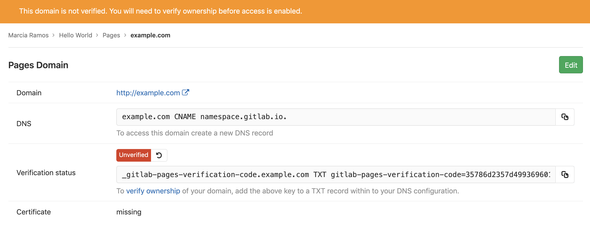

DETAILS:
**Tier:** Free, Premium, Ultimate
**Offering:** GitLab.com, GitLab Self-Managed

> - [Introduced](https://gitlab.com/gitlab-org/gitlab/-/issues/238461) in GitLab 15.4, you can use verified domains to [bypass user email confirmation for SAML- or SCIM-provisioned users](../../../group/saml_sso/_index.md#bypass-user-email-confirmation-with-verified-domains).

You can use custom domains:

- With GitLab Pages.
- To [bypass user email confirmation for SAML- or SCIM-provisioned users](../../../group/saml_sso/_index.md#bypass-user-email-confirmation-with-verified-domains).
  When using custom domains this way, you use the GitLab Pages feature but can skip the [prerequisites](#prerequisites).

To use one or more custom domain names:

- Add a [custom **root domain** or a **subdomain**](#set-up-a-custom-domain).
- Add [SSL/TLS certification](#adding-an-ssltls-certificate-to-pages).

WARNING:
You cannot verify the [most popular public email domains](../../../group/access_and_permissions.md#restrict-group-access-by-domain).

## Set up a custom domain

To set up Pages with a custom domain name, read the requirements and steps below.

### Prerequisites

- An administrator has configured the server for [GitLab Pages custom domains](../../../../administration/pages/_index.md#advanced-configuration)
- A GitLab Pages website up and running, served under the default Pages domain
  (`*.gitlab.io`, for GitLab.com).
- A custom domain name `example.com` or subdomain `subdomain.example.com`.
- Access to your domain's server control panel to set up DNS records:
  - A DNS record (`A`, `ALIAS`, or `CNAME`) pointing your domain to the GitLab Pages server. If
    there are multiple DNS records on that name, you must use an `ALIAS` record.
  - A DNS `TXT` record to verify your domain's ownership.

### Steps

Follow the steps below to add your custom domain to Pages. See also
this document for an [overview on DNS records](dns_concepts.md).

#### 1. Add a custom domain

To add your custom domain to GitLab Pages:

1. On the left sidebar, select **Search or go to** and find your project.
1. Select **Deploy > Pages**.
1. In the upper-right corner, select **New Domain**.
1. In **Domain**, enter the domain name.
1. Optional. In **Certificate**, turn off the **Automatic certificate management using Let's Encrypt** toggle to add an [SSL/TLS certificate](#adding-an-ssltls-certificate-to-pages). You can also add the certificate and key later.
1. Select **Create New Domain**.

#### 2. Get the verification code

After you add a new domain to Pages, the verification code prompts you. Copy the values from GitLab
and paste them in your domain's control panel as a `TXT` record on the next step.



#### 3. Set up DNS records

Read this document for an [overview of DNS records for Pages](dns_concepts.md).
If you're familiar with the subject, follow the instructions below
according to the type of domain you want to use with your Pages site:

- [For root domains](#for-root-domains), `example.com`.
- [For subdomains](#for-subdomains), `subdomain.example.com`.
- [For both](#for-both-root-and-subdomains).

You can [configure IPv6 on self-managed instances](../../../../administration/pages/_index.md#advanced-configuration),
but IPv6 is not currently configured for Pages on GitLab.com.
Follow [this issue](https://gitlab.com/gitlab-org/gitlab/-/issues/214718) for details.

##### For root domains

Root domains (`example.com`) require:

- A [DNS `A` record](dns_concepts.md#a-record) pointing your domain to the Pages server.
- A [`TXT` record](dns_concepts.md#txt-record) to verify your domain's ownership.

| From                                          | DNS Record | To              |
| --------------------------------------------- | ---------- | --------------- |
| `example.com`                                 | `A`        | `35.185.44.232` |
| `_gitlab-pages-verification-code.example.com` | `TXT`      | `gitlab-pages-verification-code=00112233445566778899aabbccddeeff` |

For projects on GitLab.com, this IP is `35.185.44.232`.
For projects living in other GitLab instances (CE or EE), contact
your sysadmin asking for this information (which IP address is Pages
server running on your instance).


WARNING:
If you use your root domain for your GitLab Pages website
**only**, and if your domain registrar supports this feature, you can
add a DNS apex `CNAME` record instead of an `A` record. The main
advantage of doing so is that when GitLab Pages IP on GitLab.com
changes for whatever reason, you don't need to update your `A` record.
There may be a few exceptions, but **this method is not recommended**
as it most likely doesn't work if you set an [`MX` record](dns_concepts.md#mx-record) for your root domain.

##### For subdomains

Subdomains (`subdomain.example.com`) require:

- A DNS [`ALIAS` or `CNAME` record](dns_concepts.md#cname-record) pointing your subdomain to the Pages server.
- A DNS [`TXT` record](dns_concepts.md#txt-record) to verify your domain's ownership.

| From                                                    | DNS Record      | To                    |
|:--------------------------------------------------------|:----------------|:----------------------|
| `subdomain.example.com`                                 | `ALIAS`/`CNAME` | `namespace.gitlab.io` |
| `_gitlab-pages-verification-code.subdomain.example.com` | `TXT`           | `gitlab-pages-verification-code=00112233445566778899aabbccddeeff` |

Whether it's a user or a project website, the DNS record
should point to your Pages domain (`namespace.gitlab.io`),
without any path.


##### For both root and subdomains

There are a few cases where you need to point both the subdomain and root
domain to the same website, for instance, `example.com` and `www.example.com`.

They require:

- A DNS `A` record for the domain.
- A DNS `ALIAS`/`CNAME` record for the subdomain.
- A DNS `TXT` record for each.

| From                                              | DNS Record | To |
|---------------------------------------------------|------------|----|
| `example.com`                                     | `A`        | `35.185.44.232` |
| `_gitlab-pages-verification-code.example.com`     | `TXT`      | `gitlab-pages-verification-code=00112233445566778899aabbccddeeff` |
| `www.example.com`                                 | `CNAME`    | `namespace.gitlab.io` |
| `_gitlab-pages-verification-code.www.example.com` | `TXT`      | `gitlab-pages-verification-code=00112233445566778899aabbccddeeff` |

If you're using Cloudflare, check
[Redirecting `www.domain.com` to `domain.com` with Cloudflare](#redirect-wwwdomaincom-to-domaincom-with-cloudflare).

Additionally:

- **Do not** use a `CNAME` record if you want to point your
  `domain.com` to your GitLab Pages site. Use an `A` record instead.
- **Do not** add any special chars after the default Pages
  domain. For example, don't point `subdomain.domain.com` to
  or `namespace.gitlab.io/`. Some domain hosting providers may request a trailing dot (`namespace.gitlab.io.`), though.
- GitLab Pages IP on GitLab.com [was changed](https://about.gitlab.com/releases/2017/03/06/we-are-changing-the-ip-of-gitlab-pages-on-gitlab-com/) in 2017.
- GitLab Pages IP on GitLab.com [has changed](https://about.gitlab.com/blog/2018/07/19/gcp-move-update/#gitlab-pages-and-custom-domains)
  from `52.167.214.135` to `35.185.44.232` in 2018.

#### 4. Verify the domain's ownership

After you have added all the DNS records:

1. On the left sidebar, select **Search or go to** and find your project.
1. Select **Deploy > Pages**.
1. Next to the domain name, select **Edit** (**{pencil}**).
1. In **Verification status**, select **Retry verification** (**{retry}**).


As soon as your domain becomes active, your website is available through your domain name.

WARNING:
Considering GitLab instances with domain verification enabled,
if the domain can't be verified for 7 days, it's removed
from the GitLab project.

Additionally:

- Domain verification is **required for GitLab.com users**.
  For GitLab Self-Managed, your GitLab administrator has the option
  to [disabled custom domain verification](../../../../administration/pages/_index.md#custom-domain-verification).
- [DNS propagation may take some time (up to 24 hours)](https://www.inmotionhosting.com/support/domain-names/dns-nameserver-changes/complete-guide-to-dns-records/),
  although it's usually a matter of minutes to complete. Until it does, verification
  fails, and attempts to visit your domain result in a 404.
- Once your domain has been verified, leave the verification record
  in place. Your domain is periodically reverified, and may be
  disabled if the record is removed.

### Add more domain aliases

You can add more than one alias (custom domains and subdomains) to the same project.
An alias can be understood as having many doors leading to the same room.

All the aliases you've set to your site are listed on **Setting > Pages**.
From that page, you can view, add, and remove them.

### Redirect `www.domain.com` to `domain.com` with Cloudflare

If you use Cloudflare, you can redirect `www` to `domain.com`
without adding both `www.domain.com` and `domain.com` to GitLab.

To do so, you can use Cloudflare's page rules associated to a
`CNAME` record to redirect `www.domain.com` to `domain.com`. You
can use the following setup:

1. In Cloudflare, create a DNS `A` record pointing `domain.com` to `35.185.44.232`.
1. In GitLab, add the domain to GitLab Pages and get the verification code.
1. In Cloudflare, create a DNS `TXT` record to verify your domain.
1. In GitLab, verify your domain.
1. In Cloudflare, create a DNS `CNAME` record pointing `www` to `domain.com`.
1. In Cloudflare, add a Page Rule pointing `www.domain.com` to `domain.com`:
   - Go to your domain's dashboard and select **Page Rules**
     on the top nav.
   - Select **Create Page Rule**.
   - Enter the domain `www.domain.com` and select **+ Add a Setting**.
   - From the dropdown list, choose **Forwarding URL**, then select the
     status code **301 - Permanent Redirect**.
   - Enter the destination URL `https://domain.com`.

## Adding an SSL/TLS certificate to Pages

Read this document for an [overview on SSL/TLS certification](ssl_tls_concepts.md).

To secure your custom domain with GitLab Pages you can opt by:

- Using the [Let's Encrypt integration with GitLab Pages](lets_encrypt_integration.md),
  which automatically obtains and renews SSL certificates
  for your Pages domains.
- Manually adding SSL/TLS certificates to GitLab Pages websites
  by following the steps below.

### Manual addition of SSL/TLS certificates

You can use any certificate satisfying the following requirements:

- A GitLab Pages website is up and running, accessible on a custom domain.
- **A PEM certificate**: it is the certificate generated by the CA,
  which needs to be added to the field **Certificate (PEM)**.
- **An [intermediate certificate](https://en.wikipedia.org/wiki/Intermediate_certificate_authority)**: (aka "root certificate"), it is
  the part of the encryption keychain that identifies the CA.
  Usually it's combined with the PEM certificate, but there are
  some cases in which you need to add them manually.
  [Cloudflare certs](https://about.gitlab.com/blog/2017/02/07/setting-up-gitlab-pages-with-cloudflare-certificates/)
  are one of these cases.
- **A private key**, it's an encrypted key which validates
  your PEM against your domain.

For example, [Cloudflare certificates](https://about.gitlab.com/blog/2017/02/07/setting-up-gitlab-pages-with-cloudflare-certificates/)
meet these requirements.

#### Steps

- To add the certificate at the time you add a new domain:

  1. On the left sidebar, select **Search or go to** and find your project.
  1. On the left sidebar, select **Deploy > Pages**.
  1. In the upper-right corner, select **New Domain**.
  1. In **Domain**, enter the domain name.
  1. In **Certificate**, turn off the **Automatic certificate management using Let's Encrypt** toggle to add an [SSL/TLS certificate](#adding-an-ssltls-certificate-to-pages).
  1. Select **Create New Domain**.

- To add the certificate to a domain previously added:

  1. On the left sidebar, select **Search or go to** and find your project.
  1. On the left sidebar, select **Deploy > Pages**.
  1. Next to the domain name, select **Edit** (**{pencil}**).
  1. In **Certificate**, turn off the **Automatic certificate management using Let's Encrypt** toggle to add an [SSL/TLS certificate](#adding-an-ssltls-certificate-to-pages).
  1. Select **Save changes**.

1. Add the PEM certificate to its corresponding field.
1. If your certificate is missing its intermediate, copy
   and paste the root certificate (usually available from your CA website)
   and paste it in the [same field as your PEM certificate](https://about.gitlab.com/blog/2017/02/07/setting-up-gitlab-pages-with-cloudflare-certificates/),
   just jumping a line between them.
1. Copy your private key and paste it in the last field.

**Do not** open certificates or encryption keys in
regular text editors. Always use code editors (such as
Sublime Text, Dreamweaver, Brackets, etc).

## Force HTTPS for GitLab Pages websites

To make your website's visitors even more secure, you can choose to
force HTTPS for GitLab Pages. By doing so, all attempts to visit your
website through HTTP are automatically redirected to HTTPS through 301.

It works with both the GitLab default domain and with your custom
domain (as long as you've set a valid certificate for it).

To enable this setting:

1. On the left sidebar, select **Search or go to** and find your project.
1. Select **Deploy > Pages**.
1. Select the **Force HTTPS (requires valid certificates)** checkbox.
1. Select **Save changes**.

If you use Cloudflare CDN in front of GitLab Pages, make sure to set the SSL connection setting to
`full` instead of `flexible`. For more details, see the [Cloudflare CDN directions](https://developers.cloudflare.com/ssl/origin-configuration/ssl-modes#h_4e0d1a7c-eb71-4204-9e22-9d3ef9ef7fef).

## Edit a custom domain

You can edit a custom domain to:

- View the custom domain.
- View the DNS record to add.
- View the TXT verification entry.
- Retry verification.
- Edit the certificate settings.

To edit a custom domain:

1. On the left sidebar, select **Search or go to** and find your project.
1. Select **Deploy > Pages**.
1. Next to the domain name, select **Edit** (**{pencil}**).

## Delete a custom domain

After a custom domain is deleted, the domain is no longer verified in GitLab and cannot be used with GitLab Pages.

To delete and remove a custom domain:

1. On the left sidebar, select **Search or go to** and find your project.
1. Select **Deploy > Pages**.
1. Next to the domain name, select **Remove domain** (**{remove}**)
1. When prompted, select **Remove domain**.

## Troubleshooting

### Domain verification

To manually verify that you have properly configured the domain verification
`TXT` DNS entry, you can run the following command in your terminal:

```shell
dig _gitlab-pages-verification-code.<YOUR-PAGES-DOMAIN> TXT
```

Expect the output:

```plaintext
;; ANSWER SECTION:
_gitlab-pages-verification-code.<YOUR-PAGES-DOMAIN>. 300 IN TXT "gitlab-pages-verification-code=<YOUR-VERIFICATION-CODE>"
```

In some cases it can help to add the verification code with the same domain name as you are trying to register.

For a root domain:

| From                                              | DNS Record | To                     |
| ------------------------------------------------- | ---------- | ---------------------- |
| `example.com`                                     | `TXT`      | `gitlab-pages-verification-code=00112233445566778899aabbccddeeff` |
| `_gitlab-pages-verification-code.example.com`     | `TXT`      | `gitlab-pages-verification-code=00112233445566778899aabbccddeeff` |

For a subdomain:

| From                                              | DNS Record | To                     |
| ------------------------------------------------- | ---------- | ---------------------- |
| `www.example.com`                                 | `TXT`      | `gitlab-pages-verification-code=00112233445566778899aabbccddeeff` |
| `_gitlab-pages-verification-code.www.example.com` | `TXT`      | `gitlab-pages-verification-code=00112233445566778899aabbccddeeff` |
