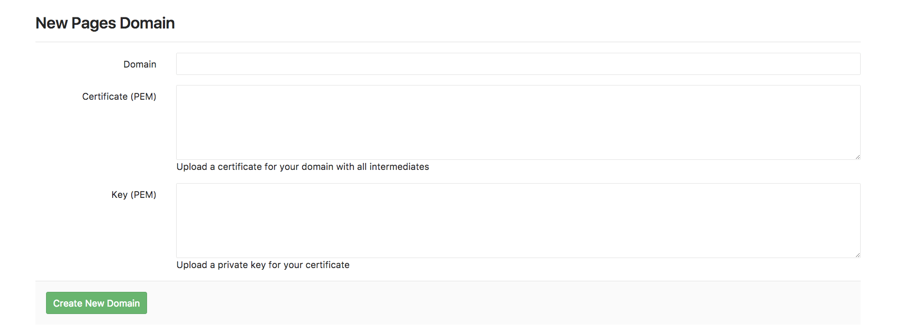

# Custom domains and SSL/TLS Certificates

Setting up GitLab Pages with custom domains, and adding SSL/TLS certificates to them, are optional features of GitLab Pages.

To use one or more custom domain names with your Pages site, you can:

- Add a [custom **root domain** or a **subdomain**](#set-up-pages-with-a-custom-domain).
- Add [SSL/TLS certification](#adding-an-ssltls-certificate-to-pages).

## Set up Pages with a custom domain

To set up Pages with a custom domain name, read the requirements
and steps below.

### Requirements

- A GitLab Pages website up and running, served under the default Pages domain
  (`*.gitlab.io`, for GitLab.com).
- A custom domain name `example.com` or subdomain `subdomain.example.com`.
- Access to your domain's server control panel to set up DNS records:
  - A DNS A or CNAME record pointing your domain to GitLab Pages server.
  - A DNS TXT record to verify your domain's ownership.

### Steps

Follow the steps below to add your custom domain to Pages. See also
this document for an [overview on DNS records](dns_concepts.md).

#### 1. Add a custom domain to Pages

Navigate to your project's **Setting > Pages** and click **+ New domain**
to add your custom domain to GitLab Pages. You can choose whether to:

- Add an [SSL/TLS certificate](#adding-an-ssltls-certificate-to-pages).
- Leave it blank (it can be added later).

Click **Create New Domain**.



#### 2. Get the verification code

Once you have added a new domain to Pages, the verification code will be prompted to you. Copy the values from GitLab and paste them in your domain's control panel as a TXT record on the next step.


#### 3. Set up DNS records for Pages

Read this document for an [overview of DNS records for Pages](dns_concepts.md).
If you're familiar with the subject, follow the instructions below
according to the type of domain you want to use with your Pages site:

- [For root domains](#for-root-domains), `example.com`.
- [For subdomains](#for-subdomains), `subdomain.example.com`.
- [For both](#for-both-root-and-subdomains).

##### For root domains

Root domains (`example.com`) require:

- A [DNS A record](dns_concepts.md#a-record) pointing your domain to the Pages server.
- A [TXT record](dns_concepts.md#txt-record) to verify your domain's ownership.

| From                                          | DNS Record | To              |
| --------------------------------------------- | ---------- | --------------- |
| `example.com`                                 | A          | `35.185.44.232` |
| `_gitlab-pages-verification-code.example.com` | TXT        | `gitlab-pages-verification-code=00112233445566778899aabbccddeeff` |

For projects on GitLab.com, this IP is `35.185.44.232`.
For projects living in other GitLab instances (CE or EE), please contact
your sysadmin asking for this information (which IP address is Pages
server running on your instance).


CAUTION: **Caution:**
Note that if you use your root domain for your GitLab Pages website
**only**, and if your domain registrar supports this feature, you can
add a DNS apex `CNAME` record instead of an `A` record. The main
advantage of doing so is that when GitLab Pages IP on GitLab.com
changes for whatever reason, you don't need to update your `A` record.
There may be a few exceptions, but **this method is not recommended**
as it most likely won't work if you set an [`MX` record](dns_concepts.md#mx-record) for your root domain.

##### For subdomains

Subdomains (`subdomain.example.com`) require:

- A DNS [CNAME record](dns_concepts.md#cname-record) record pointing your subdomain to the Pages server.
- A DNS [TXT record](dns_concepts.md#txt-record) to verify your domain's ownership.

| From                                                    | DNS Record | To                    |
| ------------------------------------------------------- | ---------- | --------------------- |
| `subdomain.example.com`                                 | CNAME      | `namespace.gitlab.io` |
| `_gitlab-pages-verification-code.subdomain.example.com` | TXT        | `gitlab-pages-verification-code=00112233445566778899aabbccddeeff` |

Note that, whether it's a user or a project website, the `CNAME`
should point to your Pages domain (`namespace.gitlab.io`),
without any `/project-name`.


##### For both root and subdomains

There are a few cases where you need point both subdomain and root
domain to the same website, for instance, `example.com` and `www.example.com`.

They require:

- A DNS A record for the domain.
- A DNS CNAME record for the subdomain.
- A DNS TXT record for each.

| From                                              | DNS Record | To                     |
| ------------------------------------------------- | ---------- | ---------------------- |
| `example.com`                                     | A          | `35.185.44.232`        |
| `_gitlab-pages-verification-code.example.com`     | TXT        | `gitlab-pages-verification-code=00112233445566778899aabbccddeeff` |
|--------------------------------------------+--------------------------------------------|
| `www.example.com`                                 | CNAME      | `namespace.gitlab.io`  |
| `_gitlab-pages-verification-code.www.example.com` | TXT        | `gitlab-pages-verification-code=00112233445566778899aabbccddeeff` |

If you're using CloudFlare, check
[Redirecting `www.domain.com` to `domain.com` with Cloudflare](#redirecting-wwwdomaincom-to-domaincom-with-cloudflare).

> **Notes**:
>
> - **Do not** use a CNAME record if you want to point your
  `domain.com` to your GitLab Pages site. Use an `A` record instead.
> - **Do not** add any special chars after the default Pages
  domain. E.g., don't point `subdomain.domain.com` to
  or `namespace.gitlab.io/`. Some domain hosting providers may request a trailing dot (`namespace.gitlab.io.`), though.
> - GitLab Pages IP on GitLab.com [was changed](https://about.gitlab.com/blog/2017/03/06/we-are-changing-the-ip-of-gitlab-pages-on-gitlab-com/) in 2017.
> - GitLab Pages IP on GitLab.com [has changed](https://about.gitlab.com/blog/2018/07/19/gcp-move-update/#gitlab-pages-and-custom-domains)
  from `52.167.214.135` to `35.185.44.232` in 2018.

#### 4. Verify the domain's ownership

Once you have added all the DNS records:

1. Go back at your project's **Settings > Pages**.
1. Locate your domain name and click **Details**.
1. Click the **Retry verification** button to activate your new domain.


As soon as your domain becomes active, your website will be available
through your domain name.

CAUTION: **Caution:**
Considering GitLab instances with domain verification enabled,
if the domain cannot be verified for 7 days, it will be removed
from the GitLab project.

> **Notes:**
>
> - Domain verification is **required for GitLab.com users**;
  for GitLab self-managed instances, your GitLab administrator has the option
  to [disabled custom domain verification](../../../../administration/pages/index.md#custom-domain-verification).
> - [DNS propagation may take some time (up to 24h)](https://www.inmotionhosting.com/support/domain-names/dns-nameserver-changes/domain-names-dns-changes),
  although it's usually a matter of minutes to complete. Until it does, verification
  will fail and attempts to visit your domain will respond with a 404.
> - Once your domain has been verified, leave the verification record
  in place: your domain will be periodically reverified, and may be
  disabled if the record is removed.

##### Troubleshooting Pages domain verification

To manually verify that you have properly configured the domain verification
`TXT` DNS entry, you can run the following command in your terminal:

```
dig _gitlab-pages-verification-code.<YOUR-PAGES-DOMAIN> TXT
```

Expect the output:

```
;; ANSWER SECTION:
_gitlab-pages-verification-code.<YOUR-PAGES-DOMAIN>. 300 IN TXT "gitlab-pages-verification-code=<YOUR-VERIFICATION-CODE>"
```

### Adding more domain aliases

You can add more than one alias (custom domains and subdomains) to the same project.
An alias can be understood as having many doors leading to the same room.

All the aliases you've set to your site will be listed on **Setting > Pages**.
From that page, you can view, add, and remove them.

### Redirecting `www.domain.com` to `domain.com` with Cloudflare

If you use Cloudflare, you can redirect `www` to `domain.com`
without adding both `www.domain.com` and `domain.com` to GitLab.

To do so, you can use Cloudflare's page rules associated to a
CNAME record to redirect `www.domain.com` to `domain.com`. You
can use the following setup:

1. In Cloudflare, create a DNS `A` record pointing `domain.com` to `35.185.44.232`.
1. In GitLab, add the domain to GitLab Pages and get the verification code.
1. In Cloudflare, create a DNS `TXT` record to verify your domain.
1. In GitLab, verify your domain.
1. In Cloudflare, create a DNS `CNAME` record pointing `www` to `domain.com`.
1. In Cloudflare, add a Page Rule pointing `www.domain.com` to `domain.com`:
   - Navigate to your domain's dashboard and click **Page Rules**
     on the top nav.
   - Click **Create Page Rule**.
   - Enter the domain `www.domain.com` and click **+ Add a Setting**.
   - From the dropdown menu, choose **Forwarding URL**, then select the
     status code **301 - Permanent Redirect**.
   - Enter the destination URL `https://domain.com`.

## Adding an SSL/TLS certificate to Pages

Read this document for an [overview on SSL/TLS certification](ssl_tls_concepts.md).

To secure your custom domain with GitLab Pages you can opt by:

- Using the [Let's Encrypt integration with GitLab Pages](lets_encrypt_integration.md),
  which automatically obtains and renews SSL certificates
  for your Pages domains.
- Manually adding SSL/TLS certificates to GitLab Pages websites
  by following the steps below.

### Requirements

- A GitLab Pages website up and running accessible via a custom domain.
- **A PEM certificate**: it is the certificate generated by the CA,
  which needs to be added to the field **Certificate (PEM)**.
- **An [intermediate certificate](https://en.wikipedia.org/wiki/Intermediate_certificate_authority)**: (aka "root certificate"), it is
  the part of the encryption keychain that identifies the CA.
  Usually it's combined with the PEM certificate, but there are
  some cases in which you need to add them manually.
  [CloudFlare certs](https://about.gitlab.com/blog/2017/02/07/setting-up-gitlab-pages-with-cloudflare-certificates/)
  are one of these cases.
- **A private key**, it's an encrypted key which validates
  your PEM against your domain.

### Steps

- To add the certificate at the time you add a new domain, go to your
  project's **Settings > Pages > New Domain**, add the domain name and the certificate.
- To add the certificate to a domain previously added, go to your
  project's **Settings > Pages**, locate your domain name, click **Details** and **Edit** to add the certificate.


1. Add the PEM certificate to its corresponding field.
1. If your certificate is missing its intermediate, copy
  and paste the root certificate (usually available from your CA website)
  and paste it in the [same field as your PEM certificate](https://about.gitlab.com/blog/2017/02/07/setting-up-gitlab-pages-with-cloudflare-certificates/),
  just jumping a line between them.
1. Copy your private key and paste it in the last field.

NOTE: **Note:**
**Do not** open certificates or encryption keys in
regular text editors. Always use code editors (such as
Sublime Text, Atom, Dreamweaver, Brackets, etc).

## Force HTTPS for GitLab Pages websites

> [Introduced](https://gitlab.com/gitlab-org/gitlab-foss/issues/28857) in GitLab 10.7.

To make your website's visitors even more secure, you can choose to
force HTTPS for GitLab Pages. By doing so, all attempts to visit your
website via HTTP will be automatically redirected to HTTPS via 301.

It works with both GitLab's default domain and with your custom
domain (as long as you've set a valid certificate for it).

To enable this setting:

1. Navigate to your project's **Settings > Pages**.
1. Tick the checkbox **Force HTTPS (requires valid certificates)**.

<!-- ## Troubleshooting

Include any troubleshooting steps that you can foresee. If you know beforehand what issues
one might have when setting this up, or when something is changed, or on upgrading, it's
important to describe those, too. Think of things that may go wrong and include them here.
This is important to minimize requests for support, and to avoid doc comments with
questions that you know someone might ask.

Each scenario can be a third-level heading, e.g. `### Getting error message X`.
If you have none to add when creating a doc, leave this section in place
but commented out to help encourage others to add to it in the future. -->
