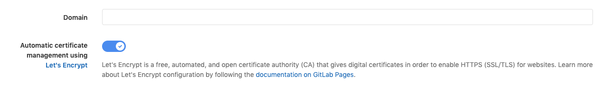

# GitLab Pages integration with Let's Encrypt **(FREE)**

> [Introduced](https://gitlab.com/gitlab-org/gitlab-foss/-/issues/28996) in GitLab 12.1. For versions earlier than GitLab 12.1, see the [manual Let's Encrypt instructions](../lets_encrypt_for_gitlab_pages.md).

The GitLab Pages integration with Let's Encrypt (LE) allows you
to use LE certificates for your Pages website with custom domains
without the hassle of having to issue and update them yourself;
GitLab does it for you, out-of-the-box.

[Let's Encrypt](https://letsencrypt.org) is a free, automated, and
open source Certificate Authority.

WARNING:
This feature covers only certificates for **custom domains**, not the wildcard certificate required to run [Pages daemon](../../../../administration/pages/index.md) **(FREE SELF)**. Wildcard certificate generation is tracked in [this issue](https://gitlab.com/gitlab-org/omnibus-gitlab/-/issues/3342).

## Requirements

Before you can enable automatic provisioning of an SSL certificate for your domain, make sure you have:

- Created a [project](../index.md#getting-started) in GitLab
  containing your website's source code.
- Acquired a domain (`example.com`) and added a [DNS entry](index.md)
  pointing it to your Pages website. The top-level domain (`.com`) must be a
  [public suffix](https://publicsuffix.org/).
- [Added your domain to your Pages project](index.md#1-add-a-custom-domain-to-pages)
  and verified your ownership.
- Verified your website is up and running, accessible through your custom domain.

The GitLab integration with Let's Encrypt is enabled and available on GitLab.com.
For **self-managed** GitLab instances, make sure your administrator has
[enabled it](../../../../administration/pages/index.md#lets-encrypt-integration).

## Enabling Let's Encrypt integration for your custom domain

Once you've met the requirements, enable Let's Encrypt integration:

1. Navigate to your project's **Settings > Pages**.
1. Find your domain and click **Details**.
1. Click **Edit** in the top-right corner.
1. Enable Let's Encrypt integration by switching **Automatic certificate management using Let's Encrypt**:

   

1. Click **Save changes**.

Once enabled, GitLab obtains a LE certificate and add it to the
associated Pages domain. GitLab also renews it automatically.

> **Notes:**
>
> - Issuing the certificate and updating Pages configuration
>   **can take up to an hour**.
> - If you already have an SSL certificate in domain settings it
>   continues to work until replaced by the Let's Encrypt's certificate.

## Troubleshooting

### Error "Something went wrong while obtaining the Let's Encrypt certificate"

> [Introduced](https://gitlab.com/gitlab-org/gitlab/-/issues/30146) in GitLab 13.0.

If you get an error **Something went wrong while obtaining the Let's Encrypt certificate**, first, make sure that your pages site is set to "Everyone" in your project's **Settings > General > Visbility**. This allows the Let's Encrypt Servers reach your pages site. Once this is confirmed, you can try obtaining the certificate again by following these steps:

1. Go to your project's **Settings > Pages**.
1. Click **Edit** on your domain.
1. Click **Retry**.
1. If you're still seeing the same error:
    1. Make sure you have properly set only one `CNAME` or `A` DNS record for your domain.
    1. Make sure your domain **doesn't have** an `AAAA` DNS record.
    1. If you have a `CAA` DNS record for your domain or any higher level domains, make sure [it includes `letsencrypt.org`](https://letsencrypt.org/docs/caa/).
    1. Make sure [your domain is verified](index.md#1-add-a-custom-domain-to-pages).
    1. Go to step 1.

### Message "GitLab is obtaining a Let's Encrypt SSL certificate for this domain. This process can take some time. Please try again later." hangs for more than an hour

If you've enabled Let's Encrypt integration, but a certificate is absent after an hour and you see the message, "GitLab is obtaining a Let's Encrypt SSL certificate for this domain. This process can take some time. Please try again later.", try to remove and add the domain for GitLab Pages again by following these steps:

1. Go to your project's **Settings > Pages**.
1. Click **Remove** on your domain.
1. [Add the domain again and verify it](index.md#1-add-a-custom-domain-to-pages).
1. [Enable Let's Encrypt integration for your domain](#enabling-lets-encrypt-integration-for-your-custom-domain).
1. If you still see the same message after some time:
    1. Make sure you have properly set only one `CNAME` or `A` DNS record for your domain.
    1. Make sure your domain **doesn't have** an `AAAA` DNS record.
    1. If you have a `CAA` DNS record for your domain or any higher level domains, make sure [it includes `letsencrypt.org`](https://letsencrypt.org/docs/caa/).
    1. Go to step 1.

<!-- Include any troubleshooting steps that you can foresee. If you know beforehand what issues
one might have when setting this up, or when something is changed, or on upgrading, it's
important to describe those, too. Think of things that may go wrong and include them here.
This is important to minimize requests for support, and to avoid doc comments with
questions that you know someone might ask.

Each scenario can be a third-level heading, e.g. `### Getting error message X`.
If you have none to add when creating a doc, leave this section in place
but commented out to help encourage others to add to it in the future. -->
