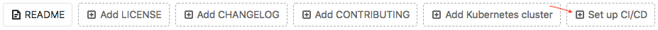
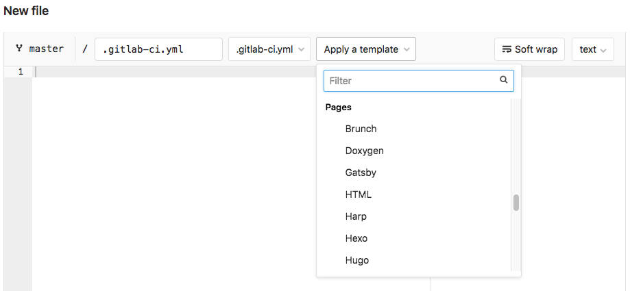

# Create a Pages website by using a CI/CD template

GitLab provides `.gitlab-ci.yml` templates for the most popular Static Site Generators (SSGs).
You can create your own `.gitlab-ci.yml` file from one of these templates, and run
the CI/CD pipeline to generate a Pages website.

Use a `.gitlab-ci.yml` template when you have an existing project that you want to add a Pages site to.

1. In the left sidebar, click **Project overview**.
1. Click **Set up CI/CD**.

   

   If this button is not available, CI/CD is already configured for
   your project. You may want to browse the `.gitlab-ci.yml` files
   [in these projects instead](https://gitlab.com/pages).

1. From the **Apply a template** list, choose a template for the SSG you're using.
   You can also choose plain HTML.

   

   If you don't find a corresponding template, you can view the
   [GitLab Pages group of sample projects](https://gitlab.com/pages).
   These projects contain `.gitlab-ci.yml` files that you can modify for your needs.
   You can also [learn how to write your own `.gitlab-ci.yml`
   file for GitLab Pages](../getting_started_part_four.md).

1. Save and commit the `.gitlab-ci.yml` file.

If everything is configured correctly, the site can take approximately 30 minutes to deploy.

You can watch the pipeline run by going to **CI / CD > Pipelines**.
When the pipeline is finished, go to **Settings > Pages** to find the link to
your Pages website.

For every change pushed to your repository, GitLab CI/CD runs a new pipeline
that immediately publishes your changes to the Pages site.
