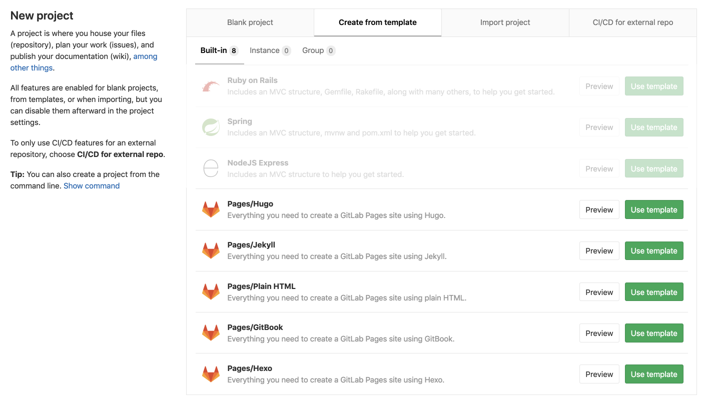

# New Pages website from a bundled template

> [Introduced](https://gitlab.com/gitlab-org/gitlab-foss/issues/47857) in GitLab 11.8.

The simplest way to create a GitLab Pages site is to use one of the most
popular templates, which come already bundled with GitLab and are ready to go.

1. From the top navigation, click the **+** button and select **New project**.
1. Select **Create from Template**.
1. Choose one of the templates starting with **Pages**:

   

1. From the left sidebar, navigate to your project's **CI/CD > Pipelines**
   and click **Run pipeline** to trigger GitLab CI/CD to build and deploy your
   site to the server.
1. After the pipeline has finished successfully, wait approximately 30 minutes
   for your website to be visible. After waiting 30 minutes, find the link to
   visit your website from your project's **Settings > Pages**. If the link
   leads to a 404 page, wait a few minutes and try again.

Your website is then visible on your domain and you can modify your files
as you wish. For every modification pushed to your repository, GitLab CI/CD
will run a new pipeline to immediately publish your changes to the server.
