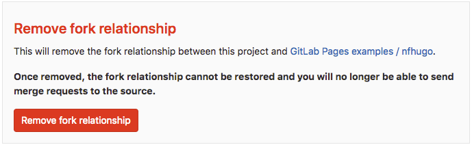
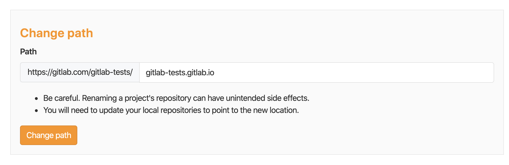

# Create a Pages website from a forked sample **(FREE)**

GitLab provides [sample projects for the most popular Static Site Generators (SSG)](https://gitlab.com/pages).
You can fork one of the sample projects and run the CI/CD pipeline to generate a Pages website.

Fork a sample project when you want to test GitLab Pages or start a new project that's already
configured to generate a Pages site.

<i class="fa fa-youtube-play youtube" aria-hidden="true"></i> Watch a [video tutorial](https://www.youtube.com/watch?v=TWqh9MtT4Bg) of how this works.

To fork a sample project and create a Pages website:

1. View the sample projects by navigating to the [GitLab Pages examples](https://gitlab.com/pages) group.
1. Click the name of the project you want to [fork](../../../../user/project/working_with_projects.md#fork-a-project).
1. In the top right, click the **Fork** button, and then choose a namespace to fork to.
1. Go to your project's **CI/CD > Pipelines** and click **Run pipeline**.
   GitLab CI/CD builds and deploys your site.

The site can take approximately 30 minutes to deploy.
When the pipeline is finished, go to **Settings > Pages** to find the link to your website from your project.

For every change pushed to your repository, GitLab CI/CD runs a new pipeline
that immediately publishes your changes to the Pages site.

You can take some **optional** further steps:

- _Remove the fork relationship._ If you want to contribute to the project you forked from,
  you can keep this relationship. Otherwise, go to your project's **Settings > General**,
  expand **Advanced settings**, and scroll down to **Remove fork relationship**:

  

- _Change the URL to match your namespace._ If your Pages site is hosted on GitLab.com,
  you can rename it to `<namespace>.gitlab.io`, where `<namespace>` is your GitLab namespace
  (the one you chose when you forked the project).

  - Go to your project's **Settings > General** and expand **Advanced**. Scroll down to
    **Change path** and change the path to `<namespace>.gitlab.io`.

    For example, if your project's URL is `gitlab.com/gitlab-tests/jekyll`, your namespace is
    `gitlab-tests`.

    If you set the repository path to `gitlab-tests.gitlab.io`,
    the resulting URL for your Pages website is `https://gitlab-tests.gitlab.io`.

    

  - Now go to your SSG's configuration file and change the [base URL](../getting_started_part_one.md#urls-and-base-urls)
    from `"project-name"` to `""`. The project name setting varies by SSG and may not be in the configuration file.
