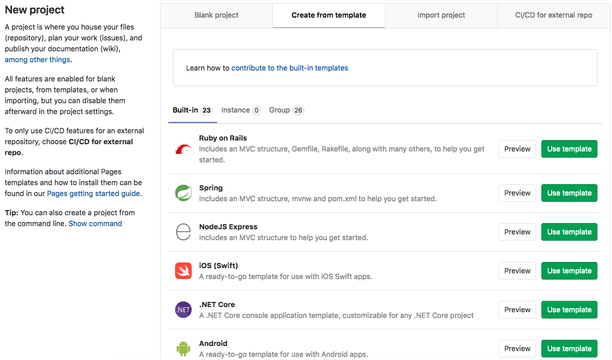

DETAILS:
**Tier:** Free, Premium, Ultimate
**Offering:** GitLab.com, GitLab Self-Managed, GitLab Dedicated

GitLab provides templates for the most popular Static Site Generators (SSGs).
You can create a new project from a template and run the CI/CD pipeline to generate a Pages website.

Use a template when you want to test GitLab Pages or start a new project that's already
configured to generate a Pages site.

1. On the left sidebar, at the top, select **Create new** (**{plus}**) and **New project/repository**.
1. Select **Create from Template**.
1. Next to one of the templates starting with **Pages**, select **Use template**.

   

1. Complete the form and select **Create project**.
1. On the left sidebar, select **Build > Pipelines**
   and select **New pipeline** to trigger GitLab CI/CD to build and deploy your
   site.

When the pipeline is finished, go to **Deploy > Pages** to find the link to
your Pages website.

For every change pushed to your repository, GitLab CI/CD runs a new pipeline
that immediately publishes your changes to the Pages site.

To view the HTML and other assets that were created for the site,
[download the job artifacts](../../../../ci/jobs/job_artifacts.md#download-job-artifacts).
