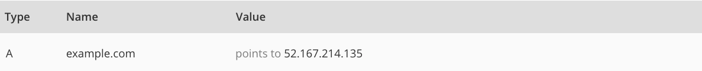
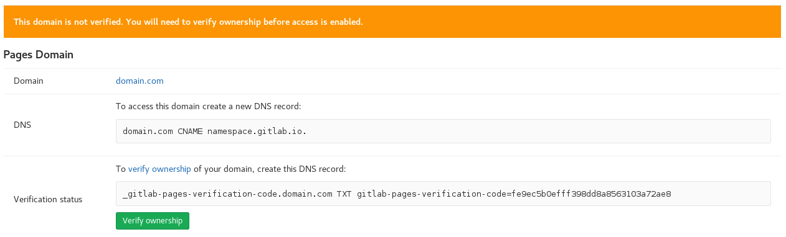

# GitLab Pages custom domains and SSL/TLS Certificates

Setting up GitLab Pages with custom domains, and adding SSL/TLS certificates to them, are optional features of GitLab Pages.

These steps assume you've already [set your site up](getting_started_part_two.md) and and it's served under the default Pages domain `namespace.gitlab.io`, or `namespace.gitlab.io/project-name`.

## Adding your custom domain to GitLab Pages

To use one or more custom domain with your Pages site, there are two things
you should consider first, which we'll cover in this guide:

1. Either if you're adding a **root domain** or a **subdomain**, for which
you'll need to set up [DNS records](#dns-records)
1. Whether you want to add an [SSL/TLS certificate](#ssl-tls-certificates) or not

To finish the association, you need to [add your domain to your project's Pages settings](#add-your-custom-domain-to-gitlab-pages-settings).

Let's start from the beginning with [DNS records](#dns-records).
If you already know how they work and want to skip the introduction to DNS,
you may be interested in skipping it until the [TL;DR](#tl-dr) section below.

## DNS Records

A Domain Name System (DNS) web service routes visitors to websites
by translating domain names (such as `www.example.com`) into the
numeric IP addresses (such as `192.0.2.1`) that computers use to
connect to each other.

A DNS record is created to point a (sub)domain to a certain location,
which can be an IP address or another domain. In case you want to use
GitLab Pages with your own (sub)domain, you need to access your domain's
registrar control panel to add a DNS record pointing it back to your
GitLab Pages site.

Note that **how to** add DNS records depends on which server your domain
is hosted on. Every control panel has its own place to do it. If you are
not an admin of your domain, and don't have access to your registrar,
you'll need to ask for the technical support of your hosting service
to do it for you.

To help you out, we've gathered some instructions on how to do that
for the most popular hosting services:

- [Amazon](http://docs.aws.amazon.com/gettingstarted/latest/swh/getting-started-configure-route53.html)
- [Bluehost](https://my.bluehost.com/cgi/help/559)
- [CloudFlare](https://support.cloudflare.com/hc/en-us/articles/200169096-How-do-I-add-A-records-)
- [cPanel](https://documentation.cpanel.net/display/ALD/Edit+DNS+Zone)
- [DreamHost](https://help.dreamhost.com/hc/en-us/articles/215414867-How-do-I-add-custom-DNS-records-)
- [Go Daddy](https://www.godaddy.com/help/add-an-a-record-19238)
- [Hostgator](http://support.hostgator.com/articles/changing-dns-records)
- [Inmotion hosting](https://my.bluehost.com/cgi/help/559)
- [Media Temple](https://mediatemple.net/community/products/dv/204403794/how-can-i-change-the-dns-records-for-my-domain)
- [Microsoft](https://msdn.microsoft.com/en-us/library/bb727018.aspx)

If your hosting service is not listed above, you can just try to
search the web for `how to add dns record on <my hosting service>`.

### DNS A record

In case you want to point a root domain (`example.com`) to your
GitLab Pages site, deployed to `namespace.gitlab.io`, you need to
log into your domain's admin control panel and add a DNS `A` record
pointing your domain to Pages' server IP address. For projects on
GitLab.com, this IP is `52.167.214.135`. For projects living in
other GitLab instances (CE or EE), please contact your sysadmin
asking for this information (which IP address is Pages server
running on your instance).

**Practical Example:**

### DNS CNAME record

In case you want to point a subdomain (`hello-world.example.com`)
to your GitLab Pages site initially deployed to `namespace.gitlab.io`,
you need to log into your domain's admin control panel and add a DNS
`CNAME` record pointing your subdomain to your website URL
(`namespace.gitlab.io`) address.

Notice that, despite it's a user or project website, the `CNAME`
should point to your Pages domain (`namespace.gitlab.io`),
without any `/project-name`.

**Practical Example:**

#### DNS TXT record

Unless your GitLab administrator has [disabled custom domain verification](../../../administration/pages/index.md#custom-domain-verification),
you'll have to prove that you own the domain by creating a `TXT` record
containing a verification code. The code will be displayed after you
[add your custom domain to GitLab Pages settings](#add-your-custom-domain-to-gitlab-pages-settings).

If using a [DNS A record](#dns-a-record), you can place the TXT record directly
under the domain. If using a [DNS CNAME record](#dns-cname-record), the two record types won't
co-exist, so you need to place the TXT record in a special subdomain of its own.

#### TL;DR

If the domain has multiple uses (e.g., you host email on it as well):

| From | DNS Record | To |
| ---- | ---------- | -- |
| domain.com | A | 52.167.214.135 |
| domain.com | TXT | gitlab-pages-verification-code=00112233445566778899aabbccddeeff |

If the domain is dedicated to GitLab Pages use and no other services run on it:

| From | DNS Record | To |
| ---- | ---------- | -- |
| subdomain.domain.com | CNAME | gitlab.io |
| _gitlab-pages-verification-code.subdomain.domain.com | TXT | gitlab-pages-verification-code=00112233445566778899aabbccddeeff |

> **Notes**:
>
> - **Do not** use a CNAME record if you want to point your
`domain.com` to your GitLab Pages site. Use an `A` record instead.
> - **Do not** add any special chars after the default Pages
domain. E.g., **do not** point your `subdomain.domain.com` to
`namespace.gitlab.io.` or `namespace.gitlab.io/`.
> - GitLab Pages IP on GitLab.com [has been changed](https://about.gitlab.com/2017/03/06/we-are-changing-the-ip-of-gitlab-pages-on-gitlab-com/) from `104.208.235.32` to `52.167.214.135`.

## Add your custom domain to GitLab Pages settings

Once you've set the DNS record, you'll need navigate to your project's
**Setting > Pages** and click **+ New domain** to add your custom domain to
GitLab Pages. You can choose whether to add an [SSL/TLS certificate](#ssl-tls-certificates)
to make your website accessible under HTTPS or leave it blank. If don't add a certificate,
your site will be accessible only via HTTP:

Once you have added a new domain, you will need to **verify your ownership**
(unless the GitLab administrator has disabled this feature). A verification code
will be shown to you; add it as a [DNS TXT record](#dns-txt-record), then press
the "Verify ownership" button to activate your new domain:

Once your domain has been verified, leave the verification record in place -
your domain will be periodically reverified, and may be disabled if the record
is removed.

You can add more than one alias (custom domains and subdomains) to the same project.
An alias can be understood as having many doors leading to the same room.

All the aliases you've set to your site will be listed on **Setting > Pages**.
From that page, you can view, add, and remove them.

Note that [DNS propagation may take some time (up to 24h)](http://www.inmotionhosting.com/support/domain-names/dns-nameserver-changes/domain-names-dns-changes),
although it's usually a matter of minutes to complete. Until it does, verification
will fail and attempts to visit your domain will respond with a 404.

Read through the [general documentation on GitLab Pages](introduction.md#add-a-custom-domain-to-your-pages-website) to learn more about adding
custom domains to GitLab Pages sites.

## SSL/TLS Certificates

Every GitLab Pages project on GitLab.com will be available under
HTTPS for the default Pages domain (`*.gitlab.io`). Once you set
up your Pages project with your custom (sub)domain, if you want
it secured by HTTPS, you will have to issue a certificate for that
(sub)domain and install it on your project.

>**Note:**
Certificates are NOT required to add to your custom
(sub)domain on your GitLab Pages project, though they are
highly recommendable.

Let's start with an introduction to the importance of HTTPS.
Alternatively, jump ahead to [adding certificates to your project](#adding-certificates-to-your-project).

### Why should I care about HTTPS?

This might be your first question. If our sites are hosted by GitLab Pages,
they are static, hence we are not dealing with server-side scripts
nor credit card transactions, then why do we need secure connections?

Back in the 1990s, where HTTPS came out, [SSL](https://en.wikipedia.org/wiki/Transport_Layer_Security#SSL_1.0.2C_2.0_and_3.0) was considered a "special"
security measure, necessary just for big companies, like banks and shoppings sites
with financial transactions.
Now we have a different picture. [According to Josh Aas](https://letsencrypt.org/2015/10/29/phishing-and-malware.html), Executive Director at [ISRG](https://en.wikipedia.org/wiki/Internet_Security_Research_Group):

> _We’ve since come to realize that HTTPS is important for almost all websites. It’s important for any website that allows people to log in with a password, any website that [tracks its users](https://www.washingtonpost.com/news/the-switch/wp/2013/12/10/nsa-uses-google-cookies-to-pinpoint-targets-for-hacking/) in any way, any website that [doesn’t want its content altered](http://arstechnica.com/tech-policy/2014/09/why-comcasts-javascript-ad-injections-threaten-security-net-neutrality/), and for any site that offers content people might not want others to know they are consuming. We’ve also learned that any site not secured by HTTPS [can be used to attack other sites](http://krebsonsecurity.com/2015/04/dont-be-fodder-for-chinas-great-cannon/)._

Therefore, the reason why certificates are so important is that they encrypt
the connection between the **client** (you, me, your visitors)
and the **server** (where you site lives), through a keychain of
authentications and validations.

How about taking Josh's advice and protecting our sites too? We will be
well supported, and we'll contribute to a safer internet.

### Organizations supporting HTTPS

There is a huge movement in favor of securing all the web. W3C fully
[supports the cause](https://w3ctag.github.io/web-https/) and explains very well
the reasons for that. Richard Barnes, a writer for Mozilla Security Blog,
suggested that [Firefox would deprecate HTTP](https://blog.mozilla.org/security/2015/04/30/deprecating-non-secure-http/),
and would no longer accept unsecured connections. Recently, Mozilla published a
[communication](https://blog.mozilla.org/security/2016/03/29/march-2016-ca-communication/)
reiterating the importance of HTTPS.

## Issuing Certificates

GitLab Pages accepts [PEM](https://support.quovadisglobal.com/kb/a37/what-is-pem-format.aspx) certificates issued by
[Certificate Authorities (CA)](https://en.wikipedia.org/wiki/Certificate_authority)
and self-signed certificates. Of course,
[you'd rather issue a certificate than generate a self-signed](https://en.wikipedia.org/wiki/Self-signed_certificate),
for security reasons and for having browsers trusting your
site's certificate.

There are several different kinds of certificates, each one
with certain security level. A static personal website will
not require the same security level as an online banking web app,
for instance. There are a couple Certificate Authorities that
offer free certificates, aiming to make the internet more secure
to everyone. The most popular is [Let's Encrypt](https://letsencrypt.org/),
which issues certificates trusted by most of browsers, it's open
source, and free to use. Please read through this tutorial to
understand [how to secure your GitLab Pages website with Let's Encrypt](https://about.gitlab.com/2016/04/11/tutorial-securing-your-gitlab-pages-with-tls-and-letsencrypt/).

With the same popularity, there are [certificates issued by CloudFlare](https://www.cloudflare.com/ssl/),
which also offers a [free CDN service](https://blog.cloudflare.com/cloudflares-free-cdn-and-you/).
Their certs are valid up to 15 years. Read through the tutorial on
[how to add a CloudFlare Certificate to your GitLab Pages website](https://about.gitlab.com/2017/02/07/setting-up-gitlab-pages-with-cloudflare-certificates/).

### Adding certificates to your project

Regardless the CA you choose, the steps to add your certificate to
your Pages project are the same.

### What do you need

1. A PEM certificate
1. An intermediate certificate
1. A public key

These fields are found under your **Project**'s **Settings** > **Pages** > **New Domain**.

### What's what?

- A PEM certificate is the certificate generated by the CA,
which needs to be added to the field **Certificate (PEM)**.
- An [intermediate certificate](https://en.wikipedia.org/wiki/Intermediate_certificate_authority) (aka "root certificate") is
the part of the encryption keychain that identifies the CA.
Usually it's combined with the PEM certificate, but there are
some cases in which you need to add them manually.
[CloudFlare certs](https://about.gitlab.com/2017/02/07/setting-up-gitlab-pages-with-cloudflare-certificates/)
are one of these cases.
- A public key is an encrypted key which validates
your PEM against your domain.

### Now what?

Now that you hopefully understand why you need all
of this, it's simple:

- Your PEM certificate needs to be added to the first field
- If your certificate is missing its intermediate, copy
and paste the root certificate (usually available from your CA website)
and paste it in the [same field as your PEM certificate](https://about.gitlab.com/2017/02/07/setting-up-gitlab-pages-with-cloudflare-certificates/),
just jumping a line between them.
- Copy your public key and paste it in the last field

>**Note:**
**Do not** open certificates or encryption keys in
regular text editors. Always use code editors (such as
Sublime Text, Atom, Dreamweaver, Brackets, etc).

_Read on about [Creating and Tweaking GitLab CI/CD for GitLab Pages](getting_started_part_four.md)_
