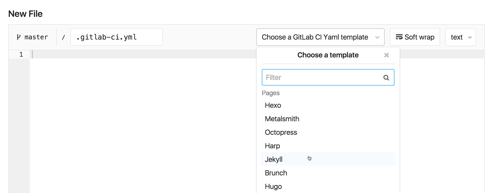

# Projects for GitLab Pages and URL structure

## What you need to get started

To get started with GitLab Pages, you need:

1. A project
1. A configuration file (`.gitlab-ci.yml`) to deploy your site
1. A specific `job` called `pages` in the configuration file
that will make GitLab aware that you are deploying a GitLab Pages website
1. A `public` directory with the content of the website

Optional Features:

1. A custom domain or subdomain
1. A DNS pointing your (sub)domain to your Pages site
   1. **Optional**: an SSL/TLS certificate so your custom
   domain is accessible under HTTPS.

The optional settings, custom domain, DNS records, and SSL/TLS certificates, are described in [Part 3](getting_started_part_three.md)).

## Project

Your GitLab Pages project is a regular project created the
same way you do for the other ones. To get started with GitLab Pages, you have two ways:

- Fork one of the templates from Page Examples, or
- Create a new project from scratch

Let's go over both options.

### Fork a project to get started from

To make things easy for you, we've created this
[group](https://gitlab.com/pages) of default projects
containing the most popular SSGs templates.

Watch the [video tutorial](https://youtu.be/TWqh9MtT4Bg) we've
created for the steps below.

1. [Fork a sample project](../../../gitlab-basics/fork-project.md) from the [Pages group](https://gitlab.com/pages)
1. Trigger a build (push a change to any file)
1. As soon as the build passes, your website will have been deployed with GitLab Pages. Your website URL will be available under your project's **Settings** > **Pages**
1. Optionally, remove the fork relationship by navigating to your project's **Settings** > expanding **Advanced settings** and scrolling down to **Remove fork relationship**:

    

To turn a **project website** forked from the Pages group into a **user/group** website, you'll need to:

- Rename it to `namespace.gitlab.io`: navigate to project's **Settings** > expand **Advanced settings** > and scroll down to **Rename repository**
- Adjust your SSG's [base URL](#urls-and-baseurls) to from `"project-name"` to `""`. This setting will be at a different place for each SSG, as each of them have their own structure and file tree. Most likely, it will be in the SSG's config file.

> **Notes:**
>
> Why do I need to remove the fork relationship?
>
> Unless you want to contribute to the original project,
you won't need it connected to the upstream. A
[fork](https://about.gitlab.com/2016/12/01/how-to-keep-your-fork-up-to-date-with-its-origin/#fork)
is useful for submitting merge requests to the upstream.

### Create a project from scratch

1. From your **Project**'s **[Dashboard](https://gitlab.com/dashboard/projects)**,
click **New project**, and name it considering the
[practical examples](getting_started_part_one.md#practical-examples).
1. Clone it to your local computer, add your website
files to your project, add, commit and push to GitLab.
1. From the your **Project**'s page, click **Set up CI/CD**:

    

1. Choose one of the templates from the dropbox menu.
Pick up the template corresponding to the SSG you're using (or plain HTML).

    

Once you have both site files and `.gitlab-ci.yml` in your project's
root, GitLab CI/CD will build your site and deploy it with Pages.
Once the first build passes, you see your site is live by
navigating to your **Project**'s **Settings** > **Pages**,
where you'll find its default URL.

> **Notes:**
>
> - GitLab Pages [supports any SSG](https://about.gitlab.com/2016/06/17/ssg-overview-gitlab-pages-part-3-examples-ci/), but,
if you don't find yours among the templates, you'll need
to configure your own `.gitlab-ci.yml`. Do do that, please
read through the article [Creating and Tweaking GitLab CI/CD for GitLab Pages](getting_started_part_four.md). New SSGs are very welcome among
the [example projects](https://gitlab.com/pages). If you set
up a new one, please
[contribute](https://gitlab.com/pages/pages.gitlab.io/blob/master/CONTRIBUTING.md)
to our examples.
>
> - The second step _"Clone it to your local computer"_, can be done
differently, achieving the same results: instead of cloning the bare
repository to you local computer and moving your site files into it,
you can run `git init` in your local website directory, add the
remote URL: `git remote add origin git@gitlab.com:namespace/project-name.git`,
then add, commit, and push.

## URLs and Baseurls

Every Static Site Generator (SSG) default configuration expects
to find your website under a (sub)domain (`example.com`), not
in a subdirectory of that domain (`example.com/subdir`). Therefore,
whenever you publish a project website (`namespace.gitlab.io/project-name`),
you'll have to look for this configuration (base URL) on your SSG's
documentation and set it up to reflect this pattern.

For example, for a Jekyll site, the `baseurl` is defined in the Jekyll
configuration file, `_config.yml`. If your website URL is
`https://john.gitlab.io/blog/`, you need to add this line to `_config.yml`:

```yaml
baseurl: "/blog"
```

On the contrary, if you deploy your website after forking one of
our [default examples](https://gitlab.com/pages), the baseurl will
already be configured this way, as all examples there are project
websites. If you decide to make yours a user or group website, you'll
have to remove this configuration from your project. For the Jekyll
example we've just mentioned, you'd have to change Jekyll's `_config.yml` to:

```yaml
baseurl: ""
```

## Custom Domains

GitLab Pages supports custom domains and subdomains, served under HTTP or HTTPS.
Please check the [next part](getting_started_part_three.md) of this series for an overview.
