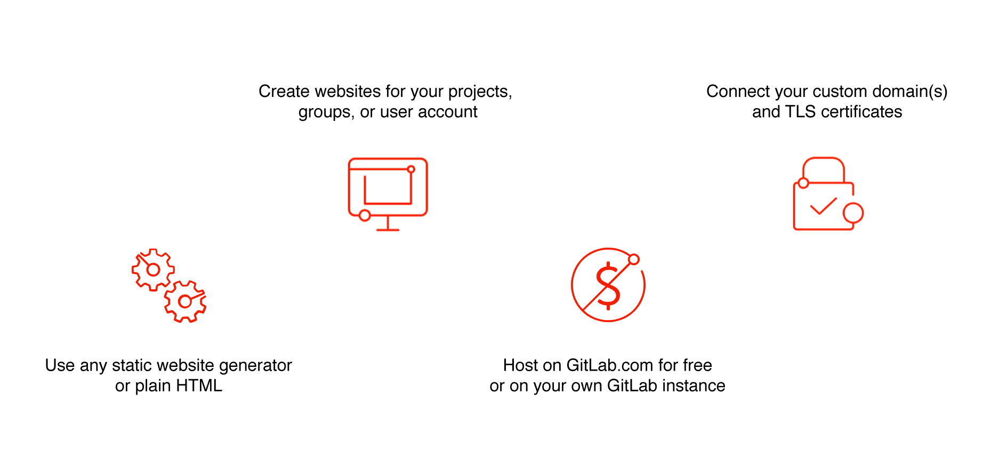
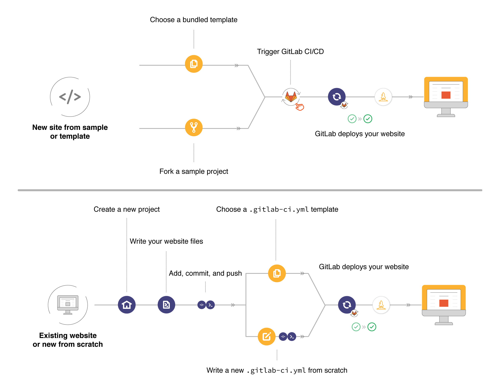

# GitLab Pages

> - [Introduced](https://gitlab.com/gitlab-org/gitlab/merge_requests/80) in GitLab Enterprise Edition 8.3.
> - Custom CNAMEs with TLS support were [introduced](https://gitlab.com/gitlab-org/gitlab/merge_requests/173) in GitLab Enterprise Edition 8.5.
> - [Ported](https://gitlab.com/gitlab-org/gitlab-foss/issues/14605) to GitLab Community Edition in GitLab 8.17.
> - Support for subgroup project's websites was [introduced](https://gitlab.com/gitlab-org/gitlab-foss/issues/30548) in GitLab 11.8.
> - Bundled project templates were [introduced](https://gitlab.com/gitlab-org/gitlab-foss/issues/47857) in GitLab 11.8.

**GitLab Pages is a feature that allows you to publish static websites
directly from a repository in GitLab.**

You can use it either for personal or business websites, such as
portfolios, documentation, manifestos, and business presentations.
You can also attribute any license to your content.

Pages is available for free for all GitLab.com users as well as for self-managed
instances (GitLab Core, Starter, Premium, and Ultimate).

## Overview

To publish a website with Pages, you can use any Static Site Generator (SSG),
such as Jekyll, Hugo, Middleman, Harp, Hexo, and Brunch, just to name a few. You can also
publish any website written directly in plain HTML, CSS, and JavaScript.

Pages does <strong>not</strong> support dynamic server-side processing, for instance, as <code>.php</code> and <code>.asp</code> requires. See this article to learn more about
<a href="https://about.gitlab.com/blog/2016/06/03/ssg-overview-gitlab-pages-part-1-dynamic-x-static/">static websites vs dynamic websites</a>.

### How it works

To use GitLab Pages, first you need to create a project in GitLab to upload your website's
files to. These projects can be either public, internal, or private, at your own choice.

GitLab will always deploy your website from a very specific folder called `public` in your
repository. Note that when you create a new project in GitLab, a [repository](../repository/index.md)
becomes available automatically.

To deploy your site, GitLab will use its built-in tool called [GitLab CI/CD](../../../ci/README.md),
to build your site and publish it to the GitLab Pages server. The sequence of
scripts that GitLab CI/CD runs to accomplish this task is created from a file named
`.gitlab-ci.yml`, which you can [create and modify](getting_started_part_four.md) at will. A specific `job` called `pages` in the configuration file will make GitLab aware that you are deploying a GitLab Pages website.

You can either use GitLab's [default domain for GitLab Pages websites](getting_started_part_one.md#gitlab-pages-default-domain-names),
`*.gitlab.io`, or your own domain (`example.com`). In that case, you'll
need admin access to your domain's registrar (or control panel) to set it up with Pages.

### Getting started

To get started with GitLab Pages, you can either:

- [Use a bundled website template ready to go](getting_started/pages_bundled_template.md).
- [Copy an existing sample](getting_started/fork_sample_project.md).
- [Create a website from scratch or deploy an existing one](getting_started/new_or_existing_website.md).

Optional features:

- Use a [custom domain or subdomain](custom_domains_ssl_tls_certification/index.md#set-up-pages-with-a-custom-domain).
- Add an [SSL/TLS certificate to secure your site under the HTTPS protocol](custom_domains_ssl_tls_certification/index.md#adding-an-ssltls-certificate-to-pages).

Note that, if you're using GitLab Pages default domain (`.gitlab.io`),
your website will be automatically secure and available under
HTTPS. If you're using your own custom domain, you can
optionally secure it with SSL/TLS certificates.

## Availability

If you're using GitLab.com, your website will be publicly available to the internet.

To restrict access to your website, enable [GitLab Pages Access Control](pages_access_control.md).

If you're using self-managed instances (Core, Starter, Premium, or Ultimate),
your websites will be published on your own server, according to the
[Pages admin settings](../../../administration/pages/index.md) chosen by your sysadmin,
who can opt for making them public or internal to your server.

## Explore GitLab Pages

To learn more about configuration options for GitLab Pages, read the following:

| Document | Description |
| --- | --- |
| [GitLab Pages domain names, URLs, and baseurls](getting_started_part_one.md) | Understand how GitLab Pages default domains work. |
| [GitLab CI/CD for GitLab Pages](getting_started_part_four.md) | Understand how to create your own `.gitlab-ci.yml` for your site. |
| [Exploring GitLab Pages](introduction.md) | Requirements, technical aspects, specific GitLab CI's configuration options, Access Control, custom 404 pages, limitations, FAQ. |
|---+---|
| [Custom domains and SSL/TLS Certificates](custom_domains_ssl_tls_certification/index.md) | How to add custom domains and subdomains to your website, configure DNS records and SSL/TLS certificates. |
| [Let's Encrypt integration](custom_domains_ssl_tls_certification/lets_encrypt_integration.md) | Secure your Pages sites with Let's Encrypt certificates automatically obtained and renewed by GitLab. |
| [CloudFlare certificates](https://about.gitlab.com/blog/2017/02/07/setting-up-gitlab-pages-with-cloudflare-certificates/) | Secure your Pages site with CloudFlare certificates. |
|---+---|
| [Static vs dynamic websites](https://about.gitlab.com/blog/2016/06/03/ssg-overview-gitlab-pages-part-1-dynamic-x-static/) | A conceptual overview on static versus dynamic sites. |
| [Modern static site generators](https://about.gitlab.com/blog/2016/06/10/ssg-overview-gitlab-pages-part-2/) | A conceptual overview on SSGs. |
| [Build any SSG site with GitLab Pages](https://about.gitlab.com/blog/2016/06/17/ssg-overview-gitlab-pages-part-3-examples-ci/) | An overview on using SSGs for GitLab Pages. |

## Advanced use

There are quite some great examples of GitLab Pages websites built for some
specific reasons. These examples can teach you some advanced techniques
to use and adapt to your own needs:

- [Posting to your GitLab Pages blog from iOS](https://about.gitlab.com/blog/2016/08/19/posting-to-your-gitlab-pages-blog-from-ios/).
- [GitLab CI: Run jobs sequentially, in parallel, or build a custom pipeline](https://about.gitlab.com/blog/2016/07/29/the-basics-of-gitlab-ci/).
- [GitLab CI: Deployment & environments](https://about.gitlab.com/blog/2016/08/26/ci-deployment-and-environments/).
- [Building a new GitLab docs site with Nanoc, GitLab CI, and GitLab Pages](https://about.gitlab.com/blog/2016/12/07/building-a-new-gitlab-docs-site-with-nanoc-gitlab-ci-and-gitlab-pages/).
- [Publish code coverage reports with GitLab Pages](https://about.gitlab.com/blog/2016/11/03/publish-code-coverage-report-with-gitlab-pages/).

## Admin GitLab Pages for self-managed instances

Enable and configure GitLab Pages on your own instance (GitLab Community Edition and Enterprise Editions) with
the [admin guide](../../../administration/pages/index.md).

**<i class="fa fa-youtube-play youtube" aria-hidden="true"></i> Watch a [video tutorial](https://www.youtube.com/watch?v=dD8c7WNcc6s) for getting started with GitLab Pages admin!**

## More information about GitLab Pages

- Announcement (2016-12-24): ["We're bringing GitLab Pages to CE"](https://about.gitlab.com/blog/2016/12/24/were-bringing-gitlab-pages-to-community-edition/)
- Announcement (2017-03-06): ["We are changing the IP of GitLab Pages on GitLab.com"](https://about.gitlab.com/blog/2017/03/06/we-are-changing-the-ip-of-gitlab-pages-on-gitlab-com/)
