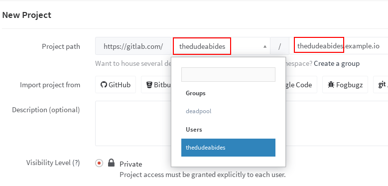
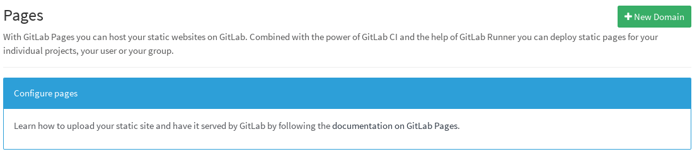
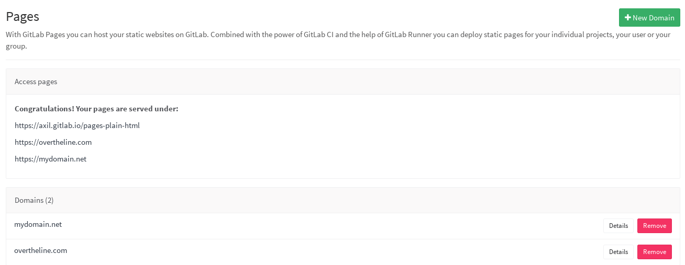
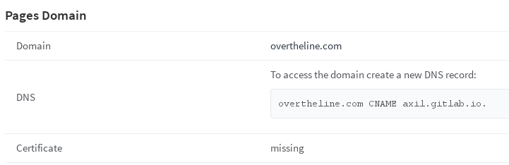
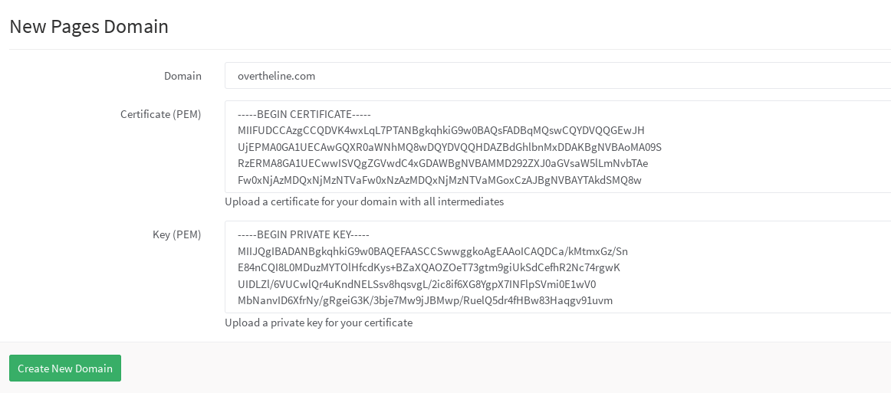
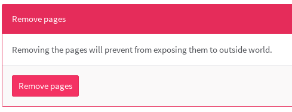

# GitLab Pages

> **Notes:**
> - This feature was [introduced][ee-80] in GitLab EE 8.3.
> - Custom CNAMEs with TLS support were [introduced][ee-173] in GitLab EE 8.5.
> - GitLab Pages [was ported][ce-14605] to Community Edition in GitLab 8.17.
> - This document is about the user guide. To learn how to enable GitLab Pages
>   across your GitLab instance, visit the [administrator documentation](../../../administration/pages/index.md).

With GitLab Pages you can host for free your static websites on GitLab.
Combined with the power of [GitLab CI] and the help of [GitLab Runner] you can
deploy static pages for your individual projects, your user or your group.

Read [GitLab Pages on GitLab.com](#gitlab-pages-on-gitlab-com) for specific
information, if you are using GitLab.com to host your website.

Read through [All you Need to Know About GitLab Pages][pages-index-guide] for a list of all learning materials we have prepared for GitLab Pages (webpages, articles, guides, blog posts, video tutorials).

## Getting started with GitLab Pages

> **Note:**
> In the rest of this document we will assume that the general domain name that
> is used for GitLab Pages is `example.io`.

In general there are two types of pages one might create:

- Pages per user (`username.example.io`) or per group (`groupname.example.io`)
- Pages per project (`username.example.io/projectname` or `groupname.example.io/projectname`)

In GitLab, usernames and groupnames are unique and we often refer to them
as [namespaces](../../group/index.md#namespaces). There can be only one namespace
in a GitLab instance. Below you
can see the connection between the type of GitLab Pages, what the project name
that is created on GitLab looks like and the website URL it will be ultimately
be served on.

| Type of GitLab Pages | The name of the project created in GitLab | Website URL |
| -------------------- | ------------ | ----------- |
| User pages  | `username.example.io`  | `http(s)://username.example.io`  |
| Group pages | `groupname.example.io` | `http(s)://groupname.example.io` |
| Project pages owned by a user  | `projectname` | `http(s)://username.example.io/projectname` |
| Project pages owned by a group | `projectname` | `http(s)://groupname.example.io/projectname`|

> **Warning:**
> There are some known [limitations](#limitations) regarding namespaces served
> under the general domain name and HTTPS. Make sure to read that section.

### GitLab Pages requirements

In brief, this is what you need to upload your website in GitLab Pages:

1. Find out the general domain name that is used for GitLab Pages
   (ask your administrator). This is very important, so you should first make
   sure you get that right.
1. Create a project
1. Push a [`.gitlab-ci.yml` file][yaml] in the root directory
   of your repository with a specific job named [`pages`][pages]
1. Set up a GitLab Runner to build your website

> **Note:**
If [shared runners](../../../ci/runners/README.md) are enabled by your GitLab
administrator, you should be able to use them instead of bringing your own.

### User or group Pages

For user and group pages, the name of the project should be specific to the
username or groupname and the general domain name that is used for GitLab Pages.
Head over your GitLab instance that supports GitLab Pages and create a
repository named `username.example.io`, where `username` is your username on
GitLab. If the first part of the project name doesn't match exactly your
username, it won’t work, so make sure to get it right.

To create a group page, the steps are the same like when creating a website for
users. Just make sure that you are creating the project within the group's
namespace.



---

After you push some static content to your repository and GitLab Runner uploads
the artifacts to GitLab CI, you will be able to access your website under
`http(s)://username.example.io`. Keep reading to find out how.

>**Note:**
If your username/groupname contains a dot, for example `foo.bar`, you will not
be able to use the wildcard domain HTTPS, read more at [limitations](#limitations).

### Project Pages

GitLab Pages for projects can be created by both user and group accounts.
The steps to create a project page for a user or a group are identical:

1. Create a new project
1. Push a [`.gitlab-ci.yml` file][yaml] in the root directory
   of your repository with a specific job named [`pages`][pages].
1. Set up a GitLab Runner to build your website

A user's project will be served under `http(s)://username.example.io/projectname`
whereas a group's project under `http(s)://groupname.example.io/projectname`.

For practical examples for group and project Pages, read through the guide
[GitLab Pages from A to Z: Part 1 - Static sites and GitLab Pages domains](getting_started_part_one.md#practical-examples).

## Quick Start

Read through [GitLab Pages Quick Start Guide][pages-quick] or watch the video tutorial on
[how to publish a website with GitLab Pages on GitLab.com from a forked project][video-pages-fork].

See also [All you Need to Know About GitLab Pages][pages-index-guide] for a list with all the resources we have for GitLab Pages.

### Explore the contents of `.gitlab-ci.yml`

The key thing about GitLab Pages is the `.gitlab-ci.yml` file, something that
gives you absolute control over the build process. You can actually watch your
website being built live by following the CI job traces.

For a simplified user guide on setting up GitLab CI/CD for Pages, read through
the article [GitLab Pages from A to Z: Part 4 - Creating and Tweaking `.gitlab-ci.yml` for GitLab Pages](getting_started_part_four.md#creating-and-tweaking-gitlab-ci-yml-for-gitlab-pages)

> **Note:**
> Before reading this section, make sure you familiarize yourself with GitLab CI
> and the specific syntax of[`.gitlab-ci.yml`][yaml] by
> following our [quick start guide].

To make use of GitLab Pages, the contents of `.gitlab-ci.yml` must follow the
rules below:

1. A special job named [`pages`][pages] must be defined
1. Any static content which will be served by GitLab Pages must be placed under
   a `public/` directory
1. `artifacts` with a path to the `public/` directory must be defined

In its simplest form, `.gitlab-ci.yml` looks like:

```yaml
pages:
  script:
  - my_commands
  artifacts:
    paths:
    - public
```

When the Runner reaches to build the `pages` job, it executes whatever is
defined in the `script` parameter and if the job completes with a non-zero
exit status, it then uploads the `public/` directory to GitLab Pages.

The `public/` directory should contain all the static content of your website.
Depending on how you plan to publish your website, the steps defined in the
[`script` parameter](../../../ci/yaml/README.md#script) may differ.

Be aware that Pages are by default branch/tag agnostic and their deployment
relies solely on what you specify in `.gitlab-ci.yml`. If you don't limit the
`pages` job with the [`only` parameter](../../../ci/yaml/README.md#only-and-except),
whenever a new commit is pushed to whatever branch or tag, the Pages will be
overwritten. In the example below, we limit the Pages to be deployed whenever
a commit is pushed only on the `master` branch:

```yaml
pages:
  script:
  - my_commands
  artifacts:
    paths:
    - public
  only:
  - master
```

We then tell the Runner to treat the `public/` directory as `artifacts` and
upload it to GitLab. And since all these parameters were all under a `pages`
job, the contents of the `public` directory will be served by GitLab Pages.

#### How `.gitlab-ci.yml` looks like when the static content is in your repository

Supposed your repository contained the following files:

```
├── index.html
├── css
│   └── main.css
└── js
    └── main.js
```

Then the `.gitlab-ci.yml` example below simply moves all files from the root
directory of the project to the `public/` directory. The `.public` workaround
is so `cp` doesn't also copy `public/` to itself in an infinite loop:

```yaml
pages:
  script:
  - mkdir .public
  - cp -r * .public
  - mv .public public
  artifacts:
    paths:
    - public
  only:
  - master
```

#### How `.gitlab-ci.yml` looks like when using a static generator

In general, GitLab Pages support any kind of [static site generator][staticgen],
since `.gitlab-ci.yml` can be configured to run any possible command.

In the root directory of your Git repository, place the source files of your
favorite static generator. Then provide a `.gitlab-ci.yml` file which is
specific to your static generator.

The example below, uses [Jekyll] to build the static site:

```yaml
image: ruby:2.1             # the script will run in Ruby 2.1 using the Docker image ruby:2.1

pages:                      # the build job must be named pages
  script:
  - gem install jekyll      # we install jekyll
  - jekyll build -d public/ # we tell jekyll to build the site for us
  artifacts:
    paths:
    - public                # this is where the site will live and the Runner uploads it in GitLab
  only:
  - master                  # this script is only affecting the master branch
```

Here, we used the Docker executor and in the first line we specified the base
image against which our jobs will run.

You have to make sure that the generated static files are ultimately placed
under the `public` directory, that's why in the `script` section we run the
`jekyll` command that jobs the website and puts all content in the `public/`
directory. Depending on the static generator of your choice, this command will
differ. Search in the documentation of the static generator you will use if
there is an option to explicitly set the output directory. If there is not
such an option, you can always add one more line under `script` to rename the
resulting directory in `public/`.

We then tell the Runner to treat the `public/` directory as `artifacts` and
upload it to GitLab.

---

See the [jekyll example project][pages-jekyll] to better understand how this
works.

For a list of Pages projects, see the [example projects](#example-projects) to
get you started.

#### How to set up GitLab Pages in a repository where there's also actual code

Remember that GitLab Pages are by default branch/tag agnostic and their
deployment relies solely on what you specify in `.gitlab-ci.yml`. You can limit
the `pages` job with the [`only` parameter](../../../ci/yaml/README.md#only-and-except),
whenever a new commit is pushed to a branch that will be used specifically for
your pages.

That way, you can have your project's code in the `master` branch and use an
orphan branch (let's name it `pages`) that will host your static generator site.

You can create a new empty branch like this:

```bash
git checkout --orphan pages
```

The first commit made on this new branch will have no parents and it will be
the root of a new history totally disconnected from all the other branches and
commits. Push the source files of your static generator in the `pages` branch.

Below is a copy of `.gitlab-ci.yml` where the most significant line is the last
one, specifying to execute everything in the `pages` branch:

```
image: ruby:2.1

pages:
  script:
  - gem install jekyll
  - jekyll build -d public/
  artifacts:
    paths:
    - public
  only:
  - pages
```

See an example that has different files in the [`master` branch][jekyll-master]
and the source files for Jekyll are in a [`pages` branch][jekyll-pages] which
also includes `.gitlab-ci.yml`.

[jekyll-master]: https://gitlab.com/pages/jekyll-branched/tree/master
[jekyll-pages]: https://gitlab.com/pages/jekyll-branched/tree/pages

## Next steps

So you have successfully deployed your website, congratulations! Let's check
what more you can do with GitLab Pages.

### Example projects

Below is a list of example projects for GitLab Pages with a plain HTML website
or various static site generators. Contributions are very welcome.

- [Plain HTML](https://gitlab.com/pages/plain-html)
- [Jekyll](https://gitlab.com/pages/jekyll)
- [Hugo](https://gitlab.com/pages/hugo)
- [Middleman](https://gitlab.com/pages/middleman)
- [Hexo](https://gitlab.com/pages/hexo)
- [Brunch](https://gitlab.com/pages/brunch)
- [Metalsmith](https://gitlab.com/pages/metalsmith)
- [Harp](https://gitlab.com/pages/harp)

Visit the GitLab Pages group for a full list of example projects:
<https://gitlab.com/groups/pages>.

### Serving compressed assets

Most modern browsers support downloading files in a compressed format. This
speeds up downloads by reducing the size of files.

Before serving an uncompressed file, Pages will check whether the same file
exists with a `.gz` extension. If it does, and the browser supports receiving
compressed files, it will serve that version instead of the uncompressed one.

To take advantage of this feature, the artifact you upload to the Pages should
have this structure:

```
public/
├─┬ index.html
│ └ index.html.gz
│
├── css/
│   └─┬ main.css
│     └ main.css.gz
│
└── js/
    └─┬ main.js
      └ main.js.gz
```

This can be achieved by including a `script:` command like this in your
`.gitlab-ci.yml` pages job:

```yaml
pages:
  # Other directives
  script:
    - # build the public/ directory first
    - find public -type f -iregex '.*\.\(htm\|html\|txt\|text\|js\|css\)$' -execdir gzip -f --keep {} \;
```

By pre-compressing the files and including both versions in the artifact, Pages
can serve requests for both compressed and uncompressed content without
needing to compress files on-demand.

### Add a custom domain to your Pages website

For a complete guide on Pages domains, read through the article
[GitLab Pages from A to Z: Part 3 - Setting Up Custom Domains - DNS Records and SSL/TLS Certificates](getting_started_part_three.md#setting-up-custom-domains-dns-records-and-ssl-tls-certificates)

If this setting is enabled by your GitLab administrator, you should be able to
see the **New Domain** button when visiting your project's settings through the
gear icon in the top right and then navigating to **Pages**.



---

You can add multiple domains pointing to your website hosted under GitLab.
Once the domain is added, you can see it listed under the **Domains** section.



---

As a last step, you need to configure your DNS and add a CNAME pointing to your
user/group page. Click on the **Details** button of a domain for further
instructions.



---

>**Note:**
Currently there is support only for custom domains on per-project basis. That
means that if you add a custom domain (`example.com`) for your user website
(`username.example.io`), a project that is served under `username.example.io/foo`,
will not be accessible under `example.com/foo`.

### Secure your custom domain website with TLS

When you add a new custom domain, you also have the chance to add a TLS
certificate. If this setting is enabled by your GitLab administrator, you
should be able to see the option to upload the public certificate and the
private key when adding a new domain.



For a complete guide on Pages domains, read through the article
[GitLab Pages from A to Z: Part 3 - Setting Up Custom Domains - DNS Records and SSL/TLS Certificates](getting_started_part_three.md#setting-up-custom-domains-dns-records-and-ssl-tls-certificates)

### Custom error codes pages

You can provide your own 403 and 404 error pages by creating the `403.html` and
`404.html` files respectively in the root directory of the `public/` directory
that will be included in the artifacts. Usually this is the root directory of
your project, but that may differ depending on your static generator
configuration.

If the case of `404.html`, there are different scenarios. For example:

- If you use project Pages (served under `/projectname/`) and try to access
  `/projectname/non/existing_file`, GitLab Pages will try to serve first
  `/projectname/404.html`, and then `/404.html`.
- If you use user/group Pages (served under `/`) and try to access
  `/non/existing_file` GitLab Pages will try to serve `/404.html`.
- If you use a custom domain and try to access `/non/existing_file`, GitLab
  Pages will try to serve only `/404.html`.

### Remove the contents of your pages

If you ever feel the need to purge your Pages content, you can do so by going
to your project's settings through the gear icon in the top right, and then
navigating to **Pages**. Hit the **Remove pages** button and your Pages website
will be deleted. Simple as that.



## GitLab Pages on GitLab.com

If you are using GitLab.com to host your website, then:

- The general domain name for GitLab Pages on GitLab.com is `gitlab.io`.
- Custom domains and TLS support are enabled.
- Shared runners are enabled by default, provided for free and can be used to
  build your website. If you want you can still bring your own Runner.

The rest of the guide still applies.

See also: [GitLab Pages from A to Z: Part 1 - Static sites and GitLab Pages domains](getting_started_part_one.md#gitlab-pages-domain).

## Limitations

When using Pages under the general domain of a GitLab instance (`*.example.io`),
you _cannot_ use HTTPS with sub-subdomains. That means that if your
username/groupname contains a dot, for example `foo.bar`, the domain
`https://foo.bar.example.io` will _not_ work. This is a limitation of the
[HTTP Over TLS protocol][rfc]. HTTP pages will continue to work provided you
don't redirect HTTP to HTTPS.

[rfc]: https://tools.ietf.org/html/rfc2818#section-3.1 "HTTP Over TLS RFC"

GitLab Pages [does **not** support subgroups](../../group/subgroups/index.md#limitations).
You can only create the highest level group website.

## Redirects in GitLab Pages

Since you cannot use any custom server configuration files, like `.htaccess` or
any `.conf` file, if you want to redirect a page to another
location, you can use the [HTTP meta refresh tag][metarefresh].

Some static site generators provide plugins for that functionality so that you
don't have to create and edit HTML files manually. For example, Jekyll has the
[redirect-from plugin](https://github.com/jekyll/jekyll-redirect-from).

## Frequently Asked Questions

### Can I download my generated pages?

Sure. All you need to do is download the artifacts archive from the job page.

### Can I use GitLab Pages if my project is private?

Yes. GitLab Pages doesn't care whether you set your project's visibility level
to private, internal or public.

### Do I need to create a user/group website before creating a project website?

No, you don't. You can create your project first and it will be accessed under
`http(s)://namespace.example.io/projectname`.

## Known issues

For a list of known issues, visit GitLab's [public issue tracker].

[jekyll]: http://jekyllrb.com/
[ee-80]: https://gitlab.com/gitlab-org/gitlab-ee/merge_requests/80
[ee-173]: https://gitlab.com/gitlab-org/gitlab-ee/merge_requests/173
[pages-daemon]: https://gitlab.com/gitlab-org/gitlab-pages
[gitlab ci]: https://about.gitlab.com/gitlab-ci
[gitlab runner]: https://docs.gitlab.com/runner/
[pages]: ../../../ci/yaml/README.md#pages
[yaml]: ../../../ci/yaml/README.md
[staticgen]: https://www.staticgen.com/
[pages-jekyll]: https://gitlab.com/pages/jekyll
[metarefresh]: https://en.wikipedia.org/wiki/Meta_refresh
[public issue tracker]: https://gitlab.com/gitlab-org/gitlab-ce/issues?label_name=pages
[ce-14605]: https://gitlab.com/gitlab-org/gitlab-ce/issues/14605
[quick start guide]: ../../../ci/quick_start/README.md
[pages-index-guide]: index.md
[pages-quick]: getting_started_part_one.md
[video-pages-fork]: https://youtu.be/TWqh9MtT4Bg
