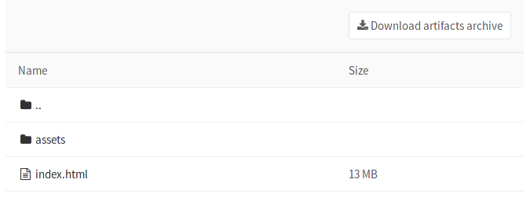
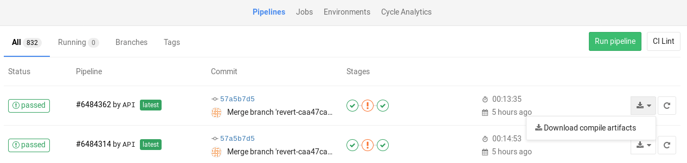
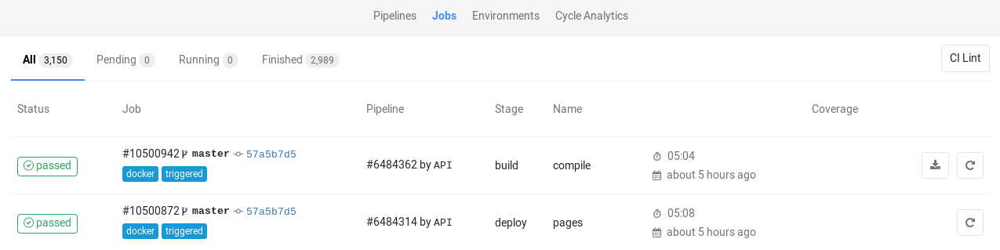
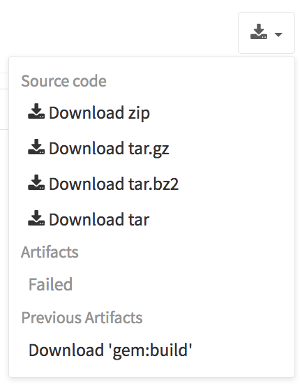

# Introduction to job artifacts

> - Introduced in GitLab 8.2 and GitLab Runner 0.7.0.
> - Starting with GitLab 8.4 and GitLab Runner 1.0, the artifacts archive format changed to `ZIP`, and it is now possible to browse its contents, with the added ability of downloading the files separately.
> - In GitLab 8.17, builds were renamed to jobs.
> - The artifacts browser will be available only for new artifacts that are sent to GitLab using GitLab Runner version 1.0 and up. It will not be possible to browse old artifacts already uploaded to GitLab.

Job artifacts are a list of files and directories created by a job
once it finishes. This feature is [enabled by default](../../../administration/job_artifacts.md) in all
GitLab installations.

Job artifacts created by GitLab Runner are uploaded to GitLab and are downloadable as a single archive using the GitLab UI or the [GitLab API](../../../api/jobs.md#get-job-artifacts).

<i class="fa fa-youtube-play youtube" aria-hidden="true"></i>
For an overview, watch the video [GitLab CI Pipeline, Artifacts, and Environments](https://www.youtube.com/watch?v=PCKDICEe10s).
Watch also [GitLab CI pipeline tutorial for beginners](https://www.youtube.com/watch?v=Jav4vbUrqII).

## Defining artifacts in `.gitlab-ci.yml`

A simple example of using the artifacts definition in `.gitlab-ci.yml` would be
the following:

```yaml
pdf:
  script: xelatex mycv.tex
  artifacts:
    paths:
    - mycv.pdf
    expire_in: 1 week
```

A job named `pdf` calls the `xelatex` command in order to build a pdf file from
the latex source file `mycv.tex`. We then define the `artifacts` paths which in
turn are defined with the `paths` keyword. All paths to files and directories
are relative to the repository that was cloned during the build.

The artifacts will be uploaded when the job succeeds by default, but can be set to upload
when the job fails, or always, if the [`artifacts:when`](../../../ci/yaml/README.md#artifactswhen)
parameter is used. These uploaded artifacts will be kept in GitLab for 1 week as defined
by the `expire_in` definition. You have the option to keep the artifacts from expiring
via the [web interface](#browsing-artifacts). If the expiry time is not defined, it defaults
to the [instance wide setting](../../admin_area/settings/continuous_integration.md#default-artifacts-expiration-core-only).

For more examples on artifacts, follow the [artifacts reference in
`.gitlab-ci.yml`](../../../ci/yaml/README.md#artifacts).

## Browsing artifacts

> - From GitLab 9.2, PDFs, images, videos and other formats can be previewed directly in the job artifacts browser without the need to download them.
> - Introduced in [GitLab 10.1][ce-14399], HTML files in a public project can be previewed directly in a new tab without the need to download them when [GitLab Pages](../../../administration/pages/index.md) is enabled. The same applies for textual formats (currently supported extensions: `.txt`, `.json`, and `.log`).
> - Introduced in [GitLab 12.4][gitlab-16675], artifacts in private projects can be previewed when [GitLab Pages access control](../../../administration/pages/index.md#access-control) is enabled.

After a job finishes, if you visit the job's specific page, there are three
buttons. You can download the artifacts archive or browse its contents, whereas
the **Keep** button appears only if you have set an [expiry date] to the
artifacts in case you changed your mind and want to keep them.


The archive browser shows the name and the actual file size of each file in the
archive. If your artifacts contained directories, then you are also able to
browse inside them.

Below you can see what browsing looks like. In this case we have browsed inside
the archive and at this point there is one directory, a couple files, and
one HTML file that you can view directly online when
[GitLab Pages](../../../administration/pages/index.md) is enabled (opens in a new tab).



## Downloading artifacts

If you need to download the whole archive, there are buttons in various places
in the GitLab UI to do this:

1. While on the pipelines page, you can see the download icon for each job's
   artifacts archive in the right corner:

   

1. While on the **Jobs** page, you can see the download icon for each job's
   artifacts archive in the right corner:

   

1. While inside a specific job, you are presented with a download button
   along with the one that browses the archive:

   

1. And finally, when browsing an archive you can see the download button at
   the top right corner:

   

## Downloading the latest artifacts

It is possible to download the latest artifacts of a job via a well known URL
so you can use it for scripting purposes.

NOTE: **Note:**
The latest artifacts are created by jobs in the **most recent** successful pipeline
for the specific ref. If you run two types of pipelines for the same ref, the latest
artifact will be determined by timing. For example, if a branch pipeline created
by merging a merge request runs at the same time as a scheduled pipeline, the
latest artifact will be from the pipeline that completed most recently.

Artifacts for other pipelines can be accessed with direct access to them.

The structure of the URL to download the whole artifacts archive is the following:

```
https://example.com/<namespace>/<project>/-/jobs/artifacts/<ref>/download?job=<job_name>
```

To download a single file from the artifacts use the following URL:

```
https://example.com/<namespace>/<project>/-/jobs/artifacts/<ref>/raw/<path_to_file>?job=<job_name>
```

For example, to download the latest artifacts of the job named `coverage` of
the `master` branch of the `gitlab` project that belongs to the `gitlab-org`
namespace, the URL would be:

```
https://gitlab.com/gitlab-org/gitlab/-/jobs/artifacts/master/download?job=coverage
```

To download the file `coverage/index.html` from the same
artifacts use the following URL:

```
https://gitlab.com/gitlab-org/gitlab/-/jobs/artifacts/master/raw/coverage/index.html?job=coverage
```

There is also a URL to browse the latest job artifacts:

```
https://example.com/<namespace>/<project>/-/jobs/artifacts/<ref>/browse?job=<job_name>
```

For example:

```
https://gitlab.com/gitlab-org/gitlab/-/jobs/artifacts/master/browse?job=coverage
```

There is also a URL to specific files, including html files that
are shown in [GitLab Pages](../../../administration/pages/index.md):

```
https://example.com/<namespace>/<project>/-/jobs/artifacts/<ref>/file/<path>?job=<job_name>
```

For example, when a job `coverage` creates the artifact `htmlcov/index.html`,
you can access it at:

```
https://gitlab.com/gitlab-org/gitlab/-/jobs/artifacts/master/file/htmlcov/index.html?job=coverage
```

The latest builds are also exposed in the UI in various places. Specifically,
look for the download button in:

- The main project's page
- The branches page
- The tags page

If the latest job has failed to upload the artifacts, you can see that
information in the UI.



## Erasing artifacts

DANGER: **Warning:**
This is a destructive action that leads to data loss. Use with caution.

You can erase a single job via the UI, which will also remove the job's
artifacts and trace, if you are:

- The owner of the job.
- A [Maintainer](../../permissions.md#gitlab-cicd-permissions) of the project.

To erase a job:

1. Navigate to a job's page.
1. Click the trash icon at the top right of the job's trace.
1. Confirm the deletion.

## Retrieve artifacts of private projects when using GitLab CI

In order to retrieve a job artifact of a different project, you might need to use a private token in order to [authenticate and download](../../../api/jobs.md#get-job-artifacts) the artifacts.

[expiry date]: ../../../ci/yaml/README.md#artifactsexpire_in
[ce-14399]: https://gitlab.com/gitlab-org/gitlab-foss/merge_requests/14399
[gitlab-16675]: https://gitlab.com/gitlab-org/gitlab/merge_requests/16675

<!-- ## Troubleshooting

Include any troubleshooting steps that you can foresee. If you know beforehand what issues
one might have when setting this up, or when something is changed, or on upgrading, it's
important to describe those, too. Think of things that may go wrong and include them here.
This is important to minimize requests for support, and to avoid doc comments with
questions that you know someone might ask.

Each scenario can be a third-level heading, e.g. `### Getting error message X`.
If you have none to add when creating a doc, leave this section in place
but commented out to help encourage others to add to it in the future. -->
