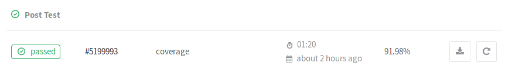
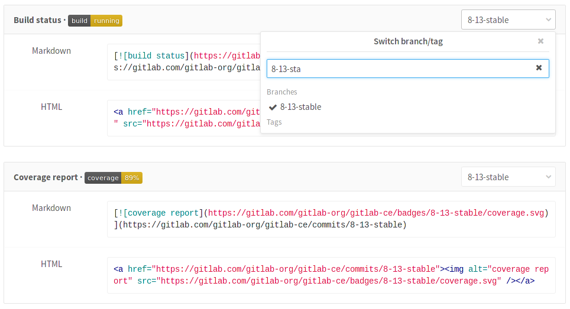

# Pipelines settings

To reach the pipelines settings navigate to your project's
**Settings ➔ CI/CD**.

The following settings can be configured per project.

## Git strategy

With Git strategy, you can choose the default way your repository is fetched
from GitLab in a job.

There are two options:

- Using `git clone` which is slower since it clones the repository from scratch
  for every job, ensuring that the project workspace is always pristine.
- Using `git fetch` which is faster as it re-uses the project workspace (falling
  back to clone if it doesn't exist).

The default Git strategy can be overridden by the [GIT_STRATEGY variable][var]
in `.gitlab-ci.yml`.

## Timeout

Timeout defines the maximum amount of time in minutes that a job is able run.
The default value is 60 minutes. Decrease the time limit if you want to impose
a hard limit on your jobs' running time or increase it otherwise. In any case,
if the job surpasses the threshold, it is marked as failed.

## Custom CI config path

>  - [Introduced][ce-12509] in GitLab 9.4.

By default we look for the `.gitlab-ci.yml` file in the project's root
directory. If you require a different location **within** the repository,
you can set a custom filepath that will be used to lookup the config file,
this filepath should be **relative** to the root.

Here are some valid examples:

> * .gitlab-ci.yml
> * .my-custom-file.yml
> * my/path/.gitlab-ci.yml
> * my/path/.my-custom-file.yml

## Test coverage parsing

If you use test coverage in your code, GitLab can capture its output in the
job log using a regular expression. In the pipelines settings, search for the
"Test coverage parsing" section.


Leave blank if you want to disable it or enter a ruby regular expression. You
can use http://rubular.com to test your regex.

If the pipeline succeeds, the coverage is shown in the merge request widget and
in the jobs table.




A few examples of known coverage tools for a variety of languages can be found
in the pipelines settings page.

## Visibility of pipelines

Access to pipelines and job details (including output of logs and artifacts)
is checked against your current user access level and the **Public pipelines**
project setting under your project's **Settings > CI/CD > General pipelines settings**.

If **Public pipelines** is enabled (default):

- for **public** projects, anyone can view the pipelines and access the job details
  (output logs and artifacts)
- for **internal** projects, any logged in user can view the pipelines
  and access the job details
  (output logs and artifacts)
- for **private** projects, any member (guest or higher) can view the pipelines
  and access the job details
  (output logs and artifacts)

If **Public pipelines** is disabled:

- for **public** projects, anyone can view the pipelines, but only members
  (reporter or higher) can access the job details (output logs and artifacts)
- for **internal** projects, any logged in user can view the pipelines,
  but only members (reporter or higher) can access the job details (output logs
  and artifacts)
- for **private** projects, only members (reporter or higher)
  can view the pipelines and access the job details (output logs and artifacts)

## Auto-cancel pending pipelines

> [Introduced][ce-9362] in GitLab 9.1.

If you want to auto-cancel all pending non-HEAD pipelines on branch, when
new pipeline will be created (after your git push or manually from UI),
check **Auto-cancel pending pipelines** checkbox and save the changes.

## Badges

In the pipelines settings page you can find pipeline status and test coverage
badges for your project. The latest successful pipeline will be used to read
the pipeline status and test coverage values.

Visit the pipelines settings page in your project to see the exact link to
your badges, as well as ways to embed the badge image in your HTML or Markdown
pages.



### Pipeline status badge

Depending on the status of your job, a badge can have the following values:

- pending
- running
- passed
- failed
- skipped
- canceled
- unknown

You can access a pipeline status badge image using the following link:

```
https://example.gitlab.com/<namespace>/<project>/badges/<branch>/build.svg
```

### Test coverage report badge

GitLab makes it possible to define the regular expression for [coverage report],
that each job log will be matched against. This means that each job in the
pipeline can have the test coverage percentage value defined.

The test coverage badge can be accessed using following link:

```
https://example.gitlab.com/<namespace>/<project>/badges/<branch>/coverage.svg
```

If you would like to get the coverage report from a specific job, you can add
the `job=coverage_job_name` parameter to the URL. For example, the following
Markdown code will embed the test coverage report badge of the `coverage` job
into your `README.md`:

```markdown

```

[var]: ../../../ci/yaml/README.md#git-strategy
[coverage report]: #test-coverage-parsing
[ce-9362]: https://gitlab.com/gitlab-org/gitlab-ce/merge_requests/9362
[ce-12509]: https://gitlab.com/gitlab-org/gitlab-ce/merge_requests/12509
