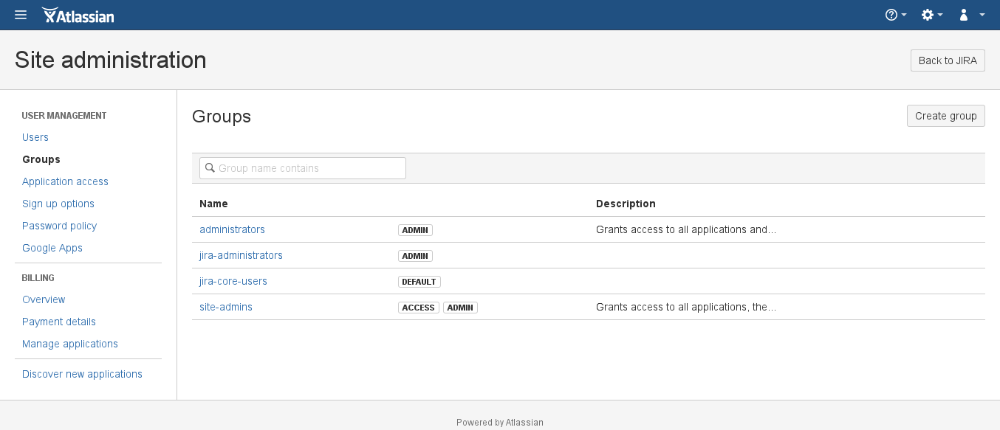
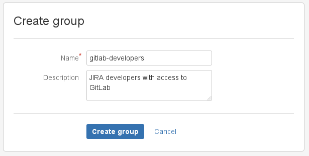
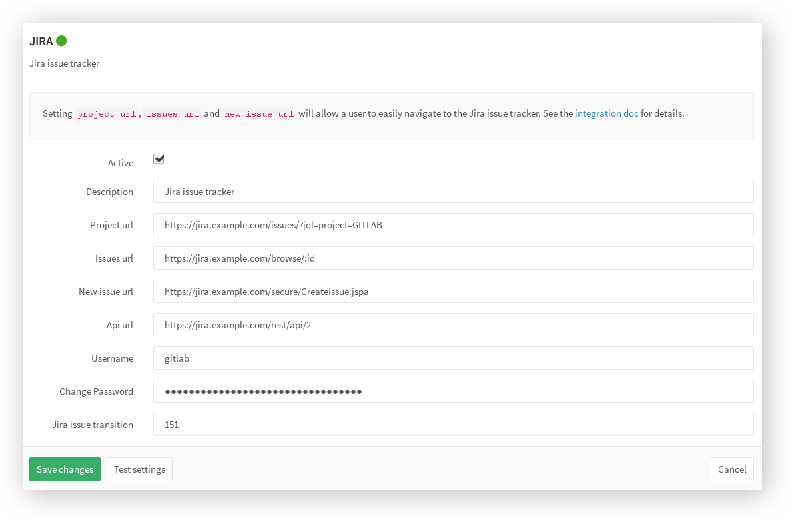
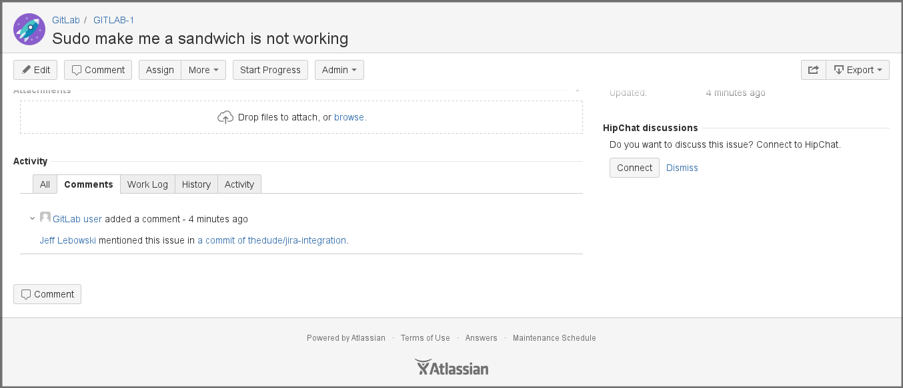
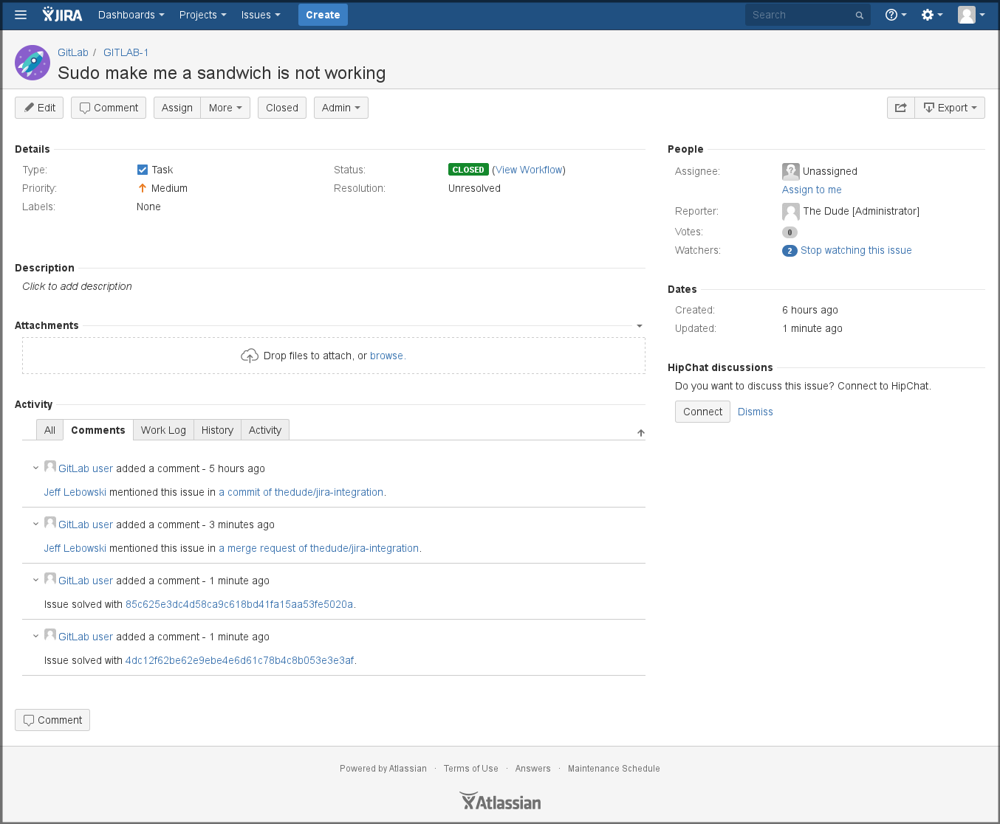

# GitLab JIRA integration

>**Note:**
Full JIRA integration was previously exclusive to GitLab Enterprise Edition.
With [GitLab 8.3 forward][8_3_post], this feature in now [backported][jira-ce]
to GitLab Community Edition as well.

---

GitLab can be configured to interact with [JIRA Core] either using an
on-premises instance or the SaaS solution that Atlassian offers. Configuration
happens via username and password on a per-project basis. Connecting to a JIRA
server via CAS is not possible.

Each project can be configured to connect to a different JIRA instance or, in
case you have a single JIRA instance, you can pre-fill the JIRA service
settings page in GitLab with a default template. To configure the JIRA template,
see the [Services Templates documentation][services-templates].

Once the GitLab project is connected to JIRA, you can reference and close the
issues in JIRA directly from GitLab's merge requests.

## Configuration

The configuration consists of two parts:

- [JIRA configuration](#configuring-jira)
- [GitLab configuration](#configuring-gitlab)

### Configuring JIRA

First things first, we need to create a user in JIRA which will have access to
all projects that need to integrate with GitLab.

We have split this stage in steps so it is easier to follow.

---

1. Login to your JIRA instance as an administrator and under **Administration**
   go to **User Management** to create a new user.

     

     ---

1. The next step is to create a new user (e.g., `gitlab`) who has write access
   to projects in JIRA. Enter the user's name and a _valid_ e-mail address
   since JIRA sends a verification e-mail to set-up the password.
   _**Note:** JIRA creates the username automatically by using the e-mail
   prefix. You can change it later if you want._

     

     ---

1. Now, let's create a `gitlab-developers` group which will have write access
   to projects in JIRA. Go to the **Groups** tab and select **Create group**.

     

     ---

     Give it an optional description and hit **Create group**.

     

     ---

1. Give the newly-created group write access by going to
   **Application access > View configuration** and adding the `gitlab-developers`
   group to JIRA Core.

     

     ---

1. Add the `gitlab` user to the `gitlab-developers` group by going to
   **Users > GitLab user > Add group** and selecting the `gitlab-developers`
   group from the dropdown menu. Notice that the group says _Access_ which is
   what we aim for.

     

---

The JIRA configuration is over. Write down the new JIRA username and its
password as they will be needed when configuring GitLab in the next section.

### Configuring GitLab

>**Note:**
The currently supported JIRA versions are v6.x and v7.x. and GitLab
7.8 or higher is required.

---

Assuming you [have already configured JIRA](#configuring-jira), now it's time
to configure GitLab.

JIRA configuration in GitLab is done via a project's
[**Services**](../project_services/project_services.md).

To enable JIRA integration in a project, navigate to the project's
**Settings > Services > JIRA**.

Fill in the required details on the page, as described in the table below.

| Setting | Description |
| ------- | ----------- |
| `Description` | A name for the issue tracker (to differentiate between instances, for example). |
| `Project url` | The URL to the JIRA project which is being linked to this GitLab project. It is of the form: `https://<jira_host_url>/issues/?jql=project=<jira_project>`. |
| `Issues url`  | The URL to the JIRA project issues overview for the project that is linked to this GitLab project. It is of the form: `https://<jira_host_url>/browse/:id`. Leave `:id` as-is, it gets replaced by GitLab at runtime. |
| `New issue url` | This is the URL to create a new issue in JIRA for the project linked to this GitLab project, and it is of the form: `https://<jira_host_url>/secure/CreateIssue.jspa` |
| `Api url`     | The base URL of the JIRA API. It may be omitted, in which case GitLab will automatically use API version `2` based on the `project url`. It is of the form: `https://<jira_host_url>/rest/api/2`. |
| `Username` | The username of the user created in [configuring JIRA step](#configuring-jira). |
| `Password` |The password of the user created in [configuring JIRA step](#configuring-jira). |
| `JIRA issue transition` | This setting is very important to set up correctly. It is the ID of a transition that moves issues to a closed state. You can find this number under the JIRA workflow administration (**Administration > Issues > Workflows**) by selecting **View** under **Operations** of the desired workflow of your project. The ID of each state can be found inside the parenthesis of each transition name under the **Transitions (id)** column ([see screenshot][trans]). By default, this ID is set to `2`. |

After saving the configuration, your GitLab project will be able to interact
with the linked JIRA project.

For example, given the settings below:

- the JIRA URL is `https://jira.example.com`
- the project is named `GITLAB`
- the user is named `gitlab`
- the JIRA issue transition is 151 (based on the [JIRA issue transition][trans])

the following screenshot shows how the JIRA service settings should look like.

[trans]: img/jira_issues_workflow.png

---

## JIRA issues

By now you should have [configured JIRA](#configuring-jira) and enabled the
[JIRA service in GitLab](#configuring-gitlab). If everything is set up correctly
you should be able to reference and close JIRA issues by just mentioning their
ID in GitLab commits and merge requests.

### Referencing JIRA Issues

If you reference a JIRA issue, e.g., `GITLAB-1`, in a commit comment, a link
which points back to JIRA is created.

The same works for comments in merge requests as well.

---

The mentioning action is two-fold, so a comment with a JIRA issue in GitLab
will automatically add a comment in that particular JIRA issue with the link
back to GitLab.

---

The comment on the JIRA issue is of the form:

> USER mentioned this issue in LINK_TO_THE_MENTION

Where:

| Format | Description |
| ------ | ----------- |
| `USER` | A user that mentioned the issue. This is the link to the user profile in GitLab. |
| `LINK_TO_THE_MENTION` | Link to the origin of mention with a name of the entity where JIRA issue was mentioned. Can be commit or merge request. |

### Closing JIRA issues

JIRA issues can be closed directly from GitLab by using trigger words in
commits and merge requests. When a commit which contains the trigger word
followed by the JIRA issue ID in the commit message is pushed, GitLab will
add a comment in the mentioned JIRA issue and immediately close it (provided
the transition ID was set up correctly).

There are currently three trigger words, and you can use either one to achieve
the same goal:

- `Resolves GITLAB-1`
- `Closes GITLAB-1`
- `Fixes GITLAB-1`

where `GITLAB-1` the issue ID of the JIRA project.

### JIRA issue closing example

Let's say for example that we submitted a bug fix and created a merge request
in GitLab. The workflow would be something like this:

1. Create a new branch
1. Fix the bug
1. Commit the changes and push branch to GitLab
1. Open a new merge request and reference the JIRA issue including one of the
   trigger words, e.g.: `Fixes GITLAB-1`, in the description
1. Submit the merge request
1. Ask someone to review
1. Merge the merge request
1. The JIRA issue is automatically closed

---

In the following screenshot you can see what the link references to the JIRA
issue look like.

---

Once this merge request is merged, the JIRA issue will be automatically closed
with a link to the commit that resolved the issue.

---

You can see from the above image that there are four references to GitLab:

- The first is from a comment in a specific commit
- The second is from the JIRA issue reference in the merge request description
- The third is from the actual commit that solved the issue
- And the fourth is from the commit that the merge request created

[services-templates]: ../project_services/services_templates.md "Services templates documentation"
[JIRA Core]: https://www.atlassian.com/software/jira/core "The JIRA Core website"
[jira-ce]: https://gitlab.com/gitlab-org/gitlab-ce/merge_requests/2146 "MR - Backport JIRA service"
[8_3_post]: https://about.gitlab.com/2015/12/22/gitlab-8-3-released/ "GitLab 8.3 release post"

## Troubleshooting

### GitLab is unable to comment on a ticket

Make sure that the user you set up for GitLab to communicate with JIRA has the
correct access permission to post comments on a ticket and to also transition the
ticket, if you'd like GitLab to also take care of closing them.

### GitLab is unable to close a ticket

Make sure the the `Transition ID` you set within the JIRA settings matches the
one your project needs to close a ticket.
