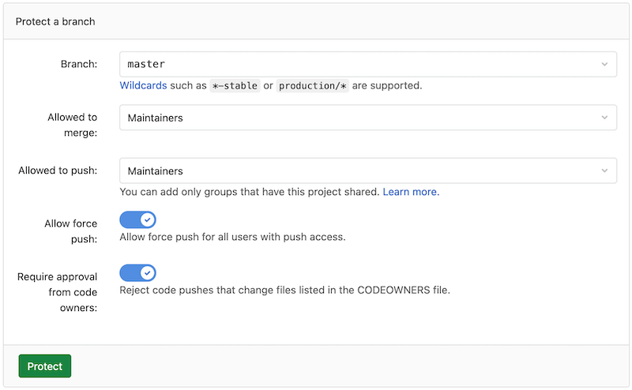
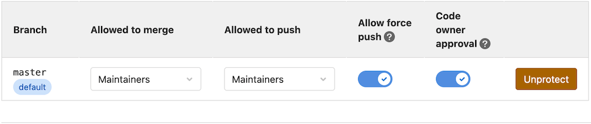

# Protected branches **(FREE)**

In GitLab, [permissions](../permissions.md) are fundamentally defined around the
idea of having read or write permission to the repository and branches. To impose
further restrictions on certain branches, they can be protected.

The default branch for your repository is protected by default.

## Who can access a protected branch

When a branch is protected, the default behavior enforces
these restrictions on the branch.

| Action                   | Who can do it |
|--------------------------|---------------|
| Protect a branch         | Maintainers only. |
| Push to the branch       | GitLab administrators and anyone with **Allowed** permission. (*) |
| Force push to the branch | No one. |
| Delete the branch        | No one. |

(*) Users with developer permissions can create a project in a group,
but might not be allowed to initially push to the [default branch](repository/branches/default.md).

### Set the branch protection default level

The default branch protection level is set in the [Admin Area](../admin_area/settings/visibility_and_access_controls.md#default-branch-protection).

## Configure a protected branch

Prerequisite:

- You must have at least maintainer permissions.

To protect a branch:

1. Go to your project and select **Settings > Repository**.
1. Expand **Protected branches**.
1. From the **Branch** dropdown menu, select the branch you want to protect.
1. Select **Protect**.

The protected branch displays in the **Protected branches** list.

## Using the Allowed to merge and Allowed to push settings

In GitLab 8.11 and later, we added another layer of branch protection which provides
more granular management of protected branches. The **Developers can push**
option was replaced by **Allowed to push**. You can set this value to allow
or prohibit Maintainers and/or Developers to push to a protected branch.

Using the **Allowed to push** and **Allowed to merge** settings, you can control
the actions that different roles can perform with the protected branch.
For example, you could set **Allowed to push** to "No one", and **Allowed to merge**
to "Developers + Maintainers", to require everyone to submit a merge request for
changes going into the protected branch. This is compatible with workflows like
the [GitLab workflow](../../topics/gitlab_flow.md).

However, there are workflows where that is not needed, and only protecting from
force pushes and branch removal is useful. For those workflows, you can allow
everyone with write access to push to a protected branch by setting
**Allowed to push** to "Developers + Maintainers".

You can set the **Allowed to push** and **Allowed to merge** options while creating
a protected branch or afterwards by selecting the option you want from the
dropdown list in the **Already protected** area.


If you don't choose any of those options while creating a protected branch,
they are set to Maintainers by default.

### Allow deploy keys to push to a protected branch

> - [Introduced](https://gitlab.com/gitlab-org/gitlab/-/issues/30769) in GitLab 13.7.
> - This feature is being selectively deployed in GitLab.com 13.7, and may not be available for all users.
> - This feature is available for all users in GitLab 13.9.

You can allow specific machines to access protected branches in your repository with
[deploy keys](deploy_keys/index.md). This can be useful for your CI/CD workflow,
for example.

Deploy keys can be selected in the **Allowed to push** dropdown when:

- Defining a protected branch.
- Updating an existing branch.

Select a deploy key to allow the key's owner to push to the chosen protected branch,
even if they aren't a member of the related project. The owner of the selected deploy
key must have at least read access to the given project.

For a deploy key to be selectable:

- It must be [enabled for your project](deploy_keys/index.md#how-to-enable-deploy-keys).
- It must have [write access](deploy_keys/index.md#deploy-keys-permissions) to your project repository.

Deploy keys are not available in the **Allowed to merge** dropdown.


## Restricting push and merge access to certain users **(PREMIUM)**

With GitLab Premium you can restrict access to protected branches
by choosing a role (Maintainers, Developers) and certain users. From the
dropdown menu select the role and/or the users you want to have merge or push
access.


Click **Protect** and the branch displays in the **Protected branch** list.


## Wildcard protected branches

You can specify a wildcard protected branch, which protects all branches
matching the wildcard. For example:

| Wildcard Protected Branch | Matching Branches                                      |
|---------------------------|--------------------------------------------------------|
| `*-stable`                | `production-stable`, `staging-stable`                  |
| `production/*`            | `production/app-server`, `production/load-balancer`    |
| `*gitlab*`                | `gitlab`, `gitlab/staging`, `master/gitlab/production` |

Protected branch settings, like **Developers can push**, apply to all matching
branches.

Two different wildcards can potentially match the same branch. For example,
`*-stable` and `production-*` would both match a `production-stable` branch.
In that case, if _any_ of these protected branches have a setting like
"Allowed to push", then `production-stable` also inherit this setting.

If you click on a protected branch's name, GitLab displays a list of
all matching branches:


## Create a protected branch

> [Introduced](https://gitlab.com/gitlab-org/gitlab-foss/-/issues/53361) in GitLab 11.9.

When a protected branch or wildcard protected branches are set to
[**No one** is **Allowed to push**](#using-the-allowed-to-merge-and-allowed-to-push-settings),
Developers (and users with higher [permission levels](../permissions.md)) are
allowed to create a new protected branch as long as they are
[**Allowed to merge**](#using-the-allowed-to-merge-and-allowed-to-push-settings).
This can only be done by using the UI or through the API, to avoid creating protected
branches accidentally from the command line or from a Git client application.

To create a new branch through the user interface:

1. Go to **Repository > Branches**.
1. Click on **New branch**.
1. Fill in the branch name and select an existing branch, tag, or commit to
   base the new branch on. Only existing protected branches and commits
   that are already in protected branches are accepted.

## Delete a protected branch

From time to time, you may need to delete or clean up protected branches.
User with [Maintainer permissions](../permissions.md) and greater can manually delete protected
branches by using the GitLab web interface:

1. Go to **Repository > Branches**.
1. Click on the delete icon next to the branch you wish to delete.
1. To prevent accidental deletion, an additional confirmation is required.

   

Deleting a protected branch is allowed only by using the web interface; not from Git.
This means that you can't accidentally delete a protected branch from your
command line or a Git client application.

## Allow force push on protected branches

> - [Introduced](https://gitlab.com/gitlab-org/gitlab/-/issues/15611) in GitLab 13.10 behind a disabled feature flag.
> - It's enabled on GitLab.com.
> - It's recommended for production use.
> - For GitLab self-managed instances, GitLab administrators can opt to [disable it](#enable-or-disable-allow-force-push-on-protected-branches).

WARNING:
This feature might not be available to you. Check the **version history** note above for details.

You can allow force pushes to protected branches by either setting **Allow force push**
when you protect a new branch, or by configuring an already-protected branch.

To protect a new branch and enable Force push:

1. Navigate to your project's **Settings > Repository**.
1. Expand **Protected branches**, and scroll to **Protect a branch**.
   
1. Select a **Branch** or wildcard you'd like to protect.
1. Select the user levels **Allowed to merge** and **Allowed to push**.
1. To allow all users with push access to force push, toggle the **Allow force push** slider.
1. To reject code pushes that change files listed in the `CODEOWNERS` file, toggle
   **Require approval from code owners**.
1. Click **Protect**.

To enable force pushes on branches already protected:

1. Navigate to your project's **Settings > Repository**.
1. Expand **Protected branches** and scroll to **Protected branch**.
   
1. Toggle the **Allow force push** slider for the chosen branch.

When enabled, members who are allowed to push to this branch can also force push.

## Protected branches approval by Code Owners **(PREMIUM)**

> [Introduced](https://gitlab.com/gitlab-org/gitlab/-/issues/13251) in GitLab Premium 12.4.

It is possible to require at least one approval by a
[Code Owner](code_owners.md) to a file changed by the
merge request. You can either set Code Owners approvals
at the time you protect a new branch, or set it to a branch
already protected, as described below.

To protect a new branch and enable Code Owner's approval:

1. Navigate to your project's **Settings > Repository** and expand **Protected branches**.
1. Scroll down to **Protect a branch**, select a **Branch** or wildcard you'd like to protect, select who's **Allowed to merge** and **Allowed to push**, and toggle the **Require approval from code owners** slider.
1. Click **Protect**.


To enable Code Owner's approval to branches already protected:

1. Navigate to your project's **Settings > Repository** and expand **Protected branches**.
1. Scroll down to **Protected branch** and toggle the **Code owner approval** slider for the chosen branch.


When enabled, all merge requests targeting these branches require approval
by a Code Owner per matched rule before they can be merged.
Additionally, direct pushes to the protected branch are denied if a rule is matched.

[Introduced](https://gitlab.com/gitlab-org/gitlab/-/issues/35097) in [GitLab Premium](https://about.gitlab.com/pricing/) 13.5, users and groups who are allowed to push to protected branches do not require a merge request to merge their feature branches. Thus, they can skip merge request approval rules.

## Running pipelines on protected branches

The permission to merge or push to protected branches is used to define if a user can
run CI/CD pipelines and execute actions on jobs that are related to those branches.

See [Security on protected branches](../../ci/pipelines/index.md#pipeline-security-on-protected-branches)
for details about the pipelines security model.

## Enable or disable allow force push on protected branches **(FREE SELF)**

Allow force push on protected branches is ready for
production use. It is deployed behind a feature flag that is **enabled by default**.
[GitLab administrators with access to the GitLab Rails console](../../administration/feature_flags.md)
can enable it.

To enable it:

```ruby
Feature.enable(:allow_force_push_to_protected_branches)
```

To disable it:

```ruby
Feature.disable(:allow_force_push_to_protected_branches)
```

## Changelog

- **13.5**: [Allow Deploy keys to push to protected branches once more](https://gitlab.com/gitlab-org/gitlab/-/issues/30769).
- **11.9**: [Allow protected branches to be created](https://gitlab.com/gitlab-org/gitlab-foss/-/issues/53361)
  by Developers (and users with higher permission levels) through the API and the user interface.

<!-- ## Troubleshooting

Include any troubleshooting steps that you can foresee. If you know beforehand what issues
one might have when setting this up, or when something is changed, or on upgrading, it's
important to describe those, too. Think of things that may go wrong and include them here.
This is important to minimize requests for support, and to avoid doc comments with
questions that you know someone might ask.

Each scenario can be a third-level heading, e.g. `### Getting error message X`.
If you have none to add when creating a doc, leave this section in place
but commented out to help encourage others to add to it in the future. -->
