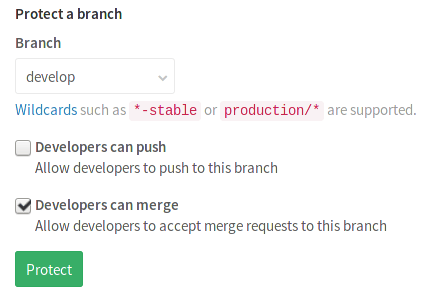
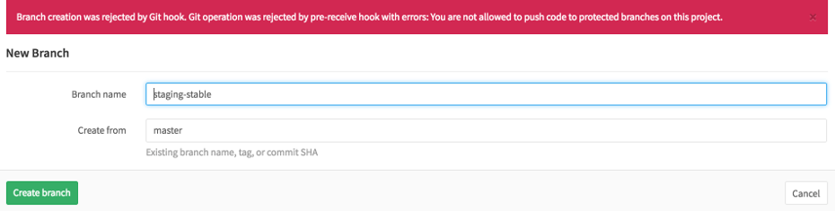

# Protected Branches

[Permissions](../permissions.md) in GitLab are fundamentally defined around the
idea of having read or write permission to the repository and branches. To
prevent people from messing with history or pushing code without review, we've
created protected branches.

By default, a protected branch does four simple things:

- it prevents its creation, if not already created, from everybody except users
  with Master permission
- it prevents pushes from everybody except users with Master permission
- it prevents **anyone** from force pushing to the branch
- it prevents **anyone** from deleting the branch

See the [Changelog](#changelog) section for changes over time.

## Configuring protected branches

To protect a branch, you need to have at least Master permission level. Note
that the `master` branch is protected by default.

1. Navigate to the main page of the project.
1. In the upper right corner, click the settings wheel and select **Protected branches**.

    

1. From the **Branch** dropdown menu, select the branch you want to protect and
   click **Protect**. In the screenshot below, we chose the `develop` branch.

    

1. Once done, the protected branch will appear in the "Already protected" list.

    


Since GitLab 8.10, we added another layer of branch protection which provides
more granular management of protected branches. You can now choose the option
"Developers can merge" so that Developer users can merge a merge request but
not directly push. In that case, your branches are protected from direct pushes,
yet Developers don't need elevated permissions or wait for someone with a higher
permission level to press merge.

You can set this option while creating the protected branch or after its
creation.

## Wildcard protected branches

>**Note:**
This feature was [introduced][ce-4665] in GitLab 8.10.

You can specify a wildcard protected branch, which will protect all branches
matching the wildcard. For example:

| Wildcard Protected Branch | Matching Branches                                      |
|---------------------------+--------------------------------------------------------|
| `*-stable`                | `production-stable`, `staging-stable`                  |
| `production/*`            | `production/app-server`, `production/load-balancer`    |
| `*gitlab*`                | `gitlab`, `gitlab/staging`, `master/gitlab/production` |

Protected branch settings (like "Developers can push") apply to all matching
branches.

Two different wildcards can potentially match the same branch. For example,
`*-stable` and `production-*` would both match a `production-stable` branch.
In that case, if _any_ of these protected branches have a setting like
"Allowed to push", then `production-stable` will also inherit this setting.

If you click on a protected branch's name that is created using a wildcard,
you will be presented with a list of all matching branches:


## Restrict the creation of protected branches

Creating a protected branch or a list of protected branches using the wildcard
feature, not only you are restricting pushes to those branches, but also their
creation if not already created.

## Error messages when pushing to a protected branch

A user with insufficient permissions will be presented with an error when
creating or pushing to a branch that's prohibited, either through GitLab's UI:



or using Git from their terminal:

```bash
remote: GitLab: You are not allowed to push code to protected branches on this project.
To https://gitlab.example.com/thedude/bowling.git
 ! [remote rejected] staging-stable -> staging-stable (pre-receive hook declined)
error: failed to push some refs to 'https://gitlab.example.com/thedude/bowling.git'
```

## Changelog

**8.10.0**

- Allow specifying protected branches using wildcards [gitlab-org/gitlab-ce!5081][ce-4665]

---

[ce-4665]: https://gitlab.com/gitlab-org/gitlab-ce/merge_requests/4665 "Allow specifying protected branches using wildcards"
[ce-5081]: https://gitlab.com/gitlab-org/gitlab-ce/merge_requests/5081 "Allow creating protected branches that can't be pushed to"
