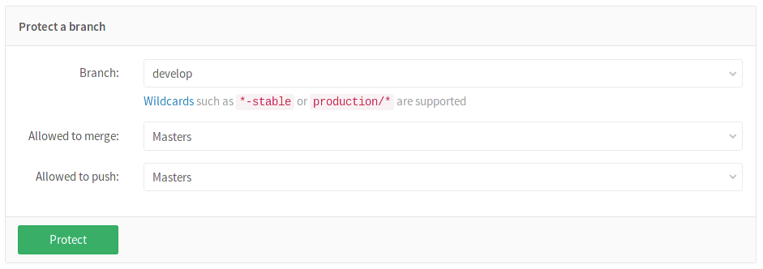
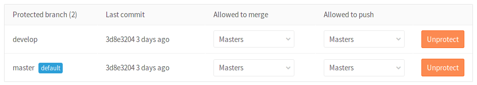
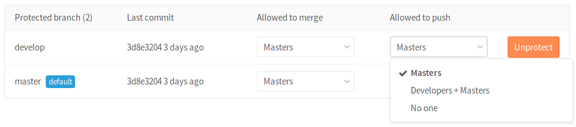
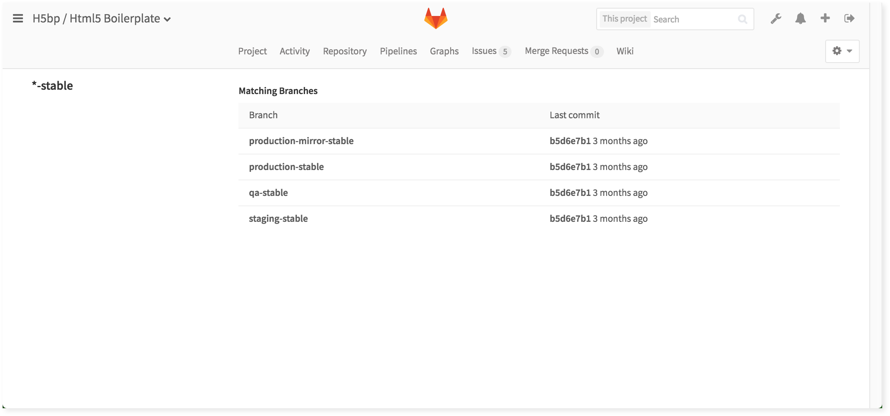
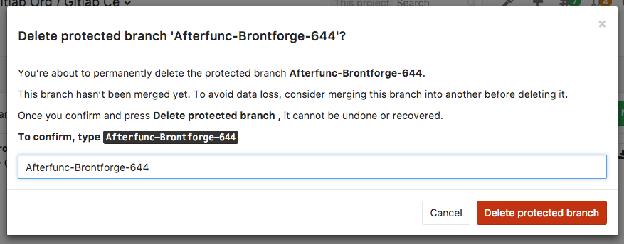

# Protected Branches

[Permissions](../permissions.md) in GitLab are fundamentally defined around the
idea of having read or write permission to the repository and branches. To
prevent people from messing with history or pushing code without review, we've
created protected branches.

## Overview

By default, a protected branch does four simple things:

- it prevents its creation, if not already created, from everybody except users
  with Master permission
- it prevents pushes from everybody except users with Master permission
- it prevents **anyone** from force pushing to the branch
- it prevents **anyone** from deleting the branch

See the [Changelog](#changelog) section for changes over time.

>
>Additional functionality for GitLab Enterprise Edition:
>
>- Restrict push and merge access to [certain users][ee-restrict]

## Configuring protected branches

To protect a branch, you need to have at least Master permission level. Note
that the `master` branch is protected by default.

1. Navigate to your project's **Settings ➔ Repository**
1. Scroll to find the **Protected branches** section.
1. From the **Branch** dropdown menu, select the branch you want to protect and
   click **Protect**. In the screenshot below, we chose the `develop` branch.

    

1. Once done, the protected branch will appear in the "Protected branches" list.

    

## Using the Allowed to merge and Allowed to push settings

> [Introduced][ce-5081] in GitLab 8.11.

Since GitLab 8.11, we added another layer of branch protection which provides
more granular management of protected branches. The "Developers can push"
option was replaced by an "Allowed to push" setting which can be set to
allow/prohibit Masters and/or Developers to push to a protected branch.

Using the "Allowed to push" and "Allowed to merge" settings, you can control
the actions that different roles can perform with the protected branch.
For example, you could set "Allowed to push" to "No one", and "Allowed to merge"
to "Developers + Masters", to require _everyone_ to submit a merge request for
changes going into the protected branch. This is compatible with workflows like
the [GitLab workflow](../../workflow/gitlab_flow.md).

However, there are workflows where that is not needed, and only protecting from
force pushes and branch removal is useful. For those workflows, you can allow
everyone with write access to push to a protected branch by setting
"Allowed to push" to "Developers + Masters".

You can set the "Allowed to push" and "Allowed to merge" options while creating
a protected branch or afterwards by selecting the option you want from the
dropdown list in the "Already protected" area.

If you don't choose any of those options while creating a protected branch,
they are set to "Masters" by default.

## Wildcard protected branches

> [Introduced][ce-4665] in GitLab 8.10.

You can specify a wildcard protected branch, which will protect all branches
matching the wildcard. For example:

| Wildcard Protected Branch | Matching Branches                                      |
|---------------------------+--------------------------------------------------------|
| `*-stable`                | `production-stable`, `staging-stable`                  |
| `production/*`            | `production/app-server`, `production/load-balancer`    |
| `*gitlab*`                | `gitlab`, `gitlab/staging`, `master/gitlab/production` |

Protected branch settings (like "Developers can push") apply to all matching
branches.

Two different wildcards can potentially match the same branch. For example,
`*-stable` and `production-*` would both match a `production-stable` branch.
In that case, if _any_ of these protected branches have a setting like
"Allowed to push", then `production-stable` will also inherit this setting.

If you click on a protected branch's name, you will be presented with a list of
all matching branches:

## Deleting a protected branch

> [Introduced][ce-21393] in GitLab 9.3.

From time to time, it may be required to delete or clean up branches that are
protected.

User with [Master permissions][perm] and up can manually delete protected
branches via GitLab's web interface:

1. Visit **Repository > Branches**
1. Click on the delete icon next to the branch you wish to delete
1. In order to prevent accidental deletion, an additional confirmation is
   required

    

Deleting a protected branch is only allowed via the web interface, not via Git.
This means that you can't accidentally delete a protected branch from your
command line or a Git client application.

## Running pipelines on protected branches

The permission to merge or push to protected branches is used to define if a user can
run CI/CD pipelines and execute actions on jobs that are related to those branches.

See [Security on protected branches](../../ci/pipelines.md#security-on-protected-branches)
for details about the pipelines security model.

## Changelog

**9.2**

- Allow deletion of protected branches via the web interface [gitlab-org/gitlab-ce#21393][ce-21393]

**8.11**

- Allow creating protected branches that can't be pushed to [gitlab-org/gitlab-ce!5081][ce-5081]

**8.10**

- Allow developers to merge into a protected branch without having push access [gitlab-org/gitlab-ce!4892][ce-4892]
- Allow specifying protected branches using wildcards [gitlab-org/gitlab-ce!4665][ce-4665]

---

[ce-4665]: https://gitlab.com/gitlab-org/gitlab-ce/merge_requests/4665 "Allow specifying protected branches using wildcards"
[ce-4892]: https://gitlab.com/gitlab-org/gitlab-ce/merge_requests/4892 "Allow developers to merge into a protected branch without having push access"
[ce-5081]: https://gitlab.com/gitlab-org/gitlab-ce/merge_requests/5081 "Allow creating protected branches that can't be pushed to"
[ce-21393]: https://gitlab.com/gitlab-org/gitlab-ce/issues/21393
[ee-restrict]: http://docs.gitlab.com/ee/user/project/protected_branches.html#restricting-push-and-merge-access-to-certain-users
[perm]: ../permissions.md
