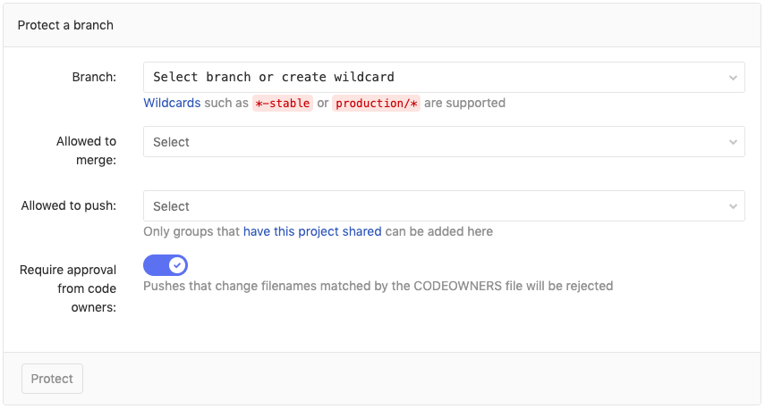
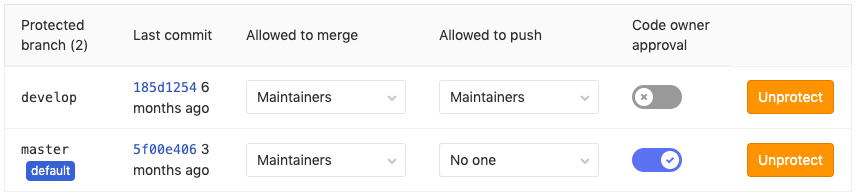
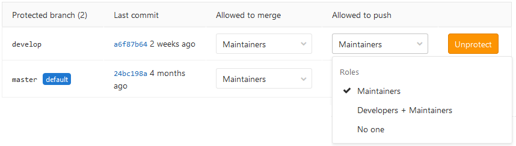
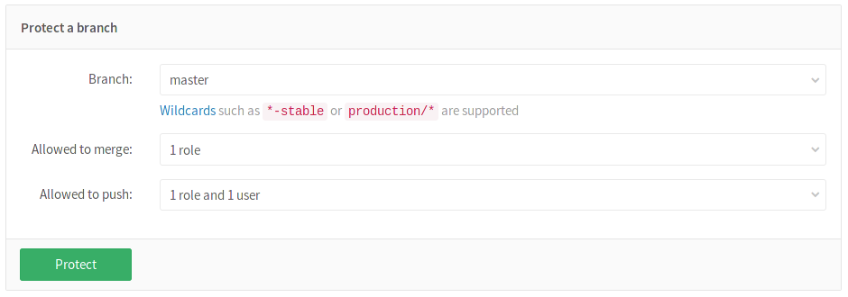
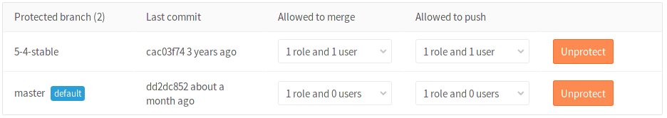
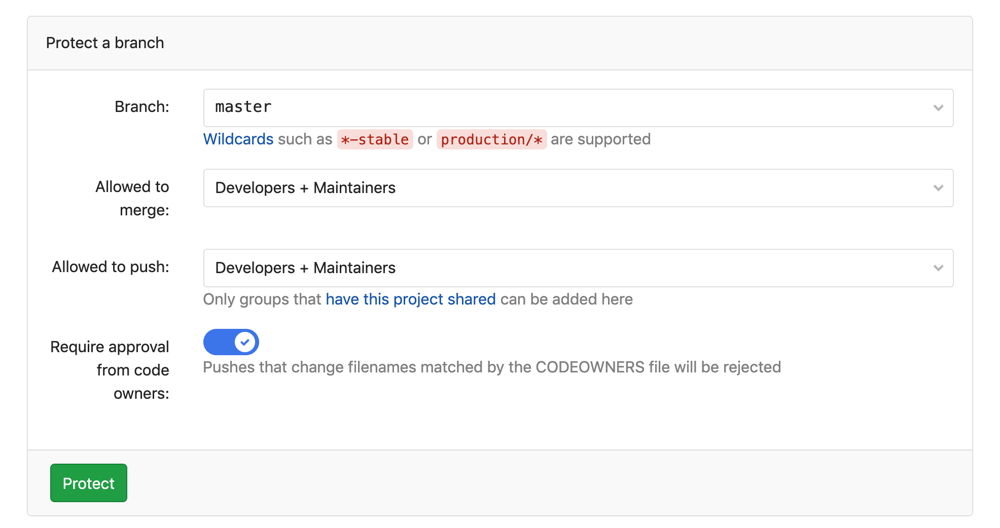
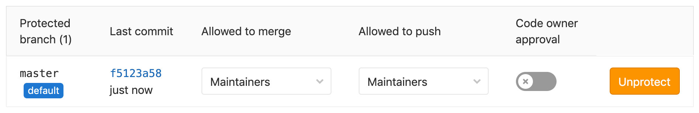

# Protected Branches

[Permissions](../permissions.md) in GitLab are fundamentally defined around the
idea of having read or write permission to the repository and branches. To impose
further restrictions on certain branches, they can be protected.

## Overview

By default, a protected branch does four simple things:

- It prevents its creation, if not already created, from everybody except users
  with Maintainer permission.
- It prevents pushes from everybody except users with **Allowed** permission.
- It prevents **anyone** from force pushing to the branch.
- It prevents **anyone** from deleting the branch.

NOTE: **Note:**
A GitLab admin is allowed to push to the protected branches.

See the [Changelog](#changelog) section for changes over time.

The default branch protection level is set in the [Admin Area](../admin_area/settings/visibility_and_access_controls.md#default-branch-protection).

## Configuring protected branches

To protect a branch, you need to have at least Maintainer permission level. Note
that the `master` branch is protected by default.

1. Navigate to your project's **Settings ➔ Repository**
1. Scroll to find the **Protected branches** section.
1. From the **Branch** dropdown menu, select the branch you want to protect and
   click **Protect**. In the screenshot below, we chose the `develop` branch.

   

1. Once done, the protected branch will appear in the "Protected branches" list.

   

## Using the Allowed to merge and Allowed to push settings

> [Introduced](https://gitlab.com/gitlab-org/gitlab-foss/merge_requests/5081) in GitLab 8.11.

Since GitLab 8.11, we added another layer of branch protection which provides
more granular management of protected branches. The "Developers can push"
option was replaced by an "Allowed to push" setting which can be set to
allow/prohibit Maintainers and/or Developers to push to a protected branch.

Using the "Allowed to push" and "Allowed to merge" settings, you can control
the actions that different roles can perform with the protected branch.
For example, you could set "Allowed to push" to "No one", and "Allowed to merge"
to "Developers + Maintainers", to require _everyone_ to submit a merge request for
changes going into the protected branch. This is compatible with workflows like
the [GitLab workflow](../../topics/gitlab_flow.md).

However, there are workflows where that is not needed, and only protecting from
force pushes and branch removal is useful. For those workflows, you can allow
everyone with write access to push to a protected branch by setting
"Allowed to push" to "Developers + Maintainers".

You can set the "Allowed to push" and "Allowed to merge" options while creating
a protected branch or afterwards by selecting the option you want from the
dropdown list in the "Already protected" area.

If you don't choose any of those options while creating a protected branch,
they are set to "Maintainers" by default.

## Restricting push and merge access to certain users **(STARTER)**

> [Introduced](https://gitlab.com/gitlab-org/gitlab-foss/merge_requests/5081) in [GitLab Starter](https://about.gitlab.com/pricing/) 8.11.

With GitLab Enterprise Edition you can restrict access to protected branches
by choosing a role (Maintainers, Developers) as well as certain users. From the
dropdown menu select the role and/or the users you want to have merge or push
access.

Click **Protect** and the branch will appear in the "Protected branch" list.

## Wildcard protected branches

> [Introduced](https://gitlab.com/gitlab-org/gitlab-foss/merge_requests/4665) in GitLab 8.10.

You can specify a wildcard protected branch, which will protect all branches
matching the wildcard. For example:

| Wildcard Protected Branch | Matching Branches                                      |
|---------------------------|--------------------------------------------------------|
| `*-stable`                | `production-stable`, `staging-stable`                  |
| `production/*`            | `production/app-server`, `production/load-balancer`    |
| `*gitlab*`                | `gitlab`, `gitlab/staging`, `master/gitlab/production` |

Protected branch settings (like "Developers can push") apply to all matching
branches.

Two different wildcards can potentially match the same branch. For example,
`*-stable` and `production-*` would both match a `production-stable` branch.
In that case, if _any_ of these protected branches have a setting like
"Allowed to push", then `production-stable` will also inherit this setting.

If you click on a protected branch's name, you will be presented with a list of
all matching branches:

## Creating a protected branch

> [Introduced](https://gitlab.com/gitlab-org/gitlab-foss/issues/53361) in GitLab 11.9.

When a protected branch or wildcard protected branches are set to
[**No one** is **Allowed to push**](#using-the-allowed-to-merge-and-allowed-to-push-settings),
Developers (and users with higher [permission levels](../permissions.md)) are
allowed to create a new protected branch as long as they are
[**Allowed to merge**](#using-the-allowed-to-merge-and-allowed-to-push-settings).
This can only be done via the UI or through the API (to avoid creating protected
branches accidentally from the command line or from a Git client application).

To create a new branch through the user interface:

1. Visit **Repository > Branches**.
1. Click on **New branch**.
1. Fill in the branch name and select an existing branch, tag, or commit that
   the new branch will be based off. Only existing protected branches and commits
   that are already in protected branches will be accepted.

## Deleting a protected branch

> [Introduced](https://gitlab.com/gitlab-org/gitlab-foss/issues/21393) in GitLab 9.3.

From time to time, it may be required to delete or clean up branches that are
protected.

User with [Maintainer permissions](../permissions.md) and up can manually delete protected
branches via GitLab's web interface:

1. Visit **Repository > Branches**
1. Click on the delete icon next to the branch you wish to delete
1. In order to prevent accidental deletion, an additional confirmation is
   required

   

Deleting a protected branch is only allowed via the web interface, not via Git.
This means that you can't accidentally delete a protected branch from your
command line or a Git client application.

## Protected Branches approval by Code Owners **(PREMIUM)**

> [Introduced](https://gitlab.com/gitlab-org/gitlab/issues/13251) in [GitLab Premium](https://about.gitlab.com/pricing/) 12.4.

It is possible to require at least one approval by a
[Code Owner](code_owners.md) to a file changed by the
merge request. You can either set Code Owners approvals
at the time you protect a new branch, or set it to a branch
already protected, as described below.

To protect a new branch and enable Code Owner's approval:

1. Navigate to your project's **Settings > Repository** and expand **Protected branches**.
1. Scroll down to **Protect a branch**, select a **Branch** or wildcard you'd like to protect, select who's **Allowed to merge** and **Allowed to push**, and toggle the **Require approval from code owners** slider.
1. Click **Protect**.

To enable Code Owner's approval to branches already protected:

1. Navigate to your project's **Settings > Repository** and expand **Protected branches**.
1. Scroll down to **Protected branch** and toggle the **Code owner approval** slider for the chosen branch.

When enabled, all merge requests targeting these branches will require approval
by a Code Owner per matched rule before they can be merged.
Additionally, direct pushes to the protected branch are denied if a rule is matched.

## Running pipelines on protected branches

The permission to merge or push to protected branches is used to define if a user can
run CI/CD pipelines and execute actions on jobs that are related to those branches.

See [Security on protected branches](../../ci/pipelines.md#security-on-protected-branches)
for details about the pipelines security model.

## Changelog

**11.9**

- [Allow protected branches to be created](https://gitlab.com/gitlab-org/gitlab-foss/issues/53361) by Developers (and users with higher permission levels) through the API and the user interface.

**9.2**

- Allow deletion of protected branches via the web interface ([issue #21393](https://gitlab.com/gitlab-org/gitlab-foss/issues/21393)).

**8.11**

- Allow creating protected branches that can't be pushed to ([merge request !5081](https://gitlab.com/gitlab-org/gitlab-foss/merge_requests/5081)).

**8.10**

- Allow developers without push access to merge into a protected branch ([merge request !4892](https://gitlab.com/gitlab-org/gitlab-foss/merge_requests/4892)).
- Allow specifying protected branches using wildcards ([merge request !4665](https://gitlab.com/gitlab-org/gitlab-foss/merge_requests/4665)).

<!-- ## Troubleshooting

Include any troubleshooting steps that you can foresee. If you know beforehand what issues
one might have when setting this up, or when something is changed, or on upgrading, it's
important to describe those, too. Think of things that may go wrong and include them here.
This is important to minimize requests for support, and to avoid doc comments with
questions that you know someone might ask.

Each scenario can be a third-level heading, e.g. `### Getting error message X`.
If you have none to add when creating a doc, leave this section in place
but commented out to help encourage others to add to it in the future. -->
