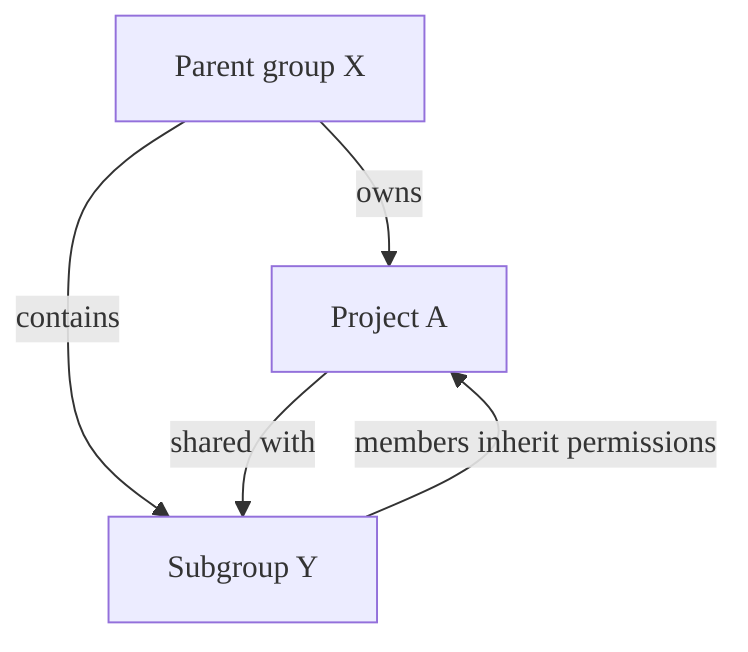
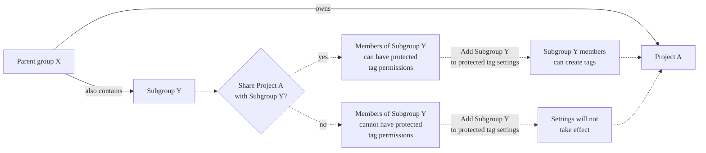

DETAILS:
**Tier:** Free, Premium, Ultimate
**Offering:** GitLab.com, GitLab Self-Managed, GitLab Dedicated

Protected [tags](repository/tags/_index.md):

- Allow control over who has permission to create tags.
- Prevent accidental update or deletion once created.

Each rule allows you to match either:

- An individual tag name.
- Wildcards to control multiple tags at once.

This feature evolved out of [protected branches](repository/branches/protected.md).

NOTE:
To create or delete a protected tag, you must be in the **Allowed to create or delete** list for that protected tag.

## Configuring protected tags

Prerequisites:

- You must have at least the Maintainer role for the project.

1. On the left sidebar, select **Search or go to** and find your project.
1. Select **Settings > Repository**.
1. Expand **Protected tags**.
1. Select **Add new**.
1. To protect a single tag, select **Tag**, then choose your tag from the dropdown list.
1. To protect all tags with names matching a string:
   1. Select **Tag**.
   1. Enter the string to use for tag matching. Wildcards (`*`) are supported.
   1. Select **Create wildcard**.
1. In **Allowed to create** , select roles that may create protected tags.

   NOTE:
   In GitLab Premium and Ultimate, you can also add groups or individual users
   to **Allowed to create**.

1. Select **Protect**.

The protected tag (or wildcard) displays in the **Protected tags** list.

### Add a group to protected tags

To set the members of a group or subgroup as Allowed to create protected tags:

1. On the left sidebar, select **Search or go** to and find your project.
1. Select **Settings > Repository**.
1. Expand **Protected tags**.
1. Add groups to the following field:

   ```plaintext
   # Allow group members to create protected tags
   Allowed to create: @group-x
   ```

#### Group inheritance and eligibility



In this example:

- **Parent group X** (`group-x`) owns **Project A**.
- **Parent group X** also contains a subgroup, **Subgroup Y**. (`group-x/subgroup-y`)
- **Project A** is shared with **Subgroup Y**.

The eligible groups for protected tag permissions are:

- **Project A**: Both **Group X** and **Subgroup Y**, because **Project A** is shared with **Subgroup Y**.

#### Share projects with groups for protected tag permissions

You can share the project with a group or subgroup so that their members are
eligible for protected tag permissions.



To grant access to **Subgroup Y** members for **Project A**, you must share the project with the subgroup.
Adding the subgroup directly to the protected tag settings is not effective and isn't applicable to subgroup members.

NOTE:
For a group to have protected tag permissions, the project must be directly shared with the group.
Inherited project membership from parent groups is not sufficient for protected tag permissions.

## Wildcard protected tags

You can specify a wildcard protected tag, which protects all tags
matching the wildcard. For example:

| Wildcard Protected Tag | Matching Tags                 |
|------------------------|-------------------------------|
| `v*`                   | `v1.0.0`, `version-9.1`       |
| `*-deploy`             | `march-deploy`, `1.0-deploy`  |
| `*gitlab*`             | `gitlab`, `gitlab/v1`         |
| `*`                    | `v1.0.1rc2`, `accidental-tag` |

Two different wildcards can potentially match the same tag. For example,
`*-stable` and `production-*` would both match a `production-stable` tag.
In that case, if _any_ of these protected tags have a setting like
**Allowed to create**, then `production-stable` also inherit this setting.

If you select a protected tag's name, GitLab displays a list of
all matching tags:


## Prevent tag creation with the same name as branches

A tag and a branch with identical names can contain different commits. If your
tags and branches use the same names, users running `git checkout`
commands might check out the _tag_ `qa` when they instead meant to check out
the _branch_ `qa`. As an added security measure, avoid creating tags with the
same name as branches. Confusing the two could lead to potential
security or operational issues.

To prevent this problem:

1. Identify the branch names you do not want used as tags.
1. As described in [Configuring protected tags](#configuring-protected-tags),
   create a protected tag:

   - For the **Name**, provide a name, such as `stable`. You can also create a wildcard
     like `stable-*` to match multiple names, like `stable-v1` and `stable-v2`.
   - For **Allowed to Create**, select **No one**.
   - Select **Protect**.

Users can still create branches, but not tags, with the protected names.

## Allow deploy keys to create protected tags

> - [Introduced](https://gitlab.com/gitlab-org/gitlab/-/issues/325415) in GitLab 15.11.

You can permit a [deploy key](deploy_keys/_index.md) to create protected tags.

Prerequisites:

- The deploy key must be enabled for your project. A project deploy key is enabled by default when
  it is created. However, a public deploy key must be
  [granted](deploy_keys/_index.md#grant-project-access-to-a-public-deploy-key) access to the
  project.
- The deploy key must have [write access](deploy_keys/_index.md#permissions) to your project
  repository.
- The owner of the deploy key must have at least read access to the project.
- The owner of the deploy key must also be a member of the project.

To allow a deploy key to create a protected tag:

1. On the left sidebar, select **Search or go to** and find your project.
1. Select **Settings > Repository**.
1. Expand **Protected tags**.
1. From the **Tag** dropdown list, select the tag you want to protect.
1. From the **Allowed to create** list, select the deploy key.
1. Select **Protect**.

## Run pipelines on protected tags

The permissions to create protected tags define if a user can:

- Initiate and run CI/CD pipelines.
- Execute actions on jobs associated with these tags.

These permissions ensure that only authorized users can trigger and manage
CI/CD processes for protected tags.

## Delete a protected tag

You can manually delete protected tags with the GitLab API, or the
GitLab user interface.

Prerequisites:

- You must be in the **Allowed to create or delete** list.

To do this:

1. On the left sidebar, select **Search or go to** and find your project.
1. Select **Code > Tags**.
1. Next to the tag you want to delete, select **Delete** (**{remove}**).
1. On the confirmation dialog, enter the tag name and select **Yes, delete protected tag**.

Protected tags can only be deleted by using GitLab either from the UI or API.
These protections prevent you from accidentally deleting a tag through local
Git commands or third-party Git clients.

## Related topics

- [Protected Tags API](../../api/protected_tags.md)
- [Tags API](../../api/tags.md)

<!-- ## Troubleshooting

Include any troubleshooting steps that you can foresee. If you know beforehand what issues
one might have when setting this up, or when something is changed, or on upgrading, it's
important to describe those, too. Think of things that may go wrong and include them here.
This is important to minimize requests for support, and to avoid doc comments with
questions that you know someone might ask.

Each scenario can be a third-level heading, for example `### Getting error message X`.
If you have none to add when creating a doc, leave this section in place
but commented out to help encourage others to add to it in the future. -->
