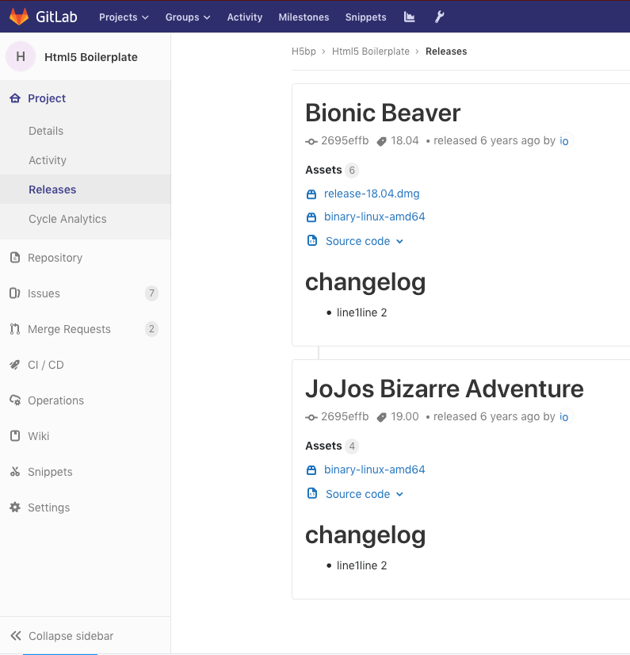

# Releases

> [Introduced](https://gitlab.com/gitlab-org/gitlab-ce/issues/41766) in GitLab 11.7.

Releases mark specific points in a project's development history, communicate
information about the type of change, and deliver on prepared, often compiled,
versions of the software to be reused elsewhere. Currently, releases can only be
created through the API.

Navigate to **Project > Releases** in order to see the list of releases of a project.

