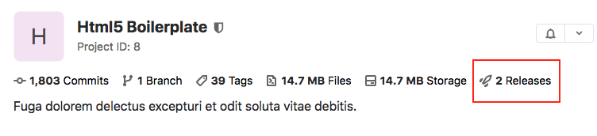
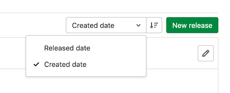
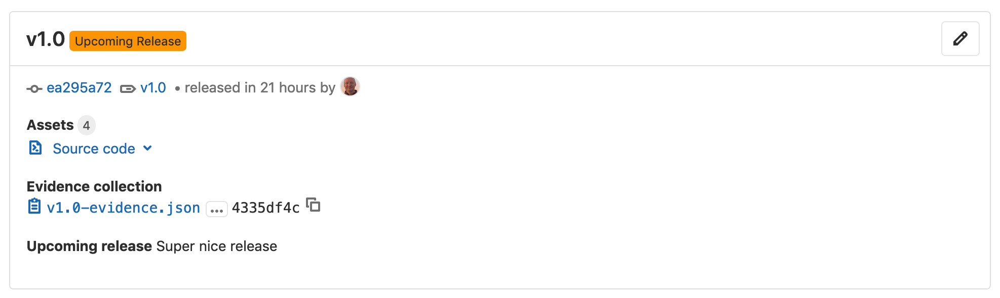
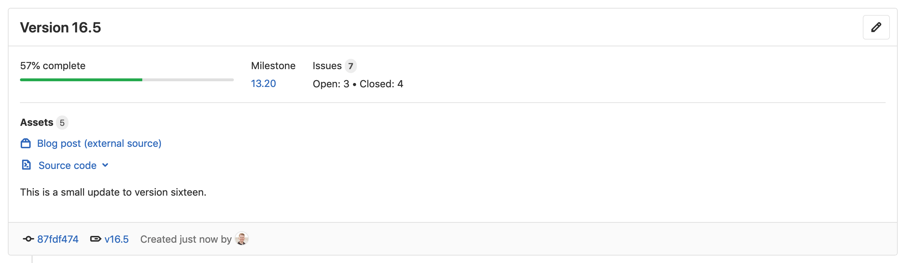

DETAILS:
**Tier:** Free, Premium, Ultimate
**Offering:** GitLab.com, GitLab Self-Managed, GitLab Dedicated

In GitLab, a release enables you to create a snapshot of your project for your users, including
installation packages and release notes. You can create a GitLab release on any branch. Creating a
release also creates a [Git tag](https://git-scm.com/book/en/v2/Git-Basics-Tagging) to mark the
release point in the source code.

WARNING:
Deleting a Git tag associated with a release also deletes the release.

A release can include:

- A snapshot of the source code of your repository.
- [Generic packages](../../packages/generic_packages/_index.md) created from job artifacts.
- Other metadata associated with a released version of your code.
- Release notes.

When you [create a release](#create-a-release):

- GitLab automatically archives source code and associates it with the release.
- GitLab automatically creates a JSON file that lists everything in the release,
  so you can compare and audit releases. This file is called [release evidence](release_evidence.md).

When you create a release, or after, you can:

- Add release notes.
- Add a message for the Git tag associated with the release.
- [Associate milestones with it](#associate-milestones-with-a-release).
- Attach [release assets](release_fields.md#release-assets), like runbooks or packages.

## View releases

To view a list of releases:

- On the left sidebar, select **Deploy > Releases**, or

- On the project's overview page, if at least one release exists, select the number of releases.

  

  - On public projects, this number is visible to all users.
  - On private projects, this number is visible to users with at least the Reporter
    [role](../../permissions.md#project-members-permissions).

### Sort releases

To sort releases by **Released date** or **Created date**, select from the sort order dropdown list. To
switch between ascending or descending order, select **Sort order**.



### Permanent link to latest release

You can access the latest release page through a permanent link.
GitLab always redirects the permanent link URL to the address of the latest release page.

The format of the URL is:

```plaintext
https://gitlab.example.com/namespace/project/-/releases/permalink/latest
```

You can also add a suffix to the permanent link URL. For example, if the latest release is `v17.7.0#release` in the `gitlab-org` namespace and `gitlab-runner` project, the readable link would be:

```plaintext
https://gitlab.com/gitlab-org/gitlab-runner/-/releases/v17.7.0#release
```

You can access the latest release URL with the following permanent link:

```plaintext
https://gitlab.com/gitlab-org/gitlab-runner/-/releases/permalink/latest#release
```

To learn about adding permanent links to release assets, see [Permanent links to latest release assets](../releases/release_fields.md#permanent-links-to-latest-release-assets).

#### Sorting preferences

By default, GitLab fetches the release using `released_at` time. The use of the query parameter `?order_by=released_at` is optional, and support for `?order_by=semver` is tracked [in this issue](https://gitlab.com/gitlab-org/gitlab/-/issues/352945).

### Track releases with an RSS feed

GitLab provides an RSS feed of a project's releases, in Atom format. To view the feed:

1. For projects you are a member of:
   1. On the left sidebar, select **Search or go to** and find your project.
   1. Select **Deploy > Releases**.
1. For all projects:
   1. Go to the **Project overview** page.
   1. On the right sidebar, select **Releases** (**{rocket-launch}**).
1. In the upper-right corner, select the feed symbol (**{rss}**).

## Create a release

You can create a release:

- [Using a job in your CI/CD pipeline](#creating-a-release-by-using-a-cicd-job).
- [In the Releases page](#create-a-release-in-the-releases-page).
- Using the [Releases API](../../../api/releases/_index.md#create-a-release).

### Create a release in the Releases page

Prerequisites:

- You must have at least the Developer role for a project. For more information, read
  [Release permissions](#release-permissions).

To create a release in the Releases page:

1. On the left sidebar, select **Search or go to** and find your project.
1. Select **Deploy > Releases** and select **New release**.
1. From the [**Tag name**](release_fields.md#tag-name) dropdown list, either:
   - Select an existing Git tag. Selecting an existing tag that is already associated with a release
     results in a validation error.
   - Enter a new Git tag name.
     1. From the **Create tag** popover, select a branch or commit SHA to use when
        creating the new tag.
     1. Optional. In the **Set tag message** text box, enter a message to create an
        [annotated tag](https://git-scm.com/book/en/v2/Git-Basics-Tagging#_annotated_tags).
     1. Select **Save**.
1. Optional. Enter additional information about the release, including:
   - [Title](release_fields.md#title).
   - [Milestones](#associate-milestones-with-a-release).
   - [Release notes](release_fields.md#release-notes-description).
   - Whether or not to include the [Tag message](../repository/tags/_index.md).
   - [Asset links](release_fields.md#links).
1. Select **Create release**.

### Creating a release by using a CI/CD job

You can create a release directly as part of the GitLab CI/CD pipeline by using the
[`release` keyword](../../../ci/yaml/_index.md#release) in the job definition.
You should likely create a release as one of the last steps in your CI/CD pipeline.

The release is created only if the job processes without error. If the API returns an error during
release creation, the release job fails.

The following links show typical example configurations for creating a release using a CI/CD job:

- [Create a release when a Git tag is created](release_cicd_examples.md#create-a-release-when-a-git-tag-is-created).
- [Create a release when a commit is merged to the default branch](release_cicd_examples.md#create-a-release-when-a-commit-is-merged-to-the-default-branch).
- [Create release metadata in a custom script](release_cicd_examples.md#create-release-metadata-in-a-custom-script).

### Use a custom SSL CA certificate authority

You can use the `ADDITIONAL_CA_CERT_BUNDLE` CI/CD variable to configure a custom SSL CA certificate authority,
which is used to verify the peer when the `release-cli` creates a release through the API using HTTPS with custom certificates.
The `ADDITIONAL_CA_CERT_BUNDLE` value should contain the
[text representation of the X.509 PEM public-key certificate](https://www.rfc-editor.org/rfc/rfc7468#section-5.1)
or the `path/to/file` containing the certificate authority.
For example, to configure this value in the `.gitlab-ci.yml` file, use the following:

```yaml
release:
  variables:
    ADDITIONAL_CA_CERT_BUNDLE: |
        -----BEGIN CERTIFICATE-----
        MIIGqTCCBJGgAwIBAgIQI7AVxxVwg2kch4d56XNdDjANBgkqhkiG9w0BAQsFADCB
        ...
        jWgmPqF3vUbZE0EyScetPJquRFRKIesyJuBFMAs=
        -----END CERTIFICATE-----
  script:
    - echo "Create release"
  release:
    name: 'My awesome release'
    tag_name: '$CI_COMMIT_TAG'
```

The `ADDITIONAL_CA_CERT_BUNDLE` value can also be configured as a
[custom variable in the UI](../../../ci/variables/_index.md#for-a-project),
either as a `file`, which requires the path to the certificate, or as a variable,
which requires the text representation of the certificate.

### Create multiple releases in a single pipeline

A pipeline can have multiple `release` jobs, for example:

```yaml
ios-release:
  script:
    - echo "iOS release job"
  release:
    tag_name: v1.0.0-ios
    description: 'iOS release v1.0.0'

android-release:
  script:
    - echo "Android release job"
  release:
    tag_name: v1.0.0-android
    description: 'Android release v1.0.0'
```

### Release assets as Generic packages

You can use [Generic packages](../../packages/generic_packages/_index.md) to host your release assets.
For a complete example, see the [Release assets as Generic packages](https://gitlab.com/gitlab-org/release-cli/-/tree/master/docs/examples/release-assets-as-generic-package/)
project.

## Upcoming releases

You can create a release ahead of time by using the [Releases API](../../../api/releases/_index.md#upcoming-releases).
When you set a future `released_at` date, an **Upcoming Release** badge is displayed next to the
release tag. When the `released_at` date and time has passed, the badge is automatically removed.



## Historical releases

> - [Introduced](https://gitlab.com/gitlab-org/gitlab/-/issues/199429) in GitLab 15.2.

You can create a release in the past using either the
[Releases API](../../../api/releases/_index.md#historical-releases) or the UI. When you set
a past `released_at` date, an **Historical release** badge is displayed next to
the release tag. Due to being released in the past, [release evidence](release_evidence.md)
is not available.

## Edit a release

To edit the details of a release after it's created, you can use the
[Update a release API](../../../api/releases/_index.md#update-a-release) or the UI.

Prerequisites:

- You must have at least the Developer role.

In the UI:

1. On the left sidebar, select **Deploy > Releases**.
1. In the upper-right corner of the release you want to modify, select **Edit this release** (the pencil icon).
1. On the **Edit Release** page, change the release's details.
1. Select **Save changes**.

## Delete a release

> - [Introduced](https://gitlab.com/gitlab-org/gitlab/-/issues/213862) in GitLab 15.2

When you delete a release, its assets are also deleted. However, the associated
Git tag is not deleted.
Deleting a Git tag associated with a release also deletes the release.

Prerequisites:

- You must have at least the Developer role. Read more about [Release permissions](#release-permissions).

To delete a release, use either the
[Delete a release API](../../../api/releases/_index.md#delete-a-release) or the UI.

In the UI:

1. On the left sidebar, select **Search or go to** and find your project.
1. Select **Deploy > Releases**.
1. In the upper-right corner of the release you want to delete, select **Edit this release**
   (**{pencil}**).
1. On the **Edit Release** page, select **Delete**.
1. Select **Delete release**.

## Associate milestones with a release

You can associate a release with one or more [project milestones](../milestones/_index.md#project-milestones-and-group-milestones).

[GitLab Premium](https://about.gitlab.com/pricing/) customers can specify [group milestones](../milestones/_index.md#project-milestones-and-group-milestones) to associate with a release.

You can do this in the user interface, or by including a `milestones` array in your request to
the [Releases API](../../../api/releases/_index.md#create-a-release).

In the user interface, to associate milestones to a release:

1. On the left sidebar, select **Deploy > Releases**.
1. In the upper-right corner of the release you want to modify, select **Edit this release** (the pencil icon).
1. From the **Milestones** list, select each milestone you want to associate. You can select multiple milestones.
1. Select **Save changes**.

On the **Deploy > Releases** page, the **Milestone** is listed in the top
section, along with statistics about the issues in the milestones.



Releases are also visible on the **Plan > Milestones** page, and when you select a milestone
on this page.

Here is an example of milestones with no releases, one release, and two releases.


NOTE:
A subgroup's project releases cannot be associated with a parent group's milestone. To learn
more, read issue #328054,
[Releases cannot be associated with a supergroup milestone](https://gitlab.com/gitlab-org/gitlab/-/issues/328054).

## Get notified when a release is created

You can be notified by email when a new release is created for your project.

To subscribe to notifications for releases:

1. On the left sidebar, select **Project overview**.
1. Select **Notification setting** (the bell icon).
1. In the list, select **Custom**.
1. Select the **New release** checkbox.
1. Close the dialog box to save.

## Prevent unintentional releases by setting a deploy freeze

Prevent unintended production releases during a period of time you specify by
setting a [*deploy freeze* period](../../../ci/environments/deployment_safety.md).
Deploy freezes help reduce uncertainty and risk when automating deployments.

A maintainer can set a deploy freeze window in the user interface or by using the [Freeze Periods API](../../../api/freeze_periods.md) to set a `freeze_start` and a `freeze_end`, which
are defined as [crontab](https://crontab.guru/) entries.

If the job that's executing is in a freeze period, GitLab CI/CD creates an environment
variable named `$CI_DEPLOY_FREEZE`.

To prevent the deployment job from executing in multiple projects in a group,
define the `.freezedeployment` job in a file shared across the group.
Use the [`includes`](../../../ci/yaml/includes.md) keyword to incorporate the
template in your project's `.gitlab-ci.yml` file:

```yaml
.freezedeployment:
  stage: deploy
  before_script:
    - '[[ ! -z "$CI_DEPLOY_FREEZE" ]] && echo "INFRASTRUCTURE OUTAGE WINDOW" && exit 1; '
  rules:
    - if: '$CI_DEPLOY_FREEZE'
      when: manual
      allow_failure: true
    - when: on_success
```

To prevent the deployment job from executing, use the [`extends`](../../../ci/yaml/_index.md#extends) keyword in the `deploy_to_production` job of your `.gitlab-ci.yml` file to inherit the configuration from the `.freezedeployment` template job:

```yaml
deploy_to_production:
  extends: .freezedeployment
  script: deploy_to_prod.sh
  environment: production
```

This configuration blocks deployment jobs conditionally and maintains pipeline continuity. When a freeze period is defined, the job fails and the pipeline can proceed without deployment. Manual deployment is possible after the freeze period.

This approach offers deployment control during critical maintenance, and ensures the uninterrupted flow of the CI/CD pipeline.

To set a deploy freeze window in the UI, complete these steps:

1. Sign in to GitLab as a user with the Maintainer role.
1. On the left sidebar, select **Search or go to** and find your project.
1. Select **Settings > CI/CD**.
1. Scroll to **Deploy freezes**.
1. Select **Expand** to see the deploy freeze table.
1. Select **Add deploy freeze** to open the deploy freeze modal.
1. Enter the start time, end time, and time zone of the desired deploy freeze period.
1. Select **Add deploy freeze** in the modal.
1. After the deploy freeze is saved, you can edit it by selecting the edit button (**{pencil}**) and remove it by selecting the delete button (**{remove}**).
   

If a project contains multiple freeze periods, all periods apply. If they overlap, the freeze covers the
complete overlapping period.

For more information, see [Deployment safety](../../../ci/environments/deployment_safety.md).

## Release permissions

### View a release and download assets

- Users with at least the Reporter role
  have read and download access to the project releases.
- Users with the Guest role
  have read and download access to the project releases.
  This includes associated Git-tag-names, release description, author information of the releases.
  However, other repository-related information, such as [source code](release_fields.md#source-code) and
  [release evidence](release_evidence.md) are redacted.

### Publish releases without giving access to source code

> - [Introduced](https://gitlab.com/gitlab-org/gitlab/-/issues/216485) in GitLab 15.6.

You can make releases accessible to non-project members while keeping repository-related information, such as [source code](release_fields.md#source-code) and [release evidence](release_evidence.md), available only to project members. These settings are ideal for
projects that use releases to give access to new versions of software, but do not want the source code to be publicly available.

To make releases available publicly, set the following [project settings](../settings/_index.md#configure-project-features-and-permissions):

- **Project visibility** is set to **Public**
- **Repository** is enabled and set to **Only Project Members**
- **Releases** is enabled and set to **Everyone With Access**

### Create, update, and delete a release and its assets

- Users with at least the Developer role
  have write access to the project releases and assets.
- If a release is associated with a [protected tag](../protected_tags.md),
  the user must be [allowed to create the protected tag](../protected_tags.md#configuring-protected-tags) too.

As an example of release permission control, you can allow only
users with at least the Maintainer role
to create, update, and delete releases by protecting the tag with a wildcard (`*`),
and set **Maintainer** in the **Allowed to create** column.

## Release Metrics

DETAILS:
**Tier:** Ultimate
**Offering:** GitLab.com, GitLab Self-Managed, GitLab Dedicated

> - [Introduced](https://gitlab.com/gitlab-org/gitlab/-/issues/259703) in GitLab Premium 13.9.

Group-level release metrics are available by navigating to **Group > Analytics > CI/CD**.
These metrics include:

- Total number of releases in the group
- Percentage of projects in the group that have at least one release

## Working example project

The Guided Exploration project [Utterly Automated Software and Artifact Versioning with GitVersion](https://gitlab.com/guided-explorations/devops-patterns/utterly-automated-versioning) demonstrates:

- Using GitLab releases.
- Using the GitLab `release-cli`.
- Creating a generic package.
- Linking the package to the release.
- Using a tool called [GitVersion](https://gitversion.net/) to automatically determine and increment versions for complex repositories.

You can copy the example project to your own group or instance for testing. More details on what other GitLab CI patterns are demonstrated are available at the project page.

## Troubleshooting

### Errors when creating, updating or deleting releases and their assets

If the release is associated with a [protected tag](../protected_tags.md),
the UI/API request might result in an authorization failures, such as:

- `403 Forbidden`
- `Something went wrong while creating a new release`

Make sure that the user or a service/bot account is allowed to
[create the protected tag](../protected_tags.md#configuring-protected-tags) too.

See [the release permissions](#release-permissions) for more information.

### Note about storage

This feature is built on top of Git tags, so virtually no extra data is needed besides to create the release itself. Additional assets and the release evidence that is automatically generated consume storage.

### GitLab CLI version requirement

The way of using the [`release` keyword](../../../ci/yaml/_index.md#release) is planned to change.
The `release-cli` tool is [being replaced](https://gitlab.com/groups/gitlab-org/-/epics/15437) by the [GitLab CLI tool](https://gitlab.com/gitlab-org/cli/).

You must use GitLab CLI tool `v1.52.0` or higher, or you could receive one of these error messages:

- `Error: glab command not found. Please install glab v1.52.0 or higher.`
- `Error: Please use glab v1.52.0 or higher.`

There are two ways to have the GitLab CLI tool:

- If you use the `registry.gitlab.com/gitlab-org/release-cli:<version>` container image,
  you can start using either `registry.gitlab.com/gitlab-org/cli:v1.52.0` or
  `registry.gitlab.com/gitlab-org/release-cli:v0.21.0`, which contains `glab` `v1.52.0`.
- If you manually installed the release-cli or GitLab CLI tool on your runners,
  make sure the GitLab CLI version is at least `v1.52.0`.
