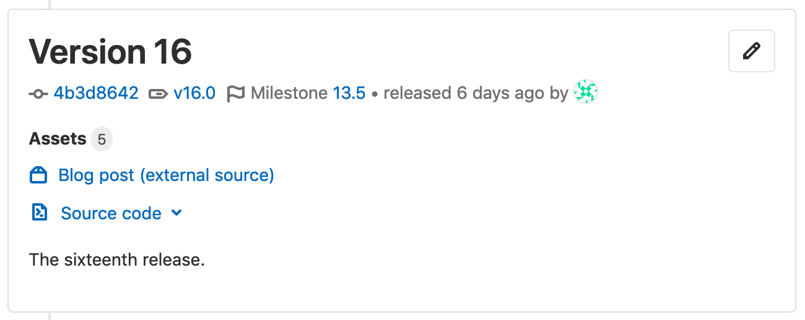
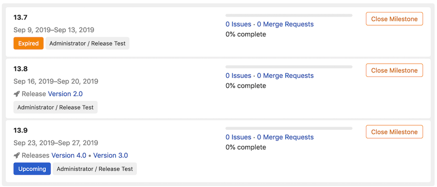
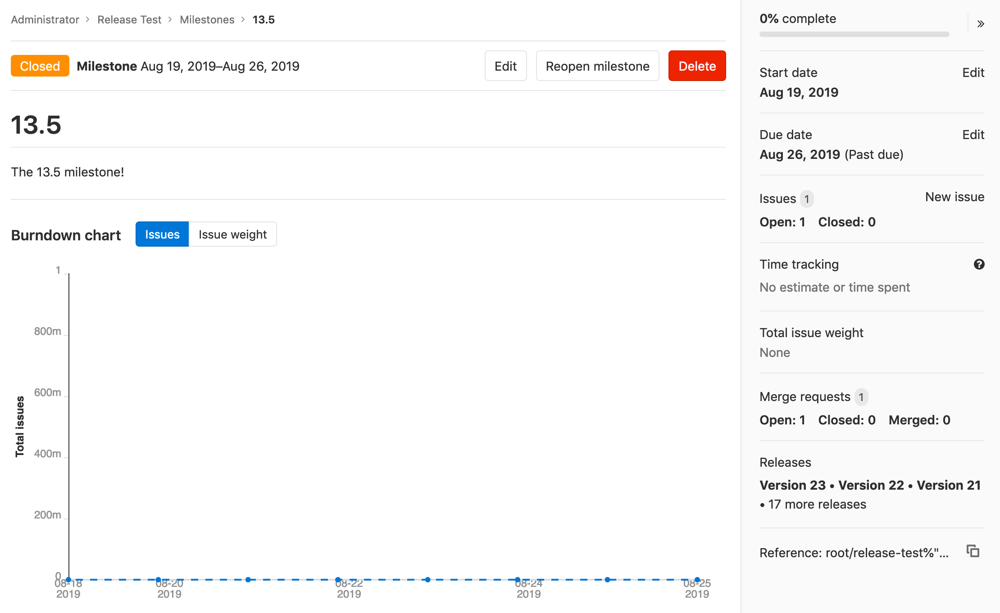
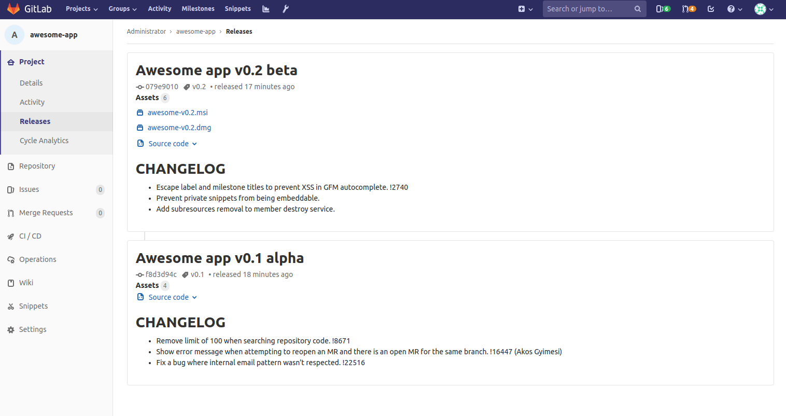
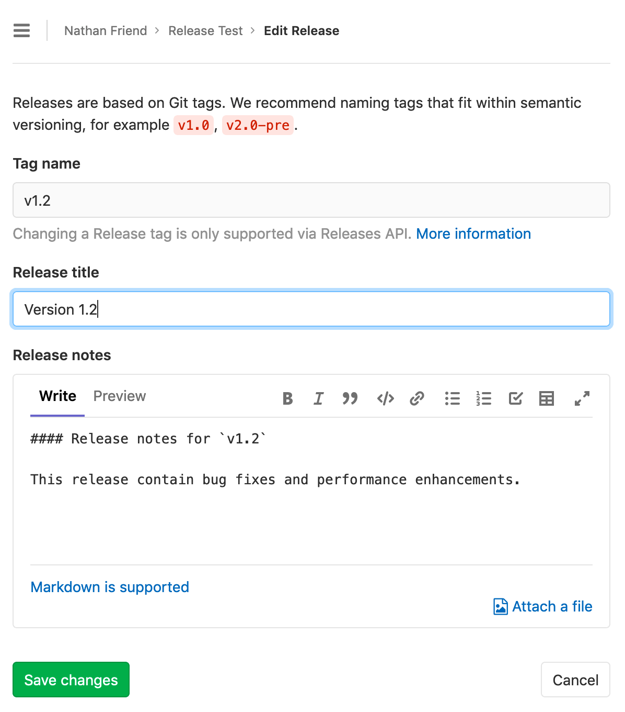
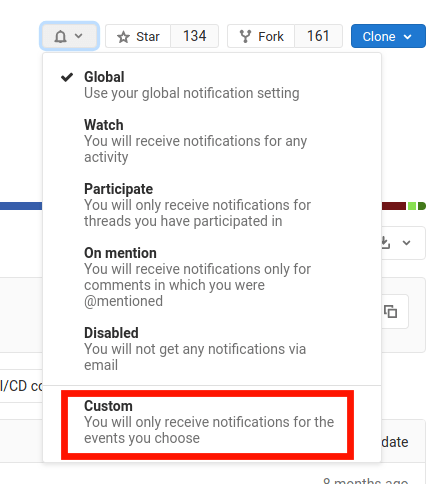
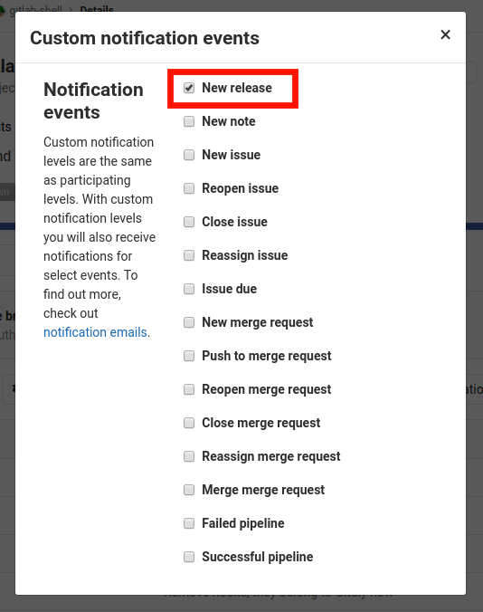
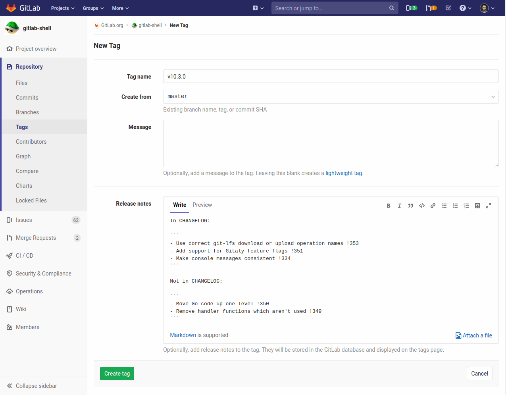
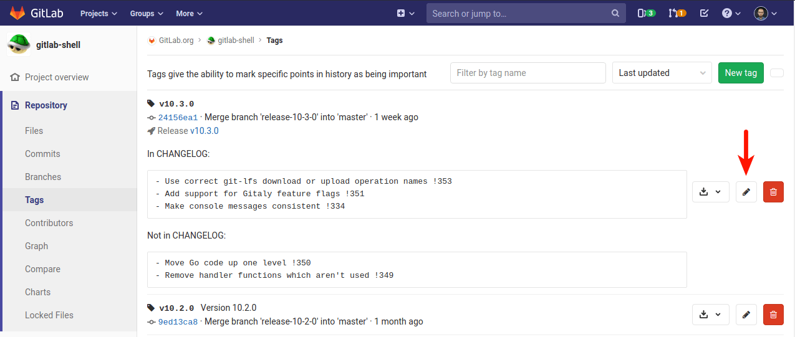

# Releases

> [Introduced](https://gitlab.com/gitlab-org/gitlab-foss/issues/41766) in GitLab 11.7.

It is typical to create a [Git tag](../../../university/training/topics/tags.md) at
the moment of release to introduce a checkpoint in your source code
history, but in most cases your users will need compiled objects or other
assets output by your CI system to use them, not just the raw source
code.

GitLab's **Releases** are a way to track deliverables in your project. Consider them
a snapshot in time of the source, build output, and other metadata or artifacts
associated with a released version of your code.

At the moment, you can create Release entries via the [Releases API](../../../api/releases/index.md);
we recommend doing this as one of the last steps in your CI/CD release pipeline.

## Getting started with Releases

Start by giving a [description](#release-description) to the Release and
including its [assets](#release-assets), as follows.

### Release description

Every Release has a description. You can add any text you like, but we recommend
including a changelog to describe the content of your release. This will allow
your users to quickly scan the differences between each one you publish.

NOTE: **Note:**
[Git's tagging messages](https://git-scm.com/book/en/v2/Git-Basics-Tagging) and
Release descriptions are unrelated. Description supports [Markdown](../../markdown.md).

### Release assets

You can currently add the following types of assets to each Release:

- [Source code](#source-code): state of the repository at the time of the Release
- [Links](#links): to content such as built binaries or documentation

GitLab will support more asset types in the future, including objects such
as pre-built packages, compliance/security evidence, or container images.

#### Source code

GitLab automatically generate `zip`, `tar.gz`, `tar.bz2` and `tar`
archived source code from the given Git tag. These are read-only assets.

#### Links

A link is any URL which can point to whatever you like; documentation, built
binaries, or other related materials. These can be both internal or external
links from your GitLab instance.

NOTE: **NOTE**
You can manipulate links of each release entry with [Release Links API](../../../api/releases/links.md)

#### Releases associated with milestones

> [Introduced](https://gitlab.com/gitlab-org/gitlab/issues/29020) in GitLab 12.5.

Releases can optionally be associated with one or more
[project milestones](../milestones/index.md#project-milestones-and-group-milestones)
by including a `milestones` array in your requests to the
[Releases API](../../../api/releases/index.md#create-a-release).

Releases display this association with the **Milestone** indicator near
the top of the Release block on the **Project overview > Releases** page.



Below is an example of milestones with no Releases, one Release, and two
Releases, respectively.



This relationship is also visible in the **Releases** section of the sidebar
when viewing a specific milestone. Below is an example of a milestone
associated with a large number of Releases.



## Releases list

Navigate to **Project > Releases** in order to see the list of releases for a given
project.



## Editing a release

> [Introduced](https://gitlab.com/gitlab-org/gitlab/issues/26016) in GitLab 12.6.

To edit the details of a release, navigate to **Project overview > Releases** and click
the edit button (pencil icon) in the top-right corner of the release you want to modify.


This will bring you to the **Edit Release** page, from which you can
change some of the release's details.



Currently, it is only possible to edit the release title and notes.
To change other release information, such as its tag, associated
milestones, or release date, use the
[Releases API](../../../api/releases/index.md#update-a-release). Editing this
information through the **Edit Release** page is planned for a future version
of GitLab.

## Notification for Releases

> [Introduced](https://gitlab.com/gitlab-org/gitlab/issues/26001) in GitLab 12.4.

You can be notified by email when a new Release is created for your project.

To subscribe to Release notifications:

1. Navigate to your **Project**'s landing page.
1. Click the bell icon (**Notification setting**).
1. Select **Custom** from the dropdown menu.
   
1. Select **New release**.
   

## Add release notes to Git tags

You can add release notes to any Git tag using the notes feature. Release notes
behave like any other Markdown form in GitLab so you can write text and
drag and drop files to it. Release notes are stored in GitLab's database.

There are several ways to add release notes:

- In the interface, when you create a new Git tag.
- In the interface, by adding a note to an existing Git tag.
- Using the GitLab API.

To create a new tag, navigate to your project's **Repository > Tags** and
click **New tag**. From there, you can fill the form with all the information
about the release:



You can also edit an existing tag to add release notes:



## Release evidence

> [Introduced](https://gitlab.com/gitlab-org/gitlab/issues/26019) in GitLab 12.6.

Each time a new release is created, specific related data is collected in
parallel. This dataset will be a snapshot this new release (including linked
milestones and issues) at moment of creation. Such collection of data will
provide a chain of custody and facilitate processes like external audits, for example.

The gathered evidence data is stored in the database upon creation of a new
release as a JSON object. In GitLab 12.6, a link to
the evidence data is provided for [each Release](#releases-list).

Here is what this object can look like:

```json
{
  "release": {
    "id": 5,
    "tag": "v4.0",
    "name": "New release",
    "project_id": 45,
    "project_name": "Project name",
    "released_at": "2019-06-28 13:23:40 UTC",
    "milestones": [
      {
        "id": 11,
        "title": "v4.0-rc1",
        "state": "closed",
        "due_date": "2019-05-12 12:00:00 UTC",
        "created_at": "2019-04-17 15:45:12 UTC",
        "issues": [
          {
            "id": 82,
            "title": "The top-right popup is broken",
            "author_name": "John Doe",
            "author_email": "john@doe.com",
            "state": "closed",
            "due_date": "2019-05-10 12:00:00 UTC"
          },
          {
            "id": 89,
            "title": "The title of this page is misleading",
            "author_name": "Jane Smith",
            "author_email": "jane@smith.com",
            "state": "closed",
            "due_date": "nil"
          }
        ]
      },
      {
        "id": 12,
        "title": "v4.0-rc2",
        "state": "closed",
        "due_date": "2019-05-30 18:30:00 UTC",
        "created_at": "2019-04-17 15:45:12 UTC",
        "issues": []
      }
    ]
  }
}
```

<!-- ## Troubleshooting

Include any troubleshooting steps that you can foresee. If you know beforehand what issues
one might have when setting this up, or when something is changed, or on upgrading, it's
important to describe those, too. Think of things that may go wrong and include them here.
This is important to minimize requests for support, and to avoid doc comments with
questions that you know someone might ask.

Each scenario can be a third-level heading, e.g. `### Getting error message X`.
If you have none to add when creating a doc, leave this section in place
but commented out to help encourage others to add to it in the future. -->
