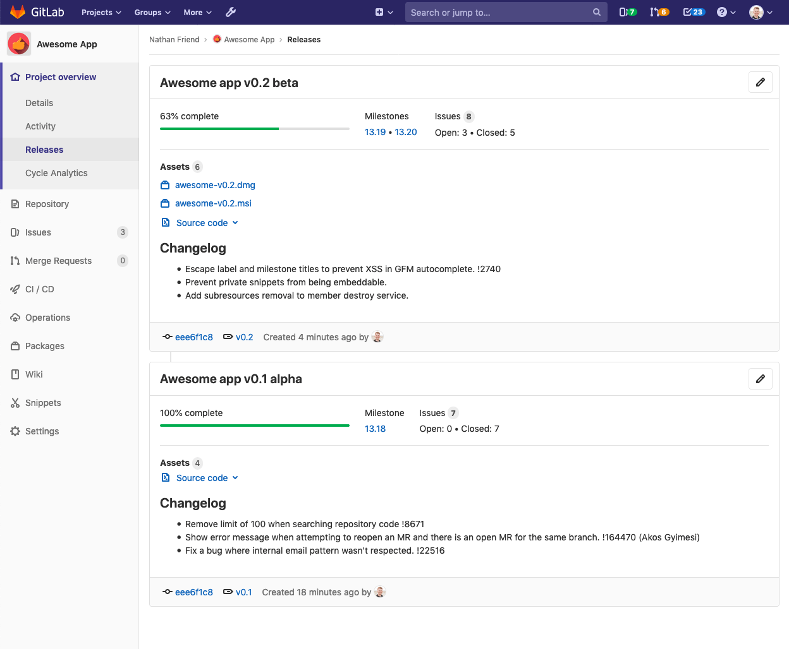
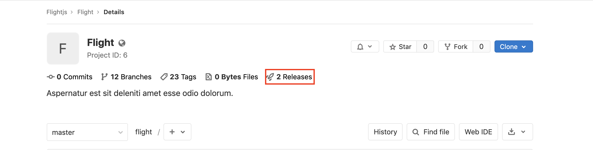
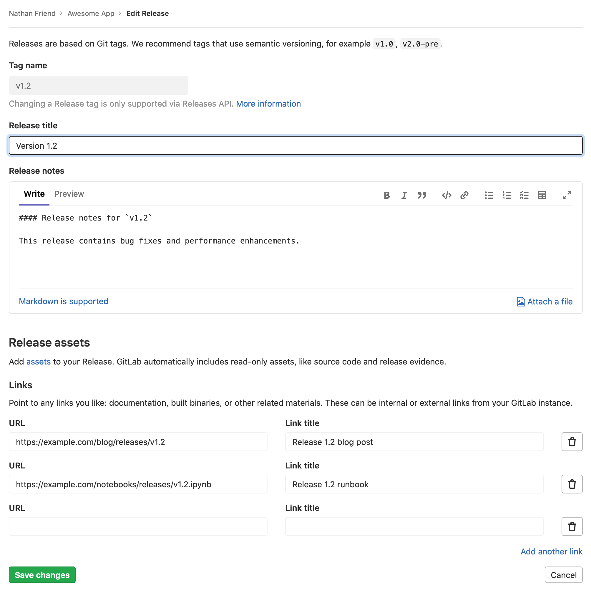

# Releases

> [Introduced](https://gitlab.com/gitlab-org/gitlab-foss/issues/41766) in GitLab 11.7.

It is typical to create a [Git tag](../../../university/training/topics/tags.md) at
the moment of release to introduce a checkpoint in your source code
history, but in most cases your users will need compiled objects or other
assets output by your CI system to use them, not just the raw source
code.

GitLab's **Releases** are a way to track deliverables in your project. Consider them
a snapshot in time of the source, build output, artifacts, and other metadata
associated with a released version of your code.

## Getting started with Releases

Start by giving a [description](#release-description) to the Release and
including its [assets](#release-assets), as follows.

## Release versioning

Release versions are manually assigned by the user in the Release title. GitLab uses [Semantic Versioning](https://semver.org/) for our releases, and we recommend you do too. Use `(Major).(Minor).(Patch)`, as detailed in the [GitLab Policy for Versioning](../../../policy/maintenance.md#versioning).

For example, for GitLab version `10.5.7`:

- `10` represents the major version. The major release was `10.0.0`, but often referred to as `10.0`.
- `5` represents the minor version. The minor release was `10.5.0`, but often referred to as `10.5`.
- `7` represents the patch number.

Any part of the version number can be multiple digits, for example, `13.10.11`.

### Release description

Every Release has a description. You can add any text you like, but we recommend
including a changelog to describe the content of your release. This will allow
your users to quickly scan the differences between each one you publish.

NOTE: **Note:**
[Git's tagging messages](https://git-scm.com/book/en/v2/Git-Basics-Tagging) and
Release descriptions are unrelated. Description supports [Markdown](../../markdown.md).

### Release assets

You can currently add the following types of assets to each Release:

- [Source code](#source-code): state of the repository at the time of the Release
- [Links](#links): to content such as built binaries or documentation

GitLab will support more asset types in the future, including objects such
as pre-built packages, compliance/security evidence, or container images.

#### Source code

GitLab automatically generate `zip`, `tar.gz`, `tar.bz2` and `tar`
archived source code from the given Git tag. These are read-only assets.

#### Links

A link is any URL which can point to whatever you like; documentation, built
binaries, or other related materials. These can be both internal or external
links from your GitLab instance.

#### Permanent links to Release assets

> [Introduced](https://gitlab.com/gitlab-org/gitlab/issues/27300) in GitLab 12.9.

The assets associated with a Release are accessible through a permanent URL.
GitLab will always redirect this URL to the actual asset
location, so even if the assets move to a different location, you can continue
to use the same URL. This is defined during [link creation](../../../api/releases/links.md#create-a-link) or [updating](../../../api/releases/links.md#update-a-link).

Each asset has a name, a URL of the *actual* asset location, and optionally, a
`filepath` parameter, which, if you specify it, will create a URL pointing
to the asset for the Release. The format of the URL is:

```html
https://host/namespace/project/releases/:release/downloads/:filepath
```

If you have an asset for the `v11.9.0-rc2` release in the `gitlab-org`
namespace and `gitlab-runner` project on `gitlab.com`, for example:

```json
{
  "name": "linux amd64",
  "filepath": "/binaries/gitlab-runner-linux-amd64",
  "url": "https://gitlab-runner-downloads.s3.amazonaws.com/v11.9.0-rc2/binaries/gitlab-runner-linux-amd64"
}
```

This asset has a direct link of:

```html
https://gitlab.com/gitlab-org/gitlab-runner/releases/v11.9.0-rc2/downloads/binaries/gitlab-runner-linux-amd64
```

The physical location of the asset can change at any time and the direct link will remain unchanged.

### Releases associated with milestones

> [Introduced](https://gitlab.com/gitlab-org/gitlab/issues/29020) in GitLab 12.5.

Releases can optionally be associated with one or more
[project milestones](../milestones/index.md#project-milestones-and-group-milestones)
by including a `milestones` array in your requests to the
[Releases API](../../../api/releases/index.md#create-a-release).

Releases display this association with the **Milestone** indicator in the top
section of the Release block on the **Project overview > Releases** page, along
with some statistics about the issues in the milestone(s).


Below is an example of milestones with no Releases, one Release, and two
Releases, respectively.


This relationship is also visible in the **Releases** section of the sidebar
when viewing a specific milestone. Below is an example of a milestone
associated with a large number of Releases.


## Releases list

Navigate to **Project > Releases** in order to see the list of releases for a given
project.



### Number of Releases

> [Introduced](https://gitlab.com/gitlab-org/gitlab/issues/36667) in GitLab 12.8.

The incremental number of Releases is displayed on the project's details page. When clicked,
it takes you to the list of Releases.



For private projects, the number of Releases is displayed to users with Reporter
[permissions](../../permissions.md#project-members-permissions) or higher. For public projects,
it is displayed to every user regardless of their permission level.

### Upcoming Releases

> [Introduced](https://gitlab.com/gitlab-org/gitlab-foss/issues/38105) in GitLab 12.1.

A Release may be created ahead of time by specifying a future `released_at` date. Until
the `released_at` date and time is reached, an **Upcoming Release** badge will appear next to the
Release tag. Once the `released_at` date and time has passed, the badge is automatically removed.


## Creating a Release

> [Introduced](https://gitlab.com/gitlab-org/gitlab/-/issues/32812) in GitLab 12.9, Releases can be created directly through the GitLab Releases UI.

NOTE: **Note:**
Only users with Developer permissions or higher can create Releases.
Read more about [Release permissions](../../../user/permissions.md#project-members-permissions).

To create a new Release through the GitLab UI:

1. Navigate to **Project overview > Releases** and click the **New release** button.
1. On the **New Tag** page, fill out the tag details.
1. Optionally, in the **Release notes** field, enter the Release's description.
   If you leave this field empty, only a tag will be created.
   If you populate it, both a tag and a Release will be created.
1. Click **Create tag**.

If you created a release, you can view it at **Project overview > Releases**.

You can also create a Release using the [Releases API](../../../api/releases/index.md#create-a-release):
we recommend doing this as one of the last steps in your CI/CD release pipeline.

## Editing a release

> [Introduced](https://gitlab.com/gitlab-org/gitlab/issues/26016) in GitLab 12.6. Asset link editing was [introduced](https://gitlab.com/gitlab-org/gitlab/-/issues/9427) in GitLab 12.10.

To edit the details of a release, navigate to **Project overview > Releases** and click
the edit button (pencil icon) in the top-right corner of the release you want to modify.


This will bring you to the **Edit Release** page, from which you can
change some of the release's details.



Currently, it is only possible to edit the release title, notes, and asset
links. To change other release information, such as its tag, associated
milestones, or release date, use the [Releases
API](../../../api/releases/index.md#update-a-release). Editing this information
through the **Edit Release** page is planned for a future version of GitLab.

## Notification for Releases

> [Introduced](https://gitlab.com/gitlab-org/gitlab/issues/26001) in GitLab 12.4.

You can be notified by email when a new Release is created for your project.

To subscribe to Release notifications:

1. Navigate to your **Project**'s landing page.
1. Click the bell icon (**Notification setting**).
1. Select **Custom** from the dropdown menu.
   
1. Select **New release**.
   

## Add release notes to Git tags

You can add release notes to any Git tag using the notes feature. Release notes
behave like any other Markdown form in GitLab so you can write text and
drag and drop files to it. Release notes are stored in GitLab's database.

There are several ways to add release notes:

- In the interface, when you create a new Git tag.
- In the interface, by adding a release note to an existing Git tag.
- Using the [Releases API](../../../api/releases/index.md): (we recommend doing this as one of the last
  steps in your CI/CD release pipeline).

To create a new tag, navigate to your project's **Repository > Tags** and
click **New tag**. From there, you can fill the form with all the information
about the release:


You can also edit an existing tag to add release notes:


## Release Evidence

> [Introduced](https://gitlab.com/gitlab-org/gitlab/issues/26019) in GitLab 12.6.

Each time a release is created, GitLab takes a snapshot of data that's related to it.
This data is called Release Evidence. It includes linked milestones and issues, and
it is taken at moment the release is created. It provides a chain of custody and can
facilitate processes like external audits, for example.

You can also [use the API](../../../api/releases/index.md#collect-release-evidence-premium-only) to
generate Release Evidence for an existing release. Because of this, [each release](#releases-list)
can have multiple Release Evidence snapshots. You can view the Release Evidence and
its details on the Release page.

Release Evidence is stored as a JSON object, so you can compare evidence by using
commonly-available tools.

Here is an example of a Release Evidence object:

```json
{
  "release": {
    "id": 5,
    "tag": "v4.0",
    "name": "New release",
    "project_id": 45,
    "project_name": "Project name",
    "released_at": "2019-06-28 13:23:40 UTC",
    "milestones": [
      {
        "id": 11,
        "title": "v4.0-rc1",
        "state": "closed",
        "due_date": "2019-05-12 12:00:00 UTC",
        "created_at": "2019-04-17 15:45:12 UTC",
        "issues": [
          {
            "id": 82,
            "title": "The top-right popup is broken",
            "author_name": "John Doe",
            "author_email": "john@doe.com",
            "state": "closed",
            "due_date": "2019-05-10 12:00:00 UTC"
          },
          {
            "id": 89,
            "title": "The title of this page is misleading",
            "author_name": "Jane Smith",
            "author_email": "jane@smith.com",
            "state": "closed",
            "due_date": "nil"
          }
        ]
      },
      {
        "id": 12,
        "title": "v4.0-rc2",
        "state": "closed",
        "due_date": "2019-05-30 18:30:00 UTC",
        "created_at": "2019-04-17 15:45:12 UTC",
        "issues": []
      }
    ]
  }
}
```

### Enabling Release Evidence display **(CORE ONLY)**

This feature comes with the `:release_evidence_collection` feature flag
enabled by default in GitLab self-managed instances. To turn it off,
ask a GitLab administrator with Rails console access to run the following
command:

```ruby
Feature.disable(:release_evidence_collection)
```

NOTE: **Note:**
Please note that Release Evidence's data is collected regardless of this
feature flag, which only enables or disables the display of the data on the
Releases page.

### Collect release evidence **(PREMIUM ONLY)**

> [Introduced](https://gitlab.com/gitlab-org/gitlab/-/issues/199065) in [GitLab Premium](https://about.gitlab.com/pricing/) 12.10.

Evidence collection can be initiated by using an [API call](../../../api/releases/index.md#collect-release-evidence-premium-only) at any time. Evidence snapshots are visible on
the Release page, along with the timestamp the Evidence was collected.

### Schedule release evidence collection

> [Introduced](https://gitlab.com/gitlab-org/gitlab/-/merge_requests/23697) in GitLab 12.8.

When the `released_at` date and time is not provided, the date and time of Release
creation is used. The Evidence collection background job is immediately executed.

If a future `released_at` is specified, the Release becomes an **Upcoming Release**. In this
case, the Evidence is scheduled to be collected at the `released_at` date and time, via a
background job.

If a past `released_at` is used, no Evidence is collected for the Release.

## GitLab Releaser

> [Introduced](https://gitlab.com/gitlab-org/gitlab-releaser/-/merge_requests/6) in GitLab 12.10.

GitLab Releaser is a CLI tool for managing GitLab Releases from the command line or from
GitLab CI/CD's configuration file, `.gitlab-ci.yml`.

With it, you can create, update, modify, and delete Releases right through the
terminal.

Read the [GitLab Releaser documentation](https://gitlab.com/gitlab-org/gitlab-releaser/-/tree/master/docs/index.md)
for details.

<!-- ## Troubleshooting

Include any troubleshooting steps that you can foresee. If you know beforehand what issues
one might have when setting this up, or when something is changed, or on upgrading, it's
important to describe those, too. Think of things that may go wrong and include them here.
This is important to minimize requests for support, and to avoid doc comments with
questions that you know someone might ask.

Each scenario can be a third-level heading, e.g. `### Getting error message X`.
If you have none to add when creating a doc, leave this section in place
but commented out to help encourage others to add to it in the future. -->
