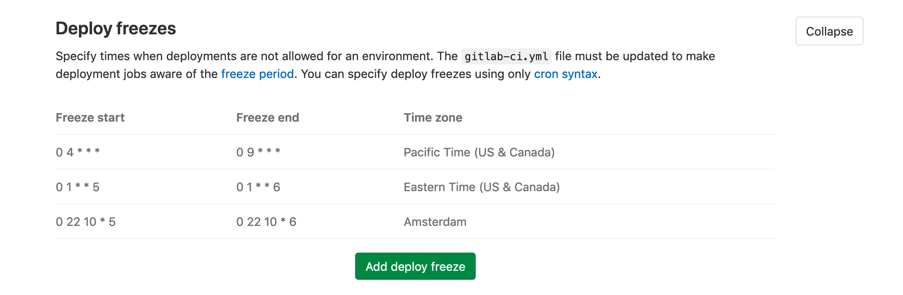

# Releases

> [Introduced](https://gitlab.com/gitlab-org/gitlab-foss/-/issues/41766) in GitLab 11.7.

To introduce a checkpoint in your source code history, you can assign a
[Git tag](https://git-scm.com/book/en/v2/Git-Basics-Tagging) at the moment of release.
However, in most cases, your users need more than just the raw source code.
They need compiled objects or other assets output by your CI/CD system.

A GitLab *Release* is a snapshot of the source, build output, artifacts, and other metadata
associated with a released version of your code.

You can create a GitLab release on any branch. When you create a release:

- GitLab automatically archives source code and associates it with the release.
- GitLab automatically creates a JSON file that lists everything in the release,
  so you can compare and audit releases. This file is called [release evidence](#release-evidence).
- You can add release notes and a message for the tag associated with the release.

After you create a release, you can [associate milestones with it](#associate-milestones-with-a-release),
and attach [release assets](#release-assets), like runbooks or packages.

## View releases

> [Introduced](https://gitlab.com/gitlab-org/gitlab/-/issues/36667) in GitLab 12.8.

To view a list of releases:

- Go to **Project overview > Releases**, or

- On the project's overview page, if at least one release exists, click the number of releases.

  

  - On public projects, this number is visible to all users.
  - On private projects, this number is visible to users with Reporter
    [permissions](../../permissions.md#project-members-permissions) or higher.

### Sort Releases

On the top right of the **Releases** page, you can use the sorting button to order releases by
**Released date** or **Created date**. You can sort releases in ascending or descending order.


## Create a release

> [Introduced](https://gitlab.com/gitlab-org/gitlab/-/issues/32812) in GitLab 12.9. Releases can be created directly in the GitLab UI.

You can create a release in the user interface, or by using the
[Releases API](../../../api/releases/index.md#create-a-release).
We recommend using the API to create releases as one of the last steps in your
CI/CD pipeline.

Only users with Developer permissions or higher can create releases.
Read more about [Release permissions](../../../user/permissions.md#project-members-permissions).

To create a new release through the GitLab UI:

1. Navigate to **Project overview > Releases** and click the **New release**
   button.
1. In the [**Tag name**](#tag-name) box, enter a name.

   Creating a release based on an existing tag using the user
   interface is not yet supported. However, this is possible using the
   [Releases API](../../../api/releases/index.md#create-a-release).

1. In the **Create from** list, select a branch, tag, or commit SHA to use when
   creating the new tag.
1. Optionally, fill out any additional information about the release, such as its
   [title](#title), [milestones](#associate-milestones-with-a-release),
   [release notes](#release-notes-description), or [assets links](#links).
1. Click **Create release**.

### Create release from GitLab CI 

> [Introduced](https://gitlab.com/gitlab-org/gitlab/-/merge_requests/19298) in GitLab 12.7.

You can [create a release directly from the GitLab CI pipeline](../../../ci/yaml/README.md#release)
by using a `release` node in the job definition.

The release is created only if the job processes without error. If the Rails API returns an error
during release creation, the release job fails.

### Schedule a future release

> [Introduced](https://gitlab.com/gitlab-org/gitlab-foss/-/issues/38105) in GitLab 12.1.

You can create a release ahead of time by using the [Releases API](../../../api/releases/index.md#upcoming-releases).
When you set a future `released_at` date, an **Upcoming Release** badge is displayed next to the
release tag. When the `released_at` date and time has passed, the badge is automatically removed.


## Edit a release

> [Introduced](https://gitlab.com/gitlab-org/gitlab/-/issues/26016) in GitLab 12.6. Asset link editing was [introduced](https://gitlab.com/gitlab-org/gitlab/-/issues/9427) in GitLab 12.10.

Only users with Developer permissions or higher can edit releases.
Read more about [Release permissions](../../../user/permissions.md#project-members-permissions).

To edit the details of a release:

1. Navigate to **Project overview > Releases**.
1. In the top-right corner of the release you want to modify, click **Edit this release** (the pencil icon).
1. On the **Edit Release** page, change the release's details.
1. Click **Save changes**.

You can edit the release title, notes, associated milestones, and asset links.
To change the release date use the
[Releases API](../../../api/releases/index.md#update-a-release).

## Add release notes to Git tags

If you have an existing Git tag, you can add release notes to it.

You can do this in the user interface, or by using the [Releases API](../../../api/releases/index.md).
We recommend using the API to add release notes as one of the last steps in your CI/CD release pipeline.

In the interface, to add release notes to a new Git tag:

1. Navigate to your project's **Repository > Tags**.
1. Click **New tag**.
1. In the **Release notes** field, enter the release's description.
   You can use Markdown and drag and drop files to this field.
1. Click **Create tag**.

In the interface, to add release notes to an existing Git tag:

1. Navigate to your project's **Repository > Tags**.
1. Click **Edit release notes** (the pencil icon).
1. In the **Release notes** field, enter the release's description.
   You can use Markdown in this field, and drag and drop files to it.
1. Click **Save changes**.

## Associate milestones with a release

> - [Introduced](https://gitlab.com/gitlab-org/gitlab/-/issues/29020) in GitLab 12.5.
> - [Updated](https://gitlab.com/gitlab-org/gitlab/-/issues/39467) to edit milestones in the UI in GitLab 13.0.

You can associate a release with one or more [project milestones](../milestones/index.md#project-milestones-and-group-milestones).

[GitLab Premium](https://about.gitlab.com/pricing/) customers can specify [group milestones](../milestones/index.md#project-milestones-and-group-milestones) to associate with a release.

You can do this in the user interface, or by including a `milestones` array in your request to
the [Releases API](../../../api/releases/index.md#create-a-release).

In the user interface, to associate milestones to a release:

1. Navigate to **Project overview > Releases**.
1. In the top-right corner of the release you want to modify, click **Edit this release** (the pencil icon).
1. From the **Milestones** list, select each milestone you want to associate. You can select multiple milestones.
1. Click **Save changes**.

On the **Project overview > Releases** page, the **Milestone** is listed in the top
section, along with statistics about the issues in the milestones.


Releases are also visible on the **Issues > Milestones** page, and when you click a milestone
on this page.

Here is an example of milestones with no releases, one release, and two releases, respectively.


## Get notified when a release is created

> [Introduced](https://gitlab.com/gitlab-org/gitlab/-/issues/26001) in GitLab 12.4.

You can be notified by email when a new release is created for your project.

To subscribe to notifications for releases:

1. Navigate to **Project overview**.
1. Click **Notification setting** (the bell icon).
1. In the list, click **Custom**.
1. Select the **New release** check box.
1. Close the dialog box to save.

## Prevent unintentional releases by setting a deploy freeze

> [Introduced](https://gitlab.com/gitlab-org/gitlab/-/merge_requests/29382) in GitLab 13.0.

Prevent unintended production releases during a period of time you specify by
setting a [*deploy freeze* period](../../../ci/environments/deployment_safety.md).
Deploy freezes help reduce uncertainty and risk when automating deployments.

A maintainer can set a deploy freeze window in the user interface or by using the [Freeze Periods API](../../../api/freeze_periods.md) to set a `freeze_start` and a `freeze_end`, which
are defined as [crontab](https://crontab.guru/) entries.

If the job that's executing is within a freeze period, GitLab CI/CD creates an environment
variable named `$CI_DEPLOY_FREEZE`.

To prevent the deployment job from executing, create a `rules` entry in your
`gitlab-ci.yaml`, for example:

```yaml
deploy_to_production:
  stage: deploy
  script: deploy_to_prod.sh
  rules:
    - if: $CI_DEPLOY_FREEZE == null
```

To set a deploy freeze window in the UI, complete these steps:

1. Sign in to GitLab as a user with project Maintainer [permissions](../../permissions.md).
1. Navigate to **Project overview**.
1. In the left navigation menu, navigate to **Settings > CI / CD**.
1. Scroll to **Deploy freezes**.
1. Click **Expand** to see the deploy freeze table.
1. Click **Add deploy freeze** to open the deploy freeze modal.
1. Enter the start time, end time, and timezone of the desired deploy freeze period.
1. Click **Add deploy freeze** in the modal.



CAUTION: **Caution:**
To edit or delete a deploy freeze, use the [Freeze Periods API](../../../api/freeze_periods.md).

If a project contains multiple freeze periods, all periods apply. If they overlap, the freeze covers the
complete overlapping period.

For more information, see [Deployment safety](../../../ci/environments/deployment_safety.md).

## Release fields

The following fields are available when you create or edit a release.

### Title

The release title can be customized using the **Release title** field when
creating or editing a release. If no title is provided, the release's tag name
is used instead.

Guest users of private projects are allowed to view the **Releases** page
but are _not_ allowed to view details about the Git repository (in particular,
tag names). Because of this, release titles are replaced with a generic
title like "Release-1234" for Guest users to avoid leaking tag name information.

See the [Permissions](../../permissions.md#project-members-permissions) page for
more information about permissions.

### Tag name

The release tag name should include the release version. GitLab uses [Semantic Versioning](https://semver.org/)
for our releases, and we recommend you do too. Use `(Major).(Minor).(Patch)`, as detailed in the
[GitLab Policy for Versioning](../../../policy/maintenance.md#versioning).

For example, for GitLab version `10.5.7`:

- `10` represents the major version. The major release was `10.0.0`, but often referred to as `10.0`.
- `5` represents the minor version. The minor release was `10.5.0`, but often referred to as `10.5`.
- `7` represents the patch number.

Any part of the version number can be multiple digits, for example, `13.10.11`.

### Release notes description

Every release has a description. You can add any text you like, but we recommend
including a changelog to describe the content of your release. This helps users
quickly scan the differences between each release you publish.

[Git's tagging messages](https://git-scm.com/book/en/v2/Git-Basics-Tagging) and
Release note descriptions are unrelated. Description supports [Markdown](../../markdown.md).

### Release assets

You can currently add the following types of assets to each release:

- [Source code](#source-code)
- [Links](#links)

GitLab will support more asset types in the future, including objects such
as pre-built packages, compliance/security evidence, or container images.

#### Permanent links to release assets

> [Introduced](https://gitlab.com/gitlab-org/gitlab/-/issues/27300) in GitLab 12.9.

The assets associated with a release are accessible through a permanent URL.
GitLab always redirects this URL to the actual asset
location, so even if the assets move to a different location, you can continue
to use the same URL. This is defined during [link creation](../../../api/releases/links.md#create-a-link) or [updating](../../../api/releases/links.md#update-a-link).

Each asset has a name, a URL of the *actual* asset location, and optionally, a
`filepath` parameter, which, if you specify it, creates a URL pointing
to the asset for the Release. The format of the URL is:

```plaintext
https://host/namespace/project/releases/:release/downloads/:filepath
```

If you have an asset for the `v11.9.0-rc2` release in the `gitlab-org`
namespace and `gitlab-runner` project on `gitlab.com`, for example:

```json
{
  "name": "linux amd64",
  "filepath": "/binaries/gitlab-runner-linux-amd64",
  "url": "https://gitlab-runner-downloads.s3.amazonaws.com/v11.9.0-rc2/binaries/gitlab-runner-linux-amd64"
}
```

This asset has a direct link of:

```plaintext
https://gitlab.com/gitlab-org/gitlab-runner/releases/v11.9.0-rc2/downloads/binaries/gitlab-runner-linux-amd64
```

The physical location of the asset can change at any time and the direct link remains unchanged.

### Source code

GitLab automatically generates `zip`, `tar.gz`, `tar.bz2` and `tar`
archived source code from the given Git tag. These are read-only assets.

### Links

A link is any URL which can point to whatever you like: documentation, built
binaries, or other related materials. These can be both internal or external
links from your GitLab instance.

The four types of links are "Runbook," "Package," "Image," and "Other."

## Release evidence

> [Introduced](https://gitlab.com/gitlab-org/gitlab/-/issues/26019) in GitLab 12.6.

Each time a release is created, GitLab takes a snapshot of data that's related to it.
This data is saved in a JSON file and called *release evidence*. The feature currently
includes test artifacts and linked milestones (and will include issues) to facilitate
internal processes, like external audits.

To access the release evidence, on the Releases page, click the link to the JSON file that's listed
under the **Evidence collection** heading.

You can also [use the API](../../../api/releases/index.md#collect-release-evidence) to
generate release evidence for an existing release. Because of this, each release
can have multiple release evidence snapshots. You can view the release evidence and
its details on the Releases page.

When the issue tracker is disabled, release evidence [can't be downloaded](https://gitlab.com/gitlab-org/gitlab/-/issues/208397).

Here is an example of a release evidence object:

```json
{
  "release": {
    "id": 5,
    "tag_name": "v4.0",
    "name": "New release",
    "project": {
      "id": 20,
      "name": "Project name",
      "created_at": "2019-04-14T11:12:13.940Z",
      "description": "Project description"
    },
    "created_at": "2019-06-28 13:23:40 UTC",
    "description": "Release description",
    "milestones": [
      {
        "id": 11,
        "title": "v4.0-rc1",
        "state": "closed",
        "due_date": "2019-05-12 12:00:00 UTC",
        "created_at": "2019-04-17 15:45:12 UTC",
        "issues": [
          {
            "id": 82,
            "title": "The top-right popup is broken",
            "author_name": "John Doe",
            "author_email": "john@doe.com",
            "state": "closed",
            "due_date": "2019-05-10 12:00:00 UTC"
          },
          {
            "id": 89,
            "title": "The title of this page is misleading",
            "author_name": "Jane Smith",
            "author_email": "jane@smith.com",
            "state": "closed",
            "due_date": "nil"
          }
        ]
      },
      {
        "id": 12,
        "title": "v4.0-rc2",
        "state": "closed",
        "due_date": "2019-05-30 18:30:00 UTC",
        "created_at": "2019-04-17 15:45:12 UTC",
        "issues": []
      }
    ],
    "report_artifacts": [
      {
        "url":"https://gitlab.example.com/root/project-name/-/jobs/111/artifacts/download"
      }
    ]
  }
}
```

### Collect release evidence **(PREMIUM ONLY)**

> [Introduced](https://gitlab.com/gitlab-org/gitlab/-/issues/199065) in [GitLab Premium](https://about.gitlab.com/pricing/) 12.10.

When a release is created, release evidence is automatically collected. To initiate evidence collection any other time, use an [API call](../../../api/releases/index.md#collect-release-evidence). You can collect release evidence multiple times for one release.

Evidence collection snapshots are visible on the Releases page, along with the timestamp the evidence was collected.

### Include report artifacts as release evidence **(ULTIMATE)**

> [Introduced](https://gitlab.com/gitlab-org/gitlab/-/issues/32773) in [GitLab Ultimate](https://about.gitlab.com/pricing/) 13.2.

When you create a release, if [job artifacts](../../../ci/pipelines/job_artifacts.md#artifactsreports) are included in the last pipeline that ran, they are automatically included in the release as release evidence.

Although job artifacts normally expire, artifacts included in release evidence do not expire.

To enable job artifact collection you need to specify both:

1. [`artifacts:paths`](../../../ci/yaml/README.md#artifactspaths)
1. [`artifacts:reports`](../../../ci/pipelines/job_artifacts.md#artifactsreports)

```yaml
ruby:
  script:
    - gem install bundler
    - bundle install
    - bundle exec rspec --format progress --format RspecJunitFormatter --out rspec.xml
  artifacts:
    paths:
      - rspec.xml
    reports:
      junit: rspec.xml
```

If the pipeline ran successfully, when you create your release, the `rspec.xml` file is saved as
release evidence.

If you [schedule release evidence collection](#schedule-release-evidence-collection),
some artifacts may already be expired by the time of evidence collection. To avoid this you can use
the [`artifacts:expire_in`](../../../ci/yaml/README.md#artifactsexpire_in)
keyword. Learn more in [this issue](https://gitlab.com/gitlab-org/gitlab/-/issues/222351).

### Schedule release evidence collection

> [Introduced](https://gitlab.com/gitlab-org/gitlab/-/merge_requests/23697) in GitLab 12.8.

In the API:

- If you specify a future `released_at` date, the release becomes an **Upcoming Release**
  and the evidence is collected on the date of the release. You cannot collect
  release evidence before then.
- If you use a past `released_at` date, no evidence is collected.
- If you do not specify a `released_at` date, release evidence is collected on the
  date the release is created.

## Release Command Line

> [Introduced](https://gitlab.com/gitlab-org/release-cli/-/merge_requests/6) in GitLab 12.10.

The Release CLI is a command-line tool for managing GitLab Releases from the command line or from
GitLab's CI/CD configuration file, `.gitlab-ci.yml`.

With it, you can create, update, modify, and delete releases right through the
terminal.

Read the [Release CLI documentation](https://gitlab.com/gitlab-org/release-cli/-/blob/master/docs/index.md)
for details.

<!-- ## Troubleshooting

Include any troubleshooting steps that you can foresee. If you know beforehand what issues
one might have when setting this up, or when something is changed, or on upgrading, it's
important to describe those, too. Think of things that may go wrong and include them here.
This is important to minimize requests for support, and to avoid doc comments with
questions that you know someone might ask.

Each scenario can be a third-level heading, e.g. `### Getting error message X`.
If you have none to add when creating a doc, leave this section in place
but commented out to help encourage others to add to it in the future. -->
