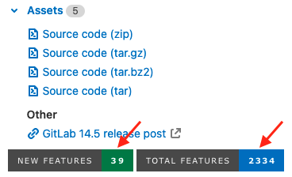

The following fields are available when you create or edit a release.

## Title

The release title can be customized using the **Release title** field when
creating or editing a release. If no title is provided, the release's tag name
is used instead.

## Tag name

The release tag name should include the release version. GitLab uses [Semantic Versioning](https://semver.org/)
for our releases, and we recommend you do too. Use `(Major).(Minor).(Patch)`, as detailed in the
[GitLab Policy for Versioning](../../../policy/maintenance.md#versioning).

For example, for GitLab version `16.1.1`:

- `16` represents the major version. The major release was `16.0.0`, but often referred to as `16.0`.
- `10` represents the minor version. The minor release was `16.1.0`, but often referred to as `16.1`.
- `1` represents the patch number.

Any part of the version number can be multiple digits, for example, `16.10.11`.

## Release notes description

Every release has a description. You can add any text you like, but we recommend
including a changelog to describe the content of your release. This helps users
quickly scan the differences between each release you publish.

[Tagging messages in Git](https://git-scm.com/book/en/v2/Git-Basics-Tagging) can
be included in Release note descriptions by selecting **Include tag message in
the release notes**.

Description supports [Markdown](../../markdown.md).

## Release assets

A release contains the following types of assets:

- [Source code](#source-code)
- [Link](#links)

### Source code

GitLab automatically generates `zip`, `tar.gz`, `tar.bz2`, and `tar`
archived source code from the given Git tag. These assets are read-only,
and [can be downloaded](../repository/_index.md#download-repository-source-code).

### Links

A link is any URL which can point to whatever you like: documentation, built
binaries, or other related materials. These can be both internal or external
links from your GitLab instance.
Each link as an asset has the following attributes:

| Attribute   | Description                                                                                                  | Required |
|-------------|--------------------------------------------------------------------------------------------------------------|----------|
| `name`      | The name of the link.                                                                                        | Yes      |
| `url`       | The URL to download a file.                                                                                  | Yes      |
| `filepath`  | The redirect link to the `url`. Must start with a slash (`/`). See [this section](#permanent-links-to-release-assets) for more information. | No       |
| `link_type` | The content kind of what users can download with `url`. See [this section](#link-types) for more information. | No       |

#### Permanent links to release assets

> - [Introduced](https://gitlab.com/gitlab-org/gitlab/-/issues/375489) in GitLab 15.9, links for private releases can be accessed using a personal access token.

The assets associated with a release are accessible through a permanent URL.
GitLab always redirects this URL to the actual asset
location, so even if the assets move to a different location, you can continue
to use the same URL. This is defined during [link creation](../../../api/releases/links.md#create-a-release-link) or [updating](../../../api/releases/links.md#update-a-release-link) using the `filepath` API attribute.

The format of the URL is:

```plaintext
https://host/namespace/project/-/releases/:release/downloads:filepath
```

If you have an asset for the `v16.9.0-rc2` release in the `gitlab-org`
namespace and `gitlab-runner` project on `gitlab.com`, for example:

```json
{
  "name": "linux amd64",
  "filepath": "/binaries/gitlab-runner-linux-amd64",
  "url": "https://gitlab-runner-downloads.s3.amazonaws.com/v16.9.0-rc2/binaries/gitlab-runner-linux-amd64",
  "link_type": "other"
}
```

This asset has a direct link of:

```plaintext
https://gitlab.com/gitlab-org/gitlab-runner/-/releases/v16.9.0-rc2/downloads/binaries/gitlab-runner-linux-amd64
```

The physical location of the asset can change at any time and the direct link remains unchanged.

If the release is private, you need to provide a personal access token with either `api` or `read_api` scopes using
a `private_token` query parameter or a `HTTP_PRIVATE_TOKEN` header when making the request. For example:

```shell
curl --location --output filename "https://gitlab.example.com/my-group/my-project/-/releases/myrelease/downloads</path-to-file>?private_token=<your_access_token>"
curl --location --output filename --header "PRIVATE-TOKEN: <your_access_token>" "https://gitlab.example.com/my-group/my-project/-/releases/myrelease/downloads</path-to-file>
```

#### Permanent links to latest release assets

You can use the `filepath` from [permanent links to release assets](#permanent-links-to-release-assets) in combination with a [permanent link to the latest release](_index.md#permanent-link-to-latest-release). The `filepath` must start with a slash (`/`).

The format of the URL is:

```plaintext
https://host/namespace/project/-/releases/permalink/latest/downloads:filepath
```

You can use this format to provide a permanent link to an asset from the latest release.

If you have an asset with [`filepath`](../../../api/releases/links.md#create-a-release-link) for the `v16.9.0-rc2` latest release in the `gitlab-org`
namespace and `gitlab-runner` project on `gitlab.com`, for example:

```json
{
  "name": "linux amd64",
  "filepath": "/binaries/gitlab-runner-linux-amd64",
  "url": "https://gitlab-runner-downloads.s3.amazonaws.com/v16.9.0-rc2/binaries/gitlab-runner-linux-amd64",
  "link_type": "other"
}
```

This asset has a direct link of:

```plaintext
https://gitlab.com/gitlab-org/gitlab-runner/-/releases/permalink/latest/downloads/binaries/gitlab-runner-linux-amd64
```

#### Link Types

The four types of links are "Runbook," "Package," "Image," and "Other."
The `link_type` parameter accepts one of the following four values:

- `runbook`
- `package`
- `image`
- `other` (default)

This field has no effect on the URL and it's only used for visual purposes in the Releases page of your project.

#### Use a generic package for attaching binaries

You can use [generic packages](../../packages/generic_packages/_index.md)
to store any artifacts from a release or tag pipeline,
that can also be used for attaching binary files to an individual release entry.
You basically need to:

1. [Push the artifacts to the Generic package registry](../../packages/generic_packages/_index.md#publish-a-package).
1. [Attach the package link to the release](#links).

The following example generates release assets, publishes them
as a generic package, and then creates a release:

```yaml
stages:
  - build
  - upload
  - release

variables:
  # Package version can only contain numbers (0-9), and dots (.).
  # Must be in the format of X.Y.Z, and should match the /\A\d+\.\d+\.\d+\z/ regular expression.
  # See https://docs.gitlab.com/ee/user/packages/generic_packages/#publish-a-package-file
  PACKAGE_VERSION: "1.2.3"
  DARWIN_AMD64_BINARY: "myawesomerelease-darwin-amd64-${PACKAGE_VERSION}"
  LINUX_AMD64_BINARY: "myawesomerelease-linux-amd64-${PACKAGE_VERSION}"
  PACKAGE_REGISTRY_URL: "${CI_API_V4_URL}/projects/${CI_PROJECT_ID}/packages/generic/myawesomerelease/${PACKAGE_VERSION}"

build:
  stage: build
  image: alpine:latest
  rules:
    - if: $CI_COMMIT_TAG
  script:
    - mkdir bin
    - echo "Mock binary for ${DARWIN_AMD64_BINARY}" > bin/${DARWIN_AMD64_BINARY}
    - echo "Mock binary for ${LINUX_AMD64_BINARY}" > bin/${LINUX_AMD64_BINARY}
  artifacts:
    paths:
      - bin/

upload:
  stage: upload
  image: curlimages/curl:latest
  rules:
    - if: $CI_COMMIT_TAG
  script:
    - |
      curl --header "JOB-TOKEN: ${CI_JOB_TOKEN}" --upload-file bin/${DARWIN_AMD64_BINARY} "${PACKAGE_REGISTRY_URL}/${DARWIN_AMD64_BINARY}"
    - |
      curl --header "JOB-TOKEN: ${CI_JOB_TOKEN}" --upload-file bin/${LINUX_AMD64_BINARY} "${PACKAGE_REGISTRY_URL}/${LINUX_AMD64_BINARY}"

release:
  # Caution, as of 2021-02-02 these assets links require a login, see:
  # https://gitlab.com/gitlab-org/gitlab/-/issues/299384
  stage: release
  image: registry.gitlab.com/gitlab-org/release-cli:latest
  rules:
    - if: $CI_COMMIT_TAG
  script:
    - |
      release-cli create --name "Release $CI_COMMIT_TAG" --tag-name $CI_COMMIT_TAG \
        --assets-link "{\"name\":\"${DARWIN_AMD64_BINARY}\",\"url\":\"${PACKAGE_REGISTRY_URL}/${DARWIN_AMD64_BINARY}\"}" \
        --assets-link "{\"name\":\"${LINUX_AMD64_BINARY}\",\"url\":\"${PACKAGE_REGISTRY_URL}/${LINUX_AMD64_BINARY}\"}"
```

PowerShell users may need to escape the double quote `"` inside a JSON
string with a `` ` `` (back tick) for `--assets-link` and `ConvertTo-Json`
before passing on to the `release-cli`.
For example:

```yaml
release:
  script:
    - $env:asset = "{`"name`":`"MyFooAsset`",`"url`":`"https://gitlab.com/upack/artifacts/download/$env:UPACK_GROUP/$env:UPACK_NAME/$($env:GitVersion_SemVer)?contentOnly=zip`"}"
    - $env:assetjson = $env:asset | ConvertTo-Json
    - release-cli create --name $CI_COMMIT_TAG --description "Release $CI_COMMIT_TAG" --ref $CI_COMMIT_TAG --tag-name $CI_COMMIT_TAG --assets-link=$env:assetjson
```

NOTE:
Directly attaching [job artifacts](../../../ci/jobs/job_artifacts.md)
links to a release is not recommended, because artifacts are ephemeral and
are used to pass data in the same pipeline. This means there's a risk that
they could either expire or someone might manually delete them.

### Number of new and total features

DETAILS:
**Tier:** Free, Premium, Ultimate
**Offering:** GitLab.com

On [GitLab.com](https://gitlab.com/gitlab-org/gitlab/-/releases), you can view the number of new and total features in the project.



The totals are displayed on [shields](https://shields.io/) and are generated per release by
[a Rake task in the `www-gitlab-com` repository](https://gitlab.com/gitlab-com/www-gitlab-com/-/blob/master/lib/tasks/update_gitlab_project_releases_page.rake).

| Item             | Formula                                                                            |
|------------------|------------------------------------------------------------------------------------|
| `New features`   | Total count of release posts across all tiers for a single release in the project. |
| `Total features` | Total count of release posts in reverse order for all releases in the project.     |

The counts are also shown by license tier.

| Item             | Formula                                                                                             |
|------------------|-----------------------------------------------------------------------------------------------------|
| `New features`   | Total count of release posts across a single tier for a single release in the project.              |
| `Total features` | Total count of release posts across a single tier in reverse order for all releases in the project. |
