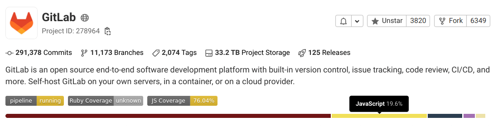
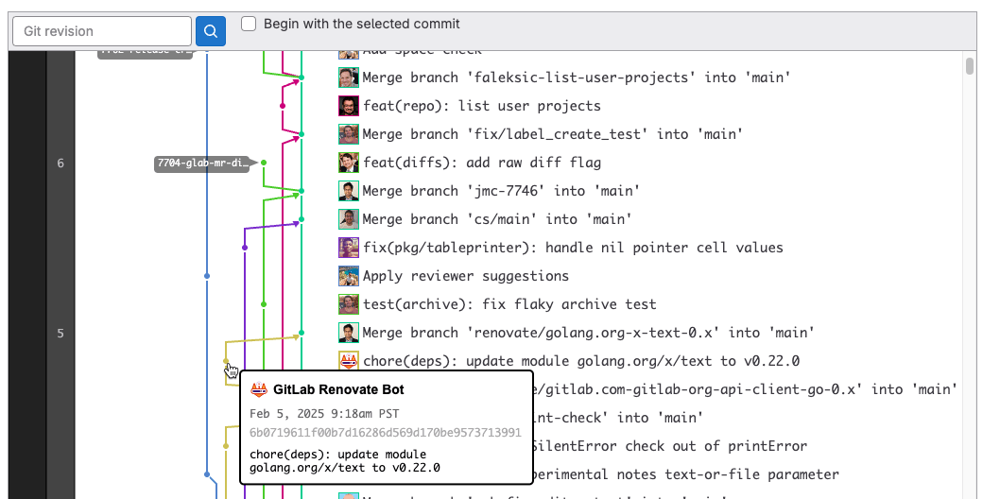

DETAILS:
**Tier:** Free, Premium, Ultimate
**Offering:** GitLab.com, GitLab Self-Managed, GitLab Dedicated

A [repository](https://git-scm.com/book/en/v2/Git-Basics-Getting-a-Git-Repository)
is where you store your code, make changes, and track changes using version control.
Each [project](../_index.md) contains a repository and a repository cannot exist without a project.

## Create a repository

To create a repository:

- [Create a project](../_index.md) or
- [Fork an existing project](forking_workflow.md).

## Add files to a repository

You can add files to a repository:

- When you [create a project](../_index.md), or
- After you create a project, using the following options:
  - [Web editor](web_editor.md#upload-a-file).
  - [User Interface (UI)](#add-a-file-from-the-ui).
  - [Command line](../../../topics/git/add_files.md).

### Add a file from the UI

To add or upload a file from the GitLab UI:

<!-- Original source for this list: doc/user/project/repository/web_editor.md#upload-a-file -->
<!-- For why we duplicated the info, see https://gitlab.com/gitlab-org/gitlab/-/merge_requests/111072#note_1267429478 -->

1. On the left sidebar, select **Search or go to** and find your project.
1. Go to the directory you want to upload the file to.
1. Next to the directory name, select the plus icon (**{plus}**) > **Upload file**.
1. Drop or upload your file.
1. Enter a commit message.
1. Optional. To create a merge request with your changes, in **Target branch**, enter a branch name
   that's not your repository's [default branch](branches/default.md).
1. Select **Upload file**.

## Commit changes to a repository

You can commit your changes to a branch in the repository. When you use the command line,
use [`git commit`](../../../topics/git/commands.md#git-commit).

For information about how to use commits to improve communication and collaboration,
trigger or skip pipelines, and reverting changes, see [commits](../merge_requests/commits.md).

## Clone a repository

You can clone a repository using the:

- Command line:
  - [Clone with SSH](../../../topics/git/clone.md#clone-with-ssh)
  - [Clone with HTTPS](../../../topics/git/clone.md#clone-with-https)
- GitLab UI:
  - [Clone and open in Apple Xcode](../../../topics/git/clone.md#clone-and-open-in-apple-xcode)
  - [Clone and open in Visual Studio Code](../../../topics/git/clone.md#clone-and-open-in-visual-studio-code)
  - [Clone and open in IntelliJ IDEA](../../../topics/git/clone.md#clone-and-open-in-intellij-idea)

## Download repository source code

When you download a repository's source code, it is compressed and saved as an archive file.
To download the source code stored in a repository:

1. On the left sidebar, select **Search or go to** and find your project.
1. Above the file list, select **Code**.
1. From the options, select the files you want to download:

   - **Source code:**

     Download the source code from the current branch you're viewing.
     Available extensions: `zip`, `tar`, `tar.gz`, and `tar.bz2`.

   - **Directory:**

     Download a specific directory. Visible only when you view a subdirectory.
     Available extensions: `zip`, `tar`, `tar.gz`, and `tar.bz2`.

   - **Artifacts:**

     Download the artifacts from the latest CI/CD job.

The checksums of generated archives can change even if the repository itself doesn't
change. For example, this occurs if Git or a third-party library that GitLab uses changes.

## Repository languages

GitLab detects programming languages used in the default branch.
This information is displayed on the **Project overview** page.



When new files are added, this information can take up to five minutes to update.

### Add repository languages

Not all files are detected and listed on the **Project overview** page. Documentation,
vendor code, and [most markup languages](files/_index.md#supported-markup-languages) are excluded.
To view a list of supported files and languages, see [supported data types](https://github.com/github/linguist/blob/master/lib/linguist/languages.yml).

To change this behavior and include additional file types in the default settings:

1. In your repository's root directory, create a file named `.gitattributes`.
1. Add a line that tells GitLab to include a specific file type. For example,
   to enable `.proto` files, add the following:

   ```plaintext
   *.proto linguist-detectable=true
   ```

This feature can use excessive CPU. If you experience an issue, see the
[Repository Languages: excessive CPU use](files/_index.md#repository-languages-excessive-cpu-use) troubleshooting section.

## Repository contributor analytics

You can view a line chart with the number of commits to the selected project branch over time,
and line charts with the number of commits by each project member.
For more information, see [Contributor analytics](../../analytics/contributor_analytics.md).

## Repository history graph

A repository graph displays a visual history of the repository network, including branches and merges.
This graph helps you see the flow of changes in the repository.

To view the repository history graph, go to your project's **Code > Repository graph**.



## Repository path changes

When a repository path changes, GitLab handles the transition from the
old location to the new one with a redirect.

When you [rename a user](../../profile/_index.md#change-your-username),
[change a group path](../../group/manage.md#change-a-groups-path), or [rename a repository](../working_with_projects.md#rename-a-repository):

- URLs for the namespace and everything under it, like projects, are
  redirected to the new URLs.
- Git remote URLs for projects under the
  namespace redirect to the new remote URL. When you push or pull to a
  repository that has changed location, a warning message to update
  your remote is displayed. Automation scripts or Git clients continue to
  work after a rename.
- The redirects are available as long as the original path is not claimed by
  another group, user, or project.
- [API redirects](../../../api/rest/_index.md#redirects) may need to be followed explicitly.

After you change a path, you must update the existing URL in the following resources:

- [Include statements](../../../ci/yaml/includes.md) except [`include:component`](../../../ci/components/_index.md),
  otherwise pipelines fail with a syntax error. CI/CD component references can follow redirects.
- Namespaced API calls that use the [encoded path](../../../api/rest/_index.md#namespaced-paths)
  instead of the numeric namespace and project IDs.
- [Docker image references](../../../ci/yaml/_index.md#image).
- Variables that specify a project or namespace.
- [CODEOWNERS file](../codeowners/_index.md#codeowners-file).

## Related topics

- [GitLab Workflow extension for VS Code](../../../editor_extensions/visual_studio_code/_index.md)
- [Lock files and prevent change conflicts](../file_lock.md)
- [Repository API](../../../api/repositories.md)
- [Files](files/_index.md)
- [Branches](branches/_index.md)
- [Create a directory](web_editor.md#create-a-directory)
- [Find file history](files/git_history.md)
- [Identify changes by line (Git blame)](files/git_blame.md)

## Troubleshooting

### Search sequence of pushes to a repository

If it seems that a commit has gone "missing", search the sequence of pushes to a repository.
[This StackOverflow article](https://stackoverflow.com/questions/13468027/the-mystery-of-the-missing-commit-across-merges)
describes how you can end up in this state without a force push. Another cause can be a misconfigured
[server hook](../../../administration/server_hooks.md) that changes a HEAD ref in a `git reset` operation.

If you look at the output from the sample code below for the target branch, you
see a discontinuity in the from/to commits as you step through the output.
The `commit_from` of each new push should equal the `commit_to` of the previous push.
A break in that sequence indicates one or more commits have been "lost" from the repository history.

Using the [rails console](../../../administration/operations/rails_console.md#starting-a-rails-console-session),
the following example checks the last 100 pushes and prints the `commit_from` and `commit_to` entries:

```ruby
p = Project.find_by_full_path('project/path')
p.events.pushed_action.last(100).each do |e|
  printf "%-20.20s %8s...%8s (%s)", e.push_event_payload[:ref], e.push_event_payload[:commit_from], e.push_event_payload[:commit_to], e.author.try(:username)
end ; nil
```

Example output showing break in sequence at line 4:

```plaintext
master f21b07713251e04575908149bdc8ac1f105aabc3...6bc56c1f46244792222f6c85b11606933af171de root
master 6bc56c1f46244792222f6c85b11606933af171de...132da6064f5d3453d445fd7cb452b148705bdc1b root
master 132da6064f5d3453d445fd7cb452b148705bdc1b...a62e1e693150a2e46ace0ce696cd4a52856dfa65 root
master 58b07b719a4b0039fec810efa52f479ba1b84756...f05321a5b5728bd8a89b7bf530aa44043c951dce root
master f05321a5b5728bd8a89b7bf530aa44043c951dce...7d02e575fd790e76a3284ee435368279a5eb3773 root
```

### Error: Xcode fails to clone repository

GitLab provides an option to [restrict a list of allowed SSH keys](../../../security/ssh_keys_restrictions.md).
If your SSH key is not on the allowed list, you might encounter an error like
`The repository rejected the provided credentials`.

To resolve this issue, create a new SSH key pair that meets the guidelines for
[supported SSH key types](../../ssh.md#supported-ssh-key-types). After you generate a
supported SSH key, try cloning the repository again.
