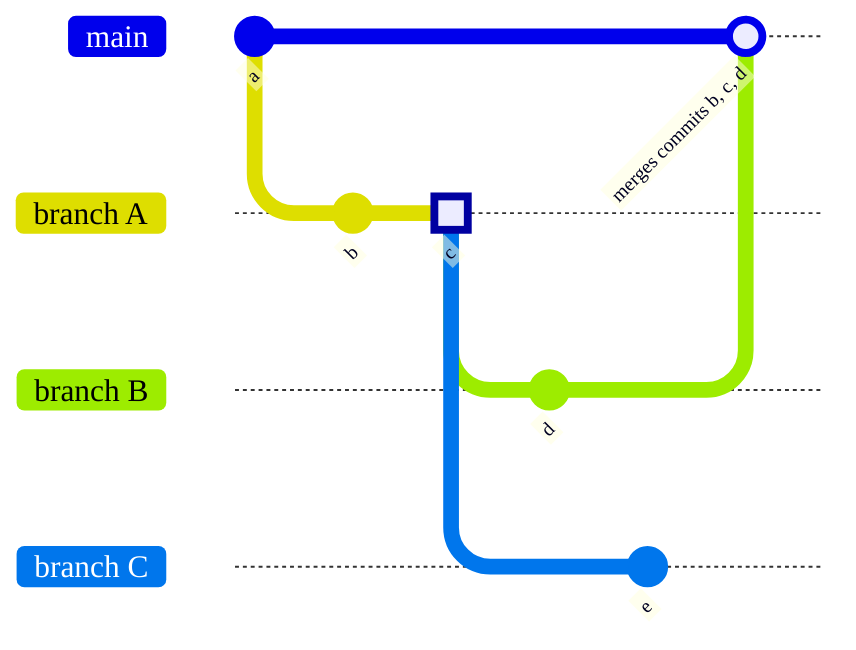

DETAILS:
**Tier:** Free, Premium, Ultimate
**Offering:** GitLab.com, GitLab Self-Managed, GitLab Dedicated

A branch is a version of a project's working tree. Branches are the
foundation of development in a project. When you create a new
[project](../../_index.md), GitLab creates a [default branch](default.md)
for your repository. Default branch settings are configured in a project,
subgroup, group, or instance.

As your project grows, your team creates more branches.
Each branch represents a set of changes, which allows development work to be done
in parallel. Development work in one branch does not affect another branch.

The development workflow for branches is:

1. [Create a branch](#create-a-branch) and add commits to it.
   To streamline this process, you should follow
   [branch naming patterns](#prefix-branch-names-with-issue-numbers).
1. When the work is ready for review, create a [merge request](../../merge_requests/_index.md) to propose merging the changes in your branch.
1. Preview the changes with a [review app](../../../../ci/review_apps/_index.md).
1. [Request a review](../../merge_requests/reviews/_index.md#request-a-review).
1. After your merge request is approved, merge your branch to the origin branch.
   The [merge method](../../merge_requests/methods/_index.md) determines how merge requests
   are handled in your project.
1. After the contents of your branch are merged, [delete the merged branch](#delete-merged-branches).

## View all branches

To view and manage your branches in the GitLab user interface:

1. On the left sidebar, select **Search or go to** and find your project.
1. On the left sidebar, select **Code > Branches**.

On this page, you can:

- See all branches, or filter to see only active or stale branches.

  A branch is considered active if a commit has been made to it in the last three months.
  Otherwise it is considered stale.

- [Create new branches](#create-a-branch).
- [Compare branches](#compare-branches).
- [Delete merged branches](#delete-merged-branches).
- See merge request links that point to the default branch.

  Branches with merge requests that do not point to the default branch display the **{merge-request}** **New** merge request button.

- [View branch rules](branch_rules.md#view-branch-rules).
- See latest pipeline status on the branch.

## Create a branch

Prerequisites:

- You must have at least the Developer role for the project.

To create a new branch from the GitLab UI:

1. On the left sidebar, select **Search or go to** and find your project.
1. Select **Code > Branches**.
1. In the upper-right corner, select **New branch**.
1. Enter a **Branch name**.
1. In **Create from**, select the base of your branch: an existing branch, an existing
   tag, or a commit SHA.
1. Select **Create branch**.

### In a blank project

A [blank project](../../_index.md#create-a-blank-project) does not contain a branch, but
you can add one.

Prerequisites:

- You must have at least the Developer role for the project.
- If you don't have the Maintainer or Owner role, the
  [default branch protection](../../../group/manage.md#change-the-default-branch-protection-of-a-group)
  must be set to `Partially protected` or `Not protected` for you to push a commit
  to the default branch.

To add a [default branch](default.md) to a blank project:

1. On the left sidebar, select **Search or go to** and find your project.
1. Scroll to **The repository for this project is empty** and select the type of
   file you want to add.
1. In the Web IDE, make any desired changes to this file, then select **Create commit**.
1. Enter a commit message, and select **Commit**.

GitLab creates a default branch and adds your file to it.

### From an issue

When viewing an issue, you can create an associated branch directly from that page.
Branches created this way use the
[default pattern for branch names from issues](#configure-default-pattern-for-branch-names-from-issues),
including variables.

Prerequisites:

- You must have at least the Developer role for the project.

To create a branch from an issue:

1. On the left sidebar, select **Search or go to** and find your project.
1. Select **Plan > Issues** and find your issue.
1. Below the issue description, find the **Create merge request** dropdown list, and select
   **{chevron-down}** to display the dropdown list.
1. Select **Create branch**. A default **Branch name** is provided, based on the
   [default pattern](#configure-default-pattern-for-branch-names-from-issues) for
   this project. If desired, enter a different **Branch name**.
1. Select **Create branch** to create the branch based on your project's
   [default branch](default.md).

## Name your branch

Git enforces [branch name rules](https://git-scm.com/docs/git-check-ref-format)
to help ensure branch names remain compatible with other tools. GitLab
adds extra requirements for branch names, and provides benefits for well-structured branch names.

GitLab enforces these additional rules on all branches:

- No spaces are allowed in branch names.
- Branch names with 40 hexadecimal characters are prohibited, because they are similar to Git commit hashes.
- Branch names are case-sensitive.

Common software packages, like Docker, can enforce
[additional branch naming restrictions](../../../../administration/packages/container_registry_troubleshooting.md#docker-connection-error).

For the best compatibility with other software packages, use only:

- Numbers
- Hyphens (`-`)
- Underscores (`_`)
- Lowercase letters from the ASCII standard table

You can use forward slashes (`/`) and emoji in branch names, but compatibility with other
software packages cannot be guaranteed.

Branch names with specific formatting offer extra benefits:

- Streamline your merge request workflow by
  [prefixing branch names with issue numbers](#prefix-branch-names-with-issue-numbers).
- Automate [branch protections](protected.md) based on branch name.
- Test branch names with [push rules](../push_rules.md) before branches are pushed up to GitLab.
- Define which [CI/CD jobs](../../../../ci/jobs/_index.md) to run on merge requests.

### Configure default pattern for branch names from issues

By default, GitLab uses the pattern `%{id}-%{title}` when creating a branch from
an issue, but you can change this pattern.

Prerequisites:

- You must have at least the Maintainer role for the project.

To change the default pattern for branches created from issues:

1. On the left sidebar, select **Search or go to** and find your project.
1. Select **Settings > Repository**.
1. Expand **Branch defaults**.
1. Scroll to **Branch name template** and enter a value. The field supports these variables:
   - `%{id}`: The numeric ID of the issue.
   - `%{title}`: The title of the issue, modified to use only characters acceptable in Git branch names.
1. Select **Save changes**.

### Prefix branch names with issue numbers

To streamline the creation of merge requests, start your Git branch name with the
issue number, followed by a hyphen.
For example, to link a branch to issue `#123`, start the branch name with `123-`.

The issue and the branch must be in the same project.

GitLab uses the issue number to import data into the merge request:

- The issue is marked as related to the merge request. The issue and merge request
  display links to each other.
- The branch is connected to the issue.
- If your project is configured with a
  [default closing pattern](../../issues/managing_issues.md#default-closing-pattern),
  merging the merge request [also closes](../../issues/managing_issues.md#closing-issues-automatically)
  the related issue.
- If the merge request is in the same project, and not a fork, the issue milestone
  and labels are copied to the merge request.

## Manage and protect branches

GitLab provides multiple methods to protect individual branches. These methods
ensure your branches receive oversight and quality checks from their creation to their deletion. To view and edit branch protections, see [Branch rules](branch_rules.md).

## Compare branches

To compare branches in a repository:

1. On the left sidebar, select **Search or go to** and find your project.
1. Select **Code > Compare revisions**.
1. Select the **Source** branch to search for your desired branch. Exact matches are
   shown first. You can refine your search with operators:
   - `^` matches the beginning of the branch name: `^feat` matches `feat/user-authentication`.
   - `$` matches the end of the branch name: `widget$` matches `feat/search-box-widget`.
   - `*` matches using a wildcard: `branch*cache*` matches `fix/branch-search-cache-expiration`.
   - You can combine operators: `^chore/*migration$` matches `chore/user-data-migration`.
1. Select the **Target** repository and branch. Exact matches are shown first.
1. Below **Show changes**, select the method to compare branches:
   <!-- vale gitlab_base.SubstitutionWarning = NO -->
   <!-- Disable Vale gitlab_base.SubstitutionWarning rule so that Vale doesn't flag "since" -->
   - **Only incoming changes from source** (default) shows differences from the source branch since
     the latest common commit on both branches.
     It doesn't include unrelated changes made to the target branch after the source branch was created.
     This method uses the `git diff <from>...<to>`
     [Git command](../../../../topics/git/commands.md).
     To compare branches, this method uses the merge base instead of the actual commit, so
     changes from cherry-picked commits are shown as new changes.
   - **Include changes to target since source was created** shows all the differences between the two
     branches.
     This method uses the `git diff <from> <to>`
     [Git command](../../../../topics/git/commands.md).
   <!-- vale gitlab_base.SubstitutionWarning = YES -->
1. Select **Compare** to show the list of commits, and changed files.
1. Optional. To reverse the **Source** and **Target**, select **Swap revisions** (**{substitute}**).

## Delete merged branches

Merged branches can be deleted in bulk if they meet all of these criteria:

- They are not [protected branches](protected.md).
- They have been merged into the project's default branch.

Prerequisites:

- You must have at least the Developer role for the project.

To do this:

1. On the left sidebar, select **Search or go to** and find your project.
1. Select **Code > Branches**.
1. In the upper right corner of the page, select **More** **{ellipsis_v}**.
1. Select **Delete merged branches**.
1. In the dialog, enter the word `delete` to confirm, then select **Delete merged branches**.

NOTE:
Deleting a branch does not completely erase all related data.
Some information persists to maintain project history and to support recovery processes.
For more information, see [Handle sensitive information](../../../../topics/git/undo.md#handle-sensitive-information).

## Configure workflows for target branches

DETAILS:
**Tier:** Premium, Ultimate
**Offering:** GitLab.com, GitLab Self-Managed, GitLab Dedicated

> - [Introduced](https://gitlab.com/gitlab-org/gitlab/-/merge_requests/127115) in GitLab 16.4 [with a flag](../../../../administration/feature_flags.md) named `target_branch_rules_flag`. Enabled by default.
> - [Feature flag removed](https://gitlab.com/gitlab-org/gitlab/-/merge_requests/136431) in GitLab 16.7.

Some projects use multiple long-term branches for development, like `develop` and `qa`.
In these projects, you might want to keep `main` as the default branch, but expect
merge requests to target `develop` or `qa` instead. Target branch workflows help ensure
merge requests target the appropriate development branch for your project.

When you create a merge request, the workflow checks the name of the branch. If the
branch name matches the workflow, the merge request targets the branch you specify. If the branch name does not match, the merge request targets the
default branch of the project.

Rules are processed on a "first-match" basis - if two rules match the same branch name, the top-most rule is applied.

Prerequisites:

- You must have at least the Maintainer role.

To create a target branch workflow:

1. On the left sidebar, select **Search or go to** and find your project.
1. Select **Settings > Merge requests**.
1. Scroll down to **Merge request branch workflow**
1. Select **Add branch target**.
1. For **Branch name pattern**, provide a string or wild card to compare against branch names.
1. Select the **Target branch** to use when the branch name matches the **Branch name pattern**.
1. Select **Save**.

### Target branch workflow example

You could configure your project to have the following target branch workflows:

| Branch name pattern   | Target branch |
|-------------|---------------|
| `feature/*` | `develop`     |
| `bug/*`     | `develop`     |
| `release/*` | `main`        |

These target branches simplify the process of creating merge requests for a project that:

- Uses `main` to represent the deployed state of your application.
- Tracks current, unreleased development work in another long-running branch, like `develop`.

If your workflow initially places new features in `develop` instead of `main`, these target branches
ensure all branches matching either `feature/*` or `bug/*` do not target `main` by mistake.

When you're ready to release to `main`, create a branch named `release/*`, and
ensure this branch targets `main`.

### Delete a target branch workflow

When you remove a target branch workflow, existing merge requests remain unchanged.

Prerequisites:

- You must have at least the Maintainer role.

To do this:

1. On the left sidebar, select **Search or go to** and find your project.
1. Select **Settings > Merge requests**.
1. Select **Delete** on the branch target you want to delete.

## Related topics

- [Protected branches](protected.md)
- [Branches API](../../../../api/branches.md)
- [Protected Branches API](../../../../api/protected_branches.md)
- [Getting started with Git](../../../../topics/git/_index.md)
- [Branches in a Nutshell](https://git-scm.com/book/en/v2/Git-Branching-Branches-in-a-Nutshell)

## Troubleshooting

### Multiple branches containing the same commit

At a deeper technical level, Git branches aren't separate entities, but labels
attached to a set of commit SHAs. When GitLab determines whether or not a branch has been
merged, it checks the target branch for the existence of those commit SHAs.
This behavior can cause unexpected results when two merge requests contain the same
commits. In this example, branches `B` and `C` both start from the same commit (`3`)
on branch `A`:



If you merge branch `B`, branch `A` also appears as merged (without any action from you)
because all commits from branch `A` now appear in the target branch `main`. Branch `C`
remains unmerged, because commit `5` wasn't part of branch `A` or `B`.

Merge request `A` remains merged, even if you attempt to push new commits
to its branch. If any changes in merge request `A` remain unmerged (because they
weren't part of merge request `A`), open a new merge request for them.

### Error: ambiguous `HEAD` branch exists

In versions of Git earlier than 2.16.0, you could create a branch named `HEAD`.
This branch named `HEAD` collides with the internal reference (also named `HEAD`)
Git uses to describe the active (checked out) branch. This naming collision can
prevent you from updating the default branch of your repository:

```plaintext
Error: Could not set the default branch. Do you have a branch named 'HEAD' in your repository?
```

To fix this problem:

1. On the left sidebar, select **Search or go to** and find your project.
1. Select **Code > Branches**.
1. Search for a branch named `HEAD`.
1. Make sure the branch has no uncommitted changes.
1. Select **Delete branch**, then **Yes, delete branch**.

Git versions [2.16.0 and later](https://github.com/git/git/commit/a625b092cc59940521789fe8a3ff69c8d6b14eb2),
prevent you from creating a branch with this name.

### Find all branches you've authored

To find all branches you've authored in a project, run this command in a Git repository:

```shell
git for-each-ref --format='%(authoremail) %(refname:short)' | grep $(git config --get user.email)
```

To get a total of all branches in a project, sorted by author, run this command
in a Git repository:

```shell
git for-each-ref --format='%(authoremail)'  | sort | uniq -c | sort -g
```

### Error: `Failed to create branch 4:Deadline Exceeded`

This error is caused by a timeout in Gitaly. It occurs when creating a branch
take longer to complete than the configured timeout period.

To resolve this issue, choose one of the following:

- Disable time-consuming [server hooks](../../../../administration/server_hooks.md).
- Increase [Gitaly timeout](../../../../administration/settings/gitaly_timeouts.md) settings.
