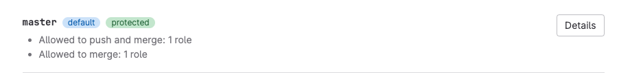
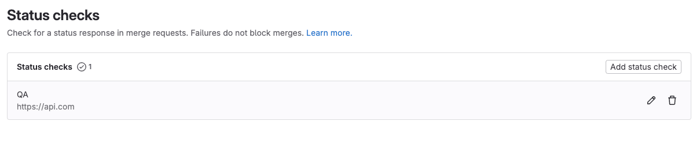

DETAILS:
**Tier:** Free, Premium, Ultimate
**Offering:** GitLab.com, GitLab Self-Managed, GitLab Dedicated

GitLab provides multiple methods to protect individual branches. These methods
ensure your branches receive oversight and quality checks from their creation to their deletion:

- Apply enhanced security and protection to your project's [default branch](default.md).
- Configure [protected branches](protected.md) to:
  - Limit who can push and merge to a branch.
  - Manage if users can force push to the branch.
  - Manage if changes to files listed in the `CODEOWNERS` file can be pushed directly to the branch.
- Configure [approval rules](../../merge_requests/approvals/rules.md#approvals-for-protected-branches) to manage review requirements and implement [security-related approvals](../../merge_requests/approvals/rules.md#security-approvals).
- Integrate with third-party [status checks](../../merge_requests/status_checks.md)
  to ensure the contents of your branch meets your defined quality standards.

You can manage your branches:

- With the GitLab user interface.
- With Git on the command line.
- With the [Branches API](../../../../api/branches.md).

## View branch rules

> - [Introduced](https://gitlab.com/gitlab-org/gitlab/-/merge_requests/88279) in GitLab 15.1 with a flag named `branch_rules`. Disabled by default.
> - [Enabled on GitLab Self-Managed](https://gitlab.com/gitlab-org/gitlab/-/issues/363170) in GitLab 15.11.
> - [Generally available](https://gitlab.com/gitlab-org/gitlab/-/merge_requests/123368) in GitLab 16.1. Feature flag `branch_rules` removed.

The **Branch rules overview** page shows all branches with any configured protections,
and their protection methods:

Prerequisites:

- You must have at least the Maintainer role for the project.

To view the **Branch rules overview** list:

1. On the left sidebar, select **Search or go to** and find your project.
1. Select **Settings > Repository**.
1. Expand **Branch rules** to view all branches with protections.

### View branch rule details

To view branch rules and protections for a single branch:

1. On the left sidebar, select **Search or go to** and find your project.
1. Select **Settings > Repository**.
1. Expand **Branch rules** to view all branches with protections.
1. Identify the branch you want and select **View details**.

## Create a branch rule

> - [Introduced](https://gitlab.com/gitlab-org/gitlab/-/merge_requests/88279) in GitLab 16.8 with a flag named `add_branch_rules`. Disabled by default.
> - Feature flag `add_branch_rules` [renamed](https://gitlab.com/gitlab-org/gitlab/-/merge_requests/88279) to `edit_branch_rules` in GitLab 16.11. Disabled by default.
> - **All branches** and **All protected branches** options [introduced](https://gitlab.com/gitlab-org/gitlab/-/issues/388129) in GitLab 17.0.
> - [Enabled on GitLab.com](https://gitlab.com/gitlab-org/gitlab/-/issues/454501) in GitLab 17.4.
> - [Enabled on GitLab Self-Managed and GitLab Dedicated](https://gitlab.com/gitlab-org/gitlab/-/issues/454501) in GitLab 17.5.

FLAG:
The availability of this feature is controlled by a feature flag.
For more information, see the history.

Prerequisites:

- You must have at least the Maintainer role for the project.

To create a branch rule:

1. On the left sidebar, select **Search or go to** and find your project.
1. Select **Settings > Repository**.
1. Expand **Branch rules**.
1. Select **Add branch rule**.
1. Choose one of the following options:
   - To enter a specific branch name or pattern:
     1. Select **Branch name or pattern**.
     1. From the **Create branch rule** dropdown list, select a branch name or create a wildcard by typing `*`.
   - To protect all branches in the project:
     1. Select **All branches**.
     1. On the rule's details page, under **Merge request approvals**, enter the required number of approvals for the rule.
   - To protect all branches in the project that are already specified as protected:
     1. Select **All protected branches**.
     1. On the rule's details page, under **Merge request approvals**, enter the required number of approvals for the rule.

### Add a branch rule protection

NOTE:
Not available for `all branches`.

To add protections to a new branch:

1. On the left sidebar, select **Search or go to** and find your project.
1. Select **Settings > Repository**.
1. Expand **Branch rules**.
1. Select **Add branch rule**.
1. Select one of **All protected branches** or **Branch name or pattern**.
1. Select **Create protected branch**.

### Add an approval rule

DETAILS:
**Tier:** Premium, Ultimate
**Offering:** GitLab.com, GitLab Self-Managed, GitLab Dedicated

NOTE:
Not available for `all branches`.

Prerequisites:

- You must have at least the Maintainer role for the project.

To add a merge request approval rule:

1. From the [branch rule details](#view-branch-rule-details) page, go to the **Merge request approvals** section.
1. In the **Approval rules** section, select **Add approval rule**.
1. On the right sidebar, complete the fields:
   - Enter a **Rule name**.
   - In **Required number of approvals**, enter a value (`0`-`100`).

     A value of `0` makes [the rule optional](../../merge_requests/approvals/rules.md#configure-optional-approval-rules), and any number greater than `0` creates a required rule.
     The maximum number of required approvals is `100`.
   - Select users or groups that are
     [eligible to approve](../../merge_requests/approvals/rules.md#eligible-approvers).

     GitLab suggests approvers based on previous authors of the files changed by the merge request.
1. Select **Save changes**.

For additional information, see [Approval rules](../../merge_requests/approvals/rules.md#approvals-for-protected-branches).

### Add a status check service

DETAILS:
**Tier:** Ultimate
**Offering:** GitLab.com, GitLab Self-Managed, GitLab Dedicated

> - [Introduced](https://gitlab.com/groups/gitlab-org/-/epics/12522) in GitLab 17.4 [with a flag](../../../../administration/feature_flags.md) named `edit_branch_rules`. Disabled by default.
> - [Enabled on GitLab.com](https://gitlab.com/gitlab-org/gitlab/-/issues/454501) in GitLab 17.4.
> - [Enabled on GitLab Self-Managed and GitLab Dedicated](https://gitlab.com/gitlab-org/gitlab/-/issues/454501) in GitLab 17.5.

NOTE:
Not available for `all protected branches`.

To add a status check service:

1. From the [branch rule details](#view-branch-rule-details) page, go to the **Status checks** section.
1. Select **Add status check**.
1. Enter the **Service name**.
1. In the **API to check** field, enter the URL.

   You should use a HTTPS URL to protect your merge request data in transit.

For more information, see [External status checks](../../merge_requests/status_checks.md).

## Edit a branch rule target

> - [Introduced](https://gitlab.com/gitlab-org/gitlab/-/merge_requests/88279) in GitLab 16.8 with a flag named `add_branch_rules`. Disabled by default.
> - Feature flag `add_branch_rules` [renamed](https://gitlab.com/gitlab-org/gitlab/-/merge_requests/88279) to `edit_branch_rules` in GitLab 16.11. Disabled by default.
> - [Enabled on GitLab.com](https://gitlab.com/gitlab-org/gitlab/-/issues/454501) in GitLab 17.4.
> - [Enabled on GitLab Self-Managed and GitLab Dedicated](https://gitlab.com/gitlab-org/gitlab/-/issues/454501) in GitLab 17.5.

FLAG:
The availability of this feature is controlled by a feature flag.
For more information, see the history.

Prerequisites:

- You must have at least the Maintainer role for the project.

To edit a branch rule target:

1. On the left sidebar, select **Search or go to** and find your project.
1. Select **Settings > Repository**.
1. Expand **Branch rules** to view all branches with protections.
1. Identify the branch you want and select **View details**.
1. In the **Rule target** section, select **Edit**.
1. Edit the information as needed.
1. Select **Update**.

### Edit a branch rule protection

NOTE:
Not available for `all branches`.

To edit branch rule protections:

1. On the left sidebar, select **Search or go to** and find your project.
1. Select **Settings > Repository**.
1. Expand **Branch rules** to view all branches with protections.
1. Identify the branch you want and select **View details**.
1. From the **Protect branch** section, choose one of the following options:
   - From **Allowed to merge**, select **Edit**.
     1. Select the roles that can merge into this branch.
     1. Select **Save changes**.
   - From **Allowed to push and merge**, select **Edit**.
     1. Select the roles that can merge into this branch.
     1. If desired, search to add **Deploy keys**.
     1. Select **Save changes**.

NOTE:
In GitLab Premium and Ultimate, you can also add groups or individual users
to **Allowed to merge** and **Allowed to push and merge**.

For additional information about branch protection controls, see [Protected branches](protected.md).

## Delete a branch rule

> - [Introduced](https://gitlab.com/gitlab-org/gitlab/-/merge_requests/88279) in GitLab 16.8 with a flag named `add_branch_rules`. Disabled by default.
> - Feature flag `add_branch_rules` [renamed](https://gitlab.com/gitlab-org/gitlab/-/merge_requests/88279) to `edit_branch_rules` in GitLab 16.11. Disabled by default.
> - [Enabled on GitLab.com](https://gitlab.com/gitlab-org/gitlab/-/issues/454501) in GitLab 17.4.
> - [Enabled on GitLab Self-Managed and GitLab Dedicated](https://gitlab.com/gitlab-org/gitlab/-/issues/454501) in GitLab 17.5.

FLAG:
The availability of this feature is controlled by a feature flag.
For more information, see the history.

Prerequisites:

- You must have at least the Maintainer role for the project.

To delete a branch rule:

1. On the left sidebar, select **Search or go to** and find your project.
1. Select **Settings > Repository**.
1. Expand **Branch rules**.
1. Next to a rule you want to delete, select **View details**.
1. In the upper-right corner, select **Delete rule**.
1. On the confirmation dialog, select **Delete branch rule**.
