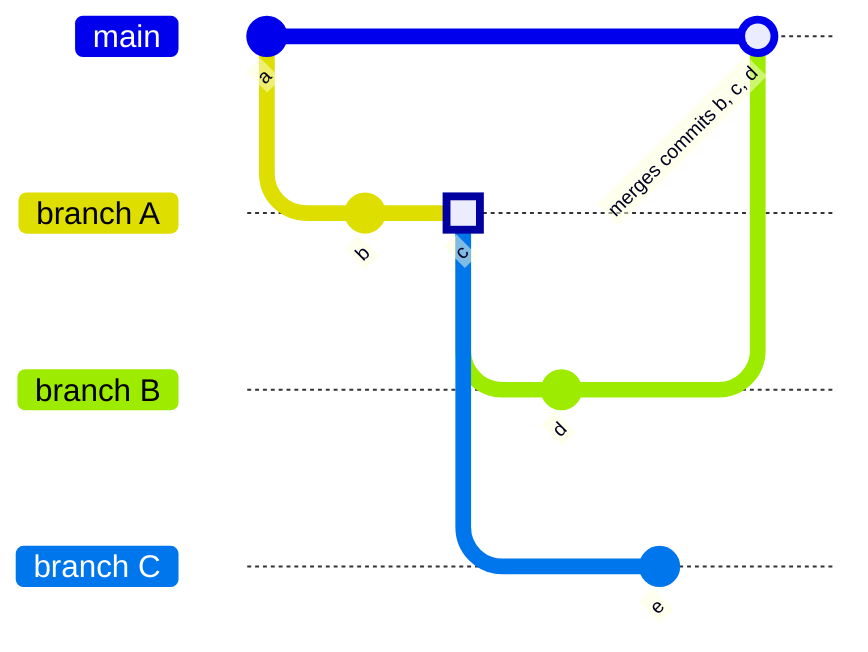

# Branches **(FREE)**

Branches are versions of a project's working tree. When you create a new
[project](../../index.md), GitLab creates a [default branch](default.md) (which
cannot be deleted) for your repository. Default branch settings can be configured
at the project, subgroup, group, or instance level.

As your project grows, your team [creates](../web_editor.md#create-a-branch) more
branches, preferably by following [branch naming patterns](#prefix-branch-names-with-issue-numbers).
Each branch represents a set of changes, which allows development work to be done
in parallel. Development work in one branch does not affect another branch.

Branches are the foundation of development in a project:

1. To get started, create a branch and add commits to it.
1. When the work is ready for review, create a [merge request](../../merge_requests/index.md) to propose
   merging the changes in your branch. To streamline this process, you should follow
   [branch naming patterns](#prefix-branch-names-with-issue-numbers).
1. Preview changes in a branch with a [review app](../../../../ci/review_apps/index.md).
1. After the contents of your branch are merged, [delete the merged branch](#delete-merged-branches).

## Create branch

To create a new branch from the GitLab UI:

1. On the top bar, select **Main menu > Projects** and find your project.
1. On the left sidebar, select **Repository > Branches**.
1. On the top right, select **New branch**.
1. Enter a **Branch name**.
1. In **Create from**, select the base of your branch: an existing branch, an existing
   tag, or a commit SHA.
1. Select **Create branch**.

### In a blank project

A [blank project](../../index.md#create-a-blank-project) does not contain a branch, but
you can add one.

Prerequisites:

- You must have at least the Developer role in the project.
- Unless you have the Maintainer or Owner roles, the
  [default branch protection](../../../group/manage.md#change-the-default-branch-protection-of-a-group)
  must be set to `Partially protected` or `Not protected` for you to push a commit
  to the default branch.

To add a [default branch](default.md) to an empty project:

1. On the top bar, select **Main menu > Projects** and find your project.
1. Scroll to **The repository for this project is empty** and select the type of
   file you want to add.
1. In the Web IDE, make any desired changes to this file, then select **Create commit**.
1. Enter a commit message, and select **Commit**.

GitLab creates a default branch and adds your file to it.

### From an issue

When viewing an issue, you can create an associated branch directly from that page.

Prerequisites:

- You must have at least the Developer role in the project.

To create a branch from an issue:

1. On the top bar, select **Main menu > Projects** and find your project.
1. On the left sidebar, select **Issues** (**{issues}**) and find your issue.
1. Below the issue description, find the **Create merge request** dropdown list, and select
   **{chevron-down}** to display the dropdown list.
1. Select **Create branch**. A default **Branch name** is provided, based on the
   [default pattern](#configure-default-pattern-for-branch-names-from-issues) for
   this project. If desired, enter a different **Branch name**.
1. Select **Create branch** to create the branch based on your project's
   [default branch](default.md).

## Manage and protect branches

GitLab provides you multiple methods to protect individual branches. These methods
ensure your branches receive oversight and quality checks from their creation to their deletion:

- The [default branch](default.md) in your project receives extra protection.
- Configure [protected branches](../../protected_branches.md#protected-branches)
  to restrict who can commit to a branch, merge other branches into it, or merge
  the branch itself into another branch.
- Configure [approval rules](../../merge_requests/approvals/rules.md) to set review
  requirements, including [security-related approvals](../../merge_requests/approvals/rules.md#security-approvals), before a branch can merge.
- Integrate with third-party [status checks](../../merge_requests/status_checks.md)
  to ensure your branch contents meet your standards of quality.

You can manage your branches:

- With the GitLab user interface.
- With the [command line](../../../../gitlab-basics/start-using-git.md#create-a-branch).
- With the [Branches API](../../../../api/branches.md).

### View all branches

To view and manage your branches in the GitLab user interface:

1. On the top bar, select **Main menu > Projects** and find your project.
1. On the left sidebar, select **Repository > Branches**.

On this page, you can:

- See all branches, active branches, or stale branches.
- Create new branches.
- [Compare branches](#compare-branches).
- Delete merged branches.

### View branches with configured protections

> - [Introduced](https://gitlab.com/gitlab-org/gitlab/-/merge_requests/88279) in GitLab 15.1 with a flag named `branch_rules`. Disabled by default.
> - [Enabled on GitLab.com](https://gitlab.com/gitlab-org/gitlab/-/issues/363170) in GitLab 15.10.
> - [Enabled on self-managed](https://gitlab.com/gitlab-org/gitlab/-/issues/363170) in GitLab 15.11

FLAG:
On self-managed GitLab, by default this feature is available. To hide the feature, ask an administrator to [disable the feature flag](../../../feature_flags.md) named `branch_rules`.
On GitLab.com, this feature is available.

Branches in your repository can be [protected](../../protected_branches.md) in multiple ways. You can:

- Limit who can push to the branch.
- Limit who can merge the branch.
- Require approval of all changes.
- Require external tests to pass.

The **Branch rules overview** page shows all branches with any configured protections,
and their protection methods:


Prerequisites:

- You must have at least the Maintainer role in the project.

To view the **Branch rules overview** list:

1. On the top bar, select **Main menu > Projects** and find your project.
1. On the left sidebar, select **Settings > Repository**.
1. Expand **Branch Rules** to view all branches with protections.
   - To add protections to a new branch:
     1. Select **Add branch rule**.
     1. Select **Create protected branch**.
   - To view more information about protections on an existing branch:
     1. Identify the branch you want more information about.
     1. Select **Details** to see information about its:
        - [Branch protections](../../protected_branches.md).
        - [Approval rules](../../merge_requests/approvals/rules.md).
        - [Status checks](../../merge_requests/status_checks.md).

## Name your branch

Git enforces [branch name rules](https://git-scm.com/docs/git-check-ref-format)
to help ensure branch names remain compatible with other tools. GitLab
adds extra requirements for branch names, and provides benefits for well-structured branch names.

GitLab enforces these additional rules on all branches:

- No spaces are allowed in branch names.
- Branch names with 40 hexadecimal characters are prohibited, because they are similar to Git commit hashes.

Common software packages, like Docker, may enforce
[additional branch naming restrictions](../../../../administration/packages/container_registry.md#docker-connection-error).

For best compatibility with other software packages, use only numbers, hyphens (`-`),
underscores (`_`), and lower-case letters from the ASCII standard table. You
can use forward slashes (`/`) and emoji in branch names, but compatibility with other
software packages cannot be guaranteed.

Branch names with specific formatting offer extra benefits:

- Streamline your merge request workflow by
  [prefixing branch names with issue numbers](#prefix-branch-names-with-issue-numbers).
- Automate [branch protections](../../protected_branches.md) based on branch name.
- Test branch names with [push rules](../push_rules.md) before branches are pushed up to GitLab.
- Define which [CI/CD jobs](../../../../ci/jobs/index.md) to run on merge requests.

### Configure default pattern for branch names from issues

By default, GitLab uses the pattern `%{id}-%{title}` when creating a branch from
an issue, but you can change this pattern.

Prerequisites:

- You must have at least the Maintainer role for the project.

To change the default pattern for branches created from issues:

1. On the top bar, select **Main menu > Projects** and find your project.
1. On the left sidebar, select **Settings > Repository** and expand **Branch defaults**.
1. Scroll to **Branch name template** and enter a value. The field supports these variables:
   - `%{id}`: The numeric ID of the issue.
   - `%{title}`: The title of the issue, modified to use only characters acceptable in Git branch names.
1. Select **Save changes**.

### Prefix branch names with issue numbers

To streamline the creation of merge requests, start your branch name with an
issue number. GitLab uses the issue number to import data into the merge request:

- The issue is marked as related to the merge request. The issue and merge request
  display links to each other.
- The branch is connected to the issue.
- If your project is configured with a
  [default closing pattern](../../issues/managing_issues.md#default-closing-pattern),
  merging the merge request [also closes](../../issues/managing_issues.md#closing-issues-automatically)
  the related issue.
- Issue milestone and labels are copied to the merge request.

## Compare branches

> - Repository filter search box [introduced](https://gitlab.com/gitlab-org/gitlab/-/merge_requests/52967) in GitLab 13.10.
> - Revision swapping [introduced](https://gitlab.com/gitlab-org/gitlab/-/merge_requests/60491) in GitLab 13.12.

The default compare mode uses the `git diff from...to` method, instead of the
`git diff from to` method, to compare branches. The `git diff from...to` method
provides a more human-readable diff, because it does not include unrelated changes
made to the target branch after the source branch was created.

NOTE:
The `git diff from...to` method shows all changes from a cherry-picked commit as
new changes. It uses the merge base, not the actual commit content, to compare branches.

To compare branches in a repository:

1. On the top bar, select **Main menu > Projects** and find your project.
1. On the left sidebar, select **Repository > Compare revisions**.
1. Select the **Source** branch to search for your desired branch. Exact matches are
   shown first. You can refine your search with operators:
   - `^` matches the beginning of the branch name: `^feat` matches `feat/user-authentication`.
   - `$` matches the end of the branch name: `widget$` matches `feat/search-box-widget`.
   - `*` matches using a wildcard: `branch*cache*` matches `fix/branch-search-cache-expiration`.
   - You can combine operators: `^chore/*migration$` matches `chore/user-data-migration`.
1. Select the **Target** repository and branch. Exact matches are shown first.
1. Select **Compare** to show the list of commits, and changed files. To reverse
   the **Source** and **Target**, select **Swap revisions**.

## Delete merged branches


This feature allows merged branches to be deleted in bulk. Only branches that
have been merged into the project's default branch and
[are not protected](../../protected_branches.md) are deleted as part of
this operation.

It's particularly useful to clean up old branches that were not deleted
automatically when a merge request was merged.

## Related topics

- [Protected branches](../../protected_branches.md)
- [Branches API](../../../../api/branches.md)
- [Protected Branches API](../../../../api/protected_branches.md)
- [Getting started with Git](../../../../topics/git/index.md)

## Troubleshooting

### Multiple branches containing the same commit

At a deeper technical level, Git branches aren't separate entities, but labels
attached to a set of commit SHAs. When GitLab determines whether or not a branch has been
merged, it checks the target branch for the existence of those commit SHAs.
This behavior can cause unexpected results when two merge requests contain the same
commits. In this example, branches `B` and `C` both start from the same commit (`3`)
on branch `A`:



If you merge branch `B`, branch `A` also appears as merged (without any action from you)
because all commits from branch `A` now appear in the target branch `main`. Branch `C`
remains unmerged, because commit `5` wasn't part of branch `A` or `B`.

Merge request `A` remains merged, even if you attempt to push new commits
to its branch. If any changes in merge request `A` remain unmerged (because they
weren't part of merge request `A`), open a new merge request for them.

### Error: ambiguous `HEAD` branch exists

In versions of Git earlier than 2.16.0, you could create a branch named `HEAD`.
This branch named `HEAD` collides with the internal reference (also named `HEAD`)
Git uses to describe the active (checked out) branch. This naming collision can
prevent you from updating the default branch of your repository:

```plaintext
Error: Could not set the default branch. Do you have a branch named 'HEAD' in your repository?
```

To fix this problem:

1. On the top bar, select **Main menu > Projects** and find your project.
1. On the left sidebar, select **Repository > Branches**.
1. Search for a branch named `HEAD`.
1. Make sure the branch has no uncommitted changes.
1. Select **Delete branch**, then **Yes, delete branch**.

Git versions [2.16.0 and later](https://github.com/git/git/commit/a625b092cc59940521789fe8a3ff69c8d6b14eb2),
prevent you from creating a branch with this name.
