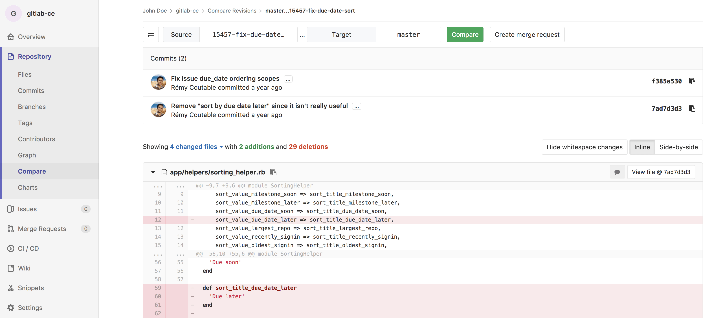

# Branches

A branch is a version of a project's working tree. You create a branch for each
set of related changes you make. This keeps each set of changes separate from
each other, allowing changes to be made in parallel, without affecting each
other.

After pushing your changes to a new branch, you can:

- Create a [merge request](../../merge_requests/index.md)
- Perform inline code review
- [Discuss](../../discussions/index.md) your implementation with your team
- Preview changes submitted to a new branch with [Review Apps](../../../../ci/review_apps/index.md).

With [GitLab Starter](https://about.gitlab.com/pricing/), you can also request
[approval](../../merge_requests/merge_request_approvals.md) from your managers.

For more information on managing branches using the GitLab UI, see:

- [Default branches](#default-branch)
- [Create a branch](../web_editor.md#create-a-new-branch)
- [Protected branches](../../protected_branches.md#protected-branches)
- [Delete merged branches](#delete-merged-branches)
- [Branch filter search box](#branch-filter-search-box)

You can also manage branches using the
[command line](../../../../gitlab-basics/start-using-git.md#create-a-branch).

<i class="fa fa-youtube-play youtube" aria-hidden="true"></i>Watch the video [GitLab Flow](https://www.youtube.com/watch?v=InKNIvky2KE).

See also:

- [Branches API](../../../../api/branches.md), for information on operating on repository branches using the GitLab API.
- [GitLab Flow](../../../../university/training/gitlab_flow.md) documentation.
- [Getting started with Git](../../../../topics/git/index.md) and GitLab.

## Default branch

When you create a new [project](../../index.md), GitLab sets `master` as the default
branch for your project. You can choose another branch to be your project's
default under your project's **Settings > Repository**.

The default branch is the branch affected by the
[issue closing pattern](../../issues/managing_issues.md#closing-issues-automatically),
which means that _an issue will be closed when a merge request is merged to
the **default branch**_.

The default branch is also protected against accidental deletion. Read through
the documentation on [protected branches](../../protected_branches.md#protected-branches)
to learn more.

## Compare

To compare branches in a repository:

1. Navigate to your project's repository.
1. Select **Repository > Compare** in the sidebar.
1. Select branches to compare using the [branch filter search box](#branch-filter-search-box)
1. Click **Compare** to view the changes inline:

## Delete merged branches

> [Introduced](https://gitlab.com/gitlab-org/gitlab-ce/merge_requests/6449) in GitLab 8.14.

This feature allows merged branches to be deleted in bulk. Only branches that
have been merged and [are not protected](../../protected_branches.md) will be deleted as part of
this operation.

It's particularly useful to clean up old branches that were not deleted
automatically when a merge request was merged.

## Branch filter search box

> [Introduced](https://gitlab.com/gitlab-org/gitlab-ce/merge_requests/22166) in GitLab 11.5.

This feature allows you to search and select branches quickly. Search results appear in the following order:

- Branches with names that matched search terms exactly.
- Other branches with names that include search terms, sorted alphabetically.

Sometimes when you have hundreds of branches you may want a more flexible matching pattern. In such cases you can use the following:

- `^feature` will only match branch names that begin with 'feature'.
- `feature$` will only match branch names that end with 'feature'.

<!-- ## Troubleshooting

Include any troubleshooting steps that you can foresee. If you know beforehand what issues
one might have when setting this up, or when something is changed, or on upgrading, it's
important to describe those, too. Think of things that may go wrong and include them here.
This is important to minimize requests for support, and to avoid doc comments with
questions that you know someone might ask.

Each scenario can be a third-level heading, e.g. `### Getting error message X`.
If you have none to add when creating a doc, leave this section in place
but commented out to help encourage others to add to it in the future. -->
